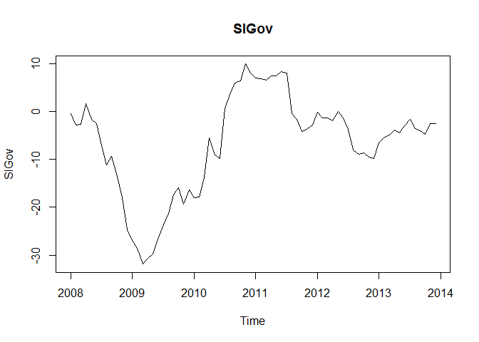
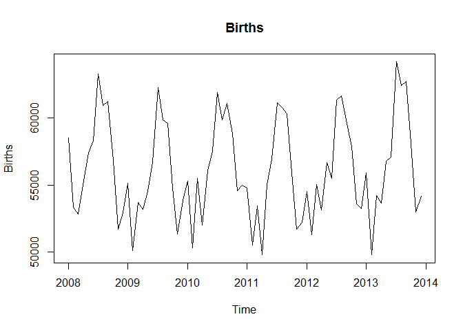
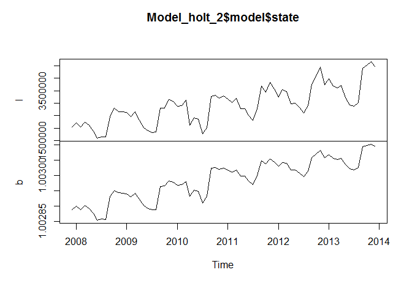

# CaseStudy10_LeeMessaGarza
Brian Less, Araya Messa, Tony Garza  
July 24, 2016  
# Introduction

### Add introduction here

## Project Setup and Required Packages


```r
setwd("C:/Users/thisi/OneDrive/git_repositories/CaseStudy10_LeeMessaGarza")
library(fpp) # must install.packages("fpp", repos = "https://cran.revolutionanalytics.com")
library(foreach) # must install.packages("foreach", repos = "https://cran.revolutionanalytics.com")
```

## Import and Data Cleanup


```r
source("ImportAndCleanupData.R")
```

Importing and tidying data from the files: ImportedAsIsDataChulwalar.csv, ImportedPlanDataChulwalar.csv, and ImportedIndicatorsChulwalar.csv.

## Defined Objects

```r
source("DefinedObjects.R")
```

All Objects loaded for exploration and analysis

# Exploration of Chulwalar Data

## Definition of the Indicators and Their Correlation with the Basic Data

### Monthly Change in Export Price Index (CEPI)


```r
plot(CEPI, main="CEPI")
```

<!-- -->

```r
cor(TotalAsIs, CEPI)
```

```
## [1] 0.663925
```

```r
cor(EfakAsIs , CEPI)
```

```
## [1] 0.9303543
```

```r
cor(WugeAsIs, CEPI)
```

```
## [1] 0.7618551
```

```r
cor(TotalEtelAsIs, CEPI)
```

```
## [1] 0.339713
```

```r
cor(BlueEtelAsIs , CEPI)
```

```
## [1] 0.1448837
```

```r
cor(RedEtelAsIs , CEPI)
```

```
## [1] 0.3587646
```

The CEPI correlates very well with the efak exports.

### Monthly Satisfaction Index (SI) government based data


```r
plot(SIGov, main="SIGov")
```

<!-- -->

```r
cor(TotalAsIs, SIGov)
```

```
## [1] 0.2007768
```

```r
cor(EfakAsIs , SIGov)
```

```
## [1] 0.37934
```

```r
cor(WugeAsIs, SIGov)
```

```
## [1] 0.3030266
```

```r
cor(TotalEtelAsIs, SIGov)
```

```
## [1] 0.002556094
```

```r
cor(BlueEtelAsIs , SIGov)
```

```
## [1] -0.04146932
```

```r
cor(RedEtelAsIs , SIGov)
```

```
## [1] 0.009978415
```

The Satisfaction Index does not show any particular correlation with any of the exports data.

### Average monthly temperatures in Chulwalar


```r
plot(Temperature, main="Temperature")
```

<!-- -->

```r
cor(TotalAsIs, Temperature)
```

```
## [1] -0.3429684
```

```r
cor(EfakAsIs , Temperature)
```

```
## [1] -0.07951179
```

```r
cor(WugeAsIs, Temperature)
```

```
## [1] -0.2045082
```

```r
cor(TotalEtelAsIs, Temperature)
```

```
## [1] -0.453138
```

```r
cor(BlueEtelAsIs , Temperature)
```

```
## [1] -0.6356067
```

```r
cor(RedEtelAsIs , Temperature)
```

```
## [1] -0.4028941
```

The temperatures have a negative correlation, exports increase in the colder months. However, the relationship is only stronger with blue Etels.

### Monthly births in Chulwalar


```r
plot(Births, main="Births")
```

<!-- -->

```r
cor(TotalAsIs, Births)
```

```
## [1] -0.1190228
```

```r
cor(EfakAsIs , Births)
```

```
## [1] -0.05802961
```

```r
cor(WugeAsIs, Births)
```

```
## [1] -0.007371339
```

```r
cor(TotalEtelAsIs, Births)
```

```
## [1] -0.1504242
```

```r
cor(BlueEtelAsIs , Births)
```

```
## [1] -0.2812913
```

```r
cor(RedEtelAsIs , Births)
```

```
## [1] -0.1217222
```

The consideration by Chulwalar's experts was that expecting new parents to try to export more products to pay for the cost of a new child. However, this could not be confirmed.  

### Monthly Satisfaction Index (SI) external index 


```r
plot(SIExtern, main="SIExtern")
```

<!-- -->

```r
cor(TotalAsIs, SIExtern)
```

```
## [1] 0.5883122
```

```r
cor(EfakAsIs , SIExtern)
```

```
## [1] 0.8358147
```

```r
cor(WugeAsIs, SIExtern)
```

```
## [1] 0.6786552
```

```r
cor(TotalEtelAsIs, SIExtern)
```

```
## [1] 0.2865672
```

```r
cor(BlueEtelAsIs , SIExtern)
```

```
## [1] 0.1604768
```

```r
cor(RedEtelAsIs , SIExtern)
```

```
## [1] 0.2960946
```

This indicator also has a high correlation with Efak exports. 

### Yearly Exports from Urbano


```r
plot(UrbanoExports, main="UrbanoExports")
```

<!-- -->

```r
cor(TotalAsIs, UrbanoExports)
```

```
## [1] 0.638178
```

```r
cor(EfakAsIs , UrbanoExports)
```

```
## [1] 0.9163565
```

```r
cor(WugeAsIs, UrbanoExports)
```

```
## [1] 0.7118468
```

```r
cor(TotalEtelAsIs, UrbanoExports)
```

```
## [1] 0.3182532
```

```r
cor(BlueEtelAsIs , UrbanoExports)
```

```
## [1] 0.1655794
```

```r
cor(RedEtelAsIs , UrbanoExports)
```

```
## [1] 0.3309962
```

This indicator also has a high correlation with Efak exports. The Wuge exports also show a correlation. Unfortunatly it was not possible to find other useful indicators based on exports from Urbano, due to possible informers being very restrictive with information. 

### Yearly number of Globalisation Party members in Chulwalar


```r
plot(GlobalisationPartyMembers, main="GlobalisationPartyMembers")
```

<!-- -->

```r
cor(TotalAsIs, GlobalisationPartyMembers)
```

```
## [1] 0.630084
```

```r
cor(EfakAsIs , GlobalisationPartyMembers)
```

```
## [1] 0.8963942
```

```r
cor(WugeAsIs, GlobalisationPartyMembers)
```

```
## [1] 0.7193864
```

```r
cor(TotalEtelAsIs, GlobalisationPartyMembers)
```

```
## [1] 0.2994635
```

```r
cor(BlueEtelAsIs , GlobalisationPartyMembers)
```

```
## [1] 0.08547266
```

```r
cor(RedEtelAsIs , GlobalisationPartyMembers)
```

```
## [1] 0.3234832
```

There is a similar picture here to that of Urbano Exports. It should however be noted that there is a continuos growth here and that the yearly view could lead to the data appearing to correlate, although this could just be due to an increase in trend. Although this could also be true for the Urbano Exports, the trend seems logical due to the Chulwalar's exports growing in accordance with the Urbano's Exports.

### Monthly Average Export Price Index for Chulwalar


```r
plot(AEPI, main="AEPI")
```

<!-- -->

```r
cor(TotalAsIs, AEPI)
```

```
## [1] 0.625232
```

```r
cor(EfakAsIs , AEPI)
```

```
## [1] 0.9056624
```

```r
cor(WugeAsIs, AEPI)
```

```
## [1] 0.7159733
```

```r
cor(TotalEtelAsIs, AEPI)
```

```
## [1] 0.3035506
```

```r
cor(BlueEtelAsIs , AEPI)
```

```
## [1] 0.1577964
```

```r
cor(RedEtelAsIs , AEPI)
```

```
## [1] 0.3157277
```

The continuous growth leads to a good correlation here too.

### Monthly Producer Price Index (PPI) for Etel in Chulwalar


```r
plot(PPIEtel, main="PPIEtel")
```

<!-- -->

```r
cor(TotalAsIs, PPIEtel)
```

```
## [1] 0.4836129
```

```r
cor(EfakAsIs , PPIEtel)
```

```
## [1] 0.5865375
```

```r
cor(WugeAsIs, PPIEtel)
```

```
## [1] 0.4920865
```

```r
cor(TotalEtelAsIs, PPIEtel)
```

```
## [1] 0.3374707
```

```r
cor(BlueEtelAsIs , PPIEtel)
```

```
## [1] 0.2445472
```

```r
cor(RedEtelAsIs , PPIEtel)
```

```
## [1] 0.3391872
```

This indicator does not give the expected results. It does not show any correlation worth mentioning, not even with the Etel segment. 

### National Holidays


```r
plot(NationalHolidays, main="NationalHolidays")
```

<!-- -->

```r
cor(TotalAsIs, NationalHolidays)
```

```
## [1] -0.007883708
```

```r
cor(EfakAsIs , NationalHolidays)
```

```
## [1] 0.001235706
```

```r
cor(WugeAsIs, NationalHolidays)
```

```
## [1] 0.06505569
```

```r
cor(TotalEtelAsIs, NationalHolidays)
```

```
## [1] -0.01081446
```

```r
cor(BlueEtelAsIs , NationalHolidays)
```

```
## [1] 0.02903763
```

```r
cor(RedEtelAsIs , NationalHolidays)
```

```
## [1] -0.01717636
```

The months April and December do not correlate well with the exports data. However later tests will show that these are worth considering. The missing correlation is just due to the sparse structure of the NationalHolidays time series.

### Chulwalar Index (Total value of all companies in Chulwalar)


```r
plot(ChulwalarIndex, main="ChulwalarIndex")
```

<!-- -->

```r
cor(TotalAsIs, ChulwalarIndex)
```

```
## [1] 0.4837017
```

```r
cor(EfakAsIs , ChulwalarIndex)
```

```
## [1] 0.7129557
```

```r
cor(WugeAsIs, ChulwalarIndex)
```

```
## [1] 0.5721568
```

```r
cor(TotalEtelAsIs, ChulwalarIndex)
```

```
## [1] 0.2209171
```

```r
cor(BlueEtelAsIs , ChulwalarIndex)
```

```
## [1] 0.1469233
```

```r
cor(RedEtelAsIs , ChulwalarIndex)
```

```
## [1] 0.2242922
```

No particular findings.

### Monthly Inflation rate in Chulwalar


```r
plot(Inflation, main="Inflation")
```

<!-- -->

```r
cor(TotalAsIs, Inflation)
```

```
## [1] 0.002438708
```

```r
cor(EfakAsIs , Inflation)
```

```
## [1] 0.1454134
```

```r
cor(WugeAsIs, Inflation)
```

```
## [1] 0.03191332
```

```r
cor(TotalEtelAsIs, Inflation)
```

```
## [1] -0.08378282
```

```r
cor(BlueEtelAsIs , Inflation)
```

```
## [1] 0.02117817
```

```r
cor(RedEtelAsIs , Inflation)
```

```
## [1] -0.0982151
```

No particular findings.

### Proposed spending for National Holidays


```r
plot(IndependenceDayPresents, main="IndependenceDayPresents")
```

<!-- -->

```r
cor(TotalAsIs, IndependenceDayPresents)
```

```
## [1] 0.4359522
```

```r
cor(EfakAsIs , IndependenceDayPresents)
```

```
## [1] 0.5243145
```

```r
cor(WugeAsIs, IndependenceDayPresents)
```

```
## [1] 0.4892437
```

```r
cor(TotalEtelAsIs, IndependenceDayPresents)
```

```
## [1] 0.2872013
```

```r
cor(BlueEtelAsIs , IndependenceDayPresents)
```

```
## [1] 0.2110373
```

```r
cor(RedEtelAsIs , IndependenceDayPresents)
```

```
## [1] 0.2881631
```

No particular findings.

### Influence of National Holiday


```r
plot(InfluenceNationalHolidays, main="InfluenceNationalHolidays")
```

<!-- -->

```r
cor(TotalAsIs, InfluenceNationalHolidays)
```

```
## [1] 0.3717463
```

```r
cor(EfakAsIs , InfluenceNationalHolidays)
```

```
## [1] 0.09926836
```

```r
cor(WugeAsIs, InfluenceNationalHolidays)
```

```
## [1] 0.3712288
```

```r
cor(TotalEtelAsIs, InfluenceNationalHolidays)
```

```
## [1] 0.4535836
```

```r
cor(BlueEtelAsIs , InfluenceNationalHolidays)
```

```
## [1] 0.2792198
```

```r
cor(RedEtelAsIs , InfluenceNationalHolidays)
```

```
## [1] 0.4643512
```

This indicator is an experiment where the influence of National Holidays is extended into the months leading up to the holiday. However later tests show that this indicator is no better for forecasting than the orignial National Holidays indicator.   

## Correlation of the indicators with each another 


```r
IndicatorsmatrixStandardised
```

```
##           CEPIVector SIGovVector TemperatureVector BirthsVector
## Jan 2008 -1.52922324  0.60197865       -0.80158296   0.63571578
## Feb 2008 -1.38212361  0.36383325       -0.78670170  -0.75485223
## Mar 2008 -1.19824907  0.38288488       -0.71229542  -0.89474624
## Apr 2008 -1.27179889  0.80202078       -0.20633274  -0.30168208
## May 2008 -1.05114944  0.47814304        0.82047388   0.33297219
## Jun 2008 -0.97759963  0.39241070        1.17762401   0.58008225
## Jul 2008 -0.75695018 -0.03625102        1.34131782   1.93095061
## Aug 2008 -0.86727491 -0.41728366        1.25203029   1.28522365
## Sep 2008 -0.90404981 -0.25534479        0.50796752   1.37677591
## Oct 2008 -0.97759963 -0.64590324        0.01688609   0.18686667
## Nov 2008 -1.16147417 -1.07456496       -0.57836412  -1.20505167
## Dec 2008 -1.01437454 -1.71279463       -1.17361434  -0.86773967
## Jan 2009 -1.19824907 -1.92236259       -1.66469577  -0.27278506
## Feb 2009 -0.97759963 -2.08430146       -1.26290187  -1.64147775
## Mar 2009 -1.05114944 -2.39865338       -0.69741417  -0.66789110
## Apr 2009 -1.01437454 -2.27481778        0.42314436  -0.80697490
## May 2009 -1.05114944 -2.19861125        0.68654258  -0.44022576
## Jun 2009 -0.94082472 -1.89378514        0.86511765   0.15959004
## Jul 2009 -0.94082472 -1.61753647        1.34131782   1.65467346
## Aug 2009 -0.86727491 -1.38891689        1.44548661   1.00111459
## Sep 2009 -0.97759963 -1.01741007        0.85023639   0.93089753
## Oct 2009 -0.97759963 -0.88404864       -0.11704521  -0.37946099
## Nov 2009 -1.01437454 -1.19840057       -0.23609525  -1.30875687
## Dec 2009 -0.72017527 -0.92215191       -1.29266438  -0.62008948
## Jan 2010 -0.94082472 -1.07456496       -1.87303334  -0.24091731
## Feb 2010 -0.79372509 -1.06503915       -1.41171443  -1.58017285
## Mar 2010 -0.60985055 -0.68400651       -0.71229542  -0.18339333
## Apr 2010 -0.57307564  0.11616203       -0.04263893  -1.11944086
## May 2010 -0.60985055 -0.22676734        0.21034241  -0.02999604
## Jun 2010 -0.60985055 -0.29344805        1.08833648   0.36889092
## Jul 2010 -0.53630074  0.69723681        1.68358669   1.55366891
## Aug 2010 -0.49952583  0.97348547        1.14786150   0.99382282
## Sep 2010 -0.53630074  1.20210506        0.50796752   1.33950685
## Oct 2010 -0.49952583  1.24973414       -0.13192646   0.71592527
## Nov 2010 -0.46275092  1.58313769       -0.62300789  -0.42915307
## Dec 2010 -0.24210148  1.41167301       -1.88791460  -0.31761595
## Jan 2011 -0.31565129  1.30688903       -1.18849560  -0.36811823
## Feb 2011 -0.09500184  1.28783740       -1.20337685  -1.52453933
## Mar 2011  0.12564760  1.25925995       -0.60812664  -0.73783810
## Apr 2011  0.12564760  1.35451811        0.38891748  -1.72141718
## May 2011  0.12564760  1.35451811        0.73118635  -0.29871136
## Jun 2011  0.16242251  1.44025045        1.11809899   0.21117258
## Jul 2011  0.23597232  1.40214719        1.05857397   1.35138974
## Aug 2011  0.27274723  0.60197865        1.29667405   1.25335591
## Sep 2011  0.34629705  0.47814304        0.92464267   1.11886322
## Oct 2011  0.34629705  0.24952346        0.06152986  -0.06159372
## Nov 2011  0.41984686  0.28762672       -0.66765166  -1.20829245
## Dec 2011  0.49339668  0.36383325       -0.75693919  -1.06488760
## Jan 2012  0.45662177  0.62103028       -1.05456430  -0.44211622
## Feb 2012  0.71404612  0.50672049       -1.70933953  -1.31928943
## Mar 2012  0.93469557  0.51624630       -0.31050153  -0.30762353
## Apr 2012  0.86114575  0.45909141       -0.13192646  -0.81183609
## May 2012  0.86114575  0.64008191        0.77583012   0.13987525
## Jun 2012  0.78759594  0.51624630        0.96928644  -0.17286077
## Jul 2012  0.93469557  0.28762672        1.25203029   1.39919136
## Aug 2012  1.08179520 -0.13150918        1.40084284   1.48777289
## Sep 2012  1.11857011 -0.21724153        0.68654258   0.93170772
## Oct 2012  1.11857011 -0.17913826       -0.04263893   0.45666225
## Nov 2012  1.15534502 -0.26487061       -0.56348287  -0.69543779
## Dec 2012  1.26566974 -0.29344805       -1.11408932  -0.78401932
## Jan 2013  1.08179520  0.01137806       -1.30754564  -0.06645490
## Feb 2013  1.30244465  0.12568785       -1.44147694  -1.72276751
## Mar 2013  1.48631918  0.17331693       -1.32242689  -0.52475630
## Apr 2013  1.30244465  0.27810091       -0.13192646  -0.68274471
## May 2013  1.44954428  0.21142019        0.41867999   0.16283083
## Jun 2013  1.48631918  0.35430743        0.99904895   0.24412059
## Jul 2013  1.67019372  0.47814304        1.56453665   2.17211923
## Aug 2013  1.67019372  0.30667835        1.32643657   1.69464317
## Sep 2013  1.67019372  0.25904927        0.64189882   1.77161188
## Oct 2013  1.59664391  0.18284275        0.24010492   0.52930991
## Nov 2013  1.67019372  0.40193651       -0.65277040  -0.85882751
## Dec 2013  1.81729335  0.40193651       -0.80158296  -0.53474873
##          SIGovVector UrbanoExportsVector GlobalisationPartyMembersVector
## Jan 2008  0.60197865          -0.9637871                      -1.5070173
## Feb 2008  0.36383325          -0.9637871                      -1.5070173
## Mar 2008  0.38288488          -0.9637871                      -1.5070173
## Apr 2008  0.80202078          -0.9637871                      -1.5070173
## May 2008  0.47814304          -0.9637871                      -1.5070173
## Jun 2008  0.39241070          -0.9637871                      -1.5070173
## Jul 2008 -0.03625102          -0.9637871                      -1.5070173
## Aug 2008 -0.41728366          -0.9637871                      -1.5070173
## Sep 2008 -0.25534479          -0.9637871                      -1.5070173
## Oct 2008 -0.64590324          -0.9637871                      -1.5070173
## Nov 2008 -1.07456496          -0.9637871                      -1.5070173
## Dec 2008 -1.71279463          -0.9637871                      -1.5070173
## Jan 2009 -1.92236259          -1.0398756                      -1.0076219
## Feb 2009 -2.08430146          -1.0398756                      -1.0076219
## Mar 2009 -2.39865338          -1.0398756                      -1.0076219
## Apr 2009 -2.27481778          -1.0398756                      -1.0076219
## May 2009 -2.19861125          -1.0398756                      -1.0076219
## Jun 2009 -1.89378514          -1.0398756                      -1.0076219
## Jul 2009 -1.61753647          -1.0398756                      -1.0076219
## Aug 2009 -1.38891689          -1.0398756                      -1.0076219
## Sep 2009 -1.01741007          -1.0398756                      -1.0076219
## Oct 2009 -0.88404864          -1.0398756                      -1.0076219
## Nov 2009 -1.19840057          -1.0398756                      -1.0076219
## Dec 2009 -0.92215191          -1.0398756                      -1.0076219
## Jan 2010 -1.07456496          -0.7050864                      -0.2266076
## Feb 2010 -1.06503915          -0.7050864                      -0.2266076
## Mar 2010 -0.68400651          -0.7050864                      -0.2266076
## Apr 2010  0.11616203          -0.7050864                      -0.2266076
## May 2010 -0.22676734          -0.7050864                      -0.2266076
## Jun 2010 -0.29344805          -0.7050864                      -0.2266076
## Jul 2010  0.69723681          -0.7050864                      -0.2266076
## Aug 2010  0.97348547          -0.7050864                      -0.2266076
## Sep 2010  1.20210506          -0.7050864                      -0.2266076
## Oct 2010  1.24973414          -0.7050864                      -0.2266076
## Nov 2010  1.58313769          -0.7050864                      -0.2266076
## Dec 2010  1.41167301          -0.7050864                      -0.2266076
## Jan 2011  1.30688903           0.2384105                       0.7590584
## Feb 2011  1.28783740           0.2384105                       0.7590584
## Mar 2011  1.25925995           0.2384105                       0.7590584
## Apr 2011  1.35451811           0.2384105                       0.7590584
## May 2011  1.35451811           0.2384105                       0.7590584
## Jun 2011  1.44025045           0.2384105                       0.7590584
## Jul 2011  1.40214719           0.2384105                       0.7590584
## Aug 2011  0.60197865           0.2384105                       0.7590584
## Sep 2011  0.47814304           0.2384105                       0.7590584
## Oct 2011  0.24952346           0.2384105                       0.7590584
## Nov 2011  0.28762672           0.2384105                       0.7590584
## Dec 2011  0.36383325           0.2384105                       0.7590584
## Jan 2012  0.62103028           0.8471181                       0.8528773
## Feb 2012  0.50672049           0.8471181                       0.8528773
## Mar 2012  0.51624630           0.8471181                       0.8528773
## Apr 2012  0.45909141           0.8471181                       0.8528773
## May 2012  0.64008191           0.8471181                       0.8528773
## Jun 2012  0.51624630           0.8471181                       0.8528773
## Jul 2012  0.28762672           0.8471181                       0.8528773
## Aug 2012 -0.13150918           0.8471181                       0.8528773
## Sep 2012 -0.21724153           0.8471181                       0.8528773
## Oct 2012 -0.17913826           0.8471181                       0.8528773
## Nov 2012 -0.26487061           0.8471181                       0.8528773
## Dec 2012 -0.29344805           0.8471181                       0.8528773
## Jan 2013  0.01137806           1.6232204                       1.1293110
## Feb 2013  0.12568785           1.6232204                       1.1293110
## Mar 2013  0.17331693           1.6232204                       1.1293110
## Apr 2013  0.27810091           1.6232204                       1.1293110
## May 2013  0.21142019           1.6232204                       1.1293110
## Jun 2013  0.35430743           1.6232204                       1.1293110
## Jul 2013  0.47814304           1.6232204                       1.1293110
## Aug 2013  0.30667835           1.6232204                       1.1293110
## Sep 2013  0.25904927           1.6232204                       1.1293110
## Oct 2013  0.18284275           1.6232204                       1.1293110
## Nov 2013  0.40193651           1.6232204                       1.1293110
## Dec 2013  0.40193651           1.6232204                       1.1293110
##           AEPIVector      PPIEtel NationalHolidaysVector
## Jan 2008 -0.91646681 -0.693775997             -0.4440971
## Feb 2008 -0.85615089 -1.062575707             -0.4440971
## Mar 2008 -0.81594028 -0.980620216              2.2204854
## Apr 2008 -0.87625620 -1.103553452             -0.4440971
## May 2008 -0.81594028 -0.939642470             -0.4440971
## Jun 2008 -0.67520315 -1.062575707             -0.4440971
## Jul 2008 -0.59478193 -0.939642470             -0.4440971
## Aug 2008 -0.57467663 -0.939642470             -0.4440971
## Sep 2008 -0.55457132 -0.570842760             -0.4440971
## Oct 2008 -0.67520315 -0.283998542             -0.4440971
## Nov 2008 -0.99688803 -0.324976287             -0.4440971
## Dec 2008 -1.11751986 -0.283998542              2.2204854
## Jan 2009 -1.01699333  0.945333824             -0.4440971
## Feb 2009 -1.03709864 -0.079109814             -0.4440971
## Mar 2009 -1.07730925  0.412623132             -0.4440971
## Apr 2009 -1.03709864  0.863378333              2.2204854
## May 2009 -1.11751986  0.289689895             -0.4440971
## Jun 2009 -1.23815168  0.699467350             -0.4440971
## Jul 2009 -1.33867821  0.986311569             -0.4440971
## Aug 2009 -1.25825699  0.699467350             -0.4440971
## Sep 2009 -1.15773047  0.453600877             -0.4440971
## Oct 2009 -1.25825699 -0.734753742             -0.4440971
## Nov 2009 -1.27836229 -0.529865015             -0.4440971
## Dec 2009 -1.17783577 -0.079109814              2.2204854
## Jan 2010 -1.07730925 -0.734753742             -0.4440971
## Feb 2010 -0.97678272 -0.939642470             -0.4440971
## Mar 2010 -0.79583498 -1.062575707             -0.4440971
## Apr 2010 -0.71541376 -0.980620216              2.2204854
## May 2010 -0.91646681 -1.062575707             -0.4440971
## Jun 2010 -0.75562437 -1.103553452             -0.4440971
## Jul 2010 -0.67520315 -0.611820506             -0.4440971
## Aug 2010 -0.67520315 -1.185508943             -0.4440971
## Sep 2010 -0.59478193 -0.857686979             -0.4440971
## Oct 2010 -0.65509785 -0.857686979             -0.4440971
## Nov 2010 -0.47415010 -0.939642470             -0.4440971
## Dec 2010 -0.29320236 -0.980620216              2.2204854
## Jan 2011 -0.15246523 -0.120087560             -0.4440971
## Feb 2011  0.02848252 -0.611820506             -0.4440971
## Mar 2011  0.16921965 -0.570842760             -0.4440971
## Apr 2011  0.26974617 -0.488887269              2.2204854
## May 2011  0.33006209 -0.365954033             -0.4440971
## Jun 2011  0.33006209 -0.570842760             -0.4440971
## Jul 2011  0.45069391 -0.816709233             -0.4440971
## Aug 2011  0.35016739 -1.062575707             -0.4440971
## Sep 2011  0.30995678 -0.693775997             -0.4440971
## Oct 2011  0.30995678 -0.857686979             -0.4440971
## Nov 2011  0.35016739 -0.939642470             -0.4440971
## Dec 2011  0.39037800 -0.980620216              2.2204854
## Jan 2012  0.51100983 -0.939642470             -0.4440971
## Feb 2012  0.71206288  0.125778913             -0.4440971
## Mar 2012  0.83269471  0.207734404             -0.4440971
## Apr 2012  0.77237879 -0.120087560              2.2204854
## May 2012  0.71206288 -0.038132069             -0.4440971
## Jun 2012  0.75227349  0.002845677             -0.4440971
## Jul 2012  0.85280001  0.207734404             -0.4440971
## Aug 2012  0.83269471  0.084801168             -0.4440971
## Sep 2012  0.89301062  1.232178042             -0.4440971
## Oct 2012  0.95332653  1.641955497             -0.4440971
## Nov 2012  0.97343184  1.764888734             -0.4440971
## Dec 2012  1.09406367  1.682933243              2.2204854
## Jan 2013  1.25490611  1.641955497             -0.4440971
## Feb 2013  1.31522202  1.519022261             -0.4440971
## Mar 2013  1.49616976  1.437066770              2.2204854
## Apr 2013  1.51627507  1.519022261             -0.4440971
## May 2013  1.63690690  1.560000006             -0.4440971
## Jun 2013  1.65701220  1.437066770             -0.4440971
## Jul 2013  1.81785464  1.437066770             -0.4440971
## Aug 2013  1.71732811  1.682933243             -0.4440971
## Sep 2013  1.75753872  1.600977752             -0.4440971
## Oct 2013  1.63690690  1.641955497             -0.4440971
## Nov 2013  1.59669629  1.641955497             -0.4440971
## Dec 2013  1.63690690  1.682933243              2.2204854
##          ChulwalarIndexVector InflationVector
## Jan 2008           0.25840362      1.46874959
## Feb 2008           0.17119839      1.45693527
## Mar 2008          -0.00819425      1.82317917
## Apr 2008           0.34009645      0.93710523
## May 2008           0.46462605      1.68140734
## Jun 2008          -0.10636535      1.92950804
## Jul 2008          -0.05482658      2.02402259
## Aug 2008          -0.10301584      1.78773621
## Sep 2008          -0.60062928      1.40967800
## Oct 2008          -1.31012904      0.91347659
## Nov 2008          -1.57819968     -0.31521260
## Dec 2008          -1.45973792     -0.56331330
## Jan 2009          -1.85684066     -0.81141400
## Feb 2009          -2.27309791     -0.57512762
## Mar 2009          -2.07025865     -1.41394428
## Apr 2009          -1.49403258     -1.05951471
## May 2009          -1.34980985     -1.89833137
## Jun 2009          -1.46088248     -1.78018817
## Jul 2009          -1.02048011     -2.48904732
## Aug 2009          -0.90899510     -1.89833137
## Sep 2009          -0.73179900     -2.13461775
## Oct 2009          -0.95077989     -1.89833137
## Nov 2009          -0.77321349     -1.41394428
## Dec 2009          -0.49424429     -0.94137151
## Jan 2010          -0.78765512     -1.05951471
## Feb 2010          -0.79634871     -1.29580109
## Mar 2010          -0.32919229     -0.45698443
## Apr 2010          -0.34421461     -0.46879875
## May 2010          -0.48843734     -0.45698443
## Jun 2010          -0.48743586     -0.82322832
## Jul 2010          -0.33388834     -0.58694194
## Aug 2010          -0.52135180     -0.70508513
## Sep 2010          -0.26567773     -0.46879875
## Oct 2010           0.04768711     -0.35065556
## Nov 2010           0.12100616     -0.10255485
## Dec 2010           0.31095230     -0.35065556
## Jan 2011           0.44837501      0.13373153
## Feb 2011           0.61234978      0.35820359
## Mar 2011           0.41793481      0.46453247
## Apr 2011           0.81613161      0.34638927
## May 2011           0.63033449      0.46453247
## Jun 2011           0.69980748      0.58267566
## Jul 2011           0.51678760      0.58267566
## Aug 2011          -0.63948534      0.58267566
## Sep 2011          -0.87751134      0.93710523
## Oct 2011          -0.33946806      0.81896204
## Nov 2011          -0.38365137      0.92529091
## Dec 2011          -0.54396524      0.44090383
## Jan 2012          -0.07220534      0.57086134
## Feb 2012           0.26204769      0.66537589
## Mar 2012           0.33842169      0.65356157
## Apr 2012           0.18218952      0.41727519
## May 2012          -0.23591922      0.41727519
## Jun 2012          -0.10808219      0.07465993
## Jul 2012           0.19150588      0.29913200
## Aug 2012           0.35858611      0.64174725
## Sep 2012           0.56507785      0.52360406
## Oct 2012           0.60251163      0.52360406
## Nov 2012           0.42146106      0.40546087
## Dec 2012           0.89854820      0.51178974
## Jan 2013           1.03628230      0.05103130
## Feb 2013           1.00737379     -0.06711190
## Mar 2013           1.05249126     -0.19706941
## Apr 2013           1.15213514     -0.53968466
## May 2013           1.51833481     -0.07892622
## Jun 2013           1.19043576      0.26368904
## Jul 2013           1.45700838      0.37001791
## Aug 2013           1.31156534     -0.09074053
## Sep 2013           1.72499486     -0.20888373
## Oct 2013           2.09488909     -0.43335579
## Nov 2013           2.40743760     -0.31521260
## Dec 2013           2.53103304     -0.20888373
##          IndependenceDayPresentsVector
## Jan 2008                   -0.60484269
## Feb 2008                   -0.60484269
## Mar 2008                   -0.60484269
## Apr 2008                   -0.60484269
## May 2008                   -0.60484269
## Jun 2008                   -0.60484269
## Jul 2008                   -0.60484269
## Aug 2008                   -0.60484269
## Sep 2008                   -0.60484269
## Oct 2008                   -0.60484269
## Nov 2008                   -0.60484269
## Dec 2008                   -0.60484269
## Jan 2009                   -0.34562439
## Feb 2009                   -0.34562439
## Mar 2009                   -0.34562439
## Apr 2009                   -0.34562439
## May 2009                   -0.34562439
## Jun 2009                   -0.34562439
## Jul 2009                   -0.34562439
## Aug 2009                   -0.34562439
## Sep 2009                   -0.34562439
## Oct 2009                   -0.34562439
## Nov 2009                   -0.34562439
## Dec 2009                   -0.34562439
## Jan 2010                    0.01728122
## Feb 2010                    0.01728122
## Mar 2010                    0.01728122
## Apr 2010                    0.01728122
## May 2010                    0.01728122
## Jun 2010                    0.01728122
## Jul 2010                    0.01728122
## Aug 2010                    0.01728122
## Sep 2010                    0.01728122
## Oct 2010                    0.01728122
## Nov 2010                    0.01728122
## Dec 2010                    0.01728122
## Jan 2011                   -1.01959196
## Feb 2011                   -1.01959196
## Mar 2011                   -1.01959196
## Apr 2011                   -1.01959196
## May 2011                   -1.01959196
## Jun 2011                   -1.01959196
## Jul 2011                   -1.01959196
## Aug 2011                   -1.01959196
## Sep 2011                   -1.01959196
## Oct 2011                   -1.01959196
## Nov 2011                   -1.01959196
## Dec 2011                   -1.01959196
## Jan 2012                   -0.13824976
## Feb 2012                   -0.13824976
## Mar 2012                   -0.13824976
## Apr 2012                   -0.13824976
## May 2012                   -0.13824976
## Jun 2012                   -0.13824976
## Jul 2012                   -0.13824976
## Aug 2012                   -0.13824976
## Sep 2012                   -0.13824976
## Oct 2012                   -0.13824976
## Nov 2012                   -0.13824976
## Dec 2012                   -0.13824976
## Jan 2013                    2.09102758
## Feb 2013                    2.09102758
## Mar 2013                    2.09102758
## Apr 2013                    2.09102758
## May 2013                    2.09102758
## Jun 2013                    2.09102758
## Jul 2013                    2.09102758
## Aug 2013                    2.09102758
## Sep 2013                    2.09102758
## Oct 2013                    2.09102758
## Nov 2013                    2.09102758
## Dec 2013                    2.09102758
## attr(,"scaled:center")
##                      CEPIVector                     SIGovVector 
##                    1.015583e+02                   -6.719444e+00 
##               TemperatureVector                    BirthsVector 
##                    8.986528e+00                    5.616507e+04 
##                     SIGovVector             UrbanoExportsVector 
##                   -6.719444e+00                    6.483333e+06 
## GlobalisationPartyMembersVector                      AEPIVector 
##                    5.438950e+04                    1.035583e+02 
##                         PPIEtel          NationalHolidaysVector 
##                    1.022931e+02                    1.666667e-01 
##            ChulwalarIndexVector                 InflationVector 
##                    6.544707e+03                    1.606806e+00 
##   IndependenceDayPresentsVector 
##                    2.326667e+02 
## attr(,"scaled:scale")
##                      CEPIVector                     SIGovVector 
##                    2.719245e+00                    1.049779e+01 
##               TemperatureVector                    BirthsVector 
##                    6.719863e+00                    3.702803e+03 
##                     SIGovVector             UrbanoExportsVector 
##                    1.049779e+01                    6.571299e+05 
## GlobalisationPartyMembersVector                      AEPIVector 
##                    6.171462e+03                    4.973812e+00 
##                         PPIEtel          NationalHolidaysVector 
##                    2.440349e+00                    3.752933e-01 
##            ChulwalarIndexVector                 InflationVector 
##                    1.188232e+03                    8.464305e-01 
##   IndependenceDayPresentsVector 
##                    1.928876e+01
```

Establish the standardised data matrix


```r
NumberOfIndicators
```

```
## [1] 72
```

The dimensions of the matrix are determined by the number of indicators.


```r
IndicatorsCorrelationCoefficientMatrix
```

```
##                                 CEPIVector SIGovVector TemperatureVector
## CEPIVector                      1.00000000  0.38443508       0.061196862
## SIGovVector                     0.38443508  1.00000000       0.088109231
## TemperatureVector               0.06119686  0.08810923       1.000000000
## BirthsVector                    0.08872676  0.12753378       0.744270853
## SIGovVector                     0.38443508  1.00000000       0.088109231
## UrbanoExportsVector             0.97660022  0.40700264      -0.001244458
## GlobalisationPartyMembersVector 0.91557949  0.49433954      -0.009695828
## AEPIVector                      0.97697428  0.45955807       0.055196145
## PPIEtel                         0.65446147 -0.23602751      -0.013959906
## NationalHolidaysVector          0.04830482 -0.02025819      -0.316148237
## ChulwalarIndexVector            0.76208613  0.63652935       0.036317166
## InflationVector                 0.16379793  0.55866085       0.054966975
## IndependenceDayPresentsVector   0.64887003  0.03237405      -0.040110690
##                                 BirthsVector SIGovVector
## CEPIVector                        0.08872676  0.38443508
## SIGovVector                       0.12753378  1.00000000
## TemperatureVector                 0.74427085  0.08810923
## BirthsVector                      1.00000000  0.12753378
## SIGovVector                       0.12753378  1.00000000
## UrbanoExportsVector               0.03139251  0.40700264
## GlobalisationPartyMembersVector  -0.01768274  0.49433954
## AEPIVector                        0.09673808  0.45955807
## PPIEtel                           0.05960084 -0.23602751
## NationalHolidaysVector           -0.37785553 -0.02025819
## ChulwalarIndexVector              0.11795545  0.63652935
## InflationVector                   0.11231574  0.55866085
## IndependenceDayPresentsVector     0.10063892  0.03237405
##                                 UrbanoExportsVector
## CEPIVector                             9.766002e-01
## SIGovVector                            4.070026e-01
## TemperatureVector                     -1.244458e-03
## BirthsVector                           3.139251e-02
## SIGovVector                            4.070026e-01
## UrbanoExportsVector                    1.000000e+00
## GlobalisationPartyMembersVector        9.121013e-01
## AEPIVector                             9.827920e-01
## PPIEtel                                6.521194e-01
## NationalHolidaysVector                -1.876433e-17
## ChulwalarIndexVector                   7.856783e-01
## InflationVector                        1.985267e-01
## IndependenceDayPresentsVector          6.699996e-01
##                                 GlobalisationPartyMembersVector AEPIVector
## CEPIVector                                         9.155795e-01 0.97697428
## SIGovVector                                        4.943395e-01 0.45955807
## TemperatureVector                                 -9.695828e-03 0.05519615
## BirthsVector                                      -1.768274e-02 0.09673808
## SIGovVector                                        4.943395e-01 0.45955807
## UrbanoExportsVector                                9.121013e-01 0.98279202
## GlobalisationPartyMembersVector                    1.000000e+00 0.88225030
## AEPIVector                                         8.822503e-01 1.00000000
## PPIEtel                                            4.583532e-01 0.62229942
## NationalHolidaysVector                             1.250956e-17 0.01886347
## ChulwalarIndexVector                               6.647301e-01 0.80958140
## InflationVector                                    9.009471e-02 0.30646256
## IndependenceDayPresentsVector                      4.606363e-01 0.64313387
##                                     PPIEtel NationalHolidaysVector
## CEPIVector                       0.65446147           4.830482e-02
## SIGovVector                     -0.23602751          -2.025819e-02
## TemperatureVector               -0.01395991          -3.161482e-01
## BirthsVector                     0.05960084          -3.778555e-01
## SIGovVector                     -0.23602751          -2.025819e-02
## UrbanoExportsVector              0.65211942          -1.876433e-17
## GlobalisationPartyMembersVector  0.45835315           1.250956e-17
## AEPIVector                       0.62229942           1.886347e-02
## PPIEtel                          1.00000000           2.896317e-02
## NationalHolidaysVector           0.02896317           1.000000e+00
## ChulwalarIndexVector             0.45429124           5.430333e-02
## InflationVector                 -0.25048037          -9.384951e-03
## IndependenceDayPresentsVector    0.71474813           0.000000e+00
##                                 ChulwalarIndexVector InflationVector
## CEPIVector                                0.76208613     0.163797927
## SIGovVector                               0.63652935     0.558660851
## TemperatureVector                         0.03631717     0.054966975
## BirthsVector                              0.11795545     0.112315739
## SIGovVector                               0.63652935     0.558660851
## UrbanoExportsVector                       0.78567826     0.198526676
## GlobalisationPartyMembersVector           0.66473014     0.090094706
## AEPIVector                                0.80958140     0.306462559
## PPIEtel                                   0.45429124    -0.250480368
## NationalHolidaysVector                    0.05430333    -0.009384951
## ChulwalarIndexVector                      1.00000000     0.341955823
## InflationVector                           0.34195582     1.000000000
## IndependenceDayPresentsVector             0.62615921    -0.185842679
##                                 IndependenceDayPresentsVector
## CEPIVector                                         0.64887003
## SIGovVector                                        0.03237405
## TemperatureVector                                 -0.04011069
## BirthsVector                                       0.10063892
## SIGovVector                                        0.03237405
## UrbanoExportsVector                                0.66999963
## GlobalisationPartyMembersVector                    0.46063633
## AEPIVector                                         0.64313387
## PPIEtel                                            0.71474813
## NationalHolidaysVector                             0.00000000
## ChulwalarIndexVector                               0.62615921
## InflationVector                                   -0.18584268
## IndependenceDayPresentsVector                      1.00000000
```

Produce the IndicatorsCorrelationCoefficientMatrix.

## ModelWithAlllIndicators and With Each Indicator Individually

### All Indiators in one model:


```r
summary(ModelWithAlllIndicators)
```

```
## 
## Call:
## tslm(formula = TotalAsIs ~ trend + season + CEPI + SIGov + Temperature + 
##     Births + SIExtern + UrbanoExports + GlobalisationPartyMembers + 
##     AEPI + PPIEtel + NationalHolidays + ChulwalarIndex + Inflation + 
##     IndependenceDayPresents)
## 
## Residuals:
##     Min      1Q  Median      3Q     Max 
## -458389 -119426    1119  165463  342741 
## 
## Coefficients:
##                             Estimate Std. Error t value Pr(>|t|)   
## (Intercept)               -8.982e+05  2.301e+07  -0.039  0.96904   
## trend                      3.176e+03  3.849e+04   0.083  0.93458   
## season2                    3.146e+05  2.678e+05   1.175  0.24624   
## season3                    5.172e+05  2.649e+05   1.953  0.05695 . 
## season4                    2.972e+05  3.413e+05   0.871  0.38836   
## season5                   -7.277e+04  3.661e+05  -0.199  0.84333   
## season6                   -2.597e+05  4.199e+05  -0.618  0.53932   
## season7                   -7.550e+05  5.225e+05  -1.445  0.15525   
## season8                   -2.869e+05  4.990e+05  -0.575  0.56809   
## season9                    1.066e+06  4.225e+05   2.523  0.01517 * 
## season10                   8.033e+05  3.352e+05   2.396  0.02068 * 
## season11                   1.226e+06  3.555e+05   3.449  0.00122 **
## season12                   9.734e+05  3.645e+05   2.670  0.01044 * 
## CEPI                      -3.551e+04  2.516e+05  -0.141  0.88838   
## SIGov                     -1.506e+04  9.150e+03  -1.646  0.10657   
## Temperature               -3.108e+04  2.069e+04  -1.502  0.14003   
## Births                     8.045e+01  3.894e+01   2.066  0.04448 * 
## SIExtern                   3.706e+04  5.872e+04   0.631  0.53109   
## UrbanoExports              5.323e-01  5.675e-01   0.938  0.35317   
## GlobalisationPartyMembers  7.324e+01  6.583e+01   1.113  0.27163   
## AEPI                      -6.003e+04  7.476e+04  -0.803  0.42612   
## PPIEtel                    7.799e+03  3.622e+04   0.215  0.83048   
## NationalHolidays          -3.192e+05  1.718e+05  -1.858  0.06963 . 
## ChulwalarIndex             6.102e+01  7.545e+01   0.809  0.42284   
## Inflation                  7.058e+04  1.555e+05   0.454  0.65213   
## IndependenceDayPresents    4.211e+01  6.187e+03   0.007  0.99460   
## ---
## Signif. codes:  0 '***' 0.001 '**' 0.01 '*' 0.05 '.' 0.1 ' ' 1
## 
## Residual standard error: 249400 on 46 degrees of freedom
## Multiple R-squared:  0.9421,	Adjusted R-squared:  0.9106 
## F-statistic: 29.94 on 25 and 46 DF,  p-value: < 2.2e-16
```

### CEPI:


```r
summary(ModelWithCEPI)
```

```
## 
## Call:
## tslm(formula = TotalAsIs ~ trend + season + CEPI)
## 
## Residuals:
##     Min      1Q  Median      3Q     Max 
## -670684 -142117    7024  168664  495366 
## 
## Coefficients:
##             Estimate Std. Error t value Pr(>|t|)    
## (Intercept) -2946424    5153463  -0.572 0.569710    
## trend          19698       6926   2.844 0.006145 ** 
## season2      -153665     153683  -1.000 0.321523    
## season3         8677     156732   0.055 0.956039    
## season4      -634082     154130  -4.114 0.000124 ***
## season5      -648875     154240  -4.207 9.09e-05 ***
## season6      -906108     153943  -5.886 2.10e-07 ***
## season7     -1112258     155872  -7.136 1.73e-09 ***
## season8      -755527     155490  -4.859 9.34e-06 ***
## season9       683382     154129   4.434 4.18e-05 ***
## season10      287071     153168   1.874 0.065940 .  
## season11      465878     152885   3.047 0.003474 ** 
## season12       50523     154712   0.327 0.745176    
## CEPI           53135      53376   0.995 0.323636    
## ---
## Signif. codes:  0 '***' 0.001 '**' 0.01 '*' 0.05 '.' 0.1 ' ' 1
## 
## Residual standard error: 263300 on 58 degrees of freedom
## Multiple R-squared:  0.9187,	Adjusted R-squared:  0.9004 
## F-statistic: 50.39 on 13 and 58 DF,  p-value: < 2.2e-16
```

The CEPI Indicator correlated best with total exports. Indeed the multiple R² improved the model slighltly compared to the simple ModelWithTrendAndSeasonalityOnly. However, the adjusted R² remains the same.


### SIGov:


```r
summary(ModelWithSIGov) 
```

```
## 
## Call:
## tslm(formula = TotalAsIs ~ trend + season + SIGov)
## 
## Residuals:
##     Min      1Q  Median      3Q     Max 
## -697126 -157160   22782  161382  486711 
## 
## Coefficients:
##             Estimate Std. Error t value Pr(>|t|)    
## (Intercept)  2154993     126151  17.083  < 2e-16 ***
## trend          26826       1656  16.196  < 2e-16 ***
## season2      -133003     152843  -0.870 0.387782    
## season3        44751     152866   0.293 0.770763    
## season4      -606128     152952  -3.963 0.000205 ***
## season5      -622634     152935  -4.071 0.000143 ***
## season6      -881666     153013  -5.762 3.35e-07 ***
## season7     -1075681     153183  -7.022 2.69e-09 ***
## season8      -726089     153194  -4.740 1.43e-05 ***
## season9       705690     153291   4.604 2.31e-05 ***
## season10      297924     153457   1.941 0.057071 .  
## season11      468770     153659   3.051 0.003439 ** 
## season12       68494     153977   0.445 0.658095    
## SIGov          -2003       3274  -0.612 0.543174    
## ---
## Signif. codes:  0 '***' 0.001 '**' 0.01 '*' 0.05 '.' 0.1 ' ' 1
## 
## Residual standard error: 264700 on 58 degrees of freedom
## Multiple R-squared:  0.9178,	Adjusted R-squared:  0.8994 
## F-statistic: 49.81 on 13 and 58 DF,  p-value: < 2.2e-16
```
   
The Satisfaction Index (gov)  hardly changes the function of the model.

### Temperature:


```r
summary(ModelWithTemperature)
```

```
## 
## Call:
## tslm(formula = TotalAsIs ~ trend + season + Temperature)
## 
## Residuals:
##     Min      1Q  Median      3Q     Max 
## -706803 -154965   23511  160215  483373 
## 
## Coefficients:
##             Estimate Std. Error t value Pr(>|t|)    
## (Intercept)  2185999     118102  18.509  < 2e-16 ***
## trend          26367       1526  17.278  < 2e-16 ***
## season2      -130163     152875  -0.851  0.39803    
## season3        91513     171443   0.534  0.59553    
## season4      -504879     236159  -2.138  0.03675 *  
## season5      -476774     296010  -1.611  0.11268    
## season6      -703539     345717  -2.035  0.04643 *  
## season7      -873818     386156  -2.263  0.02740 *  
## season8      -524053     378812  -1.383  0.17184    
## season9       858772     305542   2.811  0.00673 ** 
## season10      401142     232466   1.726  0.08974 .  
## season11      530742     183985   2.885  0.00549 ** 
## season12       85552     155077   0.552  0.58329    
## Temperature   -11344      19587  -0.579  0.56473    
## ---
## Signif. codes:  0 '***' 0.001 '**' 0.01 '*' 0.05 '.' 0.1 ' ' 1
## 
## Residual standard error: 264800 on 58 degrees of freedom
## Multiple R-squared:  0.9177,	Adjusted R-squared:  0.8993 
## F-statistic: 49.78 on 13 and 58 DF,  p-value: < 2.2e-16
```

### Births:


```r
summary(ModelWithBirths) 
```

```
## 
## Call:
## tslm(formula = TotalAsIs ~ trend + season + Births)
## 
## Residuals:
##     Min      1Q  Median      3Q     Max 
## -648252 -106586   23124  166173  443675 
## 
## Coefficients:
##               Estimate Std. Error t value Pr(>|t|)    
## (Intercept) -1.485e+06  1.452e+06  -1.023 0.310779    
## trend        2.633e+04  1.449e+03  18.163  < 2e-16 ***
## season2      1.856e+05  1.918e+05   0.968 0.337199    
## season3      1.510e+05  1.512e+05   0.998 0.322286    
## season4     -4.181e+05  1.639e+05  -2.551 0.013402 *  
## season5     -6.484e+05  1.459e+05  -4.444 4.04e-05 ***
## season6     -9.698e+05  1.496e+05  -6.482 2.16e-08 ***
## season7     -1.518e+06  2.265e+05  -6.704 9.20e-09 ***
## season8     -1.068e+06  1.992e+05  -5.364 1.48e-06 ***
## season9      3.721e+05  1.966e+05   1.893 0.063345 .  
## season10     2.114e+05  1.502e+05   1.407 0.164622    
## season11     6.744e+05  1.666e+05   4.049 0.000155 ***
## season12     2.147e+05  1.565e+05   1.372 0.175458    
## Births       6.589e+01  2.601e+01   2.533 0.014026 *  
## ---
## Signif. codes:  0 '***' 0.001 '**' 0.01 '*' 0.05 '.' 0.1 ' ' 1
## 
## Residual standard error: 251900 on 58 degrees of freedom
## Multiple R-squared:  0.9255,	Adjusted R-squared:  0.9088 
## F-statistic: 55.43 on 13 and 58 DF,  p-value: < 2.2e-16
```

### SIExtern:


```r
summary(ModelWithSIExtern) 
```

```
## 
## Call:
## tslm(formula = TotalAsIs ~ trend + season + SIExtern)
## 
## Residuals:
##     Min      1Q  Median      3Q     Max 
## -667444 -154044   -5891  162628  473612 
## 
## Coefficients:
##             Estimate Std. Error t value Pr(>|t|)    
## (Intercept)  2124425     137869  15.409  < 2e-16 ***
## trend          24163       3191   7.572 3.20e-10 ***
## season2      -133767     152487  -0.877 0.383979    
## season3        43156     152535   0.283 0.778243    
## season4      -609825     152516  -3.998 0.000183 ***
## season5      -624208     152569  -4.091 0.000134 ***
## season6      -877941     152767  -5.747 3.55e-07 ***
## season7     -1071287     153027  -7.001 2.92e-09 ***
## season8      -710173     153873  -4.615 2.22e-05 ***
## season9       722059     154265   4.681 1.76e-05 ***
## season10      312879     153885   2.033 0.046617 *  
## season11      486780     154278   3.155 0.002542 ** 
## season12       88661     154442   0.574 0.568139    
## SIExtern       26522      32881   0.807 0.423187    
## ---
## Signif. codes:  0 '***' 0.001 '**' 0.01 '*' 0.05 '.' 0.1 ' ' 1
## 
## Residual standard error: 264000 on 58 degrees of freedom
## Multiple R-squared:  0.9182,	Adjusted R-squared:  0.8998 
## F-statistic: 50.07 on 13 and 58 DF,  p-value: < 2.2e-16
```

### UrbanoExports:


```r
summary(ModelWithTotalUrbanoExports) 
```

```
## 
## Call:
## tslm(formula = TotalAsIs ~ trend + season + UrbanoExports)
## 
## Residuals:
##     Min      1Q  Median      3Q     Max 
## -651323 -145654    7297  172919  469753 
## 
## Coefficients:
##                 Estimate Std. Error t value Pr(>|t|)    
## (Intercept)    1.232e+06  9.485e+05   1.299 0.199178    
## trend          2.118e+04  5.414e+03   3.912 0.000243 ***
## season2       -1.259e+05  1.521e+05  -0.828 0.411030    
## season3        5.708e+04  1.524e+05   0.375 0.709261    
## season4       -5.934e+05  1.528e+05  -3.882 0.000267 ***
## season5       -6.025e+05  1.535e+05  -3.925 0.000232 ***
## season6       -8.568e+05  1.544e+05  -5.551 7.40e-07 ***
## season7       -1.048e+06  1.554e+05  -6.741 7.96e-09 ***
## season8       -6.879e+05  1.566e+05  -4.392 4.82e-05 ***
## season9        7.477e+05  1.580e+05   4.732 1.47e-05 ***
## season10       3.473e+05  1.596e+05   2.176 0.033640 *  
## season11       5.246e+05  1.613e+05   3.252 0.001913 ** 
## season12       1.317e+05  1.632e+05   0.807 0.423118    
## UrbanoExports  1.717e-01  1.700e-01   1.010 0.316698    
## ---
## Signif. codes:  0 '***' 0.001 '**' 0.01 '*' 0.05 '.' 0.1 ' ' 1
## 
## Residual standard error: 263200 on 58 degrees of freedom
## Multiple R-squared:  0.9187,	Adjusted R-squared:  0.9005 
## F-statistic: 50.41 on 13 and 58 DF,  p-value: < 2.2e-16
```

Indicator with adjusted R² shows a better result than the reference model (ModelWithTrendAndSeasonalityOnly). The individual months are also very significant.

### GlobalisationPartyMembers:


```r
summary(ModelWithGlobalisationPartyMembers) 
```

```
## 
## Call:
## tslm(formula = TotalAsIs ~ trend + season + GlobalisationPartyMembers)
## 
## Residuals:
##     Min      1Q  Median      3Q     Max 
## -696019 -161848   22345  172443  478347 
## 
## Coefficients:
##                             Estimate Std. Error t value Pr(>|t|)    
## (Intercept)                2.629e+06  9.653e+05   2.724 0.008517 ** 
## trend                      2.928e+04  6.311e+03   4.640 2.04e-05 ***
## season2                   -1.340e+05  1.531e+05  -0.875 0.385097    
## season3                    4.087e+04  1.535e+05   0.266 0.791010    
## season4                   -6.177e+05  1.542e+05  -4.006 0.000178 ***
## season5                   -6.350e+05  1.551e+05  -4.094 0.000133 ***
## season6                   -8.973e+05  1.562e+05  -5.744 3.59e-07 ***
## season7                   -1.096e+06  1.576e+05  -6.955 3.49e-09 ***
## season8                   -7.447e+05  1.593e+05  -4.676 1.79e-05 ***
## season9                    6.829e+05  1.611e+05   4.238 8.18e-05 ***
## season10                   2.743e+05  1.632e+05   1.681 0.098191 .  
## season11                   4.435e+05  1.655e+05   2.680 0.009573 ** 
## season12                   4.252e+04  1.680e+05   0.253 0.801132    
## GlobalisationPartyMembers -9.840e+00  2.111e+01  -0.466 0.642806    
## ---
## Signif. codes:  0 '***' 0.001 '**' 0.01 '*' 0.05 '.' 0.1 ' ' 1
## 
## Residual standard error: 265000 on 58 degrees of freedom
## Multiple R-squared:  0.9176,	Adjusted R-squared:  0.8991 
## F-statistic: 49.67 on 13 and 58 DF,  p-value: < 2.2e-16
```

### AEPI:


```r
summary(ModelWithAEPI)
```

```
## 
## Call:
## tslm(formula = TotalAsIs ~ trend + season + AEPI)
## 
## Residuals:
##     Min      1Q  Median      3Q     Max 
## -668980 -141696    1689  169009  482621 
## 
## Coefficients:
##             Estimate Std. Error t value Pr(>|t|)    
## (Intercept)   839421    1642691   0.511 0.611288    
## trend          23291       4116   5.658 4.95e-07 ***
## season2      -134830     152491  -0.884 0.380247    
## season3        38792     152745   0.254 0.800419    
## season4      -615165     152666  -4.029 0.000165 ***
## season5      -625294     152554  -4.099 0.000131 ***
## season6      -884504     152617  -5.796 2.95e-07 ***
## season7     -1082577     152748  -7.087 2.09e-09 ***
## season8      -723603     152794  -4.736 1.45e-05 ***
## season9       706895     152908   4.623 2.16e-05 ***
## season10      308319     153364   2.010 0.049049 *  
## season11      485176     154001   3.150 0.002578 ** 
## season12       85919     154027   0.558 0.579115    
## AEPI           14065      17159   0.820 0.415759    
## ---
## Signif. codes:  0 '***' 0.001 '**' 0.01 '*' 0.05 '.' 0.1 ' ' 1
## 
## Residual standard error: 264000 on 58 degrees of freedom
## Multiple R-squared:  0.9182,	Adjusted R-squared:  0.8999 
## F-statistic: 50.09 on 13 and 58 DF,  p-value: < 2.2e-16
```

### PPIEtel:

```r
summary(ModelWithPPIEtel)
```

```
## 
## Call:
## tslm(formula = TotalAsIs ~ trend + season + PPIEtel)
## 
## Residuals:
##     Min      1Q  Median      3Q     Max 
## -670282 -185589   19856  172554  468929 
## 
## Coefficients:
##             Estimate Std. Error t value Pr(>|t|)    
## (Intercept)   593668    1640506   0.362 0.718756    
## trend          25282       1919  13.172  < 2e-16 ***
## season2      -122617     152330  -0.805 0.424141    
## season3        53107     152246   0.349 0.728486    
## season4      -603022     152264  -3.960 0.000207 ***
## season5      -614727     152459  -4.032 0.000163 ***
## season6      -872851     152619  -5.719 3.94e-07 ***
## season7     -1073314     152456  -7.040 2.51e-09 ***
## season8      -711389     153051  -4.648 1.98e-05 ***
## season9       707996     152568   4.641 2.03e-05 ***
## season10      307412     152867   2.011 0.048984 *  
## season11      479843     153028   3.136 0.002692 ** 
## season12       80433     153124   0.525 0.601390    
## PPIEtel        15872      16347   0.971 0.335606    
## ---
## Signif. codes:  0 '***' 0.001 '**' 0.01 '*' 0.05 '.' 0.1 ' ' 1
## 
## Residual standard error: 263400 on 58 degrees of freedom
## Multiple R-squared:  0.9186,	Adjusted R-squared:  0.9003 
## F-statistic: 50.34 on 13 and 58 DF,  p-value: < 2.2e-16
```


### NationalHolidays:

```r
summary(ModelWithNationalHolidays)
```

```
## 
## Call:
## tslm(formula = TotalAsIs ~ trend + season + NationalHolidays)
## 
## Residuals:
##     Min      1Q  Median      3Q     Max 
## -555545 -153976       4  150487  404837 
## 
## Coefficients:
##                  Estimate Std. Error t value Pr(>|t|)    
## (Intercept)       2182435     110867  19.685  < 2e-16 ***
## trend               26427       1431  18.465  < 2e-16 ***
## season2           -131168     143696  -0.913  0.36512    
## season3            190430     152432   1.249  0.21658    
## season4           -321411     176034  -1.826  0.07302 .  
## season5           -623539     143803  -4.336 5.86e-05 ***
## season6           -883072     143867  -6.138 8.06e-08 ***
## season7          -1079124     143945  -7.497 4.29e-10 ***
## season8           -724693     144037  -5.031 5.02e-06 ***
## season9            705716     144144   4.896 8.18e-06 ***
## season10           300019     144265   2.080  0.04199 *  
## season11           472099     144400   3.269  0.00182 ** 
## season12           505461     210051   2.406  0.01932 *  
## NationalHolidays  -431536     152405  -2.832  0.00636 ** 
## ---
## Signif. codes:  0 '***' 0.001 '**' 0.01 '*' 0.05 '.' 0.1 ' ' 1
## 
## Residual standard error: 248900 on 58 degrees of freedom
## Multiple R-squared:  0.9273,	Adjusted R-squared:  0.911 
## F-statistic: 56.92 on 13 and 58 DF,  p-value: < 2.2e-16
```

### ChulwalarIndex:


```r
summary(ModelWithChulwalarIndex) 
```

```
## 
## Call:
## tslm(formula = TotalAsIs ~ trend + season + ChulwalarIndex)
## 
## Residuals:
##     Min      1Q  Median      3Q     Max 
## -689635 -153608    9444  166039  495113 
## 
## Coefficients:
##                  Estimate Std. Error t value Pr(>|t|)    
## (Intercept)     2.013e+06  2.262e+05   8.898 1.96e-12 ***
## trend           2.506e+04  2.176e+03  11.515  < 2e-16 ***
## season2        -1.295e+05  1.523e+05  -0.850 0.398630    
## season3         4.684e+04  1.523e+05   0.308 0.759534    
## season4        -6.157e+05  1.525e+05  -4.036 0.000161 ***
## season5        -6.281e+05  1.525e+05  -4.119 0.000122 ***
## season6        -8.809e+05  1.525e+05  -5.776 3.18e-07 ***
## season7        -1.082e+06  1.526e+05  -7.092 2.05e-09 ***
## season8        -7.182e+05  1.528e+05  -4.699 1.65e-05 ***
## season9         7.115e+05  1.529e+05   4.653 1.95e-05 ***
## season10        3.049e+05  1.530e+05   1.993 0.050965 .  
## season11        4.779e+05  1.532e+05   3.120 0.002817 ** 
## season12        7.433e+04  1.532e+05   0.485 0.629364    
## ChulwalarIndex  3.339e+01  3.805e+01   0.878 0.383723    
## ---
## Signif. codes:  0 '***' 0.001 '**' 0.01 '*' 0.05 '.' 0.1 ' ' 1
## 
## Residual standard error: 263800 on 58 degrees of freedom
## Multiple R-squared:  0.9184,	Adjusted R-squared:  0.9001 
## F-statistic: 50.18 on 13 and 58 DF,  p-value: < 2.2e-16
```

### Inflation:


```r
summary(ModelWithInflation)
```

```
## 
## Call:
## tslm(formula = TotalAsIs ~ trend + season + Inflation)
## 
## Residuals:
##     Min      1Q  Median      3Q     Max 
## -694867 -148205    9248  156635  501218 
## 
## Coefficients:
##             Estimate Std. Error t value Pr(>|t|)    
## (Intercept)  2160745     132862  16.263  < 2e-16 ***
## trend          26414       1526  17.313  < 2e-16 ***
## season2      -131511     153141  -0.859 0.394009    
## season3        45633     153184   0.298 0.766848    
## season4      -607707     153249  -3.966 0.000204 ***
## season5      -623065     153258  -4.065 0.000146 ***
## season6      -882807     153322  -5.758 3.41e-07 ***
## season7     -1078758     153407  -7.032 2.59e-09 ***
## season8      -724536     153503  -4.720 1.53e-05 ***
## season9       706375     153627   4.598 2.36e-05 ***
## season10      301603     153808   1.961 0.054698 .  
## season11      474428     154026   3.080 0.003160 ** 
## season12       76824     154261   0.498 0.620359    
## Inflation      13335      37358   0.357 0.722422    
## ---
## Signif. codes:  0 '***' 0.001 '**' 0.01 '*' 0.05 '.' 0.1 ' ' 1
## 
## Residual standard error: 265200 on 58 degrees of freedom
## Multiple R-squared:  0.9174,	Adjusted R-squared:  0.8989 
## F-statistic: 49.58 on 13 and 58 DF,  p-value: < 2.2e-16
```

### IndependenceDayPresents:


```r
summary(ModelWithIndependenceDayPresents)
```

```
## 
## Call:
## tslm(formula = TotalAsIs ~ trend + season + IndependenceDayPresents)
## 
## Residuals:
##     Min      1Q  Median      3Q     Max 
## -704113 -161955   23265  169241  468613 
## 
## Coefficients:
##                         Estimate Std. Error t value Pr(>|t|)    
## (Intercept)              1925395     469903   4.097 0.000131 ***
## trend                      25706       1986  12.944  < 2e-16 ***
## season2                  -130448     152891  -0.853 0.397053    
## season3                    48026     152930   0.314 0.754620    
## season4                  -606940     152994  -3.967 0.000203 ***
## season5                  -620657     153084  -4.054 0.000152 ***
## season6                  -879470     153200  -5.741 3.63e-07 ***
## season7                 -1074801     153342  -7.009 2.83e-09 ***
## season8                  -719650     153509  -4.688 1.72e-05 ***
## season9                   711480     153702   4.629 2.12e-05 ***
## season10                  306503     153919   1.991 0.051162 .  
## season11                  479303     154163   3.109 0.002907 ** 
## season12                   81850     154431   0.530 0.598127    
## IndependenceDayPresents     1201       2125   0.565 0.574184    
## ---
## Signif. codes:  0 '***' 0.001 '**' 0.01 '*' 0.05 '.' 0.1 ' ' 1
## 
## Residual standard error: 264800 on 58 degrees of freedom
## Multiple R-squared:  0.9177,	Adjusted R-squared:  0.8993 
## F-statistic: 49.76 on 13 and 58 DF,  p-value: < 2.2e-16
```

### InfluenceNationalHolidays:


```r
summary(ModelWithInfluenceNationalHolidays)
```

```
## 
## Call:
## tslm(formula = TotalAsIs ~ trend + season + InfluenceNationalHolidays)
## 
## Residuals:
##     Min      1Q  Median      3Q     Max 
## -555545 -153976       4  150487  404837 
## 
## Coefficients:
##                           Estimate Std. Error t value Pr(>|t|)    
## (Intercept)                2182435     110867  19.685  < 2e-16 ***
## trend                        26427       1431  18.465  < 2e-16 ***
## season2                    -131168     143696  -0.913  0.36512    
## season3                     190430     152432   1.249  0.21658    
## season4                    -321411     176034  -1.826  0.07302 .  
## season5                    -623539     143803  -4.336 5.86e-05 ***
## season6                    -883072     143867  -6.138 8.06e-08 ***
## season7                   -1079124     143945  -7.497 4.29e-10 ***
## season8                    -724693     144037  -5.031 5.02e-06 ***
## season9                    1137252     209773   5.421 1.20e-06 ***
## season10                    300019     144265   2.080  0.04199 *  
## season11                    903635     209949   4.304 6.53e-05 ***
## season12                    505461     210051   2.406  0.01932 *  
## InfluenceNationalHolidays  -431536     152405  -2.832  0.00636 ** 
## ---
## Signif. codes:  0 '***' 0.001 '**' 0.01 '*' 0.05 '.' 0.1 ' ' 1
## 
## Residual standard error: 248900 on 58 degrees of freedom
## Multiple R-squared:  0.9273,	Adjusted R-squared:  0.911 
## F-statistic: 56.92 on 13 and 58 DF,  p-value: < 2.2e-16
```

Indicator with the best adjusted R². The months remain very significant and the indicator itself has a p-value of 0.00636

## *Results Summary*  
CEPI: Adjusted R² = 0.9004  
SIGov: Adjusted R² = 0.8994  
Temperature: Adjusted R² = 0.8993  
Births: Adjusted R² = 0.9088  
SIExtern: Adjusted R² = 0.8998  
UrbanoExports: Adjusted R² = 0.9005  
GlobalisationPartyMembers: Adjusted R² = 0.8991  
AEPI: Adjusted R² = 0.8999  
PPIEtel: Adjusted R² = 0.9003  
NationalHolidays: Adjusted R² = 0.9110  
ChulwalarIndex: Adjusted R² = 0.9001  
Inflation: Adjusted R² = 0.8989  
IndependenceDayPresents: Adjusted R² = 0.8993  
**InfluenceNationalHolidays: Adjusted R² = 0.9110**  

## ModelWithHighCorrelatingIndicators 


```r
IndicatorsCorrelationCoefficientMatrix
```

```
##                                 CEPIVector SIGovVector TemperatureVector
## CEPIVector                      1.00000000  0.38443508       0.061196862
## SIGovVector                     0.38443508  1.00000000       0.088109231
## TemperatureVector               0.06119686  0.08810923       1.000000000
## BirthsVector                    0.08872676  0.12753378       0.744270853
## SIGovVector                     0.38443508  1.00000000       0.088109231
## UrbanoExportsVector             0.97660022  0.40700264      -0.001244458
## GlobalisationPartyMembersVector 0.91557949  0.49433954      -0.009695828
## AEPIVector                      0.97697428  0.45955807       0.055196145
## PPIEtel                         0.65446147 -0.23602751      -0.013959906
## NationalHolidaysVector          0.04830482 -0.02025819      -0.316148237
## ChulwalarIndexVector            0.76208613  0.63652935       0.036317166
## InflationVector                 0.16379793  0.55866085       0.054966975
## IndependenceDayPresentsVector   0.64887003  0.03237405      -0.040110690
##                                 BirthsVector SIGovVector
## CEPIVector                        0.08872676  0.38443508
## SIGovVector                       0.12753378  1.00000000
## TemperatureVector                 0.74427085  0.08810923
## BirthsVector                      1.00000000  0.12753378
## SIGovVector                       0.12753378  1.00000000
## UrbanoExportsVector               0.03139251  0.40700264
## GlobalisationPartyMembersVector  -0.01768274  0.49433954
## AEPIVector                        0.09673808  0.45955807
## PPIEtel                           0.05960084 -0.23602751
## NationalHolidaysVector           -0.37785553 -0.02025819
## ChulwalarIndexVector              0.11795545  0.63652935
## InflationVector                   0.11231574  0.55866085
## IndependenceDayPresentsVector     0.10063892  0.03237405
##                                 UrbanoExportsVector
## CEPIVector                             9.766002e-01
## SIGovVector                            4.070026e-01
## TemperatureVector                     -1.244458e-03
## BirthsVector                           3.139251e-02
## SIGovVector                            4.070026e-01
## UrbanoExportsVector                    1.000000e+00
## GlobalisationPartyMembersVector        9.121013e-01
## AEPIVector                             9.827920e-01
## PPIEtel                                6.521194e-01
## NationalHolidaysVector                -1.876433e-17
## ChulwalarIndexVector                   7.856783e-01
## InflationVector                        1.985267e-01
## IndependenceDayPresentsVector          6.699996e-01
##                                 GlobalisationPartyMembersVector AEPIVector
## CEPIVector                                         9.155795e-01 0.97697428
## SIGovVector                                        4.943395e-01 0.45955807
## TemperatureVector                                 -9.695828e-03 0.05519615
## BirthsVector                                      -1.768274e-02 0.09673808
## SIGovVector                                        4.943395e-01 0.45955807
## UrbanoExportsVector                                9.121013e-01 0.98279202
## GlobalisationPartyMembersVector                    1.000000e+00 0.88225030
## AEPIVector                                         8.822503e-01 1.00000000
## PPIEtel                                            4.583532e-01 0.62229942
## NationalHolidaysVector                             1.250956e-17 0.01886347
## ChulwalarIndexVector                               6.647301e-01 0.80958140
## InflationVector                                    9.009471e-02 0.30646256
## IndependenceDayPresentsVector                      4.606363e-01 0.64313387
##                                     PPIEtel NationalHolidaysVector
## CEPIVector                       0.65446147           4.830482e-02
## SIGovVector                     -0.23602751          -2.025819e-02
## TemperatureVector               -0.01395991          -3.161482e-01
## BirthsVector                     0.05960084          -3.778555e-01
## SIGovVector                     -0.23602751          -2.025819e-02
## UrbanoExportsVector              0.65211942          -1.876433e-17
## GlobalisationPartyMembersVector  0.45835315           1.250956e-17
## AEPIVector                       0.62229942           1.886347e-02
## PPIEtel                          1.00000000           2.896317e-02
## NationalHolidaysVector           0.02896317           1.000000e+00
## ChulwalarIndexVector             0.45429124           5.430333e-02
## InflationVector                 -0.25048037          -9.384951e-03
## IndependenceDayPresentsVector    0.71474813           0.000000e+00
##                                 ChulwalarIndexVector InflationVector
## CEPIVector                                0.76208613     0.163797927
## SIGovVector                               0.63652935     0.558660851
## TemperatureVector                         0.03631717     0.054966975
## BirthsVector                              0.11795545     0.112315739
## SIGovVector                               0.63652935     0.558660851
## UrbanoExportsVector                       0.78567826     0.198526676
## GlobalisationPartyMembersVector           0.66473014     0.090094706
## AEPIVector                                0.80958140     0.306462559
## PPIEtel                                   0.45429124    -0.250480368
## NationalHolidaysVector                    0.05430333    -0.009384951
## ChulwalarIndexVector                      1.00000000     0.341955823
## InflationVector                           0.34195582     1.000000000
## IndependenceDayPresentsVector             0.62615921    -0.185842679
##                                 IndependenceDayPresentsVector
## CEPIVector                                         0.64887003
## SIGovVector                                        0.03237405
## TemperatureVector                                 -0.04011069
## BirthsVector                                       0.10063892
## SIGovVector                                        0.03237405
## UrbanoExportsVector                                0.66999963
## GlobalisationPartyMembersVector                    0.46063633
## AEPIVector                                         0.64313387
## PPIEtel                                            0.71474813
## NationalHolidaysVector                             0.00000000
## ChulwalarIndexVector                               0.62615921
## InflationVector                                   -0.18584268
## IndependenceDayPresentsVector                      1.00000000
```

```r
summary(ModelWithHighCorrelatingIndicators)
```

```
## 
## Call:
## tslm(formula = TotalAsIs ~ trend + season + CEPI + SIExtern + 
##     UrbanoExports + GlobalisationPartyMembers + AEPI)
## 
## Residuals:
##     Min      1Q  Median      3Q     Max 
## -651383 -159842   14275  171424  489393 
## 
## Coefficients:
##                             Estimate Std. Error t value Pr(>|t|)    
## (Intercept)               -4.625e+06  1.240e+07  -0.373  0.71054    
## trend                      1.446e+04  1.650e+04   0.876  0.38477    
## season2                   -1.584e+05  1.724e+05  -0.919  0.36213    
## season3                    7.086e+03  1.984e+05   0.036  0.97164    
## season4                   -6.221e+05  1.862e+05  -3.341  0.00152 ** 
## season5                   -6.417e+05  1.944e+05  -3.302  0.00171 ** 
## season6                   -8.872e+05  1.983e+05  -4.473 4.01e-05 ***
## season7                   -1.088e+06  2.218e+05  -4.904 8.99e-06 ***
## season8                   -7.287e+05  2.260e+05  -3.225  0.00214 ** 
## season9                    7.236e+05  2.261e+05   3.201  0.00230 ** 
## season10                   3.199e+05  2.231e+05   1.434  0.15741    
## season11                   4.997e+05  2.246e+05   2.225  0.03027 *  
## season12                   7.986e+04  2.585e+05   0.309  0.75853    
## CEPI                       9.245e+04  1.672e+05   0.553  0.58252    
## SIExtern                   2.378e+04  4.559e+04   0.522  0.60401    
## UrbanoExports              1.504e-01  5.104e-01   0.295  0.76934    
## GlobalisationPartyMembers  3.463e+00  2.546e+01   0.136  0.89233    
## AEPI                      -3.307e+04  5.992e+04  -0.552  0.58327    
## ---
## Signif. codes:  0 '***' 0.001 '**' 0.01 '*' 0.05 '.' 0.1 ' ' 1
## 
## Residual standard error: 271600 on 54 degrees of freedom
## Multiple R-squared:  0.9194,	Adjusted R-squared:  0.8941 
## F-statistic: 36.25 on 17 and 54 DF,  p-value: < 2.2e-16
```

## ModelWithLowCorrelatingIndicators  


```r
IndicatorsCorrelationCoefficientMatrix
```

```
##                                 CEPIVector SIGovVector TemperatureVector
## CEPIVector                      1.00000000  0.38443508       0.061196862
## SIGovVector                     0.38443508  1.00000000       0.088109231
## TemperatureVector               0.06119686  0.08810923       1.000000000
## BirthsVector                    0.08872676  0.12753378       0.744270853
## SIGovVector                     0.38443508  1.00000000       0.088109231
## UrbanoExportsVector             0.97660022  0.40700264      -0.001244458
## GlobalisationPartyMembersVector 0.91557949  0.49433954      -0.009695828
## AEPIVector                      0.97697428  0.45955807       0.055196145
## PPIEtel                         0.65446147 -0.23602751      -0.013959906
## NationalHolidaysVector          0.04830482 -0.02025819      -0.316148237
## ChulwalarIndexVector            0.76208613  0.63652935       0.036317166
## InflationVector                 0.16379793  0.55866085       0.054966975
## IndependenceDayPresentsVector   0.64887003  0.03237405      -0.040110690
##                                 BirthsVector SIGovVector
## CEPIVector                        0.08872676  0.38443508
## SIGovVector                       0.12753378  1.00000000
## TemperatureVector                 0.74427085  0.08810923
## BirthsVector                      1.00000000  0.12753378
## SIGovVector                       0.12753378  1.00000000
## UrbanoExportsVector               0.03139251  0.40700264
## GlobalisationPartyMembersVector  -0.01768274  0.49433954
## AEPIVector                        0.09673808  0.45955807
## PPIEtel                           0.05960084 -0.23602751
## NationalHolidaysVector           -0.37785553 -0.02025819
## ChulwalarIndexVector              0.11795545  0.63652935
## InflationVector                   0.11231574  0.55866085
## IndependenceDayPresentsVector     0.10063892  0.03237405
##                                 UrbanoExportsVector
## CEPIVector                             9.766002e-01
## SIGovVector                            4.070026e-01
## TemperatureVector                     -1.244458e-03
## BirthsVector                           3.139251e-02
## SIGovVector                            4.070026e-01
## UrbanoExportsVector                    1.000000e+00
## GlobalisationPartyMembersVector        9.121013e-01
## AEPIVector                             9.827920e-01
## PPIEtel                                6.521194e-01
## NationalHolidaysVector                -1.876433e-17
## ChulwalarIndexVector                   7.856783e-01
## InflationVector                        1.985267e-01
## IndependenceDayPresentsVector          6.699996e-01
##                                 GlobalisationPartyMembersVector AEPIVector
## CEPIVector                                         9.155795e-01 0.97697428
## SIGovVector                                        4.943395e-01 0.45955807
## TemperatureVector                                 -9.695828e-03 0.05519615
## BirthsVector                                      -1.768274e-02 0.09673808
## SIGovVector                                        4.943395e-01 0.45955807
## UrbanoExportsVector                                9.121013e-01 0.98279202
## GlobalisationPartyMembersVector                    1.000000e+00 0.88225030
## AEPIVector                                         8.822503e-01 1.00000000
## PPIEtel                                            4.583532e-01 0.62229942
## NationalHolidaysVector                             1.250956e-17 0.01886347
## ChulwalarIndexVector                               6.647301e-01 0.80958140
## InflationVector                                    9.009471e-02 0.30646256
## IndependenceDayPresentsVector                      4.606363e-01 0.64313387
##                                     PPIEtel NationalHolidaysVector
## CEPIVector                       0.65446147           4.830482e-02
## SIGovVector                     -0.23602751          -2.025819e-02
## TemperatureVector               -0.01395991          -3.161482e-01
## BirthsVector                     0.05960084          -3.778555e-01
## SIGovVector                     -0.23602751          -2.025819e-02
## UrbanoExportsVector              0.65211942          -1.876433e-17
## GlobalisationPartyMembersVector  0.45835315           1.250956e-17
## AEPIVector                       0.62229942           1.886347e-02
## PPIEtel                          1.00000000           2.896317e-02
## NationalHolidaysVector           0.02896317           1.000000e+00
## ChulwalarIndexVector             0.45429124           5.430333e-02
## InflationVector                 -0.25048037          -9.384951e-03
## IndependenceDayPresentsVector    0.71474813           0.000000e+00
##                                 ChulwalarIndexVector InflationVector
## CEPIVector                                0.76208613     0.163797927
## SIGovVector                               0.63652935     0.558660851
## TemperatureVector                         0.03631717     0.054966975
## BirthsVector                              0.11795545     0.112315739
## SIGovVector                               0.63652935     0.558660851
## UrbanoExportsVector                       0.78567826     0.198526676
## GlobalisationPartyMembersVector           0.66473014     0.090094706
## AEPIVector                                0.80958140     0.306462559
## PPIEtel                                   0.45429124    -0.250480368
## NationalHolidaysVector                    0.05430333    -0.009384951
## ChulwalarIndexVector                      1.00000000     0.341955823
## InflationVector                           0.34195582     1.000000000
## IndependenceDayPresentsVector             0.62615921    -0.185842679
##                                 IndependenceDayPresentsVector
## CEPIVector                                         0.64887003
## SIGovVector                                        0.03237405
## TemperatureVector                                 -0.04011069
## BirthsVector                                       0.10063892
## SIGovVector                                        0.03237405
## UrbanoExportsVector                                0.66999963
## GlobalisationPartyMembersVector                    0.46063633
## AEPIVector                                         0.64313387
## PPIEtel                                            0.71474813
## NationalHolidaysVector                             0.00000000
## ChulwalarIndexVector                               0.62615921
## InflationVector                                   -0.18584268
## IndependenceDayPresentsVector                      1.00000000
```

```r
summary(ModelWithLowCorrelatingIndicators)
```

```
## 
## Call:
## tslm(formula = TotalAsIs ~ trend + season + NationalHolidays + 
##     UrbanoExports + GlobalisationPartyMembers)
## 
## Residuals:
##     Min      1Q  Median      3Q     Max 
## -508755 -122676    7119  173089  403964 
## 
## Coefficients:
##                             Estimate Std. Error t value Pr(>|t|)    
## (Intercept)                1.467e+06  1.517e+06   0.967 0.337647    
## trend                      2.264e+04  9.148e+03   2.474 0.016399 *  
## season2                   -1.274e+05  1.450e+05  -0.878 0.383528    
## season3                    1.980e+05  1.546e+05   1.281 0.205562    
## season4                   -3.100e+05  1.794e+05  -1.728 0.089424 .  
## season5                   -6.084e+05  1.493e+05  -4.075 0.000146 ***
## season6                   -8.641e+05  1.518e+05  -5.693 4.78e-07 ***
## season7                   -1.056e+06  1.548e+05  -6.824 6.75e-09 ***
## season8                   -6.982e+05  1.583e+05  -4.411 4.72e-05 ***
## season9                    7.360e+05  1.622e+05   4.538 3.05e-05 ***
## season10                   3.341e+05  1.665e+05   2.007 0.049635 *  
## season11                   5.100e+05  1.712e+05   2.979 0.004276 ** 
## season12                   5.471e+05  2.338e+05   2.341 0.022838 *  
## NationalHolidays          -4.315e+05  1.535e+05  -2.811 0.006794 ** 
## UrbanoExports              1.622e-01  1.692e-01   0.959 0.341873    
## GlobalisationPartyMembers -4.032e+00  2.086e+01  -0.193 0.847464    
## ---
## Signif. codes:  0 '***' 0.001 '**' 0.01 '*' 0.05 '.' 0.1 ' ' 1
## 
## Residual standard error: 250700 on 56 degrees of freedom
## Multiple R-squared:  0.9288,	Adjusted R-squared:  0.9097 
## F-statistic: 48.69 on 15 and 56 DF,  p-value: < 2.2e-16
```

## ModelWithTrendAndSeasonalityOnly


```r
summary(ModelWithTrendAndSeasonalityOnly)
```

```
## 
## Call:
## tslm(formula = TotalAsIs ~ trend + season)
## 
## Residuals:
##     Min      1Q  Median      3Q     Max 
## -699390 -154210   17753  150363  495430 
## 
## Coefficients:
##             Estimate Std. Error t value Pr(>|t|)    
## (Intercept)  2182435     117276  18.609  < 2e-16 ***
## trend          26427       1514  17.456  < 2e-16 ***
## season2      -131168     152001  -0.863 0.391663    
## season3        46585     152024   0.306 0.760356    
## season4      -609102     152062  -4.006 0.000176 ***
## season5      -623539     152114  -4.099 0.000129 ***
## season6      -883072     152182  -5.803 2.74e-07 ***
## season7     -1079124     152265  -7.087 1.93e-09 ***
## season8      -724693     152363  -4.756 1.31e-05 ***
## season9       705716     152476   4.628 2.07e-05 ***
## season10      300019     152603   1.966 0.054009 .  
## season11      472099     152746   3.091 0.003045 ** 
## season12       73925     152903   0.483 0.630546    
## ---
## Signif. codes:  0 '***' 0.001 '**' 0.01 '*' 0.05 '.' 0.1 ' ' 1
## 
## Residual standard error: 263300 on 59 degrees of freedom
## Multiple R-squared:  0.9173,	Adjusted R-squared:  0.9004 
## F-statistic: 54.51 on 12 and 59 DF,  p-value: < 2.2e-16
```

## ModelWithoutTrendAndSeasonality


```r
summary(ModelWithoutTrendAndSeasonality)
```

```
## 
## Call:
## tslm(formula = TotalAsIs ~ CEPI + SIExtern + UrbanoExports + 
##     GlobalisationPartyMembers + AEPI)
## 
## Residuals:
##      Min       1Q   Median       3Q      Max 
## -1246553  -546934   -10272   433938  1304765 
## 
## Coefficients:
##                             Estimate Std. Error t value Pr(>|t|)  
## (Intercept)               -2.101e+07  1.024e+07  -2.052   0.0442 *
## CEPI                       3.277e+05  1.591e+05   2.059   0.0434 *
## SIExtern                   4.274e+04  9.598e+04   0.445   0.6575  
## UrbanoExports             -7.051e-04  7.794e-01  -0.001   0.9993  
## GlobalisationPartyMembers  1.126e+01  3.341e+01   0.337   0.7372  
## AEPI                      -9.807e+04  9.917e+04  -0.989   0.3263  
## ---
## Signif. codes:  0 '***' 0.001 '**' 0.01 '*' 0.05 '.' 0.1 ' ' 1
## 
## Residual standard error: 638100 on 66 degrees of freedom
## Multiple R-squared:  0.4562,	Adjusted R-squared:  0.415 
## F-statistic: 11.07 on 5 and 66 DF,  p-value: 9.091e-08
```

## ModelWithEfakExportsIndicators


```r
summary(ModelWithEfakExportsIndicators)
```

```
## 
## Call:
## tslm(formula = EfakAsIs ~ trend + season + CEPI + UrbanoExports + 
##     AEPI + GlobalisationPartyMembers)
## 
## Residuals:
##     Min      1Q  Median      3Q     Max 
## -206351  -42410    1361   43841  136945 
## 
## Coefficients:
##                             Estimate Std. Error t value Pr(>|t|)   
## (Intercept)               -7.035e+06  3.116e+06  -2.258  0.02795 * 
## trend                     -5.436e+03  4.150e+03  -1.310  0.19572   
## season2                    5.681e+03  4.600e+04   0.124  0.90215   
## season3                    1.032e+05  5.209e+04   1.982  0.05252 . 
## season4                   -5.163e+04  4.977e+04  -1.037  0.30406   
## season5                    8.140e+04  5.153e+04   1.580  0.11991   
## season6                   -4.499e+03  5.317e+04  -0.085  0.93288   
## season7                   -5.109e+04  5.926e+04  -0.862  0.39235   
## season8                   -1.325e+04  6.065e+04  -0.218  0.82793   
## season9                    4.354e+04  6.111e+04   0.712  0.47918   
## season10                   8.939e+04  6.013e+04   1.487  0.14282   
## season11                   1.918e+05  6.062e+04   3.164  0.00254 **
## season12                   1.091e+05  6.892e+04   1.583  0.11917   
## CEPI                       6.689e+04  4.081e+04   1.639  0.10691   
## UrbanoExports              1.593e-01  1.340e-01   1.189  0.23970   
## AEPI                      -9.785e+03  1.521e+04  -0.643  0.52269   
## GlobalisationPartyMembers  2.075e+01  6.708e+00   3.093  0.00311 **
## ---
## Signif. codes:  0 '***' 0.001 '**' 0.01 '*' 0.05 '.' 0.1 ' ' 1
## 
## Residual standard error: 73760 on 55 degrees of freedom
## Multiple R-squared:  0.9404,	Adjusted R-squared:  0.923 
## F-statistic: 54.19 on 16 and 55 DF,  p-value: < 2.2e-16
```

```r
summary(ModelEfakSalesWithCEPI)
```

```
## 
## Call:
## tslm(formula = EfakAsIs ~ trend + season + CEPI)
## 
## Residuals:
##     Min      1Q  Median      3Q     Max 
## -222832  -42379    9954   49151  189313 
## 
## Coefficients:
##             Estimate Std. Error t value Pr(>|t|)    
## (Intercept) -6118687    1539297  -3.975 0.000197 ***
## trend           3310       2069   1.600 0.115103    
## season2        -7640      45904  -0.166 0.868386    
## season3        76216      46815   1.628 0.108934    
## season4       -88395      46037  -1.920 0.059770 .  
## season5        36746      46070   0.798 0.428348    
## season6       -59835      45982  -1.301 0.198309    
## season7      -118673      46558  -2.549 0.013473 *  
## season8       -88571      46444  -1.907 0.061471 .  
## season9       -42658      46037  -0.927 0.357975    
## season10       -2795      45750  -0.061 0.951495    
## season11       91980      45666   2.014 0.048632 *  
## season12       -2248      46211  -0.049 0.961362    
## CEPI           66608      15943   4.178 0.000100 ***
## ---
## Signif. codes:  0 '***' 0.001 '**' 0.01 '*' 0.05 '.' 0.1 ' ' 1
## 
## Residual standard error: 78640 on 58 degrees of freedom
## Multiple R-squared:  0.9285,	Adjusted R-squared:  0.9125 
## F-statistic: 57.94 on 13 and 58 DF,  p-value: < 2.2e-16
```

```r
summary(ModelEfakSalesWithTrendAnsSeasonalityOnly)
```

```
## 
## Call:
## tslm(formula = EfakAsIs ~ trend + season)
## 
## Residuals:
##     Min      1Q  Median      3Q     Max 
## -258816  -48546    5235   49906  169790 
## 
## Coefficients:
##             Estimate Std. Error t value Pr(>|t|)    
## (Intercept) 310602.3    39616.9   7.840 1.02e-10 ***
## trend        11743.9      511.4  22.964  < 2e-16 ***
## season2      20559.5    51347.6   0.400   0.6903    
## season3     123735.3    51355.2   2.409   0.0191 *  
## season4     -57081.7    51367.9  -1.111   0.2710    
## season5      68506.6    51385.8   1.333   0.1876    
## season6     -30958.1    51408.7  -0.602   0.5494    
## season7     -77138.6    51436.6  -1.500   0.1390    
## season8     -49919.5    51469.7  -0.970   0.3361    
## season9     -14661.3    51507.8  -0.285   0.7769    
## season10     13436.7    51550.9   0.261   0.7953    
## season11     99777.7    51599.1   1.934   0.0580 .  
## season12     27088.1    51652.3   0.524   0.6019    
## ---
## Signif. codes:  0 '***' 0.001 '**' 0.01 '*' 0.05 '.' 0.1 ' ' 1
## 
## Residual standard error: 88930 on 59 degrees of freedom
## Multiple R-squared:  0.907,	Adjusted R-squared:  0.8881 
## F-statistic: 47.94 on 12 and 59 DF,  p-value: < 2.2e-16
```

```r
summary(ModelWithCEPIOnly)
```

```
## 
## Call:
## tslm(formula = EfakAsIs ~ CEPI)
## 
## Residuals:
##     Min      1Q  Median      3Q     Max 
## -284279  -59593    1807   64606  249793 
## 
## Coefficients:
##             Estimate Std. Error t value Pr(>|t|)    
## (Intercept) -8486532     435220  -19.50   <2e-16 ***
## CEPI           90943       4284   21.23   <2e-16 ***
## ---
## Signif. codes:  0 '***' 0.001 '**' 0.01 '*' 0.05 '.' 0.1 ' ' 1
## 
## Residual standard error: 98160 on 70 degrees of freedom
## Multiple R-squared:  0.8656,	Adjusted R-squared:  0.8636 
## F-statistic: 450.7 on 1 and 70 DF,  p-value: < 2.2e-16
```

## ModelWithWugeExportsIndicators


```r
summary(ModelWithWugeExportsIndicators)
```

```
## 
## Call:
## tslm(formula = WugeAsIs ~ trend + season + CEPI + UrbanoExports + 
##     AEPI)
## 
## Residuals:
##     Min      1Q  Median      3Q     Max 
## -130646  -36631    1936   39542  108451 
## 
## Coefficients:
##                 Estimate Std. Error t value Pr(>|t|)    
## (Intercept)    9.822e+05  2.287e+06   0.430 0.669153    
## trend          6.940e+03  2.024e+03   3.429 0.001144 ** 
## season2       -1.284e+04  3.668e+04  -0.350 0.727506    
## season3        3.582e+04  4.155e+04   0.862 0.392295    
## season4       -5.666e+04  3.952e+04  -1.434 0.157224    
## season5       -5.596e+04  4.085e+04  -1.370 0.176235    
## season6       -9.119e+04  4.180e+04  -2.181 0.033362 *  
## season7       -1.217e+05  4.657e+04  -2.612 0.011525 *  
## season8       -4.948e+04  4.747e+04  -1.042 0.301706    
## season9        1.729e+05  4.689e+04   3.687 0.000514 ***
## season10       7.666e+04  4.549e+04   1.685 0.097536 .  
## season11       9.561e+04  4.516e+04   2.117 0.038713 *  
## season12       1.060e+05  5.246e+04   2.021 0.048051 *  
## CEPI          -1.610e+04  3.073e+04  -0.524 0.602446    
## UrbanoExports -6.179e-02  1.043e-01  -0.593 0.555813    
## AEPI           1.323e+04  1.124e+04   1.177 0.244178    
## ---
## Signif. codes:  0 '***' 0.001 '**' 0.01 '*' 0.05 '.' 0.1 ' ' 1
## 
## Residual standard error: 58840 on 56 degrees of freedom
## Multiple R-squared:  0.902,	Adjusted R-squared:  0.8758 
## F-statistic: 34.38 on 15 and 56 DF,  p-value: < 2.2e-16
```

```r
summary(ModelWugeWithCEPI)
```

```
## 
## Call:
## tslm(formula = WugeAsIs ~ trend + season + CEPI)
## 
## Residuals:
##     Min      1Q  Median      3Q     Max 
## -126813  -32519    -324   38102  108671 
## 
## Coefficients:
##             Estimate Std. Error t value Pr(>|t|)    
## (Intercept)   -44188    1145671  -0.039 0.969366    
## trend           5446       1540   3.537 0.000804 ***
## season2       -16053      34166  -0.470 0.640208    
## season3        32530      34843   0.934 0.354375    
## season4       -54776      34265  -1.599 0.115338    
## season5       -56373      34289  -1.644 0.105581    
## season6       -89144      34223  -2.605 0.011659 *  
## season7      -119668      34652  -3.453 0.001040 ** 
## season8       -48995      34567  -1.417 0.161725    
## season9       178410      34265   5.207 2.64e-06 ***
## season10       80937      34051   2.377 0.020778 *  
## season11       99832      33988   2.937 0.004743 ** 
## season12      106641      34394   3.101 0.002980 ** 
## CEPI            4083      11866   0.344 0.732036    
## ---
## Signif. codes:  0 '***' 0.001 '**' 0.01 '*' 0.05 '.' 0.1 ' ' 1
## 
## Residual standard error: 58530 on 58 degrees of freedom
## Multiple R-squared:  0.8996,	Adjusted R-squared:  0.8771 
## F-statistic: 39.98 on 13 and 58 DF,  p-value: < 2.2e-16
```

```r
summary(ModelWugeWithTrendAndSeasonalityOnly)
```

```
## 
## Call:
## tslm(formula = WugeAsIs ~ trend + season)
## 
## Residuals:
##     Min      1Q  Median      3Q     Max 
## -125027  -35254   -1462   36264  108676 
## 
## Coefficients:
##              Estimate Std. Error t value Pr(>|t|)    
## (Intercept)  349903.4    25878.1  13.521  < 2e-16 ***
## trend          5963.2      334.1  17.851  < 2e-16 ***
## season2      -14324.9    33540.7  -0.427 0.670869    
## season3       35442.7    33545.7   1.057 0.295023    
## season4      -52857.0    33554.0  -1.575 0.120539    
## season5      -54425.7    33565.6  -1.621 0.110249    
## season6      -87374.2    33580.6  -2.602 0.011703 *  
## season7     -117122.3    33598.9  -3.486 0.000932 ***
## season8      -46625.3    33620.4  -1.387 0.170716    
## season9      180126.5    33645.3   5.354 1.48e-06 ***
## season10      81931.4    33673.5   2.433 0.018019 *  
## season11     100309.5    33705.0   2.976 0.004228 ** 
## season12     108438.8    33739.7   3.214 0.002124 ** 
## ---
## Signif. codes:  0 '***' 0.001 '**' 0.01 '*' 0.05 '.' 0.1 ' ' 1
## 
## Residual standard error: 58090 on 59 degrees of freedom
## Multiple R-squared:  0.8994,	Adjusted R-squared:  0.8789 
## F-statistic: 43.95 on 12 and 59 DF,  p-value: < 2.2e-16
```

## ModelTotalEtel 


```r
summary(ModelTotalEtel)
```

```
## 
## Call:
## tslm(formula = TotalEtelAsIs ~ trend + season)
## 
## Residuals:
##     Min      1Q  Median      3Q     Max 
## -352676 -105634    5934  107814  481013 
## 
## Coefficients:
##             Estimate Std. Error t value Pr(>|t|)    
## (Intercept)  1370632      81168  16.886  < 2e-16 ***
## trend           8070       1048   7.702 1.75e-10 ***
## season2      -101964     105202  -0.969   0.3364    
## season3      -128812     105218  -1.224   0.2257    
## season4      -506178     105244  -4.810 1.08e-05 ***
## season5      -607122     105281  -5.767 3.14e-07 ***
## season6      -751654     105327  -7.136 1.59e-09 ***
## season7      -838360     105385  -7.955 6.51e-11 ***
## season8      -631474     105452  -5.988 1.35e-07 ***
## season9       592436     105531   5.614 5.60e-07 ***
## season10      202397     105619   1.916   0.0602 .  
## season11      232807     105718   2.202   0.0316 *  
## season12        8713     105827   0.082   0.9347    
## ---
## Signif. codes:  0 '***' 0.001 '**' 0.01 '*' 0.05 '.' 0.1 ' ' 1
## 
## Residual standard error: 182200 on 59 degrees of freedom
## Multiple R-squared:  0.8905,	Adjusted R-squared:  0.8683 
## F-statistic:    40 on 12 and 59 DF,  p-value: < 2.2e-16
```

```r
summary(ModelBlueEtel)
```

```
## 
## Call:
## tslm(formula = BlueEtelAsIs ~ trend + season)
## 
## Residuals:
##    Min     1Q Median     3Q    Max 
## -87664 -21395  -2396  22004 111508 
## 
## Coefficients:
##              Estimate Std. Error t value Pr(>|t|)    
## (Intercept)  349037.9    18751.2  18.614  < 2e-16 ***
## trend           486.4      242.1   2.009 0.049075 *  
## season2      -26032.1    24303.5  -1.071 0.288477    
## season3      -27955.9    24307.2  -1.150 0.254738    
## season4      -99331.3    24313.2  -4.085 0.000135 ***
## season5     -137194.1    24321.6  -5.641 5.06e-07 ***
## season6     -149008.6    24332.5  -6.124 8.05e-08 ***
## season7     -169134.3    24345.7  -6.947 3.32e-09 ***
## season8     -119734.1    24361.3  -4.915 7.42e-06 ***
## season9      -16190.6    24379.4  -0.664 0.509206    
## season10      24093.6    24399.8   0.987 0.327453    
## season11      -3871.6    24422.6  -0.159 0.874585    
## season12     -32461.1    24447.8  -1.328 0.189367    
## ---
## Signif. codes:  0 '***' 0.001 '**' 0.01 '*' 0.05 '.' 0.1 ' ' 1
## 
## Residual standard error: 42090 on 59 degrees of freedom
## Multiple R-squared:  0.7454,	Adjusted R-squared:  0.6937 
## F-statistic:  14.4 on 12 and 59 DF,  p-value: 2.167e-13
```

```r
summary(ModelRedEtel)
```

```
## 
## Call:
## tslm(formula = RedEtelAsIs ~ trend + season)
## 
## Residuals:
##     Min      1Q  Median      3Q     Max 
## -431944 -104225   19211   95316  487719 
## 
## Coefficients:
##              Estimate Std. Error t value Pr(>|t|)    
## (Intercept) 1021594.7    76710.2  13.318  < 2e-16 ***
## trend          7583.9      990.2   7.659 2.07e-10 ***
## season2      -75932.4    99424.4  -0.764 0.448078    
## season3     -100855.7    99439.2  -1.014 0.314607    
## season4     -406847.1    99463.9  -4.090 0.000132 ***
## season5     -469928.1    99498.4  -4.723 1.48e-05 ***
## season6     -602645.8    99542.7  -6.054 1.05e-07 ***
## season7     -669225.3    99596.9  -6.719 8.06e-09 ***
## season8     -511740.0    99660.9  -5.135 3.33e-06 ***
## season9      608626.8    99734.6   6.102 8.74e-08 ***
## season10     178303.0    99818.2   1.786 0.079193 .  
## season11     236678.8    99911.4   2.369 0.021135 *  
## season12      41174.4   100014.4   0.412 0.682062    
## ---
## Signif. codes:  0 '***' 0.001 '**' 0.01 '*' 0.05 '.' 0.1 ' ' 1
## 
## Residual standard error: 172200 on 59 degrees of freedom
## Multiple R-squared:  0.8754,	Adjusted R-squared:   0.85 
## F-statistic: 34.53 on 12 and 59 DF,  p-value: < 2.2e-16
```

## *Results Summary*  
ModelWithHighCorrelatingIndicators: Adjusted R² = 0,8941  
ModelWithLowCorrelatingIndicators: Adjusted R² = 0.9097  
ModelWithTrendAndSeasonalityOnly: Adjusted R² = 0.9004  
ModelWithoutTrendAndSeasonality: Adjusted R² = 0.415  
**ModelWithEfakExportsIndicators: Adjusted R² = 0.923**  
ModelEfakSalesWithCEPI: Adjusted R² = 0.9125  
ModelEfakSalesWithTrendAnsSeasonalityOnly: Adjusted R² = 0.8881  
ModelWithCEPIOnly: Adjusted R² = 0.8636  
ModelWithWugeExportsIndicators: Adjusted R² = 0.8758  
ModelWugeWithCEPI: Adjusted R² = 0.8771  
ModelWugeWithTrendAndSeasonalityOnly: Adjusted R² = 0.8789  
ModelTotalEtel: Adjusted R² = 0.8683  
ModelBlueEtel: Adjusted R² = 0.6937  
ModelRedEtel: Adjusted R² = 0.85  


##############################

# Analysis

## How well does forecast meet planned exports?  

This is examined using correlation between the chosen model and the planned export data of 2014. We chose the additive model (Modelhw-1) that was analyzed using Holt-Winter's seasonal method for two reasons. Firstly the plot of seasonal variation show that the variation across the time series is very much uniform. Secondly the AIC is smaller than any other models. The multiplicative model (Modelhw-1) is also a good model that we see next to the additive one. Even the multiplicative model has the smallest RMSE error. However, that solo criteria doesn't get the best model. Although our decision is to suggest the additive model we performed the correlation for both additive and multiplicative models.


```r
x1<-Model_hw_1_PointForecast # Additive model
x1
```

```
##          Jan     Feb     Mar     Apr     May     Jun     Jul     Aug
## 2014 4141204 4147309 4318537 3642744 3704865 3488859 3336738 3750478
##          Sep     Oct     Nov     Dec
## 2014 5137771 4772337 4988809 4629097
```

```r
x2<-Model_hw_2_PointForecast #multiplecative model
x2
```

```
##          Jan     Feb     Mar     Apr     May     Jun     Jul     Aug
## 2014 4226941 4123665 4350808 3494208 3484738 3162774 2912399 3521645
##          Sep     Oct     Nov     Dec
## 2014 5540988 5020487 5299729 4740169
```

```r
y<-TotalPlan_2014 #Total planned for 2014
y
```

```
##          Jan     Feb     Mar     Apr     May     Jun     Jul     Aug
## 2014 4474000 4185565 4278119 3985542 3605973 3515173 3269444 3656112
##          Sep     Oct     Nov     Dec
## 2014 5637391 5157781 5353458 4703185
```

```r
cor(x1,y)
```

```
## [1] 0.9767968
```

```r
cor(x2,y)
```

```
## [1] 0.9850555
```


```r
plot(c(x1,x2),c(y,y),xlab="forcasted data",ylab="planned data",main="Forcasted vs, Planned",type="n")
points(x1,y,col="red",pch=21,bg="red")
points(x2,y,col="blue",pch=21,bg="blue")
```

<!-- -->

Both additive and multiplecative results show a very strong correlation with the planned data. The multiplicative model has even more correlation with planned data but is too conservative which might comparatively less practical.    

## Basic Plots of the As Is and Planned Data


# Tony's Portion: Forecasting Models

```r
#################################################################################
#  7.1 Exponential Smoothing                                                    #
#################################################################################

# Exponential Smoothing uses past values to calculate a forecast. The strength 
# with which each value influences the forecast is weakened with help of a 
# smoothing parameter. Thus we are dealing with a weighted average, whose 
# values fade out the longer ago they were in the past.

#################################################################################
#  7.1.1 Simple expontential smoothing                                          #
#################################################################################

# Formula: ses(). It must be decided if alpha (the smoothing parameter
# should be automatically calculated. If initial=simple, the alpha value can 
# be set to any chosen value, if initial=optimal (or nothing, as this is the 
# default), alpha will be set to the optimal value based on ets().
# h=12 gives the number of cycles for the forecast.

Model_ses <- ses(TotalAsIs, h=12)
summary(Model_ses)
```

```
## 
## Forecast method: Simple exponential smoothing
## 
## Model Information:
## Simple exponential smoothing 
## 
## Call:
##  ses(x = TotalAsIs, h = 12) 
## 
##   Smoothing parameters:
##     alpha = 0.671 
## 
##   Initial states:
##     l = 2173226.7433 
## 
##   sigma:  609507
## 
##      AIC     AICc      BIC 
## 2230.058 2230.232 2234.612 
## 
## Error measures:
##                    ME   RMSE      MAE       MPE     MAPE     MASE
## Training set 47469.84 609507 429997.1 -1.511008 15.02336 1.172074
##                    ACF1
## Training set 0.02384493
## 
## Forecasts:
##          Point Forecast   Lo 80   Hi 80   Lo 95   Hi 95
## Jan 2014        4466448 3685333 5247562 3271836 5661059
## Feb 2014        4466448 3525801 5407094 3027853 5905042
## Mar 2014        4466448 3389650 5543245 2819628 6113267
## Apr 2014        4466448 3268880 5664015 2634926 6297969
## May 2014        4466448 3159220 5773675 2467215 6465680
## Jun 2014        4466448 3058072 5874823 2312524 6620371
## Jul 2014        4466448 2963718 5969177 2168221 6764674
## Aug 2014        4466448 2874947 6057948 2032458 6900437
## Sep 2014        4466448 2790873 6142022 1903878 7029017
## Oct 2014        4466448 2710821 6222074 1781448 7151447
## Nov 2014        4466448 2634263 6298632 1664363 7268532
## Dec 2014        4466448 2560778 6372117 1551977 7380918
```

```r
plot(Model_ses)
```

<!-- -->

```r
# The Akaike's Information Criterion(AIC/AICc) or the Bayesian Information 
# Criterion (BIC) should be at minimum.

plot(Model_ses, plot.conf=FALSE, ylab="Exports Chulwalar  )", xlab="Year", main="", fcol="white", type="o")
lines(fitted(Model_ses), col="green", type="o")
lines(Model_ses$mean, col="blue", type="o")
legend("topleft",lty=1, col=c(1,"green"), c("data", expression(alpha == 0.671)),pch=1)
```

<!-- -->

```r
#################################################################################
#  7.1.2 Holt's linear trend method                                             #
#################################################################################

# Holt added to the model in order to forecast using trends as well.
# For this it is necessary to add a beta, which determines the trend.
# If neither alpha nor beta is stated, both parameters will be optimised
# using ets(). 

Model_holt_1 <- holt(TotalAsIs,h=12)
summary(Model_holt_1)
```

```
## 
## Forecast method: Holt's method
## 
## Model Information:
## Holt's method 
## 
## Call:
##  holt(x = TotalAsIs, h = 12) 
## 
##   Smoothing parameters:
##     alpha = 0.6571 
##     beta  = 1e-04 
## 
##   Initial states:
##     l = 2040390.7764 
##     b = 45050.7514 
## 
##   sigma:  608119.1
## 
##      AIC     AICc      BIC 
## 2233.730 2234.327 2242.837 
## 
## Error measures:
##                    ME     RMSE      MAE      MPE     MAPE     MASE
## Training set -16586.9 608119.1 441110.7 -3.88925 15.75307 1.202367
##                    ACF1
## Training set 0.03462672
## 
## Forecasts:
##          Point Forecast   Lo 80   Hi 80   Lo 95   Hi 95
## Jan 2014        4536367 3757031 5315703 3344475 5728259
## Feb 2014        4581298 3648703 5513894 3155016 6007580
## Mar 2014        4626230 3562188 5690271 2998918 6253541
## Apr 2014        4671161 3490181 5852141 2865008 6477314
## May 2014        4716092 3428721 6003463 2747228 6684956
## Jun 2014        4761024 3375378 6146669 2641862 6880185
## Jul 2014        4805955 3328531 6283379 2546429 7065480
## Aug 2014        4850886 3287035 6414738 2459182 7242591
## Sep 2014        4895818 3250047 6541588 2378829 7412807
## Oct 2014        4940749 3216925 6664573 2304387 7577111
## Nov 2014        4985680 3187164 6784196 2235088 7736273
## Dec 2014        5030612 3160363 6900860 2170314 7890909
```

```r
plot(Model_holt_1)
```

<!-- -->

```r
# The trend is exponential if the intercepts(level) and the gradient (slope) are
# multiplied with eachother. The values are worse. As the Beta was very low in 
# the optimisation, the forecast is very similar to the ses() model. 


Model_holt_2<- holt(TotalAsIs, exponential=TRUE,h=12)
summary(Model_holt_2)
```

```
## 
## Forecast method: Holt's method with exponential trend
## 
## Model Information:
## Holt's method with exponential trend 
## 
## Call:
##  holt(x = TotalAsIs, h = 12, exponential = TRUE) 
## 
##   Smoothing parameters:
##     alpha = 0.6637 
##     beta  = 1e-04 
## 
##   Initial states:
##     l = 2041538.9468 
##     b = 1.0029 
## 
##   sigma:  0.2438
## 
##      AIC     AICc      BIC 
## 2251.010 2251.607 2260.116 
## 
## Error measures:
##                    ME     RMSE      MAE       MPE     MAPE     MASE
## Training set 37825.61 609787.5 433018.9 -1.838214 15.18487 1.180311
##                    ACF1
## Training set 0.02918287
## 
## Forecasts:
##          Point Forecast   Lo 80   Hi 80   Lo 95    Hi 95
## Jan 2014        4488281 3082017 5862617 2344796  6583381
## Feb 2014        4502175 2858360 6285369 2090074  7269542
## Mar 2014        4516113 2691266 6560853 1945247  8022744
## Apr 2014        4530094 2506647 6764857 1797413  8449970
## May 2014        4544118 2381955 6984979 1673356  8816680
## Jun 2014        4558186 2252591 7234588 1542984  9421517
## Jul 2014        4572297 2164161 7363148 1397538  9820669
## Aug 2014        4586452 2073710 7723987 1380957 10377726
## Sep 2014        4600650 1922239 7919644 1302678 11093634
## Oct 2014        4614893 1865206 7976847 1193076 11384307
## Nov 2014        4629180 1809086 8265155 1136576 11740934
## Dec 2014        4643510 1732546 8628168 1079102 12569531
```

```r
plot(Model_holt_2)
```

<!-- -->

```r
# As such simple trends tend to forecast the future to positively, we have added
# a dampener.
# Similar values to that of Model_holt_1 

Model_holt_3 <- holt(TotalAsIs, damped=TRUE,h=12)
summary(Model_holt_3)
```

```
## 
## Forecast method: Damped Holt's method
## 
## Model Information:
## Damped Holt's method 
## 
## Call:
##  holt(x = TotalAsIs, h = 12, damped = TRUE) 
## 
##   Smoothing parameters:
##     alpha = 0.6613 
##     beta  = 2e-04 
##     phi   = 0.98 
## 
##   Initial states:
##     l = 2040392.5761 
##     b = 45053.25 
## 
##   sigma:  608787.2
## 
##      AIC     AICc      BIC 
## 2235.888 2236.797 2247.272 
## 
## Error measures:
##                    ME     RMSE      MAE       MPE     MAPE     MASE
## Training set 15578.94 608787.2 436909.7 -2.797612 15.46526 1.190916
##                    ACF1
## Training set 0.03351419
## 
## Forecasts:
##          Point Forecast   Lo 80   Hi 80   Lo 95   Hi 95
## Jan 2014        4483618 3703426 5263811 3290417 5676819
## Feb 2014        4493914 3558436 5429391 3063224 5924603
## Mar 2014        4504003 3435520 5572486 2869899 6138107
## Apr 2014        4513891 3327168 5700614 2698955 6328827
## May 2014        4523581 3229332 5817829 2544198 6502963
## Jun 2014        4533077 3139534 5926619 2401837 6664316
## Jul 2014        4542383 3056128 6028638 2269352 6815413
## Aug 2014        4551503 2977955 6125051 2144969 6958036
## Sep 2014        4560440 2904162 6216719 2027381 7093499
## Oct 2014        4569199 2834101 6304298 1915595 7222803
## Nov 2014        4577783 2767264 6388301 1808834 7346732
## Dec 2014        4586195 2703249 6469141 1706477 7465913
```

```r
plot(Model_holt_3)
```

<!-- -->

```r
# This also works for exponential trends. 
# The values remain worse. 

Model_holt_4 <- holt(TotalAsIs, exponential=TRUE, damped=TRUE,h=12)
summary(Model_holt_4)
```

```
## 
## Forecast method: Damped Holt's method with exponential trend
## 
## Model Information:
## Damped Holt's method with exponential trend 
## 
## Call:
##  holt(x = TotalAsIs, h = 12, damped = TRUE, exponential = TRUE) 
## 
##   Smoothing parameters:
##     alpha = 0.6679 
##     beta  = 1e-04 
##     phi   = 0.9799 
## 
##   Initial states:
##     l = 2041541.9705 
##     b = 1.0019 
## 
##   sigma:  0.2449
## 
##      AIC     AICc      BIC 
## 2253.216 2254.125 2264.600 
## 
## Error measures:
##                    ME     RMSE      MAE       MPE     MAPE     MASE
## Training set 46119.56 609906.7 432069.1 -1.549114 15.11987 1.177722
##                   ACF1
## Training set 0.0254941
## 
## Forecasts:
##          Point Forecast   Lo 80   Hi 80   Lo 95    Hi 95
## Jan 2014        4470648 3074705 5836785 2350978  6594356
## Feb 2014        4473164 2793490 6225728 2083254  7246387
## Mar 2014        4475630 2636399 6499053 1928247  7871026
## Apr 2014        4478047 2498650 6660610 1745778  8311602
## May 2014        4480418 2358609 6859105 1644369  8838743
## Jun 2014        4482742 2209754 7102693 1517596  9220786
## Jul 2014        4485020 2119331 7390294 1429310  9544808
## Aug 2014        4487253 1996491 7664361 1353006 10076845
## Sep 2014        4489443 1864776 7749095 1172945 10658204
## Oct 2014        4491589 1838888 7971487 1147352 10965801
## Nov 2014        4493694 1746527 7965960 1065090 11351800
## Dec 2014        4495757 1708298 7991446 1016246 11736982
```

```r
plot(Model_holt_4)
```

<!-- -->

```r
# level and slope can be plotted individually for each model. 
plot(Model_holt_1$model$state)
```

<!-- -->

```r
plot(Model_holt_2$model$state)
```

<!-- -->

```r
plot(Model_holt_3$model$state)
```

<!-- -->

```r
plot(Model_holt_4$model$state)
```

<!-- -->

```r
plot(Model_holt_1, plot.conf=FALSE, ylab="Exports Chulwalar  )", xlab="Year", main="", fcol="white", type="o")
lines(fitted(Model_ses), col="purple", type="o")
lines(fitted(Model_holt_1), col="blue", type="o")
lines(fitted(Model_holt_2), col="red", type="o")
lines(fitted(Model_holt_3), col="green", type="o")
lines(fitted(Model_holt_4), col="orange", type="o")
lines(Model_ses$mean, col="purple", type="o")
lines(Model_holt_1$mean, col="blue", type="o")
lines(Model_holt_2$mean, col="red", type="o")
lines(Model_holt_3$mean, col="green", type="o")
lines(Model_holt_4$mean, col="orange", type="o")
legend("topleft",lty=1, col=c(1,"purple","blue","red","green","orange"), c("data", "SES","Holts auto", "Exponential", "Additive Damped", "Multiplicative Damped"),pch=1)
```

<!-- -->

```r
# As these forecasts are not very convincing at the moment, there is no need 
# to export the data.
#################################################################################
#  7.1.3 Holt-Winter's seasonal method                                          #
#################################################################################

# Holt and Winters have expanded Holt's model further to include the
# seasonality aspect. The parameter gamma, which is for smoothing the
# seasonality, was added to achieve this. The values are better than 
# the models without seasonality. This logical matches our results from the regression approaches, 
# the data is strongly influenced by seasonality. 
# In the following model, none of the parameters are given so that they
# will be optimised automatically. There are two models: one using
# an additive error model method and one using a multiplicative error model.

Model_hw_1 <- hw(TotalAsIs ,seasonal="additive",h=12)
summary(Model_hw_1)
```

```
## 
## Forecast method: Holt-Winters' additive method
## 
## Model Information:
## Holt-Winters' additive method 
## 
## Call:
##  hw(x = TotalAsIs, h = 12, seasonal = "additive") 
## 
##   Smoothing parameters:
##     alpha = 0.0087 
##     beta  = 0.0087 
##     gamma = 1e-04 
## 
##   Initial states:
##     l = 2047375.0884 
##     b = 22509.7631 
##     s=259168.3 654942.6 474529.8 876025.2 -475155 -852844
##            -664662.5 -412596.7 -438677.3 273215 138077.9 167976.7
## 
##   sigma:  241685
## 
##      AIC     AICc      BIC 
## 2124.856 2134.747 2161.283 
## 
## Error measures:
##                    ME   RMSE      MAE         MPE     MAPE      MASE
## Training set 21615.43 241685 202218.5 -0.08252109 7.329458 0.5512016
##                    ACF1
## Training set -0.2819072
## 
## Forecasts:
##          Point Forecast   Lo 80   Hi 80   Lo 95   Hi 95
## Jan 2014        4141204 3831472 4450936 3667510 4614898
## Feb 2014        4147309 3837472 4457147 3673453 4621165
## Mar 2014        4318537 4008512 4628563 3844394 4792680
## Apr 2014        3642744 3332425 3953063 3168153 4117335
## May 2014        3704865 3394124 4015605 3229628 4180102
## Jun 2014        3488859 3177546 3800173 3012746 3964973
## Jul 2014        3336738 3024677 3648799 2859482 3813994
## Aug 2014        3750478 3437474 4063482 3271780 4229176
## Sep 2014        5137771 4823607 5451935 4657298 5618244
## Oct 2014        4772337 4456775 5087900 4289726 5254949
## Nov 2014        4988809 4671591 5306028 4503665 5473953
## Dec 2014        4629097 4309943 4948252 4140992 5117202
```

```r
plot(Model_hw_1)
```

<!-- -->

```r
#     AIC     AICc      BIC 
#2127.984 2137.875 2164.411 

Model_hw_2 <- hw(TotalAsIs ,seasonal="multiplicative",h=12)
summary(Model_hw_2)
```

```
## 
## Forecast method: Holt-Winters' multiplicative method
## 
## Model Information:
## Holt-Winters' multiplicative method 
## 
## Call:
##  hw(x = TotalAsIs, h = 12, seasonal = "multiplicative") 
## 
##   Smoothing parameters:
##     alpha = 0.025 
##     beta  = 0.0062 
##     gamma = 1e-04 
## 
##   Initial states:
##     l = 2026247.531 
##     b = 25395.1259 
##     s=1.0933 1.232 1.1763 1.3086 0.8384 0.699
##            0.7653 0.8502 0.8596 1.0793 1.0316 1.0665
## 
##   sigma:  0.0877
## 
##      AIC     AICc      BIC 
## 2128.303 2138.194 2164.729 
## 
## Error measures:
##                    ME     RMSE      MAE        MPE     MAPE      MASE
## Training set 17434.11 235296.6 191805.3 -0.3292809 7.213472 0.5228175
##                    ACF1
## Training set -0.3514421
## 
## Forecasts:
##          Point Forecast   Lo 80   Hi 80   Lo 95   Hi 95
## Jan 2014        4226941 3751624 4702258 3500006 4953876
## Feb 2014        4123665 3659738 4587591 3414151 4833179
## Mar 2014        4350808 3860995 4840620 3601704 5099911
## Apr 2014        3494208 3100476 3887940 2892046 4096370
## May 2014        3484738 3091618 3877858 2883513 4085963
## Jun 2014        3162774 2805463 3520085 2616314 3709234
## Jul 2014        2912399 2582802 3241996 2408324 3416474
## Aug 2014        3521645 3122278 3921013 2910865 4132425
## Sep 2014        5540988 4911109 6170867 4577671 6504304
## Oct 2014        5020487 4448200 5592775 4145249 5895725
## Nov 2014        5299729 4693715 5905743 4372911 6226547
## Dec 2014        4740169 4196230 5284108 3908286 5572052
```

```r
plot(Model_hw_2)
```

<!-- -->

```r
#     AIC     AICc      BIC 
#2137.673 2147.564 2174.100 

# The additive model gives slightly better results than the multiplicative model.

plot(Model_hw_1, ylab="Exports Chulwalar  ", plot.conf=FALSE, type="o", fcol="white", xlab="Year")
lines(fitted(Model_hw_1), col="red", lty=2)
lines(fitted(Model_hw_2), col="green", lty=2)
lines(Model_hw_1$mean, type="o", col="red")
lines(Model_hw_2$mean, type="o", col="green")
legend("topleft",lty=1, pch=1, col=1:3, c("data","Holt Winters' Additive","Holt Winters' Multiplicative"))
```

<!-- -->

### SES AIC:       2230.058
### SES RMSE:    609507.0
### HOLT AIC:      2235.888
### HOLT RMSE:   608787.2
### HOLT_E AIC:    2253.216
### HOLT_E RMSE: 609906.7
### HW_A AIC:     2124.856 HW Additive Model said to be best choice
### HW_A RMSE:  241685.0
### HW_M AIC:     2128.303
### HW_M RMSE:  235296.6
### Provided case says the HW additive model gives slightly better results than the multiplicative model. However, one can make a case for the multiplicative model as AICs are similar and the RMSE for the multiplicative model is 3% less than the additive.

# Araya Portion: How well does forecast meet planned exports? (May want to try this for both the HW_A and HW_M). I believe we should also try with Brian's portion as well, once he has completed it.
