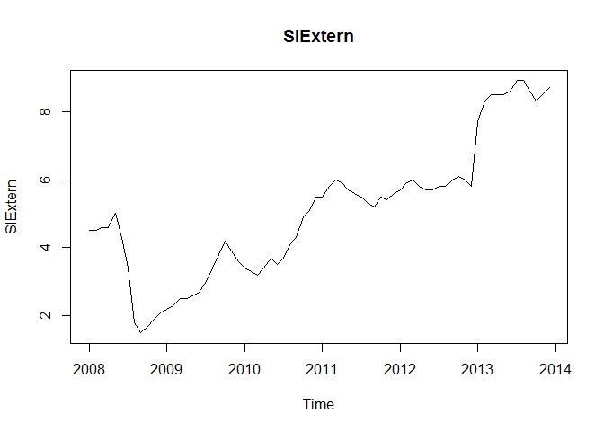
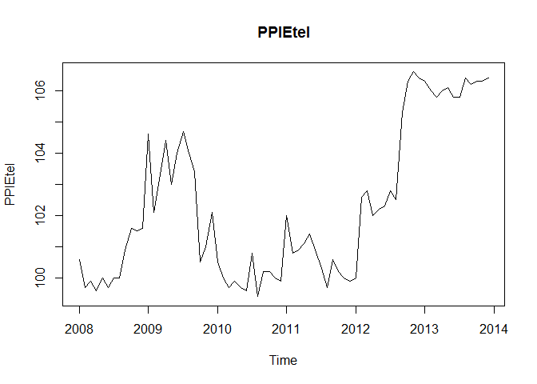
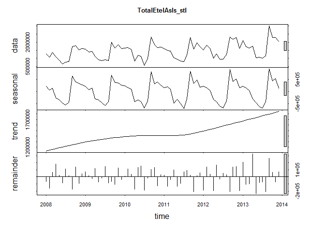
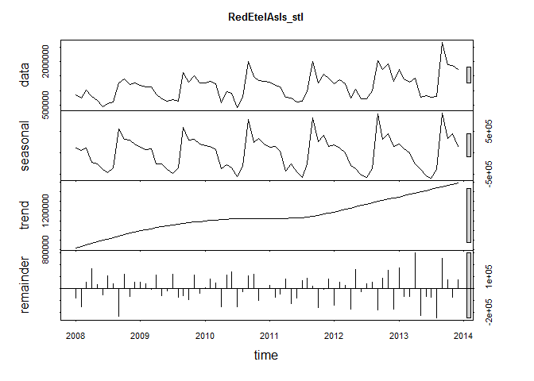
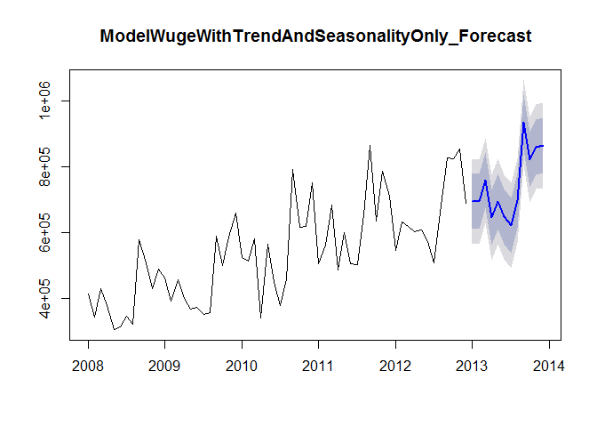
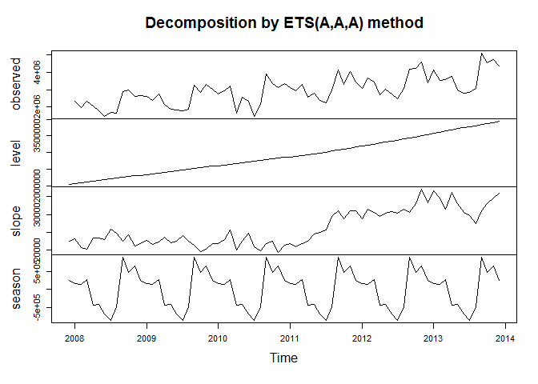
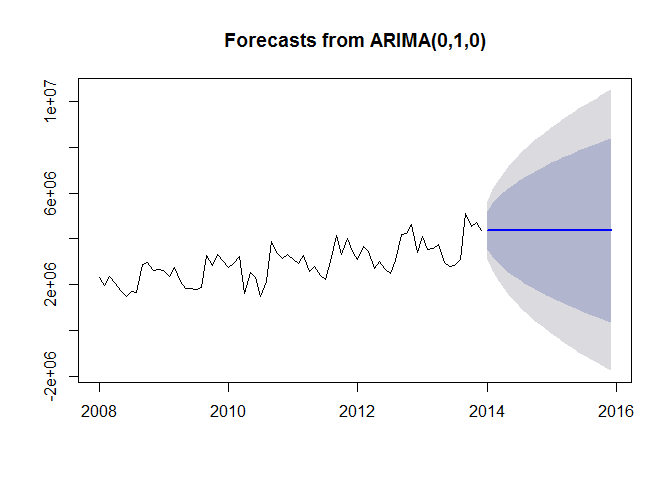
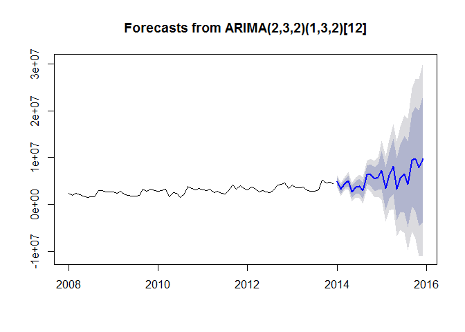

# Chulwalhar Flower Exports: Time Series Data Modeling and Forecasting
Brian Less, Araya Messa, Tony Garza  
July 24, 2016  
# Introduction

Chulwalhar, part an of island group in the northern hemisphere, is known for the winter-blooming plants. They export Efak, Wuge, and Etel with known increases in exports toward end of year. We will be performing exploratory data analysis and determining the best forecasting model along this time series data. Some important points to note are that Chulwalhar celebrates independence on December 1st and the March equinox, so we will be evaluating these observations moving through our analysis. We will be determining which are influencing indicators for Prime Minister of Chulwalhar, who is the orignator of this request.

## Project Setup and Required Packages


```r
setwd("C:/Users/thisi/OneDrive/git_repositories/CaseStudy10_LeeMessaGarza")
library(fpp) # must install.packages("fpp", repos = "https://cran.revolutionanalytics.com")
library(foreach) # must install.packages("foreach", repos = "https://cran.revolutionanalytics.com")
```

## Import and Data Cleanup


```r
source("ImportAndCleanupData.R")
```

Importing and tidying data from the files: ImportedAsIsDataChulwalar.csv, ImportedPlanDataChulwalar.csv, and ImportedIndicatorsChulwalar.csv.

## Defined Objects

```r
source("DefinedObjects.R")
```

All Objects loaded for exploration and analysis

# Exploration of Chulwalar Data

## Definition of the Indicators and Their Correlation with the Basic Data

### Monthly Change in Export Price Index (CEPI)


```r
plot(CEPI, main="CEPI")
```

<!-- -->

```r
cor(TotalAsIs, CEPI)
```

```
## [1] 0.663925
```

```r
cor(EfakAsIs , CEPI)
```

```
## [1] 0.9303543
```

```r
cor(WugeAsIs, CEPI)
```

```
## [1] 0.7618551
```

```r
cor(TotalEtelAsIs, CEPI)
```

```
## [1] 0.339713
```

```r
cor(BlueEtelAsIs , CEPI)
```

```
## [1] 0.1448837
```

```r
cor(RedEtelAsIs , CEPI)
```

```
## [1] 0.3587646
```

The CEPI correlates very well with the efak exports.

### Monthly Satisfaction Index (SI) government based data


```r
plot(SIGov, main="SIGov")
```

<!-- -->

```r
cor(TotalAsIs, SIGov)
```

```
## [1] 0.2007768
```

```r
cor(EfakAsIs , SIGov)
```

```
## [1] 0.37934
```

```r
cor(WugeAsIs, SIGov)
```

```
## [1] 0.3030266
```

```r
cor(TotalEtelAsIs, SIGov)
```

```
## [1] 0.002556094
```

```r
cor(BlueEtelAsIs , SIGov)
```

```
## [1] -0.04146932
```

```r
cor(RedEtelAsIs , SIGov)
```

```
## [1] 0.009978415
```

The Satisfaction Index does not show any particular correlation with any of the exports data.

### Average monthly temperatures in Chulwalar


```r
plot(Temperature, main="Temperature")
```

<!-- -->

```r
cor(TotalAsIs, Temperature)
```

```
## [1] -0.3429684
```

```r
cor(EfakAsIs , Temperature)
```

```
## [1] -0.07951179
```

```r
cor(WugeAsIs, Temperature)
```

```
## [1] -0.2045082
```

```r
cor(TotalEtelAsIs, Temperature)
```

```
## [1] -0.453138
```

```r
cor(BlueEtelAsIs , Temperature)
```

```
## [1] -0.6356067
```

```r
cor(RedEtelAsIs , Temperature)
```

```
## [1] -0.4028941
```

The temperatures have a negative correlation, exports increase in the colder months. However, the relationship is only stronger with blue Etels.

### Monthly births in Chulwalar


```r
plot(Births, main="Births")
```

<!-- -->

```r
cor(TotalAsIs, Births)
```

```
## [1] -0.1190228
```

```r
cor(EfakAsIs , Births)
```

```
## [1] -0.05802961
```

```r
cor(WugeAsIs, Births)
```

```
## [1] -0.007371339
```

```r
cor(TotalEtelAsIs, Births)
```

```
## [1] -0.1504242
```

```r
cor(BlueEtelAsIs , Births)
```

```
## [1] -0.2812913
```

```r
cor(RedEtelAsIs , Births)
```

```
## [1] -0.1217222
```

The consideration by Chulwalar's experts was that expecting new parents to try to export more products to pay for the cost of a new child. However, this could not be confirmed.  

### Monthly Satisfaction Index (SI) external index 


```r
plot(SIExtern, main="SIExtern")
```

<!-- -->

```r
cor(TotalAsIs, SIExtern)
```

```
## [1] 0.5883122
```

```r
cor(EfakAsIs , SIExtern)
```

```
## [1] 0.8358147
```

```r
cor(WugeAsIs, SIExtern)
```

```
## [1] 0.6786552
```

```r
cor(TotalEtelAsIs, SIExtern)
```

```
## [1] 0.2865672
```

```r
cor(BlueEtelAsIs , SIExtern)
```

```
## [1] 0.1604768
```

```r
cor(RedEtelAsIs , SIExtern)
```

```
## [1] 0.2960946
```

This indicator also has a high correlation with Efak exports. 

### Yearly Exports from Urbano


```r
plot(UrbanoExports, main="UrbanoExports")
```

<!-- -->

```r
cor(TotalAsIs, UrbanoExports)
```

```
## [1] 0.638178
```

```r
cor(EfakAsIs , UrbanoExports)
```

```
## [1] 0.9163565
```

```r
cor(WugeAsIs, UrbanoExports)
```

```
## [1] 0.7118468
```

```r
cor(TotalEtelAsIs, UrbanoExports)
```

```
## [1] 0.3182532
```

```r
cor(BlueEtelAsIs , UrbanoExports)
```

```
## [1] 0.1655794
```

```r
cor(RedEtelAsIs , UrbanoExports)
```

```
## [1] 0.3309962
```

This indicator also has a high correlation with Efak exports. The Wuge exports also show a correlation. Unfortunatly it was not possible to find other useful indicators based on exports from Urbano, due to possible informers being very restrictive with information. 

### Yearly number of Globalisation Party members in Chulwalar


```r
plot(GlobalisationPartyMembers, main="GlobalisationPartyMembers")
```

<!-- -->

```r
cor(TotalAsIs, GlobalisationPartyMembers)
```

```
## [1] 0.630084
```

```r
cor(EfakAsIs , GlobalisationPartyMembers)
```

```
## [1] 0.8963942
```

```r
cor(WugeAsIs, GlobalisationPartyMembers)
```

```
## [1] 0.7193864
```

```r
cor(TotalEtelAsIs, GlobalisationPartyMembers)
```

```
## [1] 0.2994635
```

```r
cor(BlueEtelAsIs , GlobalisationPartyMembers)
```

```
## [1] 0.08547266
```

```r
cor(RedEtelAsIs , GlobalisationPartyMembers)
```

```
## [1] 0.3234832
```

There is a similar picture here to that of Urbano Exports. It should however be noted that there is a continuous growth here and that the yearly view could lead to the data appearing to correlate, although this could just be due to an increase in trend. Although this could also be true for the Urbano Exports, the trend seems logical due to the Chulwalar's exports growing in accordance with the Urbano's Exports.

### Monthly Average Export Price Index for Chulwalar


```r
plot(AEPI, main="AEPI")
```

<!-- -->

```r
cor(TotalAsIs, AEPI)
```

```
## [1] 0.625232
```

```r
cor(EfakAsIs , AEPI)
```

```
## [1] 0.9056624
```

```r
cor(WugeAsIs, AEPI)
```

```
## [1] 0.7159733
```

```r
cor(TotalEtelAsIs, AEPI)
```

```
## [1] 0.3035506
```

```r
cor(BlueEtelAsIs , AEPI)
```

```
## [1] 0.1577964
```

```r
cor(RedEtelAsIs , AEPI)
```

```
## [1] 0.3157277
```

The continuous growth leads to a good correlation here too.

### Monthly Producer Price Index (PPI) for Etel in Chulwalar


```r
plot(PPIEtel, main="PPIEtel")
```

<!-- -->

```r
cor(TotalAsIs, PPIEtel)
```

```
## [1] 0.4836129
```

```r
cor(EfakAsIs , PPIEtel)
```

```
## [1] 0.5865375
```

```r
cor(WugeAsIs, PPIEtel)
```

```
## [1] 0.4920865
```

```r
cor(TotalEtelAsIs, PPIEtel)
```

```
## [1] 0.3374707
```

```r
cor(BlueEtelAsIs , PPIEtel)
```

```
## [1] 0.2445472
```

```r
cor(RedEtelAsIs , PPIEtel)
```

```
## [1] 0.3391872
```

This indicator does not give the expected results. It does not show any correlation worth mentioning, not even with the Etel segment. 

### National Holidays


```r
plot(NationalHolidays, main="NationalHolidays")
```

<!-- -->

```r
cor(TotalAsIs, NationalHolidays)
```

```
## [1] -0.007883708
```

```r
cor(EfakAsIs , NationalHolidays)
```

```
## [1] 0.001235706
```

```r
cor(WugeAsIs, NationalHolidays)
```

```
## [1] 0.06505569
```

```r
cor(TotalEtelAsIs, NationalHolidays)
```

```
## [1] -0.01081446
```

```r
cor(BlueEtelAsIs , NationalHolidays)
```

```
## [1] 0.02903763
```

```r
cor(RedEtelAsIs , NationalHolidays)
```

```
## [1] -0.01717636
```

The months April and December do not correlate well with the exports data. However later tests will show that these are worth considering. The missing correlation is just due to the sparse structure of the NationalHolidays time series.

### Chulwalar Index (Total value of all companies in Chulwalar)


```r
plot(ChulwalarIndex, main="ChulwalarIndex")
```

<!-- -->

```r
cor(TotalAsIs, ChulwalarIndex)
```

```
## [1] 0.4837017
```

```r
cor(EfakAsIs , ChulwalarIndex)
```

```
## [1] 0.7129557
```

```r
cor(WugeAsIs, ChulwalarIndex)
```

```
## [1] 0.5721568
```

```r
cor(TotalEtelAsIs, ChulwalarIndex)
```

```
## [1] 0.2209171
```

```r
cor(BlueEtelAsIs , ChulwalarIndex)
```

```
## [1] 0.1469233
```

```r
cor(RedEtelAsIs , ChulwalarIndex)
```

```
## [1] 0.2242922
```

No particular findings.

### Monthly Inflation rate in Chulwalar


```r
plot(Inflation, main="Inflation")
```

<!-- -->

```r
cor(TotalAsIs, Inflation)
```

```
## [1] 0.002438708
```

```r
cor(EfakAsIs , Inflation)
```

```
## [1] 0.1454134
```

```r
cor(WugeAsIs, Inflation)
```

```
## [1] 0.03191332
```

```r
cor(TotalEtelAsIs, Inflation)
```

```
## [1] -0.08378282
```

```r
cor(BlueEtelAsIs , Inflation)
```

```
## [1] 0.02117817
```

```r
cor(RedEtelAsIs , Inflation)
```

```
## [1] -0.0982151
```

No particular findings.

### Proposed spending for National Holidays


```r
plot(IndependenceDayPresents, main="IndependenceDayPresents")
```

<!-- -->

```r
cor(TotalAsIs, IndependenceDayPresents)
```

```
## [1] 0.4359522
```

```r
cor(EfakAsIs , IndependenceDayPresents)
```

```
## [1] 0.5243145
```

```r
cor(WugeAsIs, IndependenceDayPresents)
```

```
## [1] 0.4892437
```

```r
cor(TotalEtelAsIs, IndependenceDayPresents)
```

```
## [1] 0.2872013
```

```r
cor(BlueEtelAsIs , IndependenceDayPresents)
```

```
## [1] 0.2110373
```

```r
cor(RedEtelAsIs , IndependenceDayPresents)
```

```
## [1] 0.2881631
```

No particular findings.

### Influence of National Holiday


```r
plot(InfluenceNationalHolidays, main="InfluenceNationalHolidays")
```

<!-- -->

```r
cor(TotalAsIs, InfluenceNationalHolidays)
```

```
## [1] 0.3717463
```

```r
cor(EfakAsIs , InfluenceNationalHolidays)
```

```
## [1] 0.09926836
```

```r
cor(WugeAsIs, InfluenceNationalHolidays)
```

```
## [1] 0.3712288
```

```r
cor(TotalEtelAsIs, InfluenceNationalHolidays)
```

```
## [1] 0.4535836
```

```r
cor(BlueEtelAsIs , InfluenceNationalHolidays)
```

```
## [1] 0.2792198
```

```r
cor(RedEtelAsIs , InfluenceNationalHolidays)
```

```
## [1] 0.4643512
```

This indicator is an experiment where the influence of National Holidays is extended into the months leading up to the holiday. However later tests show that this indicator is no better for forecasting than the orignial National Holidays indicator.   

## Correlation of the indicators with each another 


```r
IndicatorsmatrixStandardised
```

Establish the standardised data matrix


```r
NumberOfIndicators
```

```
## [1] 72
```

The dimensions of the matrix are determined by the number of indicators.


```r
IndicatorsCorrelationCoefficientMatrix
```

```
##                                 CEPIVector SIGovVector TemperatureVector
## CEPIVector                      1.00000000  0.38443508       0.061196862
## SIGovVector                     0.38443508  1.00000000       0.088109231
## TemperatureVector               0.06119686  0.08810923       1.000000000
## BirthsVector                    0.08872676  0.12753378       0.744270853
## SIGovVector                     0.38443508  1.00000000       0.088109231
## UrbanoExportsVector             0.97660022  0.40700264      -0.001244458
## GlobalisationPartyMembersVector 0.91557949  0.49433954      -0.009695828
## AEPIVector                      0.97697428  0.45955807       0.055196145
## PPIEtel                         0.65446147 -0.23602751      -0.013959906
## NationalHolidaysVector          0.04830482 -0.02025819      -0.316148237
## ChulwalarIndexVector            0.76208613  0.63652935       0.036317166
## InflationVector                 0.16379793  0.55866085       0.054966975
## IndependenceDayPresentsVector   0.64887003  0.03237405      -0.040110690
##                                 BirthsVector SIGovVector
## CEPIVector                        0.08872676  0.38443508
## SIGovVector                       0.12753378  1.00000000
## TemperatureVector                 0.74427085  0.08810923
## BirthsVector                      1.00000000  0.12753378
## SIGovVector                       0.12753378  1.00000000
## UrbanoExportsVector               0.03139251  0.40700264
## GlobalisationPartyMembersVector  -0.01768274  0.49433954
## AEPIVector                        0.09673808  0.45955807
## PPIEtel                           0.05960084 -0.23602751
## NationalHolidaysVector           -0.37785553 -0.02025819
## ChulwalarIndexVector              0.11795545  0.63652935
## InflationVector                   0.11231574  0.55866085
## IndependenceDayPresentsVector     0.10063892  0.03237405
##                                 UrbanoExportsVector
## CEPIVector                             9.766002e-01
## SIGovVector                            4.070026e-01
## TemperatureVector                     -1.244458e-03
## BirthsVector                           3.139251e-02
## SIGovVector                            4.070026e-01
## UrbanoExportsVector                    1.000000e+00
## GlobalisationPartyMembersVector        9.121013e-01
## AEPIVector                             9.827920e-01
## PPIEtel                                6.521194e-01
## NationalHolidaysVector                -1.876433e-17
## ChulwalarIndexVector                   7.856783e-01
## InflationVector                        1.985267e-01
## IndependenceDayPresentsVector          6.699996e-01
##                                 GlobalisationPartyMembersVector AEPIVector
## CEPIVector                                         9.155795e-01 0.97697428
## SIGovVector                                        4.943395e-01 0.45955807
## TemperatureVector                                 -9.695828e-03 0.05519615
## BirthsVector                                      -1.768274e-02 0.09673808
## SIGovVector                                        4.943395e-01 0.45955807
## UrbanoExportsVector                                9.121013e-01 0.98279202
## GlobalisationPartyMembersVector                    1.000000e+00 0.88225030
## AEPIVector                                         8.822503e-01 1.00000000
## PPIEtel                                            4.583532e-01 0.62229942
## NationalHolidaysVector                             1.250956e-17 0.01886347
## ChulwalarIndexVector                               6.647301e-01 0.80958140
## InflationVector                                    9.009471e-02 0.30646256
## IndependenceDayPresentsVector                      4.606363e-01 0.64313387
##                                     PPIEtel NationalHolidaysVector
## CEPIVector                       0.65446147           4.830482e-02
## SIGovVector                     -0.23602751          -2.025819e-02
## TemperatureVector               -0.01395991          -3.161482e-01
## BirthsVector                     0.05960084          -3.778555e-01
## SIGovVector                     -0.23602751          -2.025819e-02
## UrbanoExportsVector              0.65211942          -1.876433e-17
## GlobalisationPartyMembersVector  0.45835315           1.250956e-17
## AEPIVector                       0.62229942           1.886347e-02
## PPIEtel                          1.00000000           2.896317e-02
## NationalHolidaysVector           0.02896317           1.000000e+00
## ChulwalarIndexVector             0.45429124           5.430333e-02
## InflationVector                 -0.25048037          -9.384951e-03
## IndependenceDayPresentsVector    0.71474813           0.000000e+00
##                                 ChulwalarIndexVector InflationVector
## CEPIVector                                0.76208613     0.163797927
## SIGovVector                               0.63652935     0.558660851
## TemperatureVector                         0.03631717     0.054966975
## BirthsVector                              0.11795545     0.112315739
## SIGovVector                               0.63652935     0.558660851
## UrbanoExportsVector                       0.78567826     0.198526676
## GlobalisationPartyMembersVector           0.66473014     0.090094706
## AEPIVector                                0.80958140     0.306462559
## PPIEtel                                   0.45429124    -0.250480368
## NationalHolidaysVector                    0.05430333    -0.009384951
## ChulwalarIndexVector                      1.00000000     0.341955823
## InflationVector                           0.34195582     1.000000000
## IndependenceDayPresentsVector             0.62615921    -0.185842679
##                                 IndependenceDayPresentsVector
## CEPIVector                                         0.64887003
## SIGovVector                                        0.03237405
## TemperatureVector                                 -0.04011069
## BirthsVector                                       0.10063892
## SIGovVector                                        0.03237405
## UrbanoExportsVector                                0.66999963
## GlobalisationPartyMembersVector                    0.46063633
## AEPIVector                                         0.64313387
## PPIEtel                                            0.71474813
## NationalHolidaysVector                             0.00000000
## ChulwalarIndexVector                               0.62615921
## InflationVector                                   -0.18584268
## IndependenceDayPresentsVector                      1.00000000
```

Produce the IndicatorsCorrelationCoefficientMatrix.

## ModelWithAlllIndicators and With Each Indicator Individually

### All Indiators in one model:


```r
summary(ModelWithAlllIndicators)
```

```
## 
## Call:
## tslm(formula = TotalAsIs ~ trend + season + CEPI + SIGov + Temperature + 
##     Births + SIExtern + UrbanoExports + GlobalisationPartyMembers + 
##     AEPI + PPIEtel + NationalHolidays + ChulwalarIndex + Inflation + 
##     IndependenceDayPresents)
## 
## Residuals:
##     Min      1Q  Median      3Q     Max 
## -458389 -119426    1119  165463  342741 
## 
## Coefficients:
##                             Estimate Std. Error t value Pr(>|t|)   
## (Intercept)               -8.982e+05  2.301e+07  -0.039  0.96904   
## trend                      3.176e+03  3.849e+04   0.083  0.93458   
## season2                    3.146e+05  2.678e+05   1.175  0.24624   
## season3                    5.172e+05  2.649e+05   1.953  0.05695 . 
## season4                    2.972e+05  3.413e+05   0.871  0.38836   
## season5                   -7.277e+04  3.661e+05  -0.199  0.84333   
## season6                   -2.597e+05  4.199e+05  -0.618  0.53932   
## season7                   -7.550e+05  5.225e+05  -1.445  0.15525   
## season8                   -2.869e+05  4.990e+05  -0.575  0.56809   
## season9                    1.066e+06  4.225e+05   2.523  0.01517 * 
## season10                   8.033e+05  3.352e+05   2.396  0.02068 * 
## season11                   1.226e+06  3.555e+05   3.449  0.00122 **
## season12                   9.734e+05  3.645e+05   2.670  0.01044 * 
## CEPI                      -3.551e+04  2.516e+05  -0.141  0.88838   
## SIGov                     -1.506e+04  9.150e+03  -1.646  0.10657   
## Temperature               -3.108e+04  2.069e+04  -1.502  0.14003   
## Births                     8.045e+01  3.894e+01   2.066  0.04448 * 
## SIExtern                   3.706e+04  5.872e+04   0.631  0.53109   
## UrbanoExports              5.323e-01  5.675e-01   0.938  0.35317   
## GlobalisationPartyMembers  7.324e+01  6.583e+01   1.113  0.27163   
## AEPI                      -6.003e+04  7.476e+04  -0.803  0.42612   
## PPIEtel                    7.799e+03  3.622e+04   0.215  0.83048   
## NationalHolidays          -3.192e+05  1.718e+05  -1.858  0.06963 . 
## ChulwalarIndex             6.102e+01  7.545e+01   0.809  0.42284   
## Inflation                  7.058e+04  1.555e+05   0.454  0.65213   
## IndependenceDayPresents    4.211e+01  6.187e+03   0.007  0.99460   
## ---
## Signif. codes:  0 '***' 0.001 '**' 0.01 '*' 0.05 '.' 0.1 ' ' 1
## 
## Residual standard error: 249400 on 46 degrees of freedom
## Multiple R-squared:  0.9421,	Adjusted R-squared:  0.9106 
## F-statistic: 29.94 on 25 and 46 DF,  p-value: < 2.2e-16
```

### CEPI:


```r
summary(ModelWithCEPI)
```

```
## 
## Call:
## tslm(formula = TotalAsIs ~ trend + season + CEPI)
## 
## Residuals:
##     Min      1Q  Median      3Q     Max 
## -670684 -142117    7024  168664  495366 
## 
## Coefficients:
##             Estimate Std. Error t value Pr(>|t|)    
## (Intercept) -2946424    5153463  -0.572 0.569710    
## trend          19698       6926   2.844 0.006145 ** 
## season2      -153665     153683  -1.000 0.321523    
## season3         8677     156732   0.055 0.956039    
## season4      -634082     154130  -4.114 0.000124 ***
## season5      -648875     154240  -4.207 9.09e-05 ***
## season6      -906108     153943  -5.886 2.10e-07 ***
## season7     -1112258     155872  -7.136 1.73e-09 ***
## season8      -755527     155490  -4.859 9.34e-06 ***
## season9       683382     154129   4.434 4.18e-05 ***
## season10      287071     153168   1.874 0.065940 .  
## season11      465878     152885   3.047 0.003474 ** 
## season12       50523     154712   0.327 0.745176    
## CEPI           53135      53376   0.995 0.323636    
## ---
## Signif. codes:  0 '***' 0.001 '**' 0.01 '*' 0.05 '.' 0.1 ' ' 1
## 
## Residual standard error: 263300 on 58 degrees of freedom
## Multiple R-squared:  0.9187,	Adjusted R-squared:  0.9004 
## F-statistic: 50.39 on 13 and 58 DF,  p-value: < 2.2e-16
```

The CEPI Indicator correlated best with total exports. Indeed the multiple R² improved the model slighltly compared to the simple ModelWithTrendAndSeasonalityOnly. However, the adjusted R² remains the same.


### SIGov:


```r
summary(ModelWithSIGov) 
```

```
## 
## Call:
## tslm(formula = TotalAsIs ~ trend + season + SIGov)
## 
## Residuals:
##     Min      1Q  Median      3Q     Max 
## -697126 -157160   22782  161382  486711 
## 
## Coefficients:
##             Estimate Std. Error t value Pr(>|t|)    
## (Intercept)  2154993     126151  17.083  < 2e-16 ***
## trend          26826       1656  16.196  < 2e-16 ***
## season2      -133003     152843  -0.870 0.387782    
## season3        44751     152866   0.293 0.770763    
## season4      -606128     152952  -3.963 0.000205 ***
## season5      -622634     152935  -4.071 0.000143 ***
## season6      -881666     153013  -5.762 3.35e-07 ***
## season7     -1075681     153183  -7.022 2.69e-09 ***
## season8      -726089     153194  -4.740 1.43e-05 ***
## season9       705690     153291   4.604 2.31e-05 ***
## season10      297924     153457   1.941 0.057071 .  
## season11      468770     153659   3.051 0.003439 ** 
## season12       68494     153977   0.445 0.658095    
## SIGov          -2003       3274  -0.612 0.543174    
## ---
## Signif. codes:  0 '***' 0.001 '**' 0.01 '*' 0.05 '.' 0.1 ' ' 1
## 
## Residual standard error: 264700 on 58 degrees of freedom
## Multiple R-squared:  0.9178,	Adjusted R-squared:  0.8994 
## F-statistic: 49.81 on 13 and 58 DF,  p-value: < 2.2e-16
```
   
The Satisfaction Index (gov)  hardly changes the function of the model.

### Temperature:


```r
summary(ModelWithTemperature)
```

```
## 
## Call:
## tslm(formula = TotalAsIs ~ trend + season + Temperature)
## 
## Residuals:
##     Min      1Q  Median      3Q     Max 
## -706803 -154965   23511  160215  483373 
## 
## Coefficients:
##             Estimate Std. Error t value Pr(>|t|)    
## (Intercept)  2185999     118102  18.509  < 2e-16 ***
## trend          26367       1526  17.278  < 2e-16 ***
## season2      -130163     152875  -0.851  0.39803    
## season3        91513     171443   0.534  0.59553    
## season4      -504879     236159  -2.138  0.03675 *  
## season5      -476774     296010  -1.611  0.11268    
## season6      -703539     345717  -2.035  0.04643 *  
## season7      -873818     386156  -2.263  0.02740 *  
## season8      -524053     378812  -1.383  0.17184    
## season9       858772     305542   2.811  0.00673 ** 
## season10      401142     232466   1.726  0.08974 .  
## season11      530742     183985   2.885  0.00549 ** 
## season12       85552     155077   0.552  0.58329    
## Temperature   -11344      19587  -0.579  0.56473    
## ---
## Signif. codes:  0 '***' 0.001 '**' 0.01 '*' 0.05 '.' 0.1 ' ' 1
## 
## Residual standard error: 264800 on 58 degrees of freedom
## Multiple R-squared:  0.9177,	Adjusted R-squared:  0.8993 
## F-statistic: 49.78 on 13 and 58 DF,  p-value: < 2.2e-16
```

### Births:


```r
summary(ModelWithBirths) 
```

```
## 
## Call:
## tslm(formula = TotalAsIs ~ trend + season + Births)
## 
## Residuals:
##     Min      1Q  Median      3Q     Max 
## -648252 -106586   23124  166173  443675 
## 
## Coefficients:
##               Estimate Std. Error t value Pr(>|t|)    
## (Intercept) -1.485e+06  1.452e+06  -1.023 0.310779    
## trend        2.633e+04  1.449e+03  18.163  < 2e-16 ***
## season2      1.856e+05  1.918e+05   0.968 0.337199    
## season3      1.510e+05  1.512e+05   0.998 0.322286    
## season4     -4.181e+05  1.639e+05  -2.551 0.013402 *  
## season5     -6.484e+05  1.459e+05  -4.444 4.04e-05 ***
## season6     -9.698e+05  1.496e+05  -6.482 2.16e-08 ***
## season7     -1.518e+06  2.265e+05  -6.704 9.20e-09 ***
## season8     -1.068e+06  1.992e+05  -5.364 1.48e-06 ***
## season9      3.721e+05  1.966e+05   1.893 0.063345 .  
## season10     2.114e+05  1.502e+05   1.407 0.164622    
## season11     6.744e+05  1.666e+05   4.049 0.000155 ***
## season12     2.147e+05  1.565e+05   1.372 0.175458    
## Births       6.589e+01  2.601e+01   2.533 0.014026 *  
## ---
## Signif. codes:  0 '***' 0.001 '**' 0.01 '*' 0.05 '.' 0.1 ' ' 1
## 
## Residual standard error: 251900 on 58 degrees of freedom
## Multiple R-squared:  0.9255,	Adjusted R-squared:  0.9088 
## F-statistic: 55.43 on 13 and 58 DF,  p-value: < 2.2e-16
```

### SIExtern:


```r
summary(ModelWithSIExtern) 
```

```
## 
## Call:
## tslm(formula = TotalAsIs ~ trend + season + SIExtern)
## 
## Residuals:
##     Min      1Q  Median      3Q     Max 
## -667444 -154044   -5891  162628  473612 
## 
## Coefficients:
##             Estimate Std. Error t value Pr(>|t|)    
## (Intercept)  2124425     137869  15.409  < 2e-16 ***
## trend          24163       3191   7.572 3.20e-10 ***
## season2      -133767     152487  -0.877 0.383979    
## season3        43156     152535   0.283 0.778243    
## season4      -609825     152516  -3.998 0.000183 ***
## season5      -624208     152569  -4.091 0.000134 ***
## season6      -877941     152767  -5.747 3.55e-07 ***
## season7     -1071287     153027  -7.001 2.92e-09 ***
## season8      -710173     153873  -4.615 2.22e-05 ***
## season9       722059     154265   4.681 1.76e-05 ***
## season10      312879     153885   2.033 0.046617 *  
## season11      486780     154278   3.155 0.002542 ** 
## season12       88661     154442   0.574 0.568139    
## SIExtern       26522      32881   0.807 0.423187    
## ---
## Signif. codes:  0 '***' 0.001 '**' 0.01 '*' 0.05 '.' 0.1 ' ' 1
## 
## Residual standard error: 264000 on 58 degrees of freedom
## Multiple R-squared:  0.9182,	Adjusted R-squared:  0.8998 
## F-statistic: 50.07 on 13 and 58 DF,  p-value: < 2.2e-16
```

### UrbanoExports:


```r
summary(ModelWithTotalUrbanoExports) 
```

```
## 
## Call:
## tslm(formula = TotalAsIs ~ trend + season + UrbanoExports)
## 
## Residuals:
##     Min      1Q  Median      3Q     Max 
## -651323 -145654    7297  172919  469753 
## 
## Coefficients:
##                 Estimate Std. Error t value Pr(>|t|)    
## (Intercept)    1.232e+06  9.485e+05   1.299 0.199178    
## trend          2.118e+04  5.414e+03   3.912 0.000243 ***
## season2       -1.259e+05  1.521e+05  -0.828 0.411030    
## season3        5.708e+04  1.524e+05   0.375 0.709261    
## season4       -5.934e+05  1.528e+05  -3.882 0.000267 ***
## season5       -6.025e+05  1.535e+05  -3.925 0.000232 ***
## season6       -8.568e+05  1.544e+05  -5.551 7.40e-07 ***
## season7       -1.048e+06  1.554e+05  -6.741 7.96e-09 ***
## season8       -6.879e+05  1.566e+05  -4.392 4.82e-05 ***
## season9        7.477e+05  1.580e+05   4.732 1.47e-05 ***
## season10       3.473e+05  1.596e+05   2.176 0.033640 *  
## season11       5.246e+05  1.613e+05   3.252 0.001913 ** 
## season12       1.317e+05  1.632e+05   0.807 0.423118    
## UrbanoExports  1.717e-01  1.700e-01   1.010 0.316698    
## ---
## Signif. codes:  0 '***' 0.001 '**' 0.01 '*' 0.05 '.' 0.1 ' ' 1
## 
## Residual standard error: 263200 on 58 degrees of freedom
## Multiple R-squared:  0.9187,	Adjusted R-squared:  0.9005 
## F-statistic: 50.41 on 13 and 58 DF,  p-value: < 2.2e-16
```

Indicator with adjusted R² shows a better result than the reference model (ModelWithTrendAndSeasonalityOnly). The individual months are also very significant.

### GlobalisationPartyMembers:


```r
summary(ModelWithGlobalisationPartyMembers) 
```

```
## 
## Call:
## tslm(formula = TotalAsIs ~ trend + season + GlobalisationPartyMembers)
## 
## Residuals:
##     Min      1Q  Median      3Q     Max 
## -696019 -161848   22345  172443  478347 
## 
## Coefficients:
##                             Estimate Std. Error t value Pr(>|t|)    
## (Intercept)                2.629e+06  9.653e+05   2.724 0.008517 ** 
## trend                      2.928e+04  6.311e+03   4.640 2.04e-05 ***
## season2                   -1.340e+05  1.531e+05  -0.875 0.385097    
## season3                    4.087e+04  1.535e+05   0.266 0.791010    
## season4                   -6.177e+05  1.542e+05  -4.006 0.000178 ***
## season5                   -6.350e+05  1.551e+05  -4.094 0.000133 ***
## season6                   -8.973e+05  1.562e+05  -5.744 3.59e-07 ***
## season7                   -1.096e+06  1.576e+05  -6.955 3.49e-09 ***
## season8                   -7.447e+05  1.593e+05  -4.676 1.79e-05 ***
## season9                    6.829e+05  1.611e+05   4.238 8.18e-05 ***
## season10                   2.743e+05  1.632e+05   1.681 0.098191 .  
## season11                   4.435e+05  1.655e+05   2.680 0.009573 ** 
## season12                   4.252e+04  1.680e+05   0.253 0.801132    
## GlobalisationPartyMembers -9.840e+00  2.111e+01  -0.466 0.642806    
## ---
## Signif. codes:  0 '***' 0.001 '**' 0.01 '*' 0.05 '.' 0.1 ' ' 1
## 
## Residual standard error: 265000 on 58 degrees of freedom
## Multiple R-squared:  0.9176,	Adjusted R-squared:  0.8991 
## F-statistic: 49.67 on 13 and 58 DF,  p-value: < 2.2e-16
```

### AEPI:


```r
summary(ModelWithAEPI)
```

```
## 
## Call:
## tslm(formula = TotalAsIs ~ trend + season + AEPI)
## 
## Residuals:
##     Min      1Q  Median      3Q     Max 
## -668980 -141696    1689  169009  482621 
## 
## Coefficients:
##             Estimate Std. Error t value Pr(>|t|)    
## (Intercept)   839421    1642691   0.511 0.611288    
## trend          23291       4116   5.658 4.95e-07 ***
## season2      -134830     152491  -0.884 0.380247    
## season3        38792     152745   0.254 0.800419    
## season4      -615165     152666  -4.029 0.000165 ***
## season5      -625294     152554  -4.099 0.000131 ***
## season6      -884504     152617  -5.796 2.95e-07 ***
## season7     -1082577     152748  -7.087 2.09e-09 ***
## season8      -723603     152794  -4.736 1.45e-05 ***
## season9       706895     152908   4.623 2.16e-05 ***
## season10      308319     153364   2.010 0.049049 *  
## season11      485176     154001   3.150 0.002578 ** 
## season12       85919     154027   0.558 0.579115    
## AEPI           14065      17159   0.820 0.415759    
## ---
## Signif. codes:  0 '***' 0.001 '**' 0.01 '*' 0.05 '.' 0.1 ' ' 1
## 
## Residual standard error: 264000 on 58 degrees of freedom
## Multiple R-squared:  0.9182,	Adjusted R-squared:  0.8999 
## F-statistic: 50.09 on 13 and 58 DF,  p-value: < 2.2e-16
```

### PPIEtel:

```r
summary(ModelWithPPIEtel)
```

```
## 
## Call:
## tslm(formula = TotalAsIs ~ trend + season + PPIEtel)
## 
## Residuals:
##     Min      1Q  Median      3Q     Max 
## -670282 -185589   19856  172554  468929 
## 
## Coefficients:
##             Estimate Std. Error t value Pr(>|t|)    
## (Intercept)   593668    1640506   0.362 0.718756    
## trend          25282       1919  13.172  < 2e-16 ***
## season2      -122617     152330  -0.805 0.424141    
## season3        53107     152246   0.349 0.728486    
## season4      -603022     152264  -3.960 0.000207 ***
## season5      -614727     152459  -4.032 0.000163 ***
## season6      -872851     152619  -5.719 3.94e-07 ***
## season7     -1073314     152456  -7.040 2.51e-09 ***
## season8      -711389     153051  -4.648 1.98e-05 ***
## season9       707996     152568   4.641 2.03e-05 ***
## season10      307412     152867   2.011 0.048984 *  
## season11      479843     153028   3.136 0.002692 ** 
## season12       80433     153124   0.525 0.601390    
## PPIEtel        15872      16347   0.971 0.335606    
## ---
## Signif. codes:  0 '***' 0.001 '**' 0.01 '*' 0.05 '.' 0.1 ' ' 1
## 
## Residual standard error: 263400 on 58 degrees of freedom
## Multiple R-squared:  0.9186,	Adjusted R-squared:  0.9003 
## F-statistic: 50.34 on 13 and 58 DF,  p-value: < 2.2e-16
```


### NationalHolidays:

```r
summary(ModelWithNationalHolidays)
```

```
## 
## Call:
## tslm(formula = TotalAsIs ~ trend + season + NationalHolidays)
## 
## Residuals:
##     Min      1Q  Median      3Q     Max 
## -555545 -153976       4  150487  404837 
## 
## Coefficients:
##                  Estimate Std. Error t value Pr(>|t|)    
## (Intercept)       2182435     110867  19.685  < 2e-16 ***
## trend               26427       1431  18.465  < 2e-16 ***
## season2           -131168     143696  -0.913  0.36512    
## season3            190430     152432   1.249  0.21658    
## season4           -321411     176034  -1.826  0.07302 .  
## season5           -623539     143803  -4.336 5.86e-05 ***
## season6           -883072     143867  -6.138 8.06e-08 ***
## season7          -1079124     143945  -7.497 4.29e-10 ***
## season8           -724693     144037  -5.031 5.02e-06 ***
## season9            705716     144144   4.896 8.18e-06 ***
## season10           300019     144265   2.080  0.04199 *  
## season11           472099     144400   3.269  0.00182 ** 
## season12           505461     210051   2.406  0.01932 *  
## NationalHolidays  -431536     152405  -2.832  0.00636 ** 
## ---
## Signif. codes:  0 '***' 0.001 '**' 0.01 '*' 0.05 '.' 0.1 ' ' 1
## 
## Residual standard error: 248900 on 58 degrees of freedom
## Multiple R-squared:  0.9273,	Adjusted R-squared:  0.911 
## F-statistic: 56.92 on 13 and 58 DF,  p-value: < 2.2e-16
```

### ChulwalarIndex:


```r
summary(ModelWithChulwalarIndex) 
```

```
## 
## Call:
## tslm(formula = TotalAsIs ~ trend + season + ChulwalarIndex)
## 
## Residuals:
##     Min      1Q  Median      3Q     Max 
## -689635 -153608    9444  166039  495113 
## 
## Coefficients:
##                  Estimate Std. Error t value Pr(>|t|)    
## (Intercept)     2.013e+06  2.262e+05   8.898 1.96e-12 ***
## trend           2.506e+04  2.176e+03  11.515  < 2e-16 ***
## season2        -1.295e+05  1.523e+05  -0.850 0.398630    
## season3         4.684e+04  1.523e+05   0.308 0.759534    
## season4        -6.157e+05  1.525e+05  -4.036 0.000161 ***
## season5        -6.281e+05  1.525e+05  -4.119 0.000122 ***
## season6        -8.809e+05  1.525e+05  -5.776 3.18e-07 ***
## season7        -1.082e+06  1.526e+05  -7.092 2.05e-09 ***
## season8        -7.182e+05  1.528e+05  -4.699 1.65e-05 ***
## season9         7.115e+05  1.529e+05   4.653 1.95e-05 ***
## season10        3.049e+05  1.530e+05   1.993 0.050965 .  
## season11        4.779e+05  1.532e+05   3.120 0.002817 ** 
## season12        7.433e+04  1.532e+05   0.485 0.629364    
## ChulwalarIndex  3.339e+01  3.805e+01   0.878 0.383723    
## ---
## Signif. codes:  0 '***' 0.001 '**' 0.01 '*' 0.05 '.' 0.1 ' ' 1
## 
## Residual standard error: 263800 on 58 degrees of freedom
## Multiple R-squared:  0.9184,	Adjusted R-squared:  0.9001 
## F-statistic: 50.18 on 13 and 58 DF,  p-value: < 2.2e-16
```

### Inflation:


```r
summary(ModelWithInflation)
```

```
## 
## Call:
## tslm(formula = TotalAsIs ~ trend + season + Inflation)
## 
## Residuals:
##     Min      1Q  Median      3Q     Max 
## -694867 -148205    9248  156635  501218 
## 
## Coefficients:
##             Estimate Std. Error t value Pr(>|t|)    
## (Intercept)  2160745     132862  16.263  < 2e-16 ***
## trend          26414       1526  17.313  < 2e-16 ***
## season2      -131511     153141  -0.859 0.394009    
## season3        45633     153184   0.298 0.766848    
## season4      -607707     153249  -3.966 0.000204 ***
## season5      -623065     153258  -4.065 0.000146 ***
## season6      -882807     153322  -5.758 3.41e-07 ***
## season7     -1078758     153407  -7.032 2.59e-09 ***
## season8      -724536     153503  -4.720 1.53e-05 ***
## season9       706375     153627   4.598 2.36e-05 ***
## season10      301603     153808   1.961 0.054698 .  
## season11      474428     154026   3.080 0.003160 ** 
## season12       76824     154261   0.498 0.620359    
## Inflation      13335      37358   0.357 0.722422    
## ---
## Signif. codes:  0 '***' 0.001 '**' 0.01 '*' 0.05 '.' 0.1 ' ' 1
## 
## Residual standard error: 265200 on 58 degrees of freedom
## Multiple R-squared:  0.9174,	Adjusted R-squared:  0.8989 
## F-statistic: 49.58 on 13 and 58 DF,  p-value: < 2.2e-16
```

### IndependenceDayPresents:


```r
summary(ModelWithIndependenceDayPresents)
```

```
## 
## Call:
## tslm(formula = TotalAsIs ~ trend + season + IndependenceDayPresents)
## 
## Residuals:
##     Min      1Q  Median      3Q     Max 
## -704113 -161955   23265  169241  468613 
## 
## Coefficients:
##                         Estimate Std. Error t value Pr(>|t|)    
## (Intercept)              1925395     469903   4.097 0.000131 ***
## trend                      25706       1986  12.944  < 2e-16 ***
## season2                  -130448     152891  -0.853 0.397053    
## season3                    48026     152930   0.314 0.754620    
## season4                  -606940     152994  -3.967 0.000203 ***
## season5                  -620657     153084  -4.054 0.000152 ***
## season6                  -879470     153200  -5.741 3.63e-07 ***
## season7                 -1074801     153342  -7.009 2.83e-09 ***
## season8                  -719650     153509  -4.688 1.72e-05 ***
## season9                   711480     153702   4.629 2.12e-05 ***
## season10                  306503     153919   1.991 0.051162 .  
## season11                  479303     154163   3.109 0.002907 ** 
## season12                   81850     154431   0.530 0.598127    
## IndependenceDayPresents     1201       2125   0.565 0.574184    
## ---
## Signif. codes:  0 '***' 0.001 '**' 0.01 '*' 0.05 '.' 0.1 ' ' 1
## 
## Residual standard error: 264800 on 58 degrees of freedom
## Multiple R-squared:  0.9177,	Adjusted R-squared:  0.8993 
## F-statistic: 49.76 on 13 and 58 DF,  p-value: < 2.2e-16
```

### InfluenceNationalHolidays:


```r
summary(ModelWithInfluenceNationalHolidays)
```

```
## 
## Call:
## tslm(formula = TotalAsIs ~ trend + season + InfluenceNationalHolidays)
## 
## Residuals:
##     Min      1Q  Median      3Q     Max 
## -555545 -153976       4  150487  404837 
## 
## Coefficients:
##                           Estimate Std. Error t value Pr(>|t|)    
## (Intercept)                2182435     110867  19.685  < 2e-16 ***
## trend                        26427       1431  18.465  < 2e-16 ***
## season2                    -131168     143696  -0.913  0.36512    
## season3                     190430     152432   1.249  0.21658    
## season4                    -321411     176034  -1.826  0.07302 .  
## season5                    -623539     143803  -4.336 5.86e-05 ***
## season6                    -883072     143867  -6.138 8.06e-08 ***
## season7                   -1079124     143945  -7.497 4.29e-10 ***
## season8                    -724693     144037  -5.031 5.02e-06 ***
## season9                    1137252     209773   5.421 1.20e-06 ***
## season10                    300019     144265   2.080  0.04199 *  
## season11                    903635     209949   4.304 6.53e-05 ***
## season12                    505461     210051   2.406  0.01932 *  
## InfluenceNationalHolidays  -431536     152405  -2.832  0.00636 ** 
## ---
## Signif. codes:  0 '***' 0.001 '**' 0.01 '*' 0.05 '.' 0.1 ' ' 1
## 
## Residual standard error: 248900 on 58 degrees of freedom
## Multiple R-squared:  0.9273,	Adjusted R-squared:  0.911 
## F-statistic: 56.92 on 13 and 58 DF,  p-value: < 2.2e-16
```

Indicator with the best adjusted R². The months remain very significant and the indicator itself has a p-value of 0.00636

## *Results Summary*  
CEPI: Adjusted R² = 0.9004  
SIGov: Adjusted R² = 0.8994  
Temperature: Adjusted R² = 0.8993  
Births: Adjusted R² = 0.9088  
SIExtern: Adjusted R² = 0.8998  
UrbanoExports: Adjusted R² = 0.9005  
GlobalisationPartyMembers: Adjusted R² = 0.8991  
AEPI: Adjusted R² = 0.8999  
PPIEtel: Adjusted R² = 0.9003  
**NationalHolidays: Adjusted R² = 0.9110**  
ChulwalarIndex: Adjusted R² = 0.9001  
Inflation: Adjusted R² = 0.8989  
IndependenceDayPresents: Adjusted R² = 0.8993  
**InfluenceNationalHolidays: Adjusted R² = 0.9110**  

## ModelWithHighCorrelatingIndicators 


```r
IndicatorsCorrelationCoefficientMatrix
```

```
##                                 CEPIVector SIGovVector TemperatureVector
## CEPIVector                      1.00000000  0.38443508       0.061196862
## SIGovVector                     0.38443508  1.00000000       0.088109231
## TemperatureVector               0.06119686  0.08810923       1.000000000
## BirthsVector                    0.08872676  0.12753378       0.744270853
## SIGovVector                     0.38443508  1.00000000       0.088109231
## UrbanoExportsVector             0.97660022  0.40700264      -0.001244458
## GlobalisationPartyMembersVector 0.91557949  0.49433954      -0.009695828
## AEPIVector                      0.97697428  0.45955807       0.055196145
## PPIEtel                         0.65446147 -0.23602751      -0.013959906
## NationalHolidaysVector          0.04830482 -0.02025819      -0.316148237
## ChulwalarIndexVector            0.76208613  0.63652935       0.036317166
## InflationVector                 0.16379793  0.55866085       0.054966975
## IndependenceDayPresentsVector   0.64887003  0.03237405      -0.040110690
##                                 BirthsVector SIGovVector
## CEPIVector                        0.08872676  0.38443508
## SIGovVector                       0.12753378  1.00000000
## TemperatureVector                 0.74427085  0.08810923
## BirthsVector                      1.00000000  0.12753378
## SIGovVector                       0.12753378  1.00000000
## UrbanoExportsVector               0.03139251  0.40700264
## GlobalisationPartyMembersVector  -0.01768274  0.49433954
## AEPIVector                        0.09673808  0.45955807
## PPIEtel                           0.05960084 -0.23602751
## NationalHolidaysVector           -0.37785553 -0.02025819
## ChulwalarIndexVector              0.11795545  0.63652935
## InflationVector                   0.11231574  0.55866085
## IndependenceDayPresentsVector     0.10063892  0.03237405
##                                 UrbanoExportsVector
## CEPIVector                             9.766002e-01
## SIGovVector                            4.070026e-01
## TemperatureVector                     -1.244458e-03
## BirthsVector                           3.139251e-02
## SIGovVector                            4.070026e-01
## UrbanoExportsVector                    1.000000e+00
## GlobalisationPartyMembersVector        9.121013e-01
## AEPIVector                             9.827920e-01
## PPIEtel                                6.521194e-01
## NationalHolidaysVector                -1.876433e-17
## ChulwalarIndexVector                   7.856783e-01
## InflationVector                        1.985267e-01
## IndependenceDayPresentsVector          6.699996e-01
##                                 GlobalisationPartyMembersVector AEPIVector
## CEPIVector                                         9.155795e-01 0.97697428
## SIGovVector                                        4.943395e-01 0.45955807
## TemperatureVector                                 -9.695828e-03 0.05519615
## BirthsVector                                      -1.768274e-02 0.09673808
## SIGovVector                                        4.943395e-01 0.45955807
## UrbanoExportsVector                                9.121013e-01 0.98279202
## GlobalisationPartyMembersVector                    1.000000e+00 0.88225030
## AEPIVector                                         8.822503e-01 1.00000000
## PPIEtel                                            4.583532e-01 0.62229942
## NationalHolidaysVector                             1.250956e-17 0.01886347
## ChulwalarIndexVector                               6.647301e-01 0.80958140
## InflationVector                                    9.009471e-02 0.30646256
## IndependenceDayPresentsVector                      4.606363e-01 0.64313387
##                                     PPIEtel NationalHolidaysVector
## CEPIVector                       0.65446147           4.830482e-02
## SIGovVector                     -0.23602751          -2.025819e-02
## TemperatureVector               -0.01395991          -3.161482e-01
## BirthsVector                     0.05960084          -3.778555e-01
## SIGovVector                     -0.23602751          -2.025819e-02
## UrbanoExportsVector              0.65211942          -1.876433e-17
## GlobalisationPartyMembersVector  0.45835315           1.250956e-17
## AEPIVector                       0.62229942           1.886347e-02
## PPIEtel                          1.00000000           2.896317e-02
## NationalHolidaysVector           0.02896317           1.000000e+00
## ChulwalarIndexVector             0.45429124           5.430333e-02
## InflationVector                 -0.25048037          -9.384951e-03
## IndependenceDayPresentsVector    0.71474813           0.000000e+00
##                                 ChulwalarIndexVector InflationVector
## CEPIVector                                0.76208613     0.163797927
## SIGovVector                               0.63652935     0.558660851
## TemperatureVector                         0.03631717     0.054966975
## BirthsVector                              0.11795545     0.112315739
## SIGovVector                               0.63652935     0.558660851
## UrbanoExportsVector                       0.78567826     0.198526676
## GlobalisationPartyMembersVector           0.66473014     0.090094706
## AEPIVector                                0.80958140     0.306462559
## PPIEtel                                   0.45429124    -0.250480368
## NationalHolidaysVector                    0.05430333    -0.009384951
## ChulwalarIndexVector                      1.00000000     0.341955823
## InflationVector                           0.34195582     1.000000000
## IndependenceDayPresentsVector             0.62615921    -0.185842679
##                                 IndependenceDayPresentsVector
## CEPIVector                                         0.64887003
## SIGovVector                                        0.03237405
## TemperatureVector                                 -0.04011069
## BirthsVector                                       0.10063892
## SIGovVector                                        0.03237405
## UrbanoExportsVector                                0.66999963
## GlobalisationPartyMembersVector                    0.46063633
## AEPIVector                                         0.64313387
## PPIEtel                                            0.71474813
## NationalHolidaysVector                             0.00000000
## ChulwalarIndexVector                               0.62615921
## InflationVector                                   -0.18584268
## IndependenceDayPresentsVector                      1.00000000
```

```r
summary(ModelWithHighCorrelatingIndicators)
```

```
## 
## Call:
## tslm(formula = TotalAsIs ~ trend + season + CEPI + SIExtern + 
##     UrbanoExports + GlobalisationPartyMembers + AEPI)
## 
## Residuals:
##     Min      1Q  Median      3Q     Max 
## -651383 -159842   14275  171424  489393 
## 
## Coefficients:
##                             Estimate Std. Error t value Pr(>|t|)    
## (Intercept)               -4.625e+06  1.240e+07  -0.373  0.71054    
## trend                      1.446e+04  1.650e+04   0.876  0.38477    
## season2                   -1.584e+05  1.724e+05  -0.919  0.36213    
## season3                    7.086e+03  1.984e+05   0.036  0.97164    
## season4                   -6.221e+05  1.862e+05  -3.341  0.00152 ** 
## season5                   -6.417e+05  1.944e+05  -3.302  0.00171 ** 
## season6                   -8.872e+05  1.983e+05  -4.473 4.01e-05 ***
## season7                   -1.088e+06  2.218e+05  -4.904 8.99e-06 ***
## season8                   -7.287e+05  2.260e+05  -3.225  0.00214 ** 
## season9                    7.236e+05  2.261e+05   3.201  0.00230 ** 
## season10                   3.199e+05  2.231e+05   1.434  0.15741    
## season11                   4.997e+05  2.246e+05   2.225  0.03027 *  
## season12                   7.986e+04  2.585e+05   0.309  0.75853    
## CEPI                       9.245e+04  1.672e+05   0.553  0.58252    
## SIExtern                   2.378e+04  4.559e+04   0.522  0.60401    
## UrbanoExports              1.504e-01  5.104e-01   0.295  0.76934    
## GlobalisationPartyMembers  3.463e+00  2.546e+01   0.136  0.89233    
## AEPI                      -3.307e+04  5.992e+04  -0.552  0.58327    
## ---
## Signif. codes:  0 '***' 0.001 '**' 0.01 '*' 0.05 '.' 0.1 ' ' 1
## 
## Residual standard error: 271600 on 54 degrees of freedom
## Multiple R-squared:  0.9194,	Adjusted R-squared:  0.8941 
## F-statistic: 36.25 on 17 and 54 DF,  p-value: < 2.2e-16
```

## ModelWithLowCorrelatingIndicators  


```r
IndicatorsCorrelationCoefficientMatrix
```

```
##                                 CEPIVector SIGovVector TemperatureVector
## CEPIVector                      1.00000000  0.38443508       0.061196862
## SIGovVector                     0.38443508  1.00000000       0.088109231
## TemperatureVector               0.06119686  0.08810923       1.000000000
## BirthsVector                    0.08872676  0.12753378       0.744270853
## SIGovVector                     0.38443508  1.00000000       0.088109231
## UrbanoExportsVector             0.97660022  0.40700264      -0.001244458
## GlobalisationPartyMembersVector 0.91557949  0.49433954      -0.009695828
## AEPIVector                      0.97697428  0.45955807       0.055196145
## PPIEtel                         0.65446147 -0.23602751      -0.013959906
## NationalHolidaysVector          0.04830482 -0.02025819      -0.316148237
## ChulwalarIndexVector            0.76208613  0.63652935       0.036317166
## InflationVector                 0.16379793  0.55866085       0.054966975
## IndependenceDayPresentsVector   0.64887003  0.03237405      -0.040110690
##                                 BirthsVector SIGovVector
## CEPIVector                        0.08872676  0.38443508
## SIGovVector                       0.12753378  1.00000000
## TemperatureVector                 0.74427085  0.08810923
## BirthsVector                      1.00000000  0.12753378
## SIGovVector                       0.12753378  1.00000000
## UrbanoExportsVector               0.03139251  0.40700264
## GlobalisationPartyMembersVector  -0.01768274  0.49433954
## AEPIVector                        0.09673808  0.45955807
## PPIEtel                           0.05960084 -0.23602751
## NationalHolidaysVector           -0.37785553 -0.02025819
## ChulwalarIndexVector              0.11795545  0.63652935
## InflationVector                   0.11231574  0.55866085
## IndependenceDayPresentsVector     0.10063892  0.03237405
##                                 UrbanoExportsVector
## CEPIVector                             9.766002e-01
## SIGovVector                            4.070026e-01
## TemperatureVector                     -1.244458e-03
## BirthsVector                           3.139251e-02
## SIGovVector                            4.070026e-01
## UrbanoExportsVector                    1.000000e+00
## GlobalisationPartyMembersVector        9.121013e-01
## AEPIVector                             9.827920e-01
## PPIEtel                                6.521194e-01
## NationalHolidaysVector                -1.876433e-17
## ChulwalarIndexVector                   7.856783e-01
## InflationVector                        1.985267e-01
## IndependenceDayPresentsVector          6.699996e-01
##                                 GlobalisationPartyMembersVector AEPIVector
## CEPIVector                                         9.155795e-01 0.97697428
## SIGovVector                                        4.943395e-01 0.45955807
## TemperatureVector                                 -9.695828e-03 0.05519615
## BirthsVector                                      -1.768274e-02 0.09673808
## SIGovVector                                        4.943395e-01 0.45955807
## UrbanoExportsVector                                9.121013e-01 0.98279202
## GlobalisationPartyMembersVector                    1.000000e+00 0.88225030
## AEPIVector                                         8.822503e-01 1.00000000
## PPIEtel                                            4.583532e-01 0.62229942
## NationalHolidaysVector                             1.250956e-17 0.01886347
## ChulwalarIndexVector                               6.647301e-01 0.80958140
## InflationVector                                    9.009471e-02 0.30646256
## IndependenceDayPresentsVector                      4.606363e-01 0.64313387
##                                     PPIEtel NationalHolidaysVector
## CEPIVector                       0.65446147           4.830482e-02
## SIGovVector                     -0.23602751          -2.025819e-02
## TemperatureVector               -0.01395991          -3.161482e-01
## BirthsVector                     0.05960084          -3.778555e-01
## SIGovVector                     -0.23602751          -2.025819e-02
## UrbanoExportsVector              0.65211942          -1.876433e-17
## GlobalisationPartyMembersVector  0.45835315           1.250956e-17
## AEPIVector                       0.62229942           1.886347e-02
## PPIEtel                          1.00000000           2.896317e-02
## NationalHolidaysVector           0.02896317           1.000000e+00
## ChulwalarIndexVector             0.45429124           5.430333e-02
## InflationVector                 -0.25048037          -9.384951e-03
## IndependenceDayPresentsVector    0.71474813           0.000000e+00
##                                 ChulwalarIndexVector InflationVector
## CEPIVector                                0.76208613     0.163797927
## SIGovVector                               0.63652935     0.558660851
## TemperatureVector                         0.03631717     0.054966975
## BirthsVector                              0.11795545     0.112315739
## SIGovVector                               0.63652935     0.558660851
## UrbanoExportsVector                       0.78567826     0.198526676
## GlobalisationPartyMembersVector           0.66473014     0.090094706
## AEPIVector                                0.80958140     0.306462559
## PPIEtel                                   0.45429124    -0.250480368
## NationalHolidaysVector                    0.05430333    -0.009384951
## ChulwalarIndexVector                      1.00000000     0.341955823
## InflationVector                           0.34195582     1.000000000
## IndependenceDayPresentsVector             0.62615921    -0.185842679
##                                 IndependenceDayPresentsVector
## CEPIVector                                         0.64887003
## SIGovVector                                        0.03237405
## TemperatureVector                                 -0.04011069
## BirthsVector                                       0.10063892
## SIGovVector                                        0.03237405
## UrbanoExportsVector                                0.66999963
## GlobalisationPartyMembersVector                    0.46063633
## AEPIVector                                         0.64313387
## PPIEtel                                            0.71474813
## NationalHolidaysVector                             0.00000000
## ChulwalarIndexVector                               0.62615921
## InflationVector                                   -0.18584268
## IndependenceDayPresentsVector                      1.00000000
```

```r
summary(ModelWithLowCorrelatingIndicators)
```

```
## 
## Call:
## tslm(formula = TotalAsIs ~ trend + season + NationalHolidays + 
##     UrbanoExports + GlobalisationPartyMembers)
## 
## Residuals:
##     Min      1Q  Median      3Q     Max 
## -508755 -122676    7119  173089  403964 
## 
## Coefficients:
##                             Estimate Std. Error t value Pr(>|t|)    
## (Intercept)                1.467e+06  1.517e+06   0.967 0.337647    
## trend                      2.264e+04  9.148e+03   2.474 0.016399 *  
## season2                   -1.274e+05  1.450e+05  -0.878 0.383528    
## season3                    1.980e+05  1.546e+05   1.281 0.205562    
## season4                   -3.100e+05  1.794e+05  -1.728 0.089424 .  
## season5                   -6.084e+05  1.493e+05  -4.075 0.000146 ***
## season6                   -8.641e+05  1.518e+05  -5.693 4.78e-07 ***
## season7                   -1.056e+06  1.548e+05  -6.824 6.75e-09 ***
## season8                   -6.982e+05  1.583e+05  -4.411 4.72e-05 ***
## season9                    7.360e+05  1.622e+05   4.538 3.05e-05 ***
## season10                   3.341e+05  1.665e+05   2.007 0.049635 *  
## season11                   5.100e+05  1.712e+05   2.979 0.004276 ** 
## season12                   5.471e+05  2.338e+05   2.341 0.022838 *  
## NationalHolidays          -4.315e+05  1.535e+05  -2.811 0.006794 ** 
## UrbanoExports              1.622e-01  1.692e-01   0.959 0.341873    
## GlobalisationPartyMembers -4.032e+00  2.086e+01  -0.193 0.847464    
## ---
## Signif. codes:  0 '***' 0.001 '**' 0.01 '*' 0.05 '.' 0.1 ' ' 1
## 
## Residual standard error: 250700 on 56 degrees of freedom
## Multiple R-squared:  0.9288,	Adjusted R-squared:  0.9097 
## F-statistic: 48.69 on 15 and 56 DF,  p-value: < 2.2e-16
```

## ModelWithTrendAndSeasonalityOnly


```r
summary(ModelWithTrendAndSeasonalityOnly)
```

```
## 
## Call:
## tslm(formula = TotalAsIs ~ trend + season)
## 
## Residuals:
##     Min      1Q  Median      3Q     Max 
## -699390 -154210   17753  150363  495430 
## 
## Coefficients:
##             Estimate Std. Error t value Pr(>|t|)    
## (Intercept)  2182435     117276  18.609  < 2e-16 ***
## trend          26427       1514  17.456  < 2e-16 ***
## season2      -131168     152001  -0.863 0.391663    
## season3        46585     152024   0.306 0.760356    
## season4      -609102     152062  -4.006 0.000176 ***
## season5      -623539     152114  -4.099 0.000129 ***
## season6      -883072     152182  -5.803 2.74e-07 ***
## season7     -1079124     152265  -7.087 1.93e-09 ***
## season8      -724693     152363  -4.756 1.31e-05 ***
## season9       705716     152476   4.628 2.07e-05 ***
## season10      300019     152603   1.966 0.054009 .  
## season11      472099     152746   3.091 0.003045 ** 
## season12       73925     152903   0.483 0.630546    
## ---
## Signif. codes:  0 '***' 0.001 '**' 0.01 '*' 0.05 '.' 0.1 ' ' 1
## 
## Residual standard error: 263300 on 59 degrees of freedom
## Multiple R-squared:  0.9173,	Adjusted R-squared:  0.9004 
## F-statistic: 54.51 on 12 and 59 DF,  p-value: < 2.2e-16
```

## ModelWithoutTrendAndSeasonality


```r
summary(ModelWithoutTrendAndSeasonality)
```

```
## 
## Call:
## tslm(formula = TotalAsIs ~ CEPI + SIExtern + UrbanoExports + 
##     GlobalisationPartyMembers + AEPI)
## 
## Residuals:
##      Min       1Q   Median       3Q      Max 
## -1246553  -546934   -10272   433938  1304765 
## 
## Coefficients:
##                             Estimate Std. Error t value Pr(>|t|)  
## (Intercept)               -2.101e+07  1.024e+07  -2.052   0.0442 *
## CEPI                       3.277e+05  1.591e+05   2.059   0.0434 *
## SIExtern                   4.274e+04  9.598e+04   0.445   0.6575  
## UrbanoExports             -7.051e-04  7.794e-01  -0.001   0.9993  
## GlobalisationPartyMembers  1.126e+01  3.341e+01   0.337   0.7372  
## AEPI                      -9.807e+04  9.917e+04  -0.989   0.3263  
## ---
## Signif. codes:  0 '***' 0.001 '**' 0.01 '*' 0.05 '.' 0.1 ' ' 1
## 
## Residual standard error: 638100 on 66 degrees of freedom
## Multiple R-squared:  0.4562,	Adjusted R-squared:  0.415 
## F-statistic: 11.07 on 5 and 66 DF,  p-value: 9.091e-08
```

## ModelWithEfakExportsIndicators


```r
summary(ModelWithEfakExportsIndicators)
```

```
## 
## Call:
## tslm(formula = EfakAsIs ~ trend + season + CEPI + UrbanoExports + 
##     AEPI + GlobalisationPartyMembers)
## 
## Residuals:
##     Min      1Q  Median      3Q     Max 
## -206351  -42410    1361   43841  136945 
## 
## Coefficients:
##                             Estimate Std. Error t value Pr(>|t|)   
## (Intercept)               -7.035e+06  3.116e+06  -2.258  0.02795 * 
## trend                     -5.436e+03  4.150e+03  -1.310  0.19572   
## season2                    5.681e+03  4.600e+04   0.124  0.90215   
## season3                    1.032e+05  5.209e+04   1.982  0.05252 . 
## season4                   -5.163e+04  4.977e+04  -1.037  0.30406   
## season5                    8.140e+04  5.153e+04   1.580  0.11991   
## season6                   -4.499e+03  5.317e+04  -0.085  0.93288   
## season7                   -5.109e+04  5.926e+04  -0.862  0.39235   
## season8                   -1.325e+04  6.065e+04  -0.218  0.82793   
## season9                    4.354e+04  6.111e+04   0.712  0.47918   
## season10                   8.939e+04  6.013e+04   1.487  0.14282   
## season11                   1.918e+05  6.062e+04   3.164  0.00254 **
## season12                   1.091e+05  6.892e+04   1.583  0.11917   
## CEPI                       6.689e+04  4.081e+04   1.639  0.10691   
## UrbanoExports              1.593e-01  1.340e-01   1.189  0.23970   
## AEPI                      -9.785e+03  1.521e+04  -0.643  0.52269   
## GlobalisationPartyMembers  2.075e+01  6.708e+00   3.093  0.00311 **
## ---
## Signif. codes:  0 '***' 0.001 '**' 0.01 '*' 0.05 '.' 0.1 ' ' 1
## 
## Residual standard error: 73760 on 55 degrees of freedom
## Multiple R-squared:  0.9404,	Adjusted R-squared:  0.923 
## F-statistic: 54.19 on 16 and 55 DF,  p-value: < 2.2e-16
```

```r
summary(ModelEfakSalesWithCEPI)
```

```
## 
## Call:
## tslm(formula = EfakAsIs ~ trend + season + CEPI)
## 
## Residuals:
##     Min      1Q  Median      3Q     Max 
## -222832  -42379    9954   49151  189313 
## 
## Coefficients:
##             Estimate Std. Error t value Pr(>|t|)    
## (Intercept) -6118687    1539297  -3.975 0.000197 ***
## trend           3310       2069   1.600 0.115103    
## season2        -7640      45904  -0.166 0.868386    
## season3        76216      46815   1.628 0.108934    
## season4       -88395      46037  -1.920 0.059770 .  
## season5        36746      46070   0.798 0.428348    
## season6       -59835      45982  -1.301 0.198309    
## season7      -118673      46558  -2.549 0.013473 *  
## season8       -88571      46444  -1.907 0.061471 .  
## season9       -42658      46037  -0.927 0.357975    
## season10       -2795      45750  -0.061 0.951495    
## season11       91980      45666   2.014 0.048632 *  
## season12       -2248      46211  -0.049 0.961362    
## CEPI           66608      15943   4.178 0.000100 ***
## ---
## Signif. codes:  0 '***' 0.001 '**' 0.01 '*' 0.05 '.' 0.1 ' ' 1
## 
## Residual standard error: 78640 on 58 degrees of freedom
## Multiple R-squared:  0.9285,	Adjusted R-squared:  0.9125 
## F-statistic: 57.94 on 13 and 58 DF,  p-value: < 2.2e-16
```

```r
summary(ModelEfakSalesWithTrendAnsSeasonalityOnly)
```

```
## 
## Call:
## tslm(formula = EfakAsIs ~ trend + season)
## 
## Residuals:
##     Min      1Q  Median      3Q     Max 
## -258816  -48546    5235   49906  169790 
## 
## Coefficients:
##             Estimate Std. Error t value Pr(>|t|)    
## (Intercept) 310602.3    39616.9   7.840 1.02e-10 ***
## trend        11743.9      511.4  22.964  < 2e-16 ***
## season2      20559.5    51347.6   0.400   0.6903    
## season3     123735.3    51355.2   2.409   0.0191 *  
## season4     -57081.7    51367.9  -1.111   0.2710    
## season5      68506.6    51385.8   1.333   0.1876    
## season6     -30958.1    51408.7  -0.602   0.5494    
## season7     -77138.6    51436.6  -1.500   0.1390    
## season8     -49919.5    51469.7  -0.970   0.3361    
## season9     -14661.3    51507.8  -0.285   0.7769    
## season10     13436.7    51550.9   0.261   0.7953    
## season11     99777.7    51599.1   1.934   0.0580 .  
## season12     27088.1    51652.3   0.524   0.6019    
## ---
## Signif. codes:  0 '***' 0.001 '**' 0.01 '*' 0.05 '.' 0.1 ' ' 1
## 
## Residual standard error: 88930 on 59 degrees of freedom
## Multiple R-squared:  0.907,	Adjusted R-squared:  0.8881 
## F-statistic: 47.94 on 12 and 59 DF,  p-value: < 2.2e-16
```

```r
summary(ModelWithCEPIOnly)
```

```
## 
## Call:
## tslm(formula = EfakAsIs ~ CEPI)
## 
## Residuals:
##     Min      1Q  Median      3Q     Max 
## -284279  -59593    1807   64606  249793 
## 
## Coefficients:
##             Estimate Std. Error t value Pr(>|t|)    
## (Intercept) -8486532     435220  -19.50   <2e-16 ***
## CEPI           90943       4284   21.23   <2e-16 ***
## ---
## Signif. codes:  0 '***' 0.001 '**' 0.01 '*' 0.05 '.' 0.1 ' ' 1
## 
## Residual standard error: 98160 on 70 degrees of freedom
## Multiple R-squared:  0.8656,	Adjusted R-squared:  0.8636 
## F-statistic: 450.7 on 1 and 70 DF,  p-value: < 2.2e-16
```

## ModelWithWugeExportsIndicators


```r
summary(ModelWithWugeExportsIndicators)
```

```
## 
## Call:
## tslm(formula = WugeAsIs ~ trend + season + CEPI + UrbanoExports + 
##     AEPI)
## 
## Residuals:
##     Min      1Q  Median      3Q     Max 
## -130646  -36631    1936   39542  108451 
## 
## Coefficients:
##                 Estimate Std. Error t value Pr(>|t|)    
## (Intercept)    9.822e+05  2.287e+06   0.430 0.669153    
## trend          6.940e+03  2.024e+03   3.429 0.001144 ** 
## season2       -1.284e+04  3.668e+04  -0.350 0.727506    
## season3        3.582e+04  4.155e+04   0.862 0.392295    
## season4       -5.666e+04  3.952e+04  -1.434 0.157224    
## season5       -5.596e+04  4.085e+04  -1.370 0.176235    
## season6       -9.119e+04  4.180e+04  -2.181 0.033362 *  
## season7       -1.217e+05  4.657e+04  -2.612 0.011525 *  
## season8       -4.948e+04  4.747e+04  -1.042 0.301706    
## season9        1.729e+05  4.689e+04   3.687 0.000514 ***
## season10       7.666e+04  4.549e+04   1.685 0.097536 .  
## season11       9.561e+04  4.516e+04   2.117 0.038713 *  
## season12       1.060e+05  5.246e+04   2.021 0.048051 *  
## CEPI          -1.610e+04  3.073e+04  -0.524 0.602446    
## UrbanoExports -6.179e-02  1.043e-01  -0.593 0.555813    
## AEPI           1.323e+04  1.124e+04   1.177 0.244178    
## ---
## Signif. codes:  0 '***' 0.001 '**' 0.01 '*' 0.05 '.' 0.1 ' ' 1
## 
## Residual standard error: 58840 on 56 degrees of freedom
## Multiple R-squared:  0.902,	Adjusted R-squared:  0.8758 
## F-statistic: 34.38 on 15 and 56 DF,  p-value: < 2.2e-16
```

```r
summary(ModelWugeWithCEPI)
```

```
## 
## Call:
## tslm(formula = WugeAsIs ~ trend + season + CEPI)
## 
## Residuals:
##     Min      1Q  Median      3Q     Max 
## -126813  -32519    -324   38102  108671 
## 
## Coefficients:
##             Estimate Std. Error t value Pr(>|t|)    
## (Intercept)   -44188    1145671  -0.039 0.969366    
## trend           5446       1540   3.537 0.000804 ***
## season2       -16053      34166  -0.470 0.640208    
## season3        32530      34843   0.934 0.354375    
## season4       -54776      34265  -1.599 0.115338    
## season5       -56373      34289  -1.644 0.105581    
## season6       -89144      34223  -2.605 0.011659 *  
## season7      -119668      34652  -3.453 0.001040 ** 
## season8       -48995      34567  -1.417 0.161725    
## season9       178410      34265   5.207 2.64e-06 ***
## season10       80937      34051   2.377 0.020778 *  
## season11       99832      33988   2.937 0.004743 ** 
## season12      106641      34394   3.101 0.002980 ** 
## CEPI            4083      11866   0.344 0.732036    
## ---
## Signif. codes:  0 '***' 0.001 '**' 0.01 '*' 0.05 '.' 0.1 ' ' 1
## 
## Residual standard error: 58530 on 58 degrees of freedom
## Multiple R-squared:  0.8996,	Adjusted R-squared:  0.8771 
## F-statistic: 39.98 on 13 and 58 DF,  p-value: < 2.2e-16
```

```r
summary(ModelWugeWithTrendAndSeasonalityOnly)
```

```
## 
## Call:
## tslm(formula = WugeAsIs ~ trend + season)
## 
## Residuals:
##     Min      1Q  Median      3Q     Max 
## -125027  -35254   -1462   36264  108676 
## 
## Coefficients:
##              Estimate Std. Error t value Pr(>|t|)    
## (Intercept)  349903.4    25878.1  13.521  < 2e-16 ***
## trend          5963.2      334.1  17.851  < 2e-16 ***
## season2      -14324.9    33540.7  -0.427 0.670869    
## season3       35442.7    33545.7   1.057 0.295023    
## season4      -52857.0    33554.0  -1.575 0.120539    
## season5      -54425.7    33565.6  -1.621 0.110249    
## season6      -87374.2    33580.6  -2.602 0.011703 *  
## season7     -117122.3    33598.9  -3.486 0.000932 ***
## season8      -46625.3    33620.4  -1.387 0.170716    
## season9      180126.5    33645.3   5.354 1.48e-06 ***
## season10      81931.4    33673.5   2.433 0.018019 *  
## season11     100309.5    33705.0   2.976 0.004228 ** 
## season12     108438.8    33739.7   3.214 0.002124 ** 
## ---
## Signif. codes:  0 '***' 0.001 '**' 0.01 '*' 0.05 '.' 0.1 ' ' 1
## 
## Residual standard error: 58090 on 59 degrees of freedom
## Multiple R-squared:  0.8994,	Adjusted R-squared:  0.8789 
## F-statistic: 43.95 on 12 and 59 DF,  p-value: < 2.2e-16
```

## ModelTotalEtel 


```r
summary(ModelTotalEtel)
```

```
## 
## Call:
## tslm(formula = TotalEtelAsIs ~ trend + season)
## 
## Residuals:
##     Min      1Q  Median      3Q     Max 
## -352676 -105634    5934  107814  481013 
## 
## Coefficients:
##             Estimate Std. Error t value Pr(>|t|)    
## (Intercept)  1370632      81168  16.886  < 2e-16 ***
## trend           8070       1048   7.702 1.75e-10 ***
## season2      -101964     105202  -0.969   0.3364    
## season3      -128812     105218  -1.224   0.2257    
## season4      -506178     105244  -4.810 1.08e-05 ***
## season5      -607122     105281  -5.767 3.14e-07 ***
## season6      -751654     105327  -7.136 1.59e-09 ***
## season7      -838360     105385  -7.955 6.51e-11 ***
## season8      -631474     105452  -5.988 1.35e-07 ***
## season9       592436     105531   5.614 5.60e-07 ***
## season10      202397     105619   1.916   0.0602 .  
## season11      232807     105718   2.202   0.0316 *  
## season12        8713     105827   0.082   0.9347    
## ---
## Signif. codes:  0 '***' 0.001 '**' 0.01 '*' 0.05 '.' 0.1 ' ' 1
## 
## Residual standard error: 182200 on 59 degrees of freedom
## Multiple R-squared:  0.8905,	Adjusted R-squared:  0.8683 
## F-statistic:    40 on 12 and 59 DF,  p-value: < 2.2e-16
```

```r
summary(ModelBlueEtel)
```

```
## 
## Call:
## tslm(formula = BlueEtelAsIs ~ trend + season)
## 
## Residuals:
##    Min     1Q Median     3Q    Max 
## -87664 -21395  -2396  22004 111508 
## 
## Coefficients:
##              Estimate Std. Error t value Pr(>|t|)    
## (Intercept)  349037.9    18751.2  18.614  < 2e-16 ***
## trend           486.4      242.1   2.009 0.049075 *  
## season2      -26032.1    24303.5  -1.071 0.288477    
## season3      -27955.9    24307.2  -1.150 0.254738    
## season4      -99331.3    24313.2  -4.085 0.000135 ***
## season5     -137194.1    24321.6  -5.641 5.06e-07 ***
## season6     -149008.6    24332.5  -6.124 8.05e-08 ***
## season7     -169134.3    24345.7  -6.947 3.32e-09 ***
## season8     -119734.1    24361.3  -4.915 7.42e-06 ***
## season9      -16190.6    24379.4  -0.664 0.509206    
## season10      24093.6    24399.8   0.987 0.327453    
## season11      -3871.6    24422.6  -0.159 0.874585    
## season12     -32461.1    24447.8  -1.328 0.189367    
## ---
## Signif. codes:  0 '***' 0.001 '**' 0.01 '*' 0.05 '.' 0.1 ' ' 1
## 
## Residual standard error: 42090 on 59 degrees of freedom
## Multiple R-squared:  0.7454,	Adjusted R-squared:  0.6937 
## F-statistic:  14.4 on 12 and 59 DF,  p-value: 2.167e-13
```

```r
summary(ModelRedEtel)
```

```
## 
## Call:
## tslm(formula = RedEtelAsIs ~ trend + season)
## 
## Residuals:
##     Min      1Q  Median      3Q     Max 
## -431944 -104225   19211   95316  487719 
## 
## Coefficients:
##              Estimate Std. Error t value Pr(>|t|)    
## (Intercept) 1021594.7    76710.2  13.318  < 2e-16 ***
## trend          7583.9      990.2   7.659 2.07e-10 ***
## season2      -75932.4    99424.4  -0.764 0.448078    
## season3     -100855.7    99439.2  -1.014 0.314607    
## season4     -406847.1    99463.9  -4.090 0.000132 ***
## season5     -469928.1    99498.4  -4.723 1.48e-05 ***
## season6     -602645.8    99542.7  -6.054 1.05e-07 ***
## season7     -669225.3    99596.9  -6.719 8.06e-09 ***
## season8     -511740.0    99660.9  -5.135 3.33e-06 ***
## season9      608626.8    99734.6   6.102 8.74e-08 ***
## season10     178303.0    99818.2   1.786 0.079193 .  
## season11     236678.8    99911.4   2.369 0.021135 *  
## season12      41174.4   100014.4   0.412 0.682062    
## ---
## Signif. codes:  0 '***' 0.001 '**' 0.01 '*' 0.05 '.' 0.1 ' ' 1
## 
## Residual standard error: 172200 on 59 degrees of freedom
## Multiple R-squared:  0.8754,	Adjusted R-squared:   0.85 
## F-statistic: 34.53 on 12 and 59 DF,  p-value: < 2.2e-16
```

## *Results Summary*  
ModelWithHighCorrelatingIndicators: Adjusted R² = 0,8941  
ModelWithLowCorrelatingIndicators: Adjusted R² = 0.9097  
ModelWithTrendAndSeasonalityOnly: Adjusted R² = 0.9004  
ModelWithoutTrendAndSeasonality: Adjusted R² = 0.415  
**ModelWithEfakExportsIndicators: Adjusted R² = 0.923**  
ModelEfakSalesWithCEPI: Adjusted R² = 0.9125  
ModelEfakSalesWithTrendAnsSeasonalityOnly: Adjusted R² = 0.8881  
ModelWithCEPIOnly: Adjusted R² = 0.8636  
ModelWithWugeExportsIndicators: Adjusted R² = 0.8758  
ModelWugeWithCEPI: Adjusted R² = 0.8771  
ModelWugeWithTrendAndSeasonalityOnly: Adjusted R² = 0.8789  
ModelTotalEtel: Adjusted R² = 0.8683  
ModelBlueEtel: Adjusted R² = 0.6937  
ModelRedEtel: Adjusted R² = 0.85  


##############################

# Analysis

This section will include forecasting/testing of different models as well as with analyzing alternative model approaches.

## Basic Data and Time Series


```r
par(mfrow=c(3,2))

plot(TotalAsIs, col="black", main="TotalAsIs")
plot(EfakAsIs , col="red",main="EfakAsIs")
plot(WugeAsIs, col="blue", main="WugeAsIs")
plot(TotalEtelAsIs, col="green",main="TotalEtelAsIs")
plot(BlueEtelAsIs, col="orange", main="BlueEtelAsIs")
plot(RedEtelAsIs, col="purple", main="RedEtelAsIs")
```

<!-- -->

```r
plot(TotalPlan , col="black", main="TotalPlan")
plot(EfakPlan , col="red",main="EfakPlan")
plot(WugePlan, col="blue", main="WugePlan")
plot(TotalEtelPlan, col="green",main="TotalEtelPlan")
plot(BlueEtelPlan, col="orange", main="BlueEtelPlan")
plot(RedEtelPlan, col="purple", main="RedEtelPlan")
```

<!-- -->


```r
cor(TotalAsIs, TotalPlan )
```

```
## [1] 0.9183402
```

```r
cor(EfakAsIs , EfakPlan)
```

```
## [1] 0.9055081
```

```r
cor(WugeAsIs, WugePlan)
```

```
## [1] 0.8788474
```

```r
cor(TotalEtelAsIs, TotalEtelPlan)
```

```
## [1] 0.9159505
```

```r
cor(BlueEtelAsIs , BlueEtelPlan)
```

```
## [1] 0.8044146
```

```r
cor(RedEtelAsIs , RedEtelPlan)
```

```
## [1] 0.9106702
```

```r
cor(YearAsIs, YearPlan)
```

```
## [1] 0.9627401
```


```r
par(mfrow=c(3,2))

plot(TotalAsIs_stl, col="black", main="TotalAsIs_stl")
```

<!-- -->

```r
TotalAsIs_stl
```

```
##  Call:
##  stl(x = TotalAsIs, s.window = 5)
## 
## Components
##             seasonal   trend  remainder
## Jan 2008   223320.67 2074233   15667.16
## Feb 2008    17036.99 2096208 -163113.80
## Mar 2008   361473.74 2118182 -133021.18
## Apr 2008  -410834.24 2140157  310464.16
## May 2008  -391831.93 2162114  -13317.80
## Jun 2008  -608564.13 2184070 -117204.25
## Jul 2008  -777993.52 2206027  251603.49
## Aug 2008  -583615.66 2228213   -4927.72
## Sep 2008   810939.36 2250400 -178453.09
## Oct 2008   474131.86 2272586  212998.05
## Nov 2008   488504.52 2294373 -186383.79
## Dec 2008   395452.58 2316160  -55045.03
## Jan 2009   217151.38 2337948   55473.99
## Feb 2009    39716.91 2359168  -27558.10
## Mar 2009   378507.21 2380389  -15109.96
## Apr 2009  -467522.18 2401609  191220.87
## May 2009  -371597.89 2425515 -203844.26
## Jun 2009  -595724.45 2449421  -17474.54
## Jul 2009  -827029.12 2473327  151013.28
## Aug 2009  -567342.69 2495885  -76573.99
## Sep 2009   843160.68 2518443  -90432.21
## Oct 2009   447562.71 2541000 -169675.09
## Nov 2009   497312.47 2562364  251099.75
## Dec 2009   388265.67 2583727   50520.14
## Jan 2010   201133.54 2605091  -45536.12
## Feb 2010   122776.46 2628120  167436.40
## Mar 2010   442825.47 2651150  133065.83
## Apr 2010  -652923.75 2674179 -407367.50
## May 2010  -301149.68 2698691  152615.46
## Jun 2010  -543850.29 2723203  138292.09
## Jul 2010  -985987.99 2747715 -287583.18
## Aug 2010  -487941.31 2774544 -138081.68
## Sep 2010   972415.73 2801373  124782.46
## Oct 2010   343206.82 2828202  177544.55
## Nov 2010   573281.74 2858572 -295909.05
## Dec 2010   375326.75 2888943   68616.25
## Jan 2011    84179.43 2919314  109367.89
## Feb 2011   190940.11 2949475 -213752.60
## Mar 2011   339598.68 2979637  -24451.98
## Apr 2011  -661193.66 3009799  228473.57
## May 2011  -252299.73 3037669  -11300.88
## Jun 2011  -597799.74 3065538  -89511.39
## Jul 2011 -1002974.31 3093408  132466.66
## Aug 2011  -345401.48 3120526  216662.97
## Sep 2011   951339.44 3147643   52548.18
## Oct 2011   418464.54 3174761 -274541.80
## Nov 2011   749466.48 3200972   86637.11
## Dec 2011   166063.96 3227184   36595.48
## Jan 2012   173825.10 3253395 -334131.81
## Feb 2012   131526.89 3279250  268531.13
## Mar 2012   171949.25 3305105  -43690.50
## Apr 2012  -412193.90 3330961 -203867.63
## May 2012  -414897.17 3358540   68124.29
## Jun 2012  -723606.43 3386119   63515.20
## Jul 2012  -957183.71 3413699   27319.12
## Aug 2012  -438041.15 3441507   52189.27
## Sep 2012   998725.79 3469315 -267244.98
## Oct 2012   523934.85 3497123  207665.66
## Nov 2012   847979.72 3527674  242886.44
## Dec 2012   172550.29 3558224 -347101.49
## Jan 2013   184195.89 3588775  346555.55
## Feb 2013   114297.14 3623803 -202355.91
## Mar 2013   121000.80 3658831 -218857.78
## Apr 2013  -360531.42 3693859  426737.22
## May 2013  -462506.26 3728897 -306457.92
## Jun 2013  -759940.89 3763935 -216096.28
## Jul 2013  -951772.71 3798973  -18456.45
## Aug 2013  -468011.67 3834192 -282067.53
## Sep 2013  1004335.28 3869411  234028.47
## Oct 2013   554713.70 3904630  102800.01
## Nov 2013   873598.66 3940742  -85027.53
## Dec 2013   169104.03 3976853  226223.51
```

```r
plot(EfakAsIs_stl, col="black", main="EfakAsIs_stl")
```

<!-- -->

```r
EfakAsIs_stl
```

```
##  Call:
##  stl(x = EfakAsIs, s.window = 5)
## 
## Components
##               seasonal     trend     remainder
## Jan 2008  -23226.82900  423043.7   16772.17796
## Feb 2008   21521.59151  427584.6   23458.85001
## Mar 2008  130397.87276  432125.5  -95984.33867
## Apr 2008 -103571.06289  436666.4   37678.68955
## May 2008   32361.63887  441237.6  -15858.25182
## Jun 2008  -34947.71796  445808.9  -26044.13459
## Jul 2008  -68369.51749  450380.1   82491.42533
## Aug 2008  -63706.88476  455205.5   -2485.57353
## Sep 2008   34770.96136  460030.8   13568.21423
## Oct 2008   -8531.14784  464856.2   39272.95731
## Nov 2008   50984.15465  470083.3    8123.53058
## Dec 2008   24434.06358  475310.4  -58199.50258
## Jan 2009  -21569.57080  480537.6  -28912.99242
## Feb 2009   19658.97342  486282.6  -37754.60334
## Mar 2009  141908.71866  492027.7   14645.58472
## Apr 2009 -107360.30397  497772.8   24577.54065
## May 2009   44562.88090  503523.1  -81756.97423
## Jun 2009  -31331.51204  509273.4  -12166.91132
## Jul 2009  -81781.12397  515023.8   -2254.62940
## Aug 2009  -69071.52656  521175.9   50394.64064
## Sep 2009   26350.13821  527328.0   31304.84331
## Oct 2009  -15814.61747  533480.2  -10788.53357
## Nov 2009   47428.78524  540381.2    5895.06467
## Dec 2009   22883.82560  547282.1   71416.02525
## Jan 2010  -16429.66699  554183.1  -29576.48120
## Feb 2010    8122.84784  562923.9   30068.22351
## Mar 2010  185562.10056  571664.7   18769.19033
## Apr 2010 -113961.74775  580405.5 -142911.74181
## May 2010   89827.30170  593062.5  -10878.84059
## Jun 2010  -16097.25263  605719.6     272.66442
## Jul 2010 -128865.59745  618376.6  -51171.04008
## Aug 2010  -80958.67066  636091.3  -71769.64887
## Sep 2010     -14.97259  653806.0  -23727.02894
## Oct 2010  -39524.32045  671520.7  -23054.36308
## Nov 2010   40055.68302  692153.3  -44153.98494
## Dec 2010   25787.65070  712785.9  -45515.57102
## Jan 2011  -16594.16542  733418.5   61818.62671
## Feb 2011   22321.97847  754268.4  -50336.33150
## Mar 2011  154168.46877  775118.2   13987.36387
## Apr 2011  -68657.08934  795968.0  117825.10766
## May 2011  118817.52126  814735.2   96844.30468
## Jun 2011    1882.17142  833502.4   -6186.53787
## Jul 2011 -136119.84119  852269.6   25831.28236
## Aug 2011  -56677.59941  867358.6    9704.02582
## Sep 2011  -51848.25161  882447.6   20828.66327
## Oct 2011  -10367.96254  897536.6  -13273.64056
## Nov 2011  103443.17391  909364.2  -16191.38537
## Dec 2011   -9606.16412  921191.8   30025.34430
## Jan 2012  -12924.91058  933019.4  -70685.51761
## Feb 2012   -7394.13619  943100.4   85767.71165
## Mar 2012   96808.17163  953181.4  -15964.59252
## Apr 2012  -36950.82144  963262.4  -21862.59579
## May 2012   87694.64020  972004.8  -73247.39413
## Jun 2012  -39233.07619  980747.1   69972.98557
## Jul 2012 -102693.97271  989489.4  -24556.45460
## Aug 2012  -49412.12904  997294.3   78474.78651
## Sep 2012  -68645.64289 1005099.3  -37561.61485
## Oct 2012   23112.61134 1012904.2   43977.21571
## Nov 2012  137745.56186 1022025.2   99959.18819
## Dec 2012   23773.31272 1031146.3  -67957.63968
## Jan 2013  -18512.22742 1040267.4   43341.82347
## Feb 2013  -18282.89519 1050818.1  -80340.21432
## Mar 2013   76998.74701 1061368.8  -75475.56207
## Apr 2013  -34796.61851 1071919.5   20865.09790
## May 2013   73853.95937 1082424.8  -28346.76511
## Jun 2013  -52105.72817 1092930.1 -107459.36269
## Jul 2013  -97209.87867 1103435.4   63641.50269
## Aug 2013  -48663.68800 1114155.6  -45413.95876
## Sep 2013  -74852.23174 1124875.9     -53.68579
## Oct 2013   31635.10429 1135596.2   30220.70741
## Nov 2013  147615.38092 1146745.6  -10391.00983
## Dec 2013   31201.96743 1157895.1   91737.96304
```

```r
plot(WugeAsIs_stl, col="black", main="WugeAsIs_stl")
```

<!-- -->

```r
WugeAsIs_stl
```

```
##  Call:
##  stl(x = WugeAsIs, s.window = 5)
## 
## Components
##             seasonal    trend   remainder
## Jan 2008   17722.170 392636.3   4212.5578
## Feb 2008  -33320.951 395527.0 -17627.0006
## Mar 2008   38455.870 398417.6  -6966.5016
## Apr 2008  -73928.951 401308.3  52226.6404
## May 2008  -55514.316 404310.6 -43099.2740
## Jun 2008  -89778.998 407312.9  -2951.8720
## Jul 2008 -108133.931 410315.1  44618.7814
## Aug 2008  -89728.129 413488.8   -142.7021
## Sep 2008  166874.291 416662.5  -5284.8039
## Oct 2008   49901.029 419836.2  40293.7760
## Nov 2008   57220.402 423065.3 -48805.7256
## Dec 2008  123616.460 426294.5 -59975.9117
## Jan 2009   12688.287 429523.6  20556.1337
## Feb 2009  -30520.192 433831.0  -9370.8179
## Mar 2009   41876.028 438138.4 -21528.4679
## Apr 2009  -85988.220 442445.9  45077.3498
## May 2009  -46542.229 448786.3 -34397.0515
## Jun 2009  -91250.863 455126.7   9334.1726
## Jul 2009 -115191.118 461467.1   5250.0168
## Aug 2009  -85325.179 468631.5 -24630.3220
## Sep 2009  173206.980 475795.9 -59403.8801
## Oct 2009   44475.519 482960.3 -26286.8189
## Nov 2009   62039.072 490099.1  33901.8208
## Dec 2009  125555.281 497237.9  36963.8053
## Jan 2010   -5520.274 504376.7  26450.5535
## Feb 2010  -19335.616 511854.9  22682.7384
## Mar 2010   55758.299 519333.0   6580.6663
## Apr 2010 -126076.519 526811.2 -60083.6720
## May 2010  -13363.506 534244.1  44986.4116
## Jun 2010  -94563.622 541677.0   3143.6233
## Jul 2010 -138490.382 549109.9 -31666.5198
## Aug 2010  -65027.981 555882.4 -31108.4072
## Sep 2010  196673.438 562654.9  32689.6863
## Oct 2010   24573.171 569427.4  22163.4670
## Nov 2010   88287.251 576395.1 -43709.3021
## Dec 2010  137432.476 583362.7  30048.7846
## Jan 2011  -58735.207 590330.4 -24314.2222
## Feb 2011  -18536.541 596477.1 -13598.5988
## Mar 2011   42122.409 602623.9  39512.7409
## Apr 2011 -121901.397 608770.6    233.8356
## May 2011  -12680.959 613380.3    378.6918
## Jun 2011 -102068.999 617990.0  -8453.9742
## Jul 2011 -147879.709 622599.7  30232.0302
## Aug 2011  -22387.737 626688.2  51178.5488
## Sep 2011  203322.659 630776.7  30212.6434
## Oct 2011   48819.022 634865.2 -47588.2287
## Nov 2011  118387.777 638854.6  29988.6603
## Dec 2011   71076.431 642843.9  -1716.3490
## Jan 2012  -44716.374 646833.3 -56150.8992
## Feb 2012  -20524.560 651082.4   1545.1897
## Mar 2012   14296.071 655331.5 -50326.5377
## Apr 2012  -60415.610 659580.6   3346.0463
## May 2012  -67344.569 665184.9  12090.6758
## Jun 2012 -104935.338 670789.2   8230.1158
## Jul 2012 -144652.879 676393.6 -21586.6720
## Aug 2012  -24622.915 683223.3   4619.5813
## Sep 2012  176310.472 690053.1 -38556.5878
## Oct 2012   87303.711 696882.9  40319.3912
## Nov 2012  121212.891 704258.8  30260.3453
## Dec 2012   73368.067 711634.6 -93894.6959
## Jan 2013  -41492.906 719010.5  75167.4116
## Feb 2013  -21062.252 727322.9   1981.3738
## Mar 2013    5722.875 735635.3 -22190.1365
## Apr 2013  -44997.170 743947.6  88417.5246
## May 2013  -81751.981 752332.7 -95859.7318
## Jun 2013 -105955.722 760717.8 -11133.0578
## Jul 2013 -144927.224 769102.8   3959.3771
## Aug 2013  -26223.829 777442.9 -32677.0385
## Sep 2013  168189.880 785782.9 -30389.7689
## Oct 2013   97959.387 794122.9  42151.7035
## Nov 2013  121683.011 802536.0 -37447.0602
## Dec 2013   72799.891 810949.2  65185.9191
```

```r
plot(TotalEtelAsIs_stl, col="black", main="TotalEtelAsIs_stl")
```

<!-- -->

```r
TotalEtelAsIs_stl
```

```
##  Call:
##  stl(x = TotalEtelAsIs, s.window = 5)
## 
## Components
##            seasonal   trend   remainder
## Jan 2008  212543.90 1135393  -68268.686
## Feb 2008   64724.69 1149373 -160772.697
## Mar 2008  141647.42 1163353   62519.359
## Apr 2008 -264999.95 1177333  178391.504
## May 2008 -339776.29 1191010   22334.080
## Jun 2008 -473456.92 1204687  -86751.057
## Jul 2008 -560479.22 1218364  114773.472
## Aug 2008 -439963.23 1231709   14995.207
## Sep 2008  649360.43 1245054 -179149.730
## Oct 2008  394715.11 1258400  142636.314
## Nov 2008  343804.99 1270718  -96234.645
## Dec 2008  272635.02 1283036   45653.230
## Jan 2009  216526.66 1295354   71335.502
## Feb 2009   85366.77 1304840   17181.430
## Mar 2009  134597.06 1314326  -28121.833
## Apr 2009 -299576.10 1323812  116864.362
## May 2009 -339425.04 1333273  -73988.443
## Jun 2009 -463451.32 1342735  -20407.903
## Jul 2009 -588086.05 1352197  146023.090
## Aug 2009 -428334.97 1359570  -88185.300
## Sep 2009  684000.28 1366944  -69380.862
## Oct 2009  378107.74 1374317 -104490.629
## Nov 2009  350361.28 1380061  127414.131
## Dec 2009  269269.49 1385804  -39982.767
## Jan 2010  237811.58 1391548    8104.442
## Feb 2010  164697.76 1396069  115393.780
## Mar 2010  108887.92 1400591   40081.142
## Apr 2010 -414588.58 1405112 -177054.835
## May 2010 -341339.97 1406966  132774.500
## Jun 2010 -426196.92 1408821  157400.399
## Jul 2010 -672372.03 1410675 -187034.545
## Aug 2010 -377863.24 1410092  -19686.420
## Sep 2010  818966.77 1409509  107012.482
## Oct 2010  310866.57 1408926  136471.594
## Nov 2010  396380.37 1408474 -126731.546
## Dec 2010  260838.84 1408023   30201.636
## Jan 2011  162908.25 1407571   24787.879
## Feb 2011  200345.42 1408473 -135290.178
## Mar 2011   98058.73 1409375  -37705.374
## Apr 2011 -475991.41 1410277  100364.893
## May 2011 -326861.16 1414388 -134973.648
## Jun 2011 -508609.13 1418499  -90586.968
## Jul 2011 -690240.90 1422610   69706.513
## Aug 2011 -303950.41 1431899   94863.512
## Sep 2011  841755.54 1441187   20328.047
## Oct 2011  348453.95 1450476 -207345.878
## Nov 2011  482953.99 1463581   14139.587
## Dec 2011  177522.68 1476687   59781.396
## Jan 2012  219295.41 1489792 -189339.836
## Feb 2012  167343.82 1504763  140790.260
## Mar 2012   47565.92 1519733   39980.664
## Apr 2012 -327162.02 1534704 -199519.887
## May 2012 -429104.97 1550797  170291.408
## Jun 2012 -592640.70 1566889  -34090.529
## Jul 2012 -686742.76 1582982   49689.871
## Aug 2012 -391971.46 1597629   29488.941
## Sep 2012  926501.74 1612275 -208442.888
## Oct 2012  411978.67 1626922  138994.561
## Nov 2012  520321.23 1641216  144786.748
## Dec 2012  157545.15 1655510 -194908.427
## Jan 2013  228279.54 1669805  211412.939
## Feb 2013  159093.45 1685663 -106559.227
## Mar 2013   32529.79 1701521 -100106.827
## Apr 2013 -295207.15 1717379  322919.852
## May 2013 -454478.79 1733056 -239128.325
## Jun 2013 -615888.66 1748733  -78643.269
## Jul 2013 -688356.21 1764410  -72887.536
## Aug 2013 -417329.54 1779986 -207981.755
## Sep 2013  944212.59 1795563  261153.561
## Oct 2013  431257.90 1811139   63207.703
## Nov 2013  530407.87 1827035  -72771.039
## Dec 2013  148706.84 1842931   70522.228
```

```r
plot(BlueEtelAsIs_stl, col="black", main="BlueEtelAsIs_stl")
```

<!-- -->

```r
BlueEtelAsIs_stl
```

```
##  Call:
##  stl(x = BlueEtelAsIs, s.window = 5)
## 
## Components
##              seasonal    trend    remainder
## Jan 2008   97275.2686 315974.4  12642.32237
## Feb 2008   11139.0385 314282.3  -8790.29761
## Mar 2008   30181.1498 312590.1  10740.74095
## Apr 2008  -41604.1720 310898.0   9417.21264
## May 2008  -82250.9857 309242.2 -14051.23490
## Jun 2008  -87353.5760 307586.5 -32383.90582
## Jul 2008 -105927.8088 305930.7   6282.06573
## Aug 2008  -86477.3535 304328.8 -22041.43484
## Sep 2008   86898.6482 302726.8  59107.51812
## Oct 2008   83770.5178 301124.9  18431.60318
## Nov 2008   36900.0663 299701.7 -30430.81279
## Dec 2008   58228.6185 298278.6 -10552.23250
## Jan 2009   92163.8208 296855.5  18404.69768
## Feb 2009   13669.0992 296096.5 -22111.62110
## Mar 2009   31435.5679 295337.6 -21615.13008
## Apr 2009  -42500.6886 294578.6   3609.08610
## May 2009  -78661.8281 294146.4 -15416.55261
## Jun 2009  -82645.8853 293714.2   -950.27369
## Jul 2009 -108839.2262 293281.9  27225.28892
## Aug 2009  -81026.1051 293227.4 -13729.28107
## Sep 2009   78685.0819 293172.8 -10154.91706
## Oct 2009   81277.8262 293118.3  -7986.11032
## Nov 2009   41681.4715 293074.7  15439.81387
## Dec 2009   58704.1866 293031.1    -84.33172
## Jan 2010   72580.1351 292987.6   4215.28931
## Feb 2010   20498.2214 292532.9  32112.89956
## Mar 2010   34939.9947 292078.2  -4323.17717
## Apr 2010  -45620.9710 291623.5 -22161.51489
## May 2010  -67265.4495 290733.7  15972.70036
## Jun 2010  -66554.3702 289844.0  17026.35768
## Jul 2010 -119001.0705 288954.3 -31349.20536
## Aug 2010  -62538.0386 288086.0   5631.04452
## Sep 2010   44273.8739 287217.7  -2401.58625
## Oct 2010   67997.9357 286349.4  14236.63364
## Nov 2010   59212.5980 285847.9 -24113.45064
## Dec 2010   55648.6860 285346.3  32307.03936
## Jan 2011   28955.7656 284844.7  -4907.46230
## Feb 2011   57438.5509 284966.8 -60299.37514
## Mar 2011   52343.2302 285089.0   9691.81802
## Apr 2011  -43666.0551 285211.1  19952.97579
## May 2011  -60113.6551 286414.8  -8695.15338
## Jun 2011  -72019.3516 287618.5  -7341.18602
## Jul 2011 -117469.1424 288822.3   3524.87566
## Aug 2011  -49883.9911 290590.6   7007.39742
## Sep 2011   17466.7377 292358.9   2186.34154
## Oct 2011   81493.1516 294127.2 -43694.39935
## Nov 2011   71702.0181 296020.5  22135.51695
## Dec 2011   22128.0438 297913.7 -20926.72601
## Jan 2012   30433.2294 299806.9 -45033.12878
## Feb 2012   60664.1282 301695.0  88514.85648
## Mar 2012   42220.9376 303583.1  14229.93113
## Apr 2012  -31349.3314 305471.2 -21447.91583
## May 2012  -65160.8818 307305.4   5589.50602
## Jun 2012  -82895.6870 309139.5  -4567.81742
## Jul 2012 -106267.8793 310973.6  12212.24632
## Aug 2012  -30807.7609 312758.6 -26957.85302
## Sep 2012   11197.8369 314543.6 -26083.43168
## Oct 2012   89271.6698 316328.6  51994.75448
## Nov 2012   78575.5205 318810.9  -8469.37352
## Dec 2012    4838.5499 321293.1 -22681.68023
## Jan 2013   29411.7297 323775.4  34309.86273
## Feb 2013   62361.5103 326372.9 -39721.41087
## Mar 2013   38868.3697 328970.4 -33564.76325
## Apr 2013  -29333.0223 331567.9  22817.13583
## May 2013  -66822.9596 334198.4 -11959.48200
## Jun 2013  -86068.6022 336829.0 -13741.39449
## Jul 2013 -103603.1850 339459.6   3190.63314
## Aug 2013  -26521.6173 342232.5  42841.07133
## Sep 2013    9112.7410 345005.5   5584.71890
## Oct 2013   92262.6860 347778.5 -12360.22031
## Nov 2013   79848.3267 350650.9   4061.78244
## Dec 2013     279.0305 353523.2  -5244.27796
```

```r
plot(RedEtelAsIs_stl, col="black", main="RedEtelAsIs_stl")
```

<!-- -->

```r
RedEtelAsIs_stl
```

```
##  Call:
##  stl(x = RedEtelAsIs, s.window = 5)
## 
## Components
##             seasonal     trend   remainder
## Jan 2008  115268.835  819418.3  -80911.162
## Feb 2008   53585.615  835090.7 -151982.316
## Mar 2008  111466.463  850763.1   51778.461
## Apr 2008 -223395.889  866435.4  168974.440
## May 2008 -257525.355  881768.0   36385.394
## Jun 2008 -386103.162  897100.5  -54367.310
## Jul 2008 -454551.470  912433.0  108491.485
## Aug 2008 -353485.938  927380.2   37036.720
## Sep 2008  562461.720  942327.5 -238257.172
## Oct 2008  310944.528  957274.7  124204.786
## Nov 2008  306904.849  971015.9  -65803.760
## Dec 2008  214406.334  984757.1   56205.531
## Jan 2009  124363.076  998498.4   52930.565
## Feb 2009   71697.616 1008743.3   39293.091
## Mar 2009  103161.725 1018988.2   -6506.953
## Apr 2009 -257075.580 1029233.2  113255.418
## May 2009 -260763.268 1039127.1  -58571.874
## Jun 2009 -380805.212 1049021.1  -19457.912
## Jul 2009 -479246.894 1058915.1  118797.789
## Aug 2009 -347308.936 1066343.0  -74456.050
## Sep 2009  605315.129 1073770.9  -59225.996
## Oct 2009  296829.840 1081198.7  -96504.588
## Nov 2009  308679.739 1086986.0  111974.233
## Dec 2009  210565.226 1092773.3  -39898.534
## Jan 2010  165231.780 1098560.6    3889.633
## Feb 2010  144199.451 1103536.8   83280.783
## Mar 2010   73948.266 1108512.9   44404.788
## Apr 2010 -368967.981 1113489.1 -154893.145
## May 2010 -274074.598 1116232.9  116801.697
## Jun 2010 -359642.195 1118976.7  140374.518
## Jul 2010 -553371.024 1121720.5 -155685.429
## Aug 2010 -315325.262 1122005.8  -25317.534
## Sep 2010  774692.841 1122291.1  109414.018
## Oct 2010  242868.585 1122576.5  122234.930
## Nov 2010  337167.718 1122626.4 -102618.100
## Dec 2010  205190.103 1122676.3   -2105.381
## Jan 2011  133952.721 1122726.2   29695.105
## Feb 2011  142906.823 1123505.9  -74990.731
## Mar 2011   45715.744 1124285.6  -47397.386
## Apr 2011 -432326.121 1125065.4   80411.745
## May 2011 -266747.553 1127972.9 -126278.375
## Jun 2011 -436589.538 1130880.5  -83245.941
## Jul 2011 -572771.802 1133788.0   66181.771
## Aug 2011 -254066.178 1141308.2   87855.956
## Sep 2011  824288.759 1148828.4   18141.828
## Oct 2011  266961.044 1156348.6 -163651.649
## Nov 2011  411252.213 1167560.9   -7996.121
## Dec 2011  155394.594 1178773.2   80708.196
## Jan 2012  188862.232 1189985.5 -144306.744
## Feb 2012  106679.632 1203067.9   52275.454
## Mar 2012    5345.035 1216150.3   25750.648
## Apr 2012 -295813.639 1229232.7 -178072.081
## May 2012 -363944.157 1243491.3  164701.888
## Jun 2012 -509744.966 1257749.8  -29522.851
## Jul 2012 -580474.662 1272008.4   37477.296
## Aug 2012 -361163.446 1284870.0   56447.422
## Sep 2012  915303.837 1297731.7 -182359.519
## Oct 2012  322707.245 1310593.3   87000.416
## Nov 2012  441745.957 1322405.3  153256.733
## Dec 2012  152706.817 1334217.3 -172227.099
## Jan 2013  198867.808 1346029.3  177102.939
## Feb 2013   96731.864 1359290.0  -66837.878
## Mar 2013   -6338.588 1372550.8  -66542.188
## Apr 2013 -265875.136 1385811.5  300102.598
## May 2013 -387655.909 1398857.8 -227168.886
## Jun 2013 -529820.071 1411904.1  -64901.981
## Jul 2013 -584752.754 1424950.3  -76077.555
## Aug 2013 -390807.670 1437753.9 -250823.189
## Sep 2013  935099.766 1450557.4  255568.824
## Oct 2013  338995.467 1463361.0   75567.574
## Nov 2013  450559.803 1476384.4  -76833.165
## Dec 2013  148428.084 1489407.8   75767.153
```

```r
par(mfrow=c(3,2))

plot(TotalAsIs_stl$time.series[,"trend"], col="black")
plot(EfakAsIs_stl$time.series[,"trend"], col="red")
plot(WugeAsIs_stl$time.series[,"trend"], col="blue")
plot(TotalEtelAsIs_stl$time.series[,"trend"], col="green")
plot(BlueEtelAsIs_stl$time.series[,"trend"], col="orange")
plot(RedEtelAsIs_stl$time.series[,"trend"], col="purple")
```

<!-- -->

## Forecasts with the models 

First shorten the time series in order to test the forecasts. Shortening the exports data and indicators in the Time Series in order to be able to compare the produced forecasts with the As Is data.

## Forecasting and testing the models                                      
###  Forecast ModelWithHighCorrelatingIndicators                          
Shorten ModelWithHighCorrelatingIndicators by one year in order to be able to produce a forecast for 2013. 


```r
ModelWithHighCorrelatingIndicators_2012 <- tslm(TotalAsIs_2012 ~ trend + season + CEPI_2012 + SIExtern_2012 + UrbanoExports_2012 + GlobalisationPartyMembers_2012 + AEPI_2012)
summary(ModelWithHighCorrelatingIndicators_2012) 
```

```
## 
## Call:
## tslm(formula = TotalAsIs_2012 ~ trend + season + CEPI_2012 + 
##     SIExtern_2012 + UrbanoExports_2012 + GlobalisationPartyMembers_2012 + 
##     AEPI_2012)
## 
## Residuals:
##     Min      1Q  Median      3Q     Max 
## -590682 -148874   23944  148648  423243 
## 
## Coefficients:
##                                  Estimate Std. Error t value Pr(>|t|)    
## (Intercept)                    -1.542e+07  1.461e+07  -1.056 0.297224    
## trend                           2.827e+02  2.096e+04   0.013 0.989301    
## season2                        -1.071e+05  1.777e+05  -0.603 0.549946    
## season3                         6.219e+04  2.031e+05   0.306 0.760993    
## season4                        -7.186e+05  1.935e+05  -3.715 0.000595 ***
## season5                        -5.757e+05  1.978e+05  -2.910 0.005752 ** 
## season6                        -8.241e+05  1.994e+05  -4.134 0.000167 ***
## season7                        -1.083e+06  2.186e+05  -4.955 1.23e-05 ***
## season8                        -6.963e+05  2.236e+05  -3.113 0.003325 ** 
## season9                         6.649e+05  2.219e+05   2.996 0.004572 ** 
## season10                        3.046e+05  2.223e+05   1.370 0.177909    
## season11                        5.136e+05  2.230e+05   2.303 0.026314 *  
## season12                        4.974e+04  2.530e+05   0.197 0.845057    
## CEPI_2012                       2.248e+05  1.922e+05   1.169 0.248882    
## SIExtern_2012                   2.369e+04  4.590e+04   0.516 0.608451    
## UrbanoExports_2012             -1.522e-01  5.208e-01  -0.292 0.771535    
## GlobalisationPartyMembers_2012  3.142e+01  3.844e+01   0.817 0.418370    
## AEPI_2012                      -4.974e+04  6.236e+04  -0.798 0.429556    
## ---
## Signif. codes:  0 '***' 0.001 '**' 0.01 '*' 0.05 '.' 0.1 ' ' 1
## 
## Residual standard error: 256600 on 42 degrees of freedom
## Multiple R-squared:  0.9145,	Adjusted R-squared:  0.8798 
## F-statistic: 26.41 on 17 and 42 DF,  p-value: < 2.2e-16
```

```r
# Add "newdata" to the 2013 indicator values for the forecast 
ModelWithHighCorrelatingIndicators_Forecast <- forecast(ModelWithHighCorrelatingIndicators_2012,newdata=data.frame(CEPI_2012=CEPI_2013, SIExtern_2012=SIExtern_2013, UrbanoExports_2012= UrbanoExports_2013, GlobalisationPartyMembers_2012=GlobalisationPartyMembers_2013, AEPI_2012=AEPI_2013),h=12)
plot(ModelWithHighCorrelatingIndicators_Forecast, main="ModelWithHighCorrelatingIndicators_Forecast")
```

<!-- -->

```r
ModelWithHighCorrelatingIndicators_Forecast
```

```
##          Point Forecast   Lo 80   Hi 80   Lo 95   Hi 95
## Jan 2013        3588409 3145307 4031511 2901625 4275193
## Feb 2013        3615751 3174780 4056722 2932271 4299231
## Mar 2013        3857685 3418316 4297055 3176687 4538684
## Apr 2013        2959830 2478742 3440918 2214171 3705489
## May 2013        3163014 2698603 3627424 2443204 3882824
## Jun 2013        2934791 2472811 3396771 2218748 3650835
## Jul 2013        2755659 2296827 3214490 2044495 3466822
## Aug 2013        3167751 2707972 3627531 2455119 3880384
## Sep 2013        4512206 4061044 4963367 3812930 5211481
## Oct 2013        4129962 3677062 4582861 3427993 4831931
## Nov 2013        4398869 3963060 4834678 3723389 5074349
## Dec 2013        4019999 3580235 4459762 3338390 4701608
```

```r
# In order to be able to correlate the Forecast with the As Is Data, it is necessary to convert the Point 
# Estimator into a time series. 
ModelWithHighCorrelatingIndicators_Forecast_df <-as.data.frame(ModelWithHighCorrelatingIndicators_Forecast) 
ModelWithHighCorrelatingIndicators_PointForecast <- ts(ModelWithHighCorrelatingIndicators_Forecast_df$"Point Forecast", start=c(2013,1), end=c(2013,12), frequency=12)

# Correlation of the forecasts and As Is Data. As a comparison, the correlation of the As Is Data for 2013 with the Plan Data. 
cor(ModelWithHighCorrelatingIndicators_PointForecast, TotalAsIs_2013) 
```

```
## [1] 0.9028604
```

```r
cor(TotalAsIs_2013, TotalPlan_2013)
```

```
## [1] 0.929769
```

```r
# A Comparison with linear regression also supports the result.
ModelWithHighCorrelatingIndicators_forecast_lm <- lm(TotalAsIs_2013 ~ ModelWithHighCorrelatingIndicators_PointForecast, data = TotalAsIs_2013)
TotalAsIs_2013_lm <- lm(TotalAsIs_2013 ~ TotalPlan_2013, data = TotalAsIs_2013)
summary(ModelWithHighCorrelatingIndicators_forecast_lm)
```

```
## 
## Call:
## lm(formula = TotalAsIs_2013 ~ ModelWithHighCorrelatingIndicators_PointForecast, 
##     data = TotalAsIs_2013)
## 
## Residuals:
##     Min      1Q  Median      3Q     Max 
## -540546 -227283   12596  157487  731430 
## 
## Coefficients:
##                                                    Estimate Std. Error
## (Intercept)                                      -5.082e+05  6.545e+05
## ModelWithHighCorrelatingIndicators_PointForecast  1.195e+00  1.799e-01
##                                                  t value Pr(>|t|)    
## (Intercept)                                       -0.776    0.455    
## ModelWithHighCorrelatingIndicators_PointForecast   6.641 5.78e-05 ***
## ---
## Signif. codes:  0 '***' 0.001 '**' 0.01 '*' 0.05 '.' 0.1 ' ' 1
## 
## Residual standard error: 357000 on 10 degrees of freedom
## Multiple R-squared:  0.8152,	Adjusted R-squared:  0.7967 
## F-statistic:  44.1 on 1 and 10 DF,  p-value: 5.776e-05
```

```r
summary(TotalAsIs_2013_lm)
```

```
## 
## Call:
## lm(formula = TotalAsIs_2013 ~ TotalPlan_2013, data = TotalAsIs_2013)
## 
## Residuals:
##     Min      1Q  Median      3Q     Max 
## -441885 -227385  -43470  184761  466401 
## 
## Coefficients:
##                  Estimate Std. Error t value Pr(>|t|)    
## (Intercept)    -8.972e+04  4.930e+05  -0.182    0.859    
## TotalPlan_2013  1.053e+00  1.318e-01   7.987  1.2e-05 ***
## ---
## Signif. codes:  0 '***' 0.001 '**' 0.01 '*' 0.05 '.' 0.1 ' ' 1
## 
## Residual standard error: 305700 on 10 degrees of freedom
## Multiple R-squared:  0.8645,	Adjusted R-squared:  0.8509 
## F-statistic: 63.78 on 1 and 10 DF,  p-value: 1.195e-05
```

### Forecast ModelWithLowCorrelatingIndicators                         

Shorten ModelWithLowCorrelatingIndicators by one year in order to be able to produce a forecast for 2013. 


```r
ModelWithLowCorrelatingIndicators_2012 <- tslm(TotalAsIs_2012 ~ trend + season + NationalHolidays_2012 + UrbanoExports_2012 + GlobalisationPartyMembers_2012)
summary(ModelWithLowCorrelatingIndicators_2012) 
```

```
## 
## Call:
## tslm(formula = TotalAsIs_2012 ~ trend + season + NationalHolidays_2012 + 
##     UrbanoExports_2012 + GlobalisationPartyMembers_2012)
## 
## Residuals:
##     Min      1Q  Median      3Q     Max 
## -508808 -130098   11746  177748  466017 
## 
## Coefficients:
##                                  Estimate Std. Error t value Pr(>|t|)    
## (Intercept)                     1.211e+06  1.549e+06   0.782 0.438428    
## trend                           2.004e+04  1.028e+04   1.950 0.057515 .  
## season2                        -2.898e+04  1.573e+05  -0.184 0.854714    
## season3                         2.520e+05  1.631e+05   1.545 0.129609    
## season4                        -3.800e+05  2.242e+05  -1.695 0.097100 .  
## season5                        -4.697e+05  1.623e+05  -2.894 0.005897 ** 
## season6                        -7.350e+05  1.652e+05  -4.450 5.79e-05 ***
## season7                        -9.668e+05  1.687e+05  -5.732 8.35e-07 ***
## season8                        -5.809e+05  1.727e+05  -3.364 0.001602 ** 
## season9                         7.426e+05  1.772e+05   4.190 0.000132 ***
## season10                        3.765e+05  1.822e+05   2.066 0.044712 *  
## season11                        5.612e+05  1.876e+05   2.991 0.004541 ** 
## season12                        4.716e+05  2.756e+05   1.711 0.094062 .  
## NationalHolidays_2012          -3.051e+05  1.962e+05  -1.554 0.127234    
## UrbanoExports_2012              1.218e-01  1.838e-01   0.663 0.510937    
## GlobalisationPartyMembers_2012  5.692e+00  2.753e+01   0.207 0.837165    
## ---
## Signif. codes:  0 '***' 0.001 '**' 0.01 '*' 0.05 '.' 0.1 ' ' 1
## 
## Residual standard error: 248200 on 44 degrees of freedom
## Multiple R-squared:  0.9162,	Adjusted R-squared:  0.8876 
## F-statistic: 32.05 on 15 and 44 DF,  p-value: < 2.2e-16
```

```r
# Add "newdata" to the 2013 indicator values for the forecast 
ModelWithLowCorrelatingIndicators_Forecast <- forecast(ModelWithLowCorrelatingIndicators_2012,newdata=data.frame(NationalHolidays_2012=NationalHolidays_2013, UrbanoExports_2012= UrbanoExports_2013, GlobalisationPartyMembers_2012=GlobalisationPartyMembers_2013),h=12)
plot(ModelWithLowCorrelatingIndicators_Forecast, main="ModelWithLowCorrelatingIndicators_Forecast")
```

<!-- -->

```r
ModelWithLowCorrelatingIndicators_Forecast
```

```
##          Point Forecast   Lo 80   Hi 80   Lo 95   Hi 95
## Jan 2013        3703214 3306827 4099602 3089217 4317212
## Feb 2013        3694280 3297893 4090668 3080283 4308278
## Mar 2013        3690209 3244288 4136130 2999485 4380933
## Apr 2013        3383361 2937440 3829282 2692637 4074085
## May 2013        3313734 2917347 3710121 2699736 3927731
## Jun 2013        3068413 2672026 3464800 2454415 3682410
## Jul 2013        2856693 2460306 3253081 2242696 3470691
## Aug 2013        3262648 2866261 3659036 2648651 3876646
## Sep 2013        4606119 4209732 5002506 3992121 5220117
## Oct 2013        4260121 3863734 4656508 3646123 4874119
## Nov 2013        4464894 4068507 4861282 3850897 5078892
## Dec 2013        4090225 3693837 4486612 3476227 4704222
```

```r
# In order to be able to correlate the Forecast with the As Is Data, it is necessary to convert the Point 
# Estimator into a time series. 
ModelWithLowCorrelatingIndicators_Forecast_df <-as.data.frame(ModelWithLowCorrelatingIndicators_Forecast) 
ModelWithLowCorrelatingIndicators_PointForecast <- ts(ModelWithLowCorrelatingIndicators_Forecast_df$"Point Forecast", start=c(2013,1), end=c(2013,12), frequency=12)

# Correlation of the forecasts and As Is Data. As a comparison, the correlation of the As Is Data for 2013 with the Plan Data. 
cor(ModelWithLowCorrelatingIndicators_PointForecast, TotalAsIs_2013) 
```

```
## [1] 0.9590162
```

```r
cor(TotalAsIs_2013, TotalPlan_2013)
```

```
## [1] 0.929769
```

```r
# A Comparison with linear regression also supports the result.
ModelWithLowCorrelatingIndicators_forecast_lm <- lm(TotalAsIs_2013 ~ ModelWithLowCorrelatingIndicators_PointForecast, data = TotalAsIs_2013)
TotalAsIs_2013_lm <- lm(TotalAsIs_2013 ~ TotalPlan_2013, data = TotalAsIs_2013)
summary(ModelWithLowCorrelatingIndicators_forecast_lm)
```

```
## 
## Call:
## lm(formula = TotalAsIs_2013 ~ ModelWithLowCorrelatingIndicators_PointForecast, 
##     data = TotalAsIs_2013)
## 
## Residuals:
##     Min      1Q  Median      3Q     Max 
## -299026 -155463  -40768  115237  406333 
## 
## Coefficients:
##                                                   Estimate Std. Error
## (Intercept)                                     -1.252e+06  4.754e+05
## ModelWithLowCorrelatingIndicators_PointForecast  1.361e+00  1.272e-01
##                                                 t value Pr(>|t|)    
## (Intercept)                                      -2.633    0.025 *  
## ModelWithLowCorrelatingIndicators_PointForecast  10.703  8.5e-07 ***
## ---
## Signif. codes:  0 '***' 0.001 '**' 0.01 '*' 0.05 '.' 0.1 ' ' 1
## 
## Residual standard error: 235300 on 10 degrees of freedom
## Multiple R-squared:  0.9197,	Adjusted R-squared:  0.9117 
## F-statistic: 114.6 on 1 and 10 DF,  p-value: 8.5e-07
```

```r
summary(TotalAsIs_2013_lm)
```

```
## 
## Call:
## lm(formula = TotalAsIs_2013 ~ TotalPlan_2013, data = TotalAsIs_2013)
## 
## Residuals:
##     Min      1Q  Median      3Q     Max 
## -441885 -227385  -43470  184761  466401 
## 
## Coefficients:
##                  Estimate Std. Error t value Pr(>|t|)    
## (Intercept)    -8.972e+04  4.930e+05  -0.182    0.859    
## TotalPlan_2013  1.053e+00  1.318e-01   7.987  1.2e-05 ***
## ---
## Signif. codes:  0 '***' 0.001 '**' 0.01 '*' 0.05 '.' 0.1 ' ' 1
## 
## Residual standard error: 305700 on 10 degrees of freedom
## Multiple R-squared:  0.8645,	Adjusted R-squared:  0.8509 
## F-statistic: 63.78 on 1 and 10 DF,  p-value: 1.195e-05
```

### Forecast ModelWithTrendAndSeasonalityOnly                            

Shorten ModelWithTrendAndSeasonalityOnly by one year in order to be able to produce a forecast for 2013.


```r
ModelWithTrendAndSeasonalityOnly_2012 <- tslm(TotalAsIs_2012 ~ trend + season)
summary(ModelWithTrendAndSeasonalityOnly_2012) 
```

```
## 
## Call:
## tslm(formula = TotalAsIs_2012 ~ trend + season)
## 
## Residuals:
##     Min      1Q  Median      3Q     Max 
## -600304 -116717   -7864  163111  473692 
## 
## Coefficients:
##             Estimate Std. Error t value Pr(>|t|)    
## (Intercept)  2147793     120530  17.820  < 2e-16 ***
## trend          25212       1887  13.363  < 2e-16 ***
## season2       -34146     156872  -0.218 0.828632    
## season3       180612     156906   1.151 0.255518    
## season4      -639529     156962  -4.074 0.000176 ***
## season5      -490327     157042  -3.122 0.003068 ** 
## season6      -760860     157144  -4.842 1.43e-05 ***
## season7      -997792     157268  -6.345 8.09e-08 ***
## season8      -617048     157415  -3.920 0.000286 ***
## season9       701211     157585   4.450 5.26e-05 ***
## season10      330001     157777   2.092 0.041907 *  
## season11      509563     157991   3.225 0.002292 ** 
## season12      109681     158227   0.693 0.491603    
## ---
## Signif. codes:  0 '***' 0.001 '**' 0.01 '*' 0.05 '.' 0.1 ' ' 1
## 
## Residual standard error: 248000 on 47 degrees of freedom
## Multiple R-squared:  0.9106,	Adjusted R-squared:  0.8878 
## F-statistic: 39.89 on 12 and 47 DF,  p-value: < 2.2e-16
```

```r
# Add "newdata" to the 2013 indicator values for the forecast.
ModelWithTrendAndSeasonalityOnly_Forecast <- forecast(ModelWithTrendAndSeasonalityOnly_2012,h=12)
plot(ModelWithTrendAndSeasonalityOnly_Forecast, main="ModelWithTrendAndSeasonalityOnly_Forecast")
```

<!-- -->

```r
ModelWithTrendAndSeasonalityOnly_Forecast
```

```
##          Point Forecast   Lo 80   Hi 80   Lo 95   Hi 95
## Jan 2013        3685709 3321691 4049727 3122318 4249100
## Feb 2013        3676775 3312757 4040793 3113384 4240166
## Mar 2013        3916745 3552727 4280763 3353354 4480136
## Apr 2013        3121815 2757797 3485833 2558424 3685206
## May 2013        3296229 2932211 3660247 2732838 3859620
## Jun 2013        3050908 2686890 3414926 2487517 3614299
## Jul 2013        2839188 2475170 3203206 2275797 3402579
## Aug 2013        3245143 2881125 3609161 2681752 3808534
## Sep 2013        4588614 4224596 4952632 4025223 5152005
## Oct 2013        4242616 3878598 4606634 3679225 4806007
## Nov 2013        4447389 4083371 4811407 3883998 5010780
## Dec 2013        4072720 3708702 4436737 3509329 4636110
```

```r
# In order to be able to correlate the Forecast with the As Is Data, it is necessary to convert the Point 
# Estimator into a time series. 
ModelWithTrendAndSeasonalityOnly_Forecast_df <-as.data.frame(ModelWithTrendAndSeasonalityOnly_Forecast) 
ModelWithTrendAndSeasonalityOnly_PointForecast <- ts(ModelWithTrendAndSeasonalityOnly_Forecast_df$"Point Forecast", start=c(2013,1), end=c(2013,12), frequency=12)

# Correlation of the forecasts and As Is Data. As a comparison, the correlation of the As Is Data for 2013 with the Plan Data.
cor(ModelWithTrendAndSeasonalityOnly_PointForecast, TotalAsIs_2013) 
```

```
## [1] 0.9138049
```

```r
cor(TotalAsIs_2013, TotalPlan_2013)
```

```
## [1] 0.929769
```

```r
# A Comparison with linear regression also supports the result.
ModelWithTrendAndSeasonalityOnly_Forecast_lm <- lm(TotalAsIs_2013 ~ ModelWithTrendAndSeasonalityOnly_PointForecast, data = TotalAsIs_2013)
TotalAsIs_2013_lm <- lm(TotalAsIs_2013 ~ TotalPlan_2013, data = TotalAsIs_2013)
summary(ModelWithTrendAndSeasonalityOnly_Forecast_lm)
```

```
## 
## Call:
## lm(formula = TotalAsIs_2013 ~ ModelWithTrendAndSeasonalityOnly_PointForecast, 
##     data = TotalAsIs_2013)
## 
## Residuals:
##     Min      1Q  Median      3Q     Max 
## -516239 -216450   33683  123007  675607 
## 
## Coefficients:
##                                                  Estimate Std. Error
## (Intercept)                                    -8.142e+05  6.536e+05
## ModelWithTrendAndSeasonalityOnly_PointForecast  1.249e+00  1.755e-01
##                                                t value Pr(>|t|)    
## (Intercept)                                     -1.246    0.241    
## ModelWithTrendAndSeasonalityOnly_PointForecast   7.115 3.24e-05 ***
## ---
## Signif. codes:  0 '***' 0.001 '**' 0.01 '*' 0.05 '.' 0.1 ' ' 1
## 
## Residual standard error: 337300 on 10 degrees of freedom
## Multiple R-squared:  0.835,	Adjusted R-squared:  0.8185 
## F-statistic: 50.62 on 1 and 10 DF,  p-value: 3.238e-05
```

```r
summary(TotalAsIs_2013_lm)
```

```
## 
## Call:
## lm(formula = TotalAsIs_2013 ~ TotalPlan_2013, data = TotalAsIs_2013)
## 
## Residuals:
##     Min      1Q  Median      3Q     Max 
## -441885 -227385  -43470  184761  466401 
## 
## Coefficients:
##                  Estimate Std. Error t value Pr(>|t|)    
## (Intercept)    -8.972e+04  4.930e+05  -0.182    0.859    
## TotalPlan_2013  1.053e+00  1.318e-01   7.987  1.2e-05 ***
## ---
## Signif. codes:  0 '***' 0.001 '**' 0.01 '*' 0.05 '.' 0.1 ' ' 1
## 
## Residual standard error: 305700 on 10 degrees of freedom
## Multiple R-squared:  0.8645,	Adjusted R-squared:  0.8509 
## F-statistic: 63.78 on 1 and 10 DF,  p-value: 1.195e-05
```

### Forecast ModelWithEfakExportsIndicators                        

Shorten the variables in ModelWithEfakExportsIndicators by one year in order to be able to produce a forecast for 2013.


```r
ModelWithEfakExportsIndicators_2012 <- tslm(EfakAsIs_2012 ~ trend + season + CEPI_2012 + UrbanoExports_2012 + AEPI_2012)
ModelEfakSalesWithCEPI_2012 <- tslm(EfakAsIs_2012 ~ trend + season + CEPI_2012)
ModelEfakSalesWithTrendAnsSeasonalityOnly_2012 <- tslm(EfakAsIs_2012 ~ trend + season)
ModelWithCEPIOnly_2012 <- tslm(EfakAsIs_2012 ~ CEPI_2012)
summary(ModelWithEfakExportsIndicators_2012) 
```

```
## 
## Call:
## tslm(formula = EfakAsIs_2012 ~ trend + season + CEPI_2012 + UrbanoExports_2012 + 
##     AEPI_2012)
## 
## Residuals:
##     Min      1Q  Median      3Q     Max 
## -176710  -50413    8239   35248  146391 
## 
## Coefficients:
##                      Estimate Std. Error t value Pr(>|t|)   
## (Intercept)        -1.810e+06  2.908e+06  -0.622  0.53684   
## trend               4.285e+03  2.516e+03   1.703  0.09562 . 
## season2             5.273e+04  4.854e+04   1.086  0.28323   
## season3             1.607e+05  5.440e+04   2.954  0.00503 **
## season4            -4.599e+04  5.317e+04  -0.865  0.39168   
## season5             1.016e+05  5.404e+04   1.881  0.06666 . 
## season6             2.951e+04  5.512e+04   0.535  0.59512   
## season7            -4.571e+04  6.041e+04  -0.757  0.45334   
## season8             6.598e+03  6.206e+04   0.106  0.91582   
## season9             5.155e+04  6.111e+04   0.844  0.40345   
## season10            6.691e+04  6.008e+04   1.114  0.27148   
## season11            1.637e+05  5.900e+04   2.775  0.00808 **
## season12            8.394e+04  6.858e+04   1.224  0.22747   
## CEPI_2012           2.407e+03  3.940e+04   0.061  0.95155   
## UrbanoExports_2012  2.348e-01  1.413e-01   1.661  0.10374   
## AEPI_2012           5.823e+03  1.420e+04   0.410  0.68375   
## ---
## Signif. codes:  0 '***' 0.001 '**' 0.01 '*' 0.05 '.' 0.1 ' ' 1
## 
## Residual standard error: 71560 on 44 degrees of freedom
## Multiple R-squared:  0.9294,	Adjusted R-squared:  0.9053 
## F-statistic: 38.59 on 15 and 44 DF,  p-value: < 2.2e-16
```

```r
summary(ModelEfakSalesWithCEPI_2012) 
```

```
## 
## Call:
## tslm(formula = EfakAsIs_2012 ~ trend + season + CEPI_2012)
## 
## Residuals:
##     Min      1Q  Median      3Q     Max 
## -205118  -45951    8303   48133  175186 
## 
## Coefficients:
##             Estimate Std. Error t value Pr(>|t|)    
## (Intercept) -7424279    1546653  -4.800 1.71e-05 ***
## trend           2533       1977   1.282  0.20640    
## season2        15685      47310   0.332  0.74174    
## season3        96971      48168   2.013  0.04997 *  
## season4      -104275      47657  -2.188  0.03378 *  
## season5        37612      47571   0.791  0.43321    
## season6       -37662      47501  -0.793  0.43192    
## season7      -131181      48012  -2.732  0.00889 ** 
## season8       -84988      47994  -1.771  0.08322 .  
## season9       -33902      47593  -0.712  0.47985    
## season10      -16525      47364  -0.349  0.72876    
## season11       84535      47226   1.790  0.08004 .  
## season12      -27244      47895  -0.569  0.57225    
## CEPI_2012      79863      15994   4.993 8.99e-06 ***
## ---
## Signif. codes:  0 '***' 0.001 '**' 0.01 '*' 0.05 '.' 0.1 ' ' 1
## 
## Residual standard error: 74030 on 46 degrees of freedom
## Multiple R-squared:  0.921,	Adjusted R-squared:  0.8986 
## F-statistic: 41.23 on 13 and 46 DF,  p-value: < 2.2e-16
```

```r
summary(ModelEfakSalesWithTrendAnsSeasonalityOnly_2012) 
```

```
## 
## Call:
## tslm(formula = EfakAsIs_2012 ~ trend + season)
## 
## Residuals:
##     Min      1Q  Median      3Q     Max 
## -248244  -48564    2962   44626  164771 
## 
## Coefficients:
##             Estimate Std. Error t value Pr(>|t|)    
## (Intercept) 296701.0    44200.2   6.713 2.23e-08 ***
## trend        11994.9      691.9  17.336  < 2e-16 ***
## season2      49349.5    57527.4   0.858   0.3953    
## season3     153118.7    57539.8   2.661   0.0106 *  
## season4     -60783.2    57560.6  -1.056   0.2964    
## season5      78031.6    57589.7   1.355   0.1819    
## season6       -314.9    57627.1  -0.005   0.9957    
## season7     -80934.3    57672.8  -1.403   0.1671    
## season8     -36215.8    57726.7  -0.627   0.5335    
## season9       2213.3    57788.9   0.038   0.9696    
## season10      8532.1    57859.3   0.147   0.8834    
## season11     96935.4    57937.8   1.673   0.1010    
## season12     12432.6    58024.5   0.214   0.8313    
## ---
## Signif. codes:  0 '***' 0.001 '**' 0.01 '*' 0.05 '.' 0.1 ' ' 1
## 
## Residual standard error: 90950 on 47 degrees of freedom
## Multiple R-squared:  0.8781,	Adjusted R-squared:  0.847 
## F-statistic: 28.22 on 12 and 47 DF,  p-value: < 2.2e-16
```

```r
summary(ModelWithCEPIOnly_2012)
```

```
## 
## Call:
## tslm(formula = EfakAsIs_2012 ~ CEPI_2012)
## 
## Residuals:
##     Min      1Q  Median      3Q     Max 
## -285729  -46717   -4540   53446  235068 
## 
## Coefficients:
##             Estimate Std. Error t value Pr(>|t|)    
## (Intercept) -9183792     584004  -15.73   <2e-16 ***
## CEPI_2012      97931       5796   16.90   <2e-16 ***
## ---
## Signif. codes:  0 '***' 0.001 '**' 0.01 '*' 0.05 '.' 0.1 ' ' 1
## 
## Residual standard error: 96370 on 58 degrees of freedom
## Multiple R-squared:  0.8311,	Adjusted R-squared:  0.8282 
## F-statistic: 285.5 on 1 and 58 DF,  p-value: < 2.2e-16
```

```r
# Add "newdata" to the 2013 indicator values for the forecast.
ModelWithEfakExportsIndicators_Forecast <- forecast(ModelWithEfakExportsIndicators_2012, newdata=data.frame(CEPI_2012=CEPI_2013, UrbanoExports_2012 = UrbanoExports_2013, AEPI_2012 = AEPI_2013),h=12)
ModelEfakSalesWithCEPI_Forecast <- forecast(ModelEfakSalesWithCEPI_2012,newdata=data.frame(CEPI_2012=CEPI_2013), h=12)
ModelEfakSalesWithTrendAnsSeasonalityOnly_Forecast <- forecast(ModelEfakSalesWithTrendAnsSeasonalityOnly_2012,h=12)
ModelWithCEPIOnly_Forecast <- forecast(ModelWithCEPIOnly_2012,newdata=data.frame(CEPI_2012=CEPI_2013), h=12)

par(mfrow=c(2,2))

plot(ModelWithEfakExportsIndicators_Forecast, main="ModelWithEfakExportsIndicators_Forecast")
plot(ModelEfakSalesWithCEPI_Forecast, main="ModelEfakSalesWithCEPI_Forecast")
plot(ModelEfakSalesWithTrendAnsSeasonalityOnly_Forecast, main="ModelEfakSalesWithTrendAnsSeasonalityOnly_Forecast")
plot(ModelWithCEPIOnly_Forecast, main="ModelWithCEPIOnly_Forecast")
```

<!-- -->

```r
ModelWithEfakExportsIndicators_Forecast
```

```
##          Point Forecast   Lo 80   Hi 80     Lo 95   Hi 95
## Jan 2013        1114825 1005751 1223900  945870.9 1283780
## Feb 2013        1175033 1065668 1284399 1005627.7 1344439
## Mar 2013        1293717 1185544 1401889 1126159.0 1461275
## Apr 2013        1090702  979260 1202145  918079.9 1263325
## May 2013        1247057 1138259 1355856 1078530.0 1415584
## Jun 2013        1180055 1071566 1288545 1012006.6 1348104
## Jul 2013        1114988 1007070 1222906  947825.2 1282151
## Aug 2013        1168666 1060874 1276457 1001698.5 1335633
## Sep 2013        1219070 1111457 1326682 1052380.0 1385759
## Oct 2013        1234737 1126290 1343185 1066753.4 1402722
## Nov 2013        1335131 1227414 1442848 1168278.8 1501984
## Dec 2013        1261780 1153853 1369708 1094602.1 1428958
```

```r
ModelEfakSalesWithCEPI_Forecast
```

```
##          Point Forecast     Lo 80   Hi 80     Lo 95   Hi 95
## Jan 2013        1075911  966514.0 1185308  906552.6 1245269
## Feb 2013        1142047 1032502.0 1251592  972459.4 1311635
## Mar 2013        1265797 1155974.5 1375620 1095779.5 1435815
## Apr 2013        1027154  918285.8 1136021  858614.3 1195693
## May 2013        1203519 1094074.8 1312964 1034087.2 1372952
## Jun 2013        1138765 1029271.1 1248259  969256.4 1308274
## Jul 2013        1087711  977571.1 1197850  917202.6 1258218
## Aug 2013        1136438 1026614.7 1246261  966419.7 1306456
## Sep 2013        1190056 1080111.3 1300001 1019849.4 1360263
## Oct 2013        1193995 1084550.0 1303439 1024562.4 1363427
## Nov 2013        1313560 1203420.5 1423699 1143052.0 1484068
## Dec 2013        1236260 1126315.5 1346205 1066053.6 1406467
```

```r
ModelEfakSalesWithTrendAnsSeasonalityOnly_Forecast
```

```
##          Point Forecast     Lo 80   Hi 80     Lo 95   Hi 95
## Jan 2013        1028393  894901.3 1161884  821787.9 1234997
## Feb 2013        1089737  956245.7 1223228  883132.3 1296342
## Mar 2013        1205501 1072009.9 1338992  998896.5 1412106
## Apr 2013        1003594  870102.9 1137085  796989.5 1210199
## May 2013        1154404 1020912.7 1287895  947799.3 1361009
## Jun 2013        1088052  954561.1 1221544  881447.7 1294657
## Jul 2013        1019428  885936.7 1152919  812823.3 1226033
## Aug 2013        1076141  942650.1 1209633  869536.7 1282746
## Sep 2013        1126565  993074.1 1260057  919960.7 1333170
## Oct 2013        1144879 1011387.9 1278370  938274.5 1351484
## Nov 2013        1245277 1111786.1 1378769 1038672.7 1451882
## Dec 2013        1172770 1039278.3 1306261  966164.9 1379374
```

```r
ModelWithCEPIOnly_Forecast
```

```
##          Point Forecast     Lo 80   Hi 80     Lo 95   Hi 95
## Jan 2013        1049949  920846.3 1179052  850594.4 1249303
## Feb 2013        1108707  978542.0 1238872  907711.9 1309703
## Mar 2013        1157672 1026509.9 1288835  955137.1 1360208
## Apr 2013        1108707  978542.0 1238872  907711.9 1309703
## May 2013        1147879 1016924.3 1278835  945664.4 1350094
## Jun 2013        1157672 1026509.9 1288835  955137.1 1360208
## Jul 2013        1206638 1074378.5 1338897 1002409.0 1410866
## Aug 2013        1206638 1074378.5 1338897 1002409.0 1410866
## Sep 2013        1206638 1074378.5 1338897 1002409.0 1410866
## Oct 2013        1187052 1055242.8 1318860  983518.4 1390585
## Nov 2013        1206638 1074378.5 1338897 1002409.0 1410866
## Dec 2013        1245810 1112603.7 1379016 1040118.8 1451501
```

```r
# In order to be able to correlate the Forecast with the As Is Data, it is necessary to convert the Point 
# Estimator into a time series.
ModelWithEfakExportsIndicators_Forecast_df <-as.data.frame(ModelWithEfakExportsIndicators_Forecast) 
ModelEfakSalesWithCEPI_Forecast_df <-as.data.frame(ModelEfakSalesWithCEPI_Forecast) 
ModelEfakSalesWithTrendAnsSeasonalityOnly_Forecast_df <-as.data.frame(ModelEfakSalesWithTrendAnsSeasonalityOnly_Forecast) 
ModelWithCEPIOnly_Forecast_df <-as.data.frame(ModelWithCEPIOnly_Forecast) 
ModelWithEfakExportsIndicators_PointForecast <- ts(ModelWithEfakExportsIndicators_Forecast_df$"Point Forecast", start=c(2013,1), end=c(2013,12), frequency=12)
ModelEfakSalesWithCEPI_PointForecast <- ts(ModelEfakSalesWithCEPI_Forecast_df$"Point Forecast", start=c(2013,1), end=c(2013,12), frequency=12)
ModelEfakSalesWithTrendAnsSeasonalityOnly_PointForecast <- ts(ModelEfakSalesWithTrendAnsSeasonalityOnly_Forecast_df$"Point Forecast", start=c(2013,1), end=c(2013,12), frequency=12)
ModelWithCEPIOnly_PointForecast <- ts(ModelWithCEPIOnly_Forecast_df$"Point Forecast", start=c(2013,1), end=c(2013,12), frequency=12)

# Correlation of the forecasts and As Is Data. As a comparison, the correlation of the As Is Data for 2013 with the Plan Data.
cor(ModelWithEfakExportsIndicators_PointForecast, EfakAsIs_2013) 
```

```
## [1] 0.5994128
```

```r
cor(ModelEfakSalesWithCEPI_PointForecast, EfakAsIs_2013) 
```

```
## [1] 0.5919143
```

```r
cor(ModelEfakSalesWithTrendAnsSeasonalityOnly_PointForecast, EfakAsIs_2013) 
```

```
## [1] 0.5990717
```

```r
cor(ModelWithCEPIOnly_PointForecast, EfakAsIs_2013)
```

```
## [1] 0.4873009
```

```r
cor(EfakAsIs_2013, EfakPlan_2013)
```

```
## [1] 0.2513655
```

### Forecast ModelWithWugeExportsIndicators                                

Shorten the variable in ModelWithWugeExportsIndicators by one year in order to be able to produce a forecast for 2013.


```r
ModelWithWugeExportsIndicators_2012 <- tslm(WugeAsIs_2012 ~ trend + season + CEPI_2012 + UrbanoExports_2012 + AEPI_2012 + GlobalisationPartyMembers_2012)
ModelWugeWithCEPI_2012 <- tslm(WugeAsIs_2012 ~ trend + season + CEPI_2012)
ModelWugeWithTrendAndSeasonalityOnly_2012 <- tslm(WugeAsIs_2012 ~ trend + season)
summary(ModelWithWugeExportsIndicators_2012) 
```

```
## 
## Call:
## tslm(formula = WugeAsIs_2012 ~ trend + season + CEPI_2012 + UrbanoExports_2012 + 
##     AEPI_2012 + GlobalisationPartyMembers_2012)
## 
## Residuals:
##     Min      1Q  Median      3Q     Max 
## -115173  -41200    1525   29413   86974 
## 
## Coefficients:
##                                  Estimate Std. Error t value Pr(>|t|)    
## (Intercept)                    -3.279e+06  3.138e+06  -1.045 0.301896    
## trend                           8.454e+02  4.543e+03   0.186 0.853263    
## season2                        -2.471e+04  3.854e+04  -0.641 0.524769    
## season3                         2.194e+04  4.371e+04   0.502 0.618276    
## season4                        -9.058e+04  4.179e+04  -2.167 0.035789 *  
## season5                        -4.502e+04  4.244e+04  -1.061 0.294645    
## season6                        -9.635e+04  4.313e+04  -2.234 0.030734 *  
## season7                        -1.345e+05  4.729e+04  -2.844 0.006794 ** 
## season8                        -6.510e+04  4.856e+04  -1.341 0.187094    
## season9                         1.723e+05  4.825e+04   3.570 0.000893 ***
## season10                        6.080e+04  4.797e+04   1.267 0.211830    
## season11                        1.007e+05  4.824e+04   2.088 0.042712 *  
## season12                        8.584e+04  5.427e+04   1.582 0.121031    
## CEPI_2012                       3.569e+04  4.074e+04   0.876 0.385872    
## UrbanoExports_2012             -1.840e-01  1.119e-01  -1.644 0.107492    
## AEPI_2012                       6.634e+03  1.322e+04   0.502 0.618505    
## GlobalisationPartyMembers_2012  1.279e+01  8.370e+00   1.528 0.133808    
## ---
## Signif. codes:  0 '***' 0.001 '**' 0.01 '*' 0.05 '.' 0.1 ' ' 1
## 
## Residual standard error: 55990 on 43 degrees of freedom
## Multiple R-squared:  0.8946,	Adjusted R-squared:  0.8553 
## F-statistic:  22.8 on 16 and 43 DF,  p-value: 6.386e-16
```

```r
summary(ModelWugeWithCEPI_2012) 
```

```
## 
## Call:
## tslm(formula = WugeAsIs_2012 ~ trend + season + CEPI_2012)
## 
## Residuals:
##     Min      1Q  Median      3Q     Max 
## -107584  -35585     -33   36537   95586 
## 
## Coefficients:
##             Estimate Std. Error t value Pr(>|t|)    
## (Intercept)   139201    1198306   0.116 0.908027    
## trend           5425       1532   3.542 0.000923 ***
## season2        -7743      36654  -0.211 0.833637    
## season3        50656      37319   1.357 0.181287    
## season4       -67126      36923  -1.818 0.075582 .  
## season5       -24921      36857  -0.676 0.502323    
## season6       -76684      36802  -2.084 0.042774 *  
## season7      -108160      37198  -2.908 0.005588 ** 
## season8       -40131      37184  -1.079 0.286109    
## season9       192782      36874   5.228 4.07e-06 ***
## season10       74592      36696   2.033 0.047879 *  
## season11      107956      36590   2.950 0.004977 ** 
## season12      106011      37108   2.857 0.006404 ** 
## CEPI_2012       2171      12391   0.175 0.861664    
## ---
## Signif. codes:  0 '***' 0.001 '**' 0.01 '*' 0.05 '.' 0.1 ' ' 1
## 
## Residual standard error: 57360 on 46 degrees of freedom
## Multiple R-squared:  0.8816,	Adjusted R-squared:  0.8481 
## F-statistic: 26.35 on 13 and 46 DF,  p-value: < 2.2e-16
```

```r
summary(ModelWugeWithTrendAndSeasonalityOnly_2012) 
```

```
## 
## Call:
## tslm(formula = WugeAsIs_2012 ~ trend + season)
## 
## Residuals:
##     Min      1Q  Median      3Q     Max 
## -106028  -36228   -1747   35972   95148 
## 
## Coefficients:
##              Estimate Std. Error t value Pr(>|t|)    
## (Intercept)  349130.0    27586.4  12.656  < 2e-16 ***
## trend          5681.9      431.8  13.158  < 2e-16 ***
## season2       -6827.3    35904.2  -0.190  0.85001    
## season3       52182.5    35912.0   1.453  0.15285    
## season4      -65943.2    35925.0  -1.836  0.07275 .  
## season5      -23822.4    35943.1  -0.663  0.51071    
## season6      -75668.3    35966.5  -2.104  0.04077 *  
## season7     -106793.3    35995.0  -2.967  0.00472 ** 
## season8      -38804.4    36028.6  -1.077  0.28696    
## season9      193763.4    36067.4   5.372 2.37e-06 ***
## season10      75273.1    36111.4   2.084  0.04258 *  
## season11     108293.1    36160.4   2.995  0.00437 ** 
## season12     107089.6    36214.5   2.957  0.00485 ** 
## ---
## Signif. codes:  0 '***' 0.001 '**' 0.01 '*' 0.05 '.' 0.1 ' ' 1
## 
## Residual standard error: 56770 on 47 degrees of freedom
## Multiple R-squared:  0.8815,	Adjusted R-squared:  0.8513 
## F-statistic: 29.14 on 12 and 47 DF,  p-value: < 2.2e-16
```

```r
# Add "newdata" to the 2013 indicator values for the forecast.
ModelWithWugeExportsIndicators_Forecast <- forecast(ModelWithWugeExportsIndicators_2012, newdata=data.frame(CEPI_2012=CEPI_2013, UrbanoExports_2012 = UrbanoExports_2013, AEPI_2012 = AEPI_2013, GlobalisationPartyMembers_2012 = GlobalisationPartyMembers_2013),h=12)
ModelWugeWithCEPI_Forecast <- forecast(ModelWugeWithCEPI_2012,newdata=data.frame(CEPI_2012=CEPI_2013), h=12)
ModelWugeWithTrendAndSeasonalityOnly_Forecast <- forecast(ModelWugeWithTrendAndSeasonalityOnly_2012,h=12)

plot(ModelWithWugeExportsIndicators_Forecast, main="ModelWithWugeExportsIndicators_Forecast")
```

<!-- -->

```r
plot(ModelWugeWithCEPI_Forecast, main="ModelWugeWithEPI_Forecast")
```

<!-- -->

```r
plot(ModelWugeWithTrendAndSeasonalityOnly_Forecast, main="ModelWugeWithTrendAndSeasonalityOnly_Forecast")
```

<!-- -->

```r
ModelWithWugeExportsIndicators_Forecast
```

```
##          Point Forecast    Lo 80    Hi 80    Lo 95     Hi 95
## Jan 2013       625378.5 529199.6 721557.4 476353.9  774403.1
## Feb 2013       624914.9 530363.0 719466.9 478411.2  771418.6
## Mar 2013       696227.0 602160.9 790293.0 550476.2  841977.7
## Apr 2013       567366.9 463202.7 671531.1 405969.4  728764.4
## May 2013       632029.3 531460.8 732597.8 476203.2  787855.4
## Jun 2013       585783.0 486374.5 685191.5 431754.3  739811.7
## Jul 2013       571640.8 474032.0 669249.5 420400.7  722880.9
## Aug 2013       638558.7 541541.1 735576.3 488234.5  788882.8
## Sep 2013       878103.3 781975.9 974230.6 729158.5 1027048.0
## Oct 2013       756350.3 658331.3 854369.4 604474.6  908226.1
## Nov 2013       802954.0 709738.0 896169.9 658520.3  947387.6
## Dec 2013       804495.1 710717.6 898272.6 659191.3  949798.9
```

```r
ModelWugeWithCEPI_Forecast
```

```
##          Point Forecast    Lo 80     Hi 80    Lo 95     Hi 95
## Jan 2013       697020.6 612262.9  781778.4 565806.3  828234.9
## Feb 2013       696005.5 611133.0  780878.0 564613.5  827397.5
## Mar 2013       760914.4 675826.6  846002.3 629189.1  892639.8
## Apr 2013       647471.8 563123.9  731819.7 516892.0  778051.6
## May 2013       695969.4 611174.6  780764.3 564697.8  827241.1
## Jun 2013       649848.9 565015.8  734681.9 518518.0  781179.8
## Jul 2013       624883.6 539550.5  710216.7 492778.6  756988.6
## Aug 2013       698337.2 613249.4  783425.1 566611.9  830062.6
## Sep 2013       936673.9 851491.5 1021856.3 804802.2 1068545.6
## Oct 2013       823474.6 738679.8  908269.5 692203.0  954746.3
## Nov 2013       862697.8 777364.7  948030.9 730592.8  994802.8
## Dec 2013       867045.9 781863.5  952228.3 735174.2  998917.6
```

```r
ModelWugeWithTrendAndSeasonalityOnly_Forecast
```

```
##          Point Forecast    Lo 80     Hi 80    Lo 95     Hi 95
## Jan 2013       695728.6 612413.5  779043.8 566781.7  824675.6
## Feb 2013       694583.2 611268.1  777898.4 565636.3  823530.2
## Mar 2013       759275.0 675959.9  842590.2 630328.1  888222.0
## Apr 2013       646831.2 563516.1  730146.4 517884.3  775778.2
## May 2013       694634.0 611318.9  777949.2 565687.1  823581.0
## Jun 2013       648470.0 565154.9  731785.2 519523.1  777417.0
## Jul 2013       623027.0 539711.9  706342.2 494080.1  751974.0
## Aug 2013       696697.8 613382.7  780013.0 567750.9  825644.8
## Sep 2013       934947.6 851632.5 1018262.8 806000.7 1063894.6
## Oct 2013       822139.2 738824.1  905454.4 693192.3  951086.2
## Nov 2013       860841.2 777526.1  944156.4 731894.3  989788.2
## Dec 2013       865319.6 782004.5  948634.8 736372.7  994266.6
```

```r
# In order to be able to correlate the Forecast with the As Is data, it is necessary to convert the Point 
# Estimator into a time series. 
ModelWithWugeExportsIndicators_Forecast_df <-as.data.frame(ModelWithWugeExportsIndicators_Forecast) 
ModelWugeWithCEPI_Forecast_df <-as.data.frame(ModelWugeWithCEPI_Forecast) 
ModelWugeWithTrendAndSeasonalityOnly_Forecast_df <-as.data.frame(ModelWugeWithTrendAndSeasonalityOnly_Forecast)
ModelWithWugeExportsIndicators_PointForecast <- ts(ModelWithWugeExportsIndicators_Forecast_df$"Point Forecast", start=c(2013,1), end=c(2013,12), frequency=12)
ModelWugeWithCEPI_PointForecast <- ts(ModelWugeWithCEPI_Forecast_df$"Point Forecast", start=c(2013,1), end=c(2013,12), frequency=12)
ModelWugeWithTrendAndSeasonalityOnly_PointForecast <- ts(ModelWugeWithTrendAndSeasonalityOnly_Forecast_df$"Point Forecast", start=c(2013,1), end=c(2013,12), frequency=12)

# Correlation of the forecasts and As Is data. As a comparison, the correlation of the As Is data for 2013 with the Plan Data.
cor(ModelWithWugeExportsIndicators_PointForecast, WugeAsIs_2013) 
```

```
## [1] 0.8187058
```

```r
cor(ModelWugeWithCEPI_PointForecast, WugeAsIs_2013) 
```

```
## [1] 0.8392912
```

```r
cor(ModelWugeWithTrendAndSeasonalityOnly_PointForecast, WugeAsIs_2013) 
```

```
## [1] 0.8400829
```

```r
cor(WugeAsIs_2013, WugePlan_2013)
```

```
## [1] 0.8143285
```

### Forecast ModelTotalEtel                                                 
Shorten the variables in ModelTotalEtel by one year in order to be able to produce a forecast for 2013.


```r
ModelTotalEtel_2012 <- tslm(TotalEtelAsIs_2012 ~ trend + season)
ModelBlueEtel_2012 <- tslm(BlueEtelAsIs_2012 ~ trend + season)
ModelRedEtel_2012 <- tslm(RedEtelAsIs_2012 ~ trend + season)
summary(ModelTotalEtel_2012) 
```

```
## 
## Call:
## tslm(formula = TotalEtelAsIs_2012 ~ trend + season)
## 
## Residuals:
##     Min      1Q  Median      3Q     Max 
## -299816  -89175   -2539  108720  287047 
## 
## Coefficients:
##             Estimate Std. Error t value Pr(>|t|)    
## (Intercept)  1361585      78100  17.434  < 2e-16 ***
## trend           6460       1223   5.284 3.20e-06 ***
## season2       -44872     101648  -0.441  0.66091    
## season3       -53014     101671  -0.521  0.60452    
## season4      -524858     101707  -5.160 4.88e-06 ***
## season5      -501638     101759  -4.930 1.07e-05 ***
## season6      -674802     101825  -6.627 3.01e-08 ***
## season7      -765417     101905  -7.511 1.38e-09 ***
## season8      -544231     102001  -5.336 2.68e-06 ***
## season9       558436     102111   5.469 1.70e-06 ***
## season10      232677     102235   2.276  0.02745 *  
## season11      276582     102374   2.702  0.00957 ** 
## season12       55396     102527   0.540  0.59154    
## ---
## Signif. codes:  0 '***' 0.001 '**' 0.01 '*' 0.05 '.' 0.1 ' ' 1
## 
## Residual standard error: 160700 on 47 degrees of freedom
## Multiple R-squared:  0.9008,	Adjusted R-squared:  0.8755 
## F-statistic: 35.58 on 12 and 47 DF,  p-value: < 2.2e-16
```

```r
summary(ModelBlueEtel_2012) 
```

```
## 
## Call:
## tslm(formula = BlueEtelAsIs_2012 ~ trend + season)
## 
## Residuals:
##    Min     1Q Median     3Q    Max 
## -74076 -27925     13  21979 114549 
## 
## Coefficients:
##               Estimate Std. Error t value Pr(>|t|)    
## (Intercept)  3.596e+05  2.020e+04  17.804  < 2e-16 ***
## trend       -6.523e+00  3.162e+02  -0.021  0.98363    
## season2     -2.295e+04  2.629e+04  -0.873  0.38706    
## season3     -2.172e+04  2.629e+04  -0.826  0.41290    
## season4     -1.049e+05  2.630e+04  -3.990  0.00023 ***
## season5     -1.359e+05  2.632e+04  -5.162 4.85e-06 ***
## season6     -1.458e+05  2.633e+04  -5.535 1.35e-06 ***
## season7     -1.697e+05  2.635e+04  -6.440 5.78e-08 ***
## season8     -1.338e+05  2.638e+04  -5.071 6.62e-06 ***
## season9     -9.148e+03  2.641e+04  -0.346  0.73056    
## season10     2.619e+04  2.644e+04   0.990  0.32702    
## season11    -8.157e+03  2.648e+04  -0.308  0.75938    
## season12    -2.467e+04  2.652e+04  -0.931  0.35684    
## ---
## Signif. codes:  0 '***' 0.001 '**' 0.01 '*' 0.05 '.' 0.1 ' ' 1
## 
## Residual standard error: 41560 on 47 degrees of freedom
## Multiple R-squared:  0.7652,	Adjusted R-squared:  0.7052 
## F-statistic: 12.76 on 12 and 47 DF,  p-value: 4.92e-11
```

```r
summary(ModelRedEtel_2012) 
```

```
## 
## Call:
## tslm(formula = RedEtelAsIs_2012 ~ trend + season)
## 
## Residuals:
##     Min      1Q  Median      3Q     Max 
## -361228  -84581   16694   93341  249192 
## 
## Coefficients:
##             Estimate Std. Error t value Pr(>|t|)    
## (Intercept)  1001982      71882  13.939  < 2e-16 ***
## trend           6466       1125   5.746 6.50e-07 ***
## season2       -21921      93555  -0.234 0.815761    
## season3       -31292      93576  -0.334 0.739565    
## season4      -419921      93609  -4.486 4.67e-05 ***
## season5      -365782      93657  -3.906 0.000299 ***
## season6      -529038      93718  -5.645 9.24e-07 ***
## season7      -595687      93792  -6.351 7.90e-08 ***
## season8      -410470      93880  -4.372 6.77e-05 ***
## season9       567584      93981   6.039 2.35e-07 ***
## season10      206490      94095   2.194 0.033178 *  
## season11      284738      94223   3.022 0.004056 ** 
## season12       80069      94364   0.849 0.400451    
## ---
## Signif. codes:  0 '***' 0.001 '**' 0.01 '*' 0.05 '.' 0.1 ' ' 1
## 
## Residual standard error: 147900 on 47 degrees of freedom
## Multiple R-squared:  0.8895,	Adjusted R-squared:  0.8613 
## F-statistic: 31.53 on 12 and 47 DF,  p-value: < 2.2e-16
```

```r
# Forecast
ModelTotalEtel_Forecast <- forecast(ModelTotalEtel_2012,h=12)
ModelBlueEtel_Forecast <- forecast(ModelBlueEtel_2012,h=12)
ModelRedEtel_Forecast <- forecast(ModelRedEtel_2012,h=12)


plot(ModelTotalEtel_Forecast,main="ModelTotalEtel_Forecast")
```

<!-- -->

```r
plot(ModelBlueEtel_Forecast,main="ModelBlueEtel_Forecast")
```

<!-- -->

```r
plot(ModelRedEtel_Forecast,main="ModelRedEtel_Forecast")
```

<!-- -->

```r
ModelTotalEtel_Forecast
```

```
##          Point Forecast     Lo 80   Hi 80     Lo 95   Hi 95
## Jan 2013        1755615 1519741.4 1991488 1390553.3 2120676
## Feb 2013        1717202 1481328.6 1953076 1352140.5 2082264
## Mar 2013        1715520 1479646.6 1951394 1350458.5 2080582
## Apr 2013        1250135 1014262.0 1486009  885073.9 1615197
## May 2013        1279815 1043941.8 1515689  914753.7 1644877
## Jun 2013        1113110  877236.8 1348984  748048.7 1478172
## Jul 2013        1028955  793081.8 1264829  663893.7 1394017
## Aug 2013        1256600 1020727.0 1492474  891538.9 1621662
## Sep 2013        2365726 2129853.0 2601600 2000664.9 2730788
## Oct 2013        2046428 1810554.4 2282301 1681366.3 2411489
## Nov 2013        2096791 1860918.0 2332665 1731729.9 2461853
## Dec 2013        1882065 1646192.0 2117939 1517003.9 2247127
```

```r
ModelBlueEtel_Forecast
```

```
##          Point Forecast    Lo 80    Hi 80     Lo 95    Hi 95
## Jan 2013       359205.0 298204.4 420205.5 264794.39 453615.6
## Feb 2013       336247.0 275246.4 397247.5 241836.39 430657.6
## Mar 2013       337469.8 276469.2 398470.3 243059.19 431880.4
## Apr 2013       254247.4 193246.8 315247.9 159836.79 348658.0
## May 2013       223323.0 162322.4 284323.5 128912.39 317733.6
## Jun 2013       213408.6 152408.0 274409.1 118997.99 307819.2
## Jul 2013       189435.8 128435.2 250436.3  95025.19 283846.4
## Aug 2013       225398.8 164398.2 286399.3 130988.19 319809.4
## Sep 2013       350004.4 289003.8 411004.9 255593.79 444415.0
## Oct 2013       385333.6 324333.0 446334.1 290922.99 479744.2
## Nov 2013       350983.0 289982.4 411983.5 256572.39 445393.6
## Dec 2013       334459.8 273459.2 395460.3 240049.19 428870.4
```

```r
ModelRedEtel_Forecast
```

```
##          Point Forecast     Lo 80   Hi 80     Lo 95   Hi 95
## Jan 2013      1396410.2 1179316.7 1613504 1060414.4 1732406
## Feb 2013      1380955.2 1163861.7 1598049 1044959.4 1716951
## Mar 2013      1378050.6 1160957.1 1595144 1042054.8 1714046
## Apr 2013       995887.8  778794.3 1212981  659892.0 1331884
## May 2013      1056492.4  839398.9 1273586  720496.6 1392488
## Jun 2013       899702.0  682608.5 1116795  563706.2 1235698
## Jul 2013       839519.6  622426.1 1056613  503523.8 1175515
## Aug 2013      1031202.0  814108.5 1248295  695206.2 1367198
## Sep 2013      2015722.2 1798628.7 2232816 1679726.4 2351718
## Oct 2013      1661094.6 1444001.1 1878188 1325098.8 1997090
## Nov 2013      1745808.8 1528715.3 1962902 1409813.0 2081805
## Dec 2013      1547605.8 1330512.3 1764699 1211610.0 1883602
```

```r
# In order to be able to correlate the Forecast with the As Is Data, it is necessary to convert the Point 
# Estimator into a time series.
ModelTotalEtel_Forecast_df <-as.data.frame(ModelTotalEtel_Forecast) 
ModelBlueEtel_Forecast_df <-as.data.frame(ModelBlueEtel_Forecast) 
ModelRedEtel_Forecast_df <-as.data.frame(ModelRedEtel_Forecast) 
ModelTotalEtel_PointForecast <- ts(ModelTotalEtel_Forecast_df$"Point Forecast", start=c(2013,1), end=c(2013,12), frequency=12)
ModelBlueEtel_PointForecast <- ts(ModelBlueEtel_Forecast_df$"Point Forecast", start=c(2013,1), end=c(2013,12), frequency=12)
ModelRedEtel_PointForecast <- ts(ModelRedEtel_Forecast_df$"Point Forecast", start=c(2013,1), end=c(2013,12), frequency=12)

# Correlation of the forecasts and As Is Data. As a comparison, the correlation of the As Is Data for 2013 with the Plan Data.
cor(ModelTotalEtel_PointForecast, TotalEtelAsIs_2013) 
```

```
## [1] 0.9392717
```

```r
cor(TotalEtelPlan_2013, TotalEtelAsIs_2013)
```

```
## [1] 0.9602983
```

```r
cor(ModelBlueEtel_PointForecast, BlueEtelAsIs_2013) 
```

```
## [1] 0.8397498
```

```r
cor(BlueEtelPlan_2013, BlueEtelAsIs_2013)
```

```
## [1] 0.7467031
```

```r
cor(ModelRedEtel_PointForecast, RedEtelAsIs_2013) 
```

```
## [1] 0.9288154
```

```r
cor(RedEtelPlan_2013, RedEtelAsIs_2013)
```

```
## [1] 0.9570811
```

### Forecast ModelWithTotalUrbanoExports                                   
Shorten the variables in ModelWithTotalUrbanoExports by one year in order to be able to produce a forecast for 2013.


```r
ModelWithTotalUrbanoExports_2012 <- tslm(TotalAsIs_2012 ~ trend + season + UrbanoExports_2012)
summary(ModelWithTotalUrbanoExports_2012) 
```

```
## 
## Call:
## tslm(formula = TotalAsIs_2012 ~ trend + season + UrbanoExports_2012)
## 
## Residuals:
##     Min      1Q  Median      3Q     Max 
## -569149 -128266    8067  181935  457990 
## 
## Coefficients:
##                      Estimate Std. Error t value Pr(>|t|)    
## (Intercept)         1.450e+06  1.039e+06   1.396 0.169437    
## trend               2.187e+04  5.296e+03   4.129 0.000152 ***
## season2            -3.080e+04  1.579e+05  -0.195 0.846161    
## season3             1.873e+05  1.581e+05   1.184 0.242307    
## season4            -6.295e+05  1.586e+05  -3.970 0.000250 ***
## season5            -4.770e+05  1.592e+05  -2.996 0.004395 ** 
## season6            -7.441e+05  1.600e+05  -4.651 2.80e-05 ***
## season7            -9.777e+05  1.609e+05  -6.075 2.23e-07 ***
## season8            -5.936e+05  1.621e+05  -3.663 0.000643 ***
## season9             7.280e+05  1.634e+05   4.456 5.31e-05 ***
## season10            3.601e+05  1.648e+05   2.185 0.034032 *  
## season11            5.430e+05  1.664e+05   3.263 0.002084 ** 
## season12            1.465e+05  1.682e+05   0.871 0.388352    
## UrbanoExports_2012  1.246e-01  1.843e-01   0.676 0.502194    
## ---
## Signif. codes:  0 '***' 0.001 '**' 0.01 '*' 0.05 '.' 0.1 ' ' 1
## 
## Residual standard error: 249500 on 46 degrees of freedom
## Multiple R-squared:  0.9115,	Adjusted R-squared:  0.8864 
## F-statistic: 36.43 on 13 and 46 DF,  p-value: < 2.2e-16
```

```r
# Add "newdata" to the 2013 indicator values for the forecast.
ModelWithTotalUrbanoExports_Forecast <- forecast(ModelWithTotalUrbanoExports_2012, newdata=data.frame(UrbanoExports_2012=UrbanoExports_2013), h=12)
plot(ModelWithTotalUrbanoExports_Forecast,main="ModelWithTotalUrbanoExports_Forecast")
```

<!-- -->

```r
ModelWithTotalUrbanoExports_Forecast
```

```
##          Point Forecast   Lo 80   Hi 80   Lo 95   Hi 95
## Jan 2013        3724840 3350944 4098736 3146008 4303672
## Feb 2013        3715906 3342010 4089802 3137074 4294739
## Mar 2013        3955876 3581980 4329772 3377044 4534708
## Apr 2013        3160946 2787050 3534842 2582114 3739778
## May 2013        3335360 2961464 3709256 2756527 3914192
## Jun 2013        3090039 2716143 3463935 2511206 3668871
## Jul 2013        2878319 2504423 3252215 2299487 3457151
## Aug 2013        3284274 2910378 3658170 2705442 3863106
## Sep 2013        4627745 4253849 5001641 4048913 5206577
## Oct 2013        4281747 3907851 4655643 3702915 4860579
## Nov 2013        4486520 4112624 4860416 3907688 5065352
## Dec 2013        4111851 3737954 4485747 3533018 4690683
```

```r
# In order to be able to correlate the Forecast with the As Is data, it is necessary to convert the Point 
# Estimator into a time series. 
ModelWithTotalUrbanoExports_Forecast_df <-as.data.frame(ModelWithTotalUrbanoExports_Forecast) 
ModelWithTotalUrbanoExports_PointForecast <- ts(ModelWithTotalUrbanoExports_Forecast_df$"Point Forecast", start=c(2013,1), end=c(2013,12), frequency=12)

# Correlation of the forecasts and As Is Data. As a comparison, the correlation of the As Is Data for 2013 with the Plan Data.
cor(ModelWithTotalUrbanoExports_PointForecast, TotalAsIs_2013) 
```

```
## [1] 0.9138049
```

```r
cor(TotalAsIs_2013, TotalPlan_2013)
```

```
## [1] 0.929769
```

### Forecast ModelWithNationalHolidays                                      
Shorten the variables in ModelWithNationalHolidays by one year in order to be able to produce a forecast for 2013.


```r
ModelWithNationalHolidays_2012 <- tslm(TotalAsIs_2012 ~ trend + season + NationalHolidays_2012)
summary(ModelWithNationalHolidays_2012) 
```

```
## 
## Call:
## tslm(formula = TotalAsIs_2012 ~ trend + season + NationalHolidays_2012)
## 
## Residuals:
##     Min      1Q  Median      3Q     Max 
## -539294 -116717   -7864  163111  473692 
## 
## Coefficients:
##                       Estimate Std. Error t value Pr(>|t|)    
## (Intercept)            2147793     118654  18.101  < 2e-16 ***
## trend                    25212       1857  13.574  < 2e-16 ***
## season2                 -34146     154431  -0.221 0.825988    
## season3                 241623     159215   1.518 0.135962    
## season4                -395488     218453  -1.810 0.076768 .  
## season5                -490327     154598  -3.172 0.002699 ** 
## season6                -760860     154698  -4.918 1.16e-05 ***
## season7                -997792     154821  -6.445 6.22e-08 ***
## season8                -617048     154966  -3.982 0.000241 ***
## season9                 701211     155133   4.520 4.31e-05 ***
## season10                330001     155322   2.125 0.039022 *  
## season11                509563     155532   3.276 0.002005 ** 
## season12                414732     248034   1.672 0.101299    
## NationalHolidays_2012  -305051     193024  -1.580 0.120873    
## ---
## Signif. codes:  0 '***' 0.001 '**' 0.01 '*' 0.05 '.' 0.1 ' ' 1
## 
## Residual standard error: 244200 on 46 degrees of freedom
## Multiple R-squared:  0.9152,	Adjusted R-squared:  0.8912 
## F-statistic: 38.19 on 13 and 46 DF,  p-value: < 2.2e-16
```

```r
# Add "newdata" to the 2013 indicator values for the forecast.
ModelWithNationalHolidays_Forecast <- forecast(ModelWithNationalHolidays_2012, newdata=data.frame(NationalHolidays_2012=NationalHolidays_2013), h=12)
plot(ModelWithNationalHolidays_Forecast,main="ModelWithNationalHolidays_Forecast")
```

<!-- -->

```r
ModelWithNationalHolidays_Forecast
```

```
##          Point Forecast   Lo 80   Hi 80   Lo 95   Hi 95
## Jan 2013        3685709 3327245 4044174 3130767 4240652
## Feb 2013        3676775 3318311 4035240 3121833 4231718
## Mar 2013        3672704 3261840 4083568 3036641 4308767
## Apr 2013        3365856 2954992 3776720 2729793 4001919
## May 2013        3296229 2937764 3654693 2741286 3851171
## Jun 2013        3050908 2692443 3409372 2495965 3605850
## Jul 2013        2839188 2480724 3197653 2284246 3394131
## Aug 2013        3245143 2886679 3603608 2690201 3800086
## Sep 2013        4588614 4230149 4947079 4033671 5143556
## Oct 2013        4242616 3884151 4601081 3687673 4797558
## Nov 2013        4447389 4088925 4805854 3892447 5002332
## Dec 2013        4072720 3714255 4431184 3517777 4627662
```

```r
# In order to be able to correlate the Forecast with the As Is data, it is necessary to convert the Point 
# Estimator into a time series.
ModelWithNationalHolidays_Forecast_df <-as.data.frame(ModelWithNationalHolidays_Forecast) 
ModelWithNationalHolidays_PointForecast <- ts(ModelWithNationalHolidays_Forecast_df$"Point Forecast", start=c(2013,1), end=c(2013,12), frequency=12)

# Correlation of the forecasts and As Is Data. As a comparison, the correlation of the As Is data for 2013 with the Plan Data.
cor(ModelWithNationalHolidays_PointForecast, TotalAsIs_2013) 
```

```
## [1] 0.9590162
```

### Forecast ModelWithInfluenceNationalHolidays 

Shorten the variables in ModelWithInfluenceNationalHolidays by one year in order to be able to produce a forecast for 2013.


```r
ModelWithInfluenceNationalHolidays_2012 <- tslm(TotalAsIs_2012 ~ trend + season + InfluenceNationalHolidays_2012)
summary(ModelWithInfluenceNationalHolidays_2012) 
```

```
## 
## Call:
## tslm(formula = TotalAsIs_2012 ~ trend + season + InfluenceNationalHolidays_2012)
## 
## Residuals:
##     Min      1Q  Median      3Q     Max 
## -539294 -116717   -7864  163111  473692 
## 
## Coefficients:
##                                Estimate Std. Error t value Pr(>|t|)    
## (Intercept)                     2147793     118654  18.101  < 2e-16 ***
## trend                             25212       1857  13.574  < 2e-16 ***
## season2                          -34146     154431  -0.221 0.825988    
## season3                          241623     159215   1.518 0.135962    
## season4                         -395488     218453  -1.810 0.076768 .  
## season5                         -490327     154598  -3.172 0.002699 ** 
## season6                         -760860     154698  -4.918 1.16e-05 ***
## season7                         -997792     154821  -6.445 6.22e-08 ***
## season8                         -617048     154966  -3.982 0.000241 ***
## season9                         1006262     247638   4.063 0.000187 ***
## season10                         330001     155322   2.125 0.039022 *  
## season11                         814614     247888   3.286 0.001948 ** 
## season12                         414732     248034   1.672 0.101299    
## InfluenceNationalHolidays_2012  -305051     193024  -1.580 0.120873    
## ---
## Signif. codes:  0 '***' 0.001 '**' 0.01 '*' 0.05 '.' 0.1 ' ' 1
## 
## Residual standard error: 244200 on 46 degrees of freedom
## Multiple R-squared:  0.9152,	Adjusted R-squared:  0.8912 
## F-statistic: 38.19 on 13 and 46 DF,  p-value: < 2.2e-16
```

```r
# Add "newdata" to the 2013 indicator values for the forecast.
ModelWithInfluenceNationalHolidays_Forecast <- forecast(ModelWithInfluenceNationalHolidays_2012, newdata=data.frame(InfluenceNationalHolidays_2012=InfluenceNationalHolidaysVector_2013), h=12)
plot(ModelWithInfluenceNationalHolidays_Forecast,main="ModelWithInfluenceNationalHolidays_Forecast")
```

<!-- -->

```r
ModelWithInfluenceNationalHolidays_Forecast
```

```
##          Point Forecast   Lo 80   Hi 80   Lo 95   Hi 95
## Jan 2013        3685709 3327245 4044174 3130767 4240652
## Feb 2013        3676775 3318311 4035240 3121833 4231718
## Mar 2013        3672704 3261840 4083568 3036641 4308767
## Apr 2013        3365856 2954992 3776720 2729793 4001919
## May 2013        3296229 2937764 3654693 2741286 3851171
## Jun 2013        3050908 2692443 3409372 2495965 3605850
## Jul 2013        2839188 2480724 3197653 2284246 3394131
## Aug 2013        3245143 2886679 3603608 2690201 3800086
## Sep 2013        4588614 4230149 4947079 4033671 5143556
## Oct 2013        4242616 3884151 4601081 3687673 4797558
## Nov 2013        4447389 4088925 4805854 3892447 5002332
## Dec 2013        4072720 3714255 4431184 3517777 4627662
```

```r
# In order to be able to correlate the Forecast with the As Is Data, it is necessary to convert the Point 
# Estimator into a time series.
ModelWithInfluenceNationalHolidays_Forecast_df <-as.data.frame(ModelWithInfluenceNationalHolidays_Forecast) 
ModelWithInfluenceNationalHolidays_PointForecast <- ts(ModelWithInfluenceNationalHolidays_Forecast_df$"Point Forecast", start=c(2013,1), end=c(2013,12), frequency=12)

# Correlation of the forecasts and As Is Data. As a comparison, the correlation of the As Is Data for 2013 with the Plan Data.
cor(ModelWithInfluenceNationalHolidays_PointForecast, TotalAsIs_2013) 
```

```
## [1] 0.9590162
```

```r
cor(TotalAsIs_2013, TotalPlan_2013)
```

```
## [1] 0.929769
```

```r
cor(TotalAsIs_2013, TotalPlan_2013)
```

```
## [1] 0.929769
```

## Forecast for 2014                                                     

As ModelWithLowCorrelatingIndicators was the one of best fitting model for a forecast, the exports data for 2014 will be forecast based on trend and seasonality and NationalHolidays, UrbanoExports and GlobalisationPartyMembers. 


```r
summary(ModelWithLowCorrelatingIndicators) 
```

```
## 
## Call:
## tslm(formula = TotalAsIs ~ trend + season + NationalHolidays + 
##     UrbanoExports + GlobalisationPartyMembers)
## 
## Residuals:
##     Min      1Q  Median      3Q     Max 
## -508755 -122676    7119  173089  403964 
## 
## Coefficients:
##                             Estimate Std. Error t value Pr(>|t|)    
## (Intercept)                1.467e+06  1.517e+06   0.967 0.337647    
## trend                      2.264e+04  9.148e+03   2.474 0.016399 *  
## season2                   -1.274e+05  1.450e+05  -0.878 0.383528    
## season3                    1.980e+05  1.546e+05   1.281 0.205562    
## season4                   -3.100e+05  1.794e+05  -1.728 0.089424 .  
## season5                   -6.084e+05  1.493e+05  -4.075 0.000146 ***
## season6                   -8.641e+05  1.518e+05  -5.693 4.78e-07 ***
## season7                   -1.056e+06  1.548e+05  -6.824 6.75e-09 ***
## season8                   -6.982e+05  1.583e+05  -4.411 4.72e-05 ***
## season9                    7.360e+05  1.622e+05   4.538 3.05e-05 ***
## season10                   3.341e+05  1.665e+05   2.007 0.049635 *  
## season11                   5.100e+05  1.712e+05   2.979 0.004276 ** 
## season12                   5.471e+05  2.338e+05   2.341 0.022838 *  
## NationalHolidays          -4.315e+05  1.535e+05  -2.811 0.006794 ** 
## UrbanoExports              1.622e-01  1.692e-01   0.959 0.341873    
## GlobalisationPartyMembers -4.032e+00  2.086e+01  -0.193 0.847464    
## ---
## Signif. codes:  0 '***' 0.001 '**' 0.01 '*' 0.05 '.' 0.1 ' ' 1
## 
## Residual standard error: 250700 on 56 degrees of freedom
## Multiple R-squared:  0.9288,	Adjusted R-squared:  0.9097 
## F-statistic: 48.69 on 15 and 56 DF,  p-value: < 2.2e-16
```

```r
Forecast_ModelWithLowCorrelatingIndicators_2014 <- forecast(ModelWithLowCorrelatingIndicators,newdata=data.frame(NationalHolidays=NationalHolidays_2014, UrbanoExports= UrbanoExports_2014, GlobalisationPartyMembers=GlobalisationPartyMembers_2014),h=12)
plot(Forecast_ModelWithLowCorrelatingIndicators_2014, main="Forecast_2014")
```

<!-- -->

```r
Forecast_ModelWithLowCorrelatingIndicators_2014_df <-as.data.frame(Forecast_ModelWithLowCorrelatingIndicators_2014) 
PointForecast_ModelWithLowCorrelatingIndicators_2014 <- ts(Forecast_ModelWithLowCorrelatingIndicators_2014_df$"Point Forecast", start=c(2014,1), end=c(2014,12), frequency=12)
PointForecast_ModelWithLowCorrelatingIndicators_2014
```

```
##          Jan     Feb     Mar     Apr     May     Jun     Jul     Aug
## 2014 4154873 4050131 4398156 3481206 3637040 3403934 3234308 3615166
##          Sep     Oct     Nov     Dec
## 2014 5072002 4692732 4891237 4519491
```

```r
cor(TotalAsIs_2014,TotalPlan_2014)
```

```
## [1] 0.9448221
```

```r
cor(TotalAsIs_2014,PointForecast_ModelWithLowCorrelatingIndicators_2014)
```

```
## [1] 0.9178468
```

```r
# As ModelWithTrendAndSeasonalityOnly also gave a well fitting model for a forecast, the exports data for 2014 will be forecast
# based on trend and seasonality. 
summary(ModelWithTrendAndSeasonalityOnly) 
```

```
## 
## Call:
## tslm(formula = TotalAsIs ~ trend + season)
## 
## Residuals:
##     Min      1Q  Median      3Q     Max 
## -699390 -154210   17753  150363  495430 
## 
## Coefficients:
##             Estimate Std. Error t value Pr(>|t|)    
## (Intercept)  2182435     117276  18.609  < 2e-16 ***
## trend          26427       1514  17.456  < 2e-16 ***
## season2      -131168     152001  -0.863 0.391663    
## season3        46585     152024   0.306 0.760356    
## season4      -609102     152062  -4.006 0.000176 ***
## season5      -623539     152114  -4.099 0.000129 ***
## season6      -883072     152182  -5.803 2.74e-07 ***
## season7     -1079124     152265  -7.087 1.93e-09 ***
## season8      -724693     152363  -4.756 1.31e-05 ***
## season9       705716     152476   4.628 2.07e-05 ***
## season10      300019     152603   1.966 0.054009 .  
## season11      472099     152746   3.091 0.003045 ** 
## season12       73925     152903   0.483 0.630546    
## ---
## Signif. codes:  0 '***' 0.001 '**' 0.01 '*' 0.05 '.' 0.1 ' ' 1
## 
## Residual standard error: 263300 on 59 degrees of freedom
## Multiple R-squared:  0.9173,	Adjusted R-squared:  0.9004 
## F-statistic: 54.51 on 12 and 59 DF,  p-value: < 2.2e-16
```

```r
Forecast_2014 <- forecast(ModelWithTrendAndSeasonalityOnly,h=12)
plot(Forecast_2014, main="Forecast_2014")
```

<!-- -->

```r
Forecast_2014_df <-as.data.frame(Forecast_2014) 
PointForecast_TrendAndSeasonality_2014 <- ts(Forecast_2014_df$"Point Forecast", start=c(2014,1), end=c(2014,12), frequency=12)
PointForecast_TrendAndSeasonality_2014
```

```
##          Jan     Feb     Mar     Apr     May     Jun     Jul     Aug
## 2014 4111576 4006834 4211014 3581754 3593744 3360637 3191012 3571869
##          Sep     Oct     Nov     Dec
## 2014 5028705 4649435 4847941 4476194
```

```r
cor(TotalAsIs_2014,TotalPlan_2014)
```

```
## [1] 0.9448221
```

```r
cor(TotalAsIs_2014,PointForecast_TrendAndSeasonality_2014)
```

```
## [1] 0.9349765
```

```r
# Output instruction for the data export of the results for further use in Excel. 
#write.csv(PointForecast_TrendAndSeasonality_2014,file='PointForecast_TrendAndSeasonality_2014.csv')

### ALTERNATIVE###
# As the indiators NationalHolidays delievered a good result, but could not convince in the 2013 forecast,
# it could be possible that the data for 2013 was to blame. Therefore there is another Forecast using the
# ModelWithNationalHolidays
summary(ModelWithNationalHolidays)
```

```
## 
## Call:
## tslm(formula = TotalAsIs ~ trend + season + NationalHolidays)
## 
## Residuals:
##     Min      1Q  Median      3Q     Max 
## -555545 -153976       4  150487  404837 
## 
## Coefficients:
##                  Estimate Std. Error t value Pr(>|t|)    
## (Intercept)       2182435     110867  19.685  < 2e-16 ***
## trend               26427       1431  18.465  < 2e-16 ***
## season2           -131168     143696  -0.913  0.36512    
## season3            190430     152432   1.249  0.21658    
## season4           -321411     176034  -1.826  0.07302 .  
## season5           -623539     143803  -4.336 5.86e-05 ***
## season6           -883072     143867  -6.138 8.06e-08 ***
## season7          -1079124     143945  -7.497 4.29e-10 ***
## season8           -724693     144037  -5.031 5.02e-06 ***
## season9            705716     144144   4.896 8.18e-06 ***
## season10           300019     144265   2.080  0.04199 *  
## season11           472099     144400   3.269  0.00182 ** 
## season12           505461     210051   2.406  0.01932 *  
## NationalHolidays  -431536     152405  -2.832  0.00636 ** 
## ---
## Signif. codes:  0 '***' 0.001 '**' 0.01 '*' 0.05 '.' 0.1 ' ' 1
## 
## Residual standard error: 248900 on 58 degrees of freedom
## Multiple R-squared:  0.9273,	Adjusted R-squared:  0.911 
## F-statistic: 56.92 on 13 and 58 DF,  p-value: < 2.2e-16
```

```r
Forecast_2014_alternative <- forecast(ModelWithNationalHolidays, newdata=data.frame(NationalHolidays=NationalHolidays_2014),h=12)
plot(Forecast_2014_alternative,main="Forecast_2014_alternative")
```

<!-- -->

```r
Forecast_2014_alternative_df <-as.data.frame(Forecast_2014_alternative) 
PointForecast_2014_alternative <- ts(Forecast_2014_alternative_df$"Point Forecast", start=c(2014,1), end=c(2014,12), frequency=12)
PointForecast_2014_alternative
```

```
##          Jan     Feb     Mar     Apr     May     Jun     Jul     Aug
## 2014 4111576 4006834 4354859 3437909 3593744 3360637 3191012 3571869
##          Sep     Oct     Nov     Dec
## 2014 5028705 4649435 4847941 4476194
```

```r
# Output instruction for the data export of the results for further use in Excel.
#write.csv(PointForecast_2014_alternative,file='PointForecast_2014_alternative.csv')
```

## Developing forecasting models with alternative model approaches
We are going to develop different forecasting models and determine which we believe to be the best model by anayzing the Akaike's Information Criterion(AIC/AICc) and the Bayesian Information Criterion (BIC) for each as well as looking at the various error indicators. The minimum values of each will be desired.

### Simple Exponential Smoothing

Exponential Smoothing uses past values to calculate a forecast. The strength with which each value influences the forecast is weakened with help of a smoothing parameter. Thus we are dealing with a weighted average, whose values fade out the longer ago they were in the past.
Formula: ses(). It must be decided if alpha (the smoothing parameter should be automatically calculated. If initial=simple, the alpha value can be set to any chosen value, if initial=optimal (or nothing, as this is the 
default), alpha will be set to the optimal value based on ets().
h=12 gives the number of cycles for the forecast.


```r
Model_ses <- ses(TotalAsIs, h=12)
summary(Model_ses)
```

```
## 
## Forecast method: Simple exponential smoothing
## 
## Model Information:
## Simple exponential smoothing 
## 
## Call:
##  ses(x = TotalAsIs, h = 12) 
## 
##   Smoothing parameters:
##     alpha = 0.671 
## 
##   Initial states:
##     l = 2173226.7433 
## 
##   sigma:  609507
## 
##      AIC     AICc      BIC 
## 2230.058 2230.232 2234.612 
## 
## Error measures:
##                    ME   RMSE      MAE       MPE     MAPE     MASE
## Training set 47469.84 609507 429997.1 -1.511008 15.02336 1.172074
##                    ACF1
## Training set 0.02384493
## 
## Forecasts:
##          Point Forecast   Lo 80   Hi 80   Lo 95   Hi 95
## Jan 2014        4466448 3685333 5247562 3271836 5661059
## Feb 2014        4466448 3525801 5407094 3027853 5905042
## Mar 2014        4466448 3389650 5543245 2819628 6113267
## Apr 2014        4466448 3268880 5664015 2634926 6297969
## May 2014        4466448 3159220 5773675 2467215 6465680
## Jun 2014        4466448 3058072 5874823 2312524 6620371
## Jul 2014        4466448 2963718 5969177 2168221 6764674
## Aug 2014        4466448 2874947 6057948 2032458 6900437
## Sep 2014        4466448 2790873 6142022 1903878 7029017
## Oct 2014        4466448 2710821 6222074 1781448 7151447
## Nov 2014        4466448 2634263 6298632 1664363 7268532
## Dec 2014        4466448 2560778 6372117 1551977 7380918
```

```r
plot(Model_ses)
```

<!-- -->

```r
# The Akaike's Information Criterion(AIC/AICc) or the Bayesian Information 
# Criterion (BIC) should be at minimum.

plot(Model_ses, plot.conf=FALSE, ylab="Exports Chulwalar  )", xlab="Year", main="", fcol="white", type="o")
lines(fitted(Model_ses), col="green", type="o")
lines(Model_ses$mean, col="blue", type="o")
legend("topleft",lty=1, col=c(1,"green"), c("data", expression(alpha == 0.671)),pch=1)
```

<!-- -->

###  Holt's linear trend method                                             
Holt added to the model in order to forecast using trends as well. For this it is necessary to add a beta, which determines the trend. If neither alpha nor beta is stated, both parameters will be optimised using ets(). 


```r
Model_holt_1 <- holt(TotalAsIs,h=12)
summary(Model_holt_1)
```

```
## 
## Forecast method: Holt's method
## 
## Model Information:
## Holt's method 
## 
## Call:
##  holt(x = TotalAsIs, h = 12) 
## 
##   Smoothing parameters:
##     alpha = 0.6571 
##     beta  = 1e-04 
## 
##   Initial states:
##     l = 2040390.7764 
##     b = 45050.7514 
## 
##   sigma:  608119.1
## 
##      AIC     AICc      BIC 
## 2233.730 2234.327 2242.837 
## 
## Error measures:
##                    ME     RMSE      MAE      MPE     MAPE     MASE
## Training set -16586.9 608119.1 441110.7 -3.88925 15.75307 1.202367
##                    ACF1
## Training set 0.03462672
## 
## Forecasts:
##          Point Forecast   Lo 80   Hi 80   Lo 95   Hi 95
## Jan 2014        4536367 3757031 5315703 3344475 5728259
## Feb 2014        4581298 3648703 5513894 3155016 6007580
## Mar 2014        4626230 3562188 5690271 2998918 6253541
## Apr 2014        4671161 3490181 5852141 2865008 6477314
## May 2014        4716092 3428721 6003463 2747228 6684956
## Jun 2014        4761024 3375378 6146669 2641862 6880185
## Jul 2014        4805955 3328531 6283379 2546429 7065480
## Aug 2014        4850886 3287035 6414738 2459182 7242591
## Sep 2014        4895818 3250047 6541588 2378829 7412807
## Oct 2014        4940749 3216925 6664573 2304387 7577111
## Nov 2014        4985680 3187164 6784196 2235088 7736273
## Dec 2014        5030612 3160363 6900860 2170314 7890909
```

```r
plot(Model_holt_1)
```

<!-- -->

```r
# The trend is exponential if the intercepts(level) and the gradient (slope) are
# multiplied with each other. The values are worse. As the Beta was very low in 
# the optimization, the forecast is very similar to the ses() model. 


Model_holt_2<- holt(TotalAsIs, exponential=TRUE,h=12)
summary(Model_holt_2)
```

```
## 
## Forecast method: Holt's method with exponential trend
## 
## Model Information:
## Holt's method with exponential trend 
## 
## Call:
##  holt(x = TotalAsIs, h = 12, exponential = TRUE) 
## 
##   Smoothing parameters:
##     alpha = 0.6637 
##     beta  = 1e-04 
## 
##   Initial states:
##     l = 2041538.9468 
##     b = 1.0029 
## 
##   sigma:  0.2438
## 
##      AIC     AICc      BIC 
## 2251.010 2251.607 2260.116 
## 
## Error measures:
##                    ME     RMSE      MAE       MPE     MAPE     MASE
## Training set 37825.61 609787.5 433018.9 -1.838214 15.18487 1.180311
##                    ACF1
## Training set 0.02918287
## 
## Forecasts:
##          Point Forecast   Lo 80   Hi 80   Lo 95    Hi 95
## Jan 2014        4488281 3042667 5869008 2305457  6609694
## Feb 2014        4502175 2860139 6171900 2110347  7366794
## Mar 2014        4516113 2628806 6497460 1975044  7799211
## Apr 2014        4530094 2474772 6779157 1759123  8481218
## May 2014        4544118 2353024 6847152 1656577  8872854
## Jun 2014        4558186 2210247 7266354 1542680  9457212
## Jul 2014        4572297 2131521 7473593 1481271 10142534
## Aug 2014        4586452 2050545 7701281 1402372 10285663
## Sep 2014        4600650 1918420 7852642 1329037 11292212
## Oct 2014        4614893 1881351 8068582 1224506 11440190
## Nov 2014        4629180 1764050 8129385 1149504 11976657
## Dec 2014        4643510 1720527 8422747 1091326 12500877
```

```r
plot(Model_holt_2)
```

<!-- -->

```r
# As such simple trends tend to forecast the future too positively, we have added
# a dampener.
# Similar values to that of Model_holt_1 

Model_holt_3 <- holt(TotalAsIs, damped=TRUE,h=12)
summary(Model_holt_3)
```

```
## 
## Forecast method: Damped Holt's method
## 
## Model Information:
## Damped Holt's method 
## 
## Call:
##  holt(x = TotalAsIs, h = 12, damped = TRUE) 
## 
##   Smoothing parameters:
##     alpha = 0.6613 
##     beta  = 2e-04 
##     phi   = 0.98 
## 
##   Initial states:
##     l = 2040392.5761 
##     b = 45053.25 
## 
##   sigma:  608787.2
## 
##      AIC     AICc      BIC 
## 2235.888 2236.797 2247.272 
## 
## Error measures:
##                    ME     RMSE      MAE       MPE     MAPE     MASE
## Training set 15578.94 608787.2 436909.7 -2.797612 15.46526 1.190916
##                    ACF1
## Training set 0.03351419
## 
## Forecasts:
##          Point Forecast   Lo 80   Hi 80   Lo 95   Hi 95
## Jan 2014        4483618 3703426 5263811 3290417 5676819
## Feb 2014        4493914 3558436 5429391 3063224 5924603
## Mar 2014        4504003 3435520 5572486 2869899 6138107
## Apr 2014        4513891 3327168 5700614 2698955 6328827
## May 2014        4523581 3229332 5817829 2544198 6502963
## Jun 2014        4533077 3139534 5926619 2401837 6664316
## Jul 2014        4542383 3056128 6028638 2269352 6815413
## Aug 2014        4551503 2977955 6125051 2144969 6958036
## Sep 2014        4560440 2904162 6216719 2027381 7093499
## Oct 2014        4569199 2834101 6304298 1915595 7222803
## Nov 2014        4577783 2767264 6388301 1808834 7346732
## Dec 2014        4586195 2703249 6469141 1706477 7465913
```

```r
plot(Model_holt_3)
```

<!-- -->

```r
# This also works for exponential trends. 
# The values remain worse. 

Model_holt_4 <- holt(TotalAsIs, exponential=TRUE, damped=TRUE,h=12)
summary(Model_holt_4)
```

```
## 
## Forecast method: Damped Holt's method with exponential trend
## 
## Model Information:
## Damped Holt's method with exponential trend 
## 
## Call:
##  holt(x = TotalAsIs, h = 12, damped = TRUE, exponential = TRUE) 
## 
##   Smoothing parameters:
##     alpha = 0.6679 
##     beta  = 1e-04 
##     phi   = 0.9799 
## 
##   Initial states:
##     l = 2041541.9705 
##     b = 1.0019 
## 
##   sigma:  0.2449
## 
##      AIC     AICc      BIC 
## 2253.216 2254.125 2264.600 
## 
## Error measures:
##                    ME     RMSE      MAE       MPE     MAPE     MASE
## Training set 46119.56 609906.7 432069.1 -1.549114 15.11987 1.177722
##                   ACF1
## Training set 0.0254941
## 
## Forecasts:
##          Point Forecast   Lo 80   Hi 80   Lo 95    Hi 95
## Jan 2014        4470648 3055335 5880431 2262789  6599582
## Feb 2014        4473164 2807374 6193096 2034069  7397958
## Mar 2014        4475630 2618727 6454829 1884589  7838173
## Apr 2014        4478047 2424004 6662696 1776458  8455362
## May 2014        4480418 2277919 6898204 1596966  8852491
## Jun 2014        4482742 2136837 7210602 1489357  9341478
## Jul 2014        4485020 2046783 7546853 1335314  9933611
## Aug 2014        4487253 1904649 7551380 1271617 10283441
## Sep 2014        4489443 1847147 7840700 1189855 10731757
## Oct 2014        4491589 1796439 7876477 1187041 11064876
## Nov 2014        4493694 1700579 8121464 1038981 11840454
## Dec 2014        4495757 1633418 8173810 1018074 12118662
```

```r
plot(Model_holt_4)
```

<!-- -->

```r
# level and slope can be plotted individually for each model. 
plot(Model_holt_1$model$state)
```

<!-- -->

```r
plot(Model_holt_2$model$state)
```

<!-- -->

```r
plot(Model_holt_3$model$state)
```

<!-- -->

```r
plot(Model_holt_4$model$state)
```

<!-- -->

```r
plot(Model_holt_1, plot.conf=FALSE, ylab="Exports Chulwalar  )", xlab="Year", main="", fcol="white", type="o")
lines(fitted(Model_ses), col="purple", type="o")
lines(fitted(Model_holt_1), col="blue", type="o")
lines(fitted(Model_holt_2), col="red", type="o")
lines(fitted(Model_holt_3), col="green", type="o")
lines(fitted(Model_holt_4), col="orange", type="o")
lines(Model_ses$mean, col="purple", type="o")
lines(Model_holt_1$mean, col="blue", type="o")
lines(Model_holt_2$mean, col="red", type="o")
lines(Model_holt_3$mean, col="green", type="o")
lines(Model_holt_4$mean, col="orange", type="o")
legend("topleft",lty=1, col=c(1,"purple","blue","red","green","orange"), c("data", "SES","Holts auto", "Exponential", "Additive Damped", "Multiplicative Damped"),pch=1)
```

<!-- -->

```r
# As these forecasts are not very convincing at the moment, there is no need 
# to export the data.
```

### Holt-Winter's seasonal method                                          

Holt and Winters have expanded Holt's model further to include the seasonality aspect. The parameter gamma, which is for smoothing the seasonality, was added to achieve this. The values are better than the models without seasonality. This logically matches our results from the regression approaches, the data is strongly influenced by seasonality. In the following model, none of the parameters are given so that they will be optimised automatically. There are two models: one using an additive error model method and one using a multiplicative error model.


```r
Model_hw_1 <- hw(TotalAsIs ,seasonal="additive",h=12)
summary(Model_hw_1)
```

```
## 
## Forecast method: Holt-Winters' additive method
## 
## Model Information:
## Holt-Winters' additive method 
## 
## Call:
##  hw(x = TotalAsIs, h = 12, seasonal = "additive") 
## 
##   Smoothing parameters:
##     alpha = 0.0087 
##     beta  = 0.0087 
##     gamma = 1e-04 
## 
##   Initial states:
##     l = 2047375.0884 
##     b = 22509.7631 
##     s=259168.3 654942.6 474529.8 876025.2 -475155 -852844
##            -664662.5 -412596.7 -438677.3 273215 138077.9 167976.7
## 
##   sigma:  241685
## 
##      AIC     AICc      BIC 
## 2124.856 2134.747 2161.283 
## 
## Error measures:
##                    ME   RMSE      MAE         MPE     MAPE      MASE
## Training set 21615.43 241685 202218.5 -0.08252109 7.329458 0.5512016
##                    ACF1
## Training set -0.2819072
## 
## Forecasts:
##          Point Forecast   Lo 80   Hi 80   Lo 95   Hi 95
## Jan 2014        4141204 3831472 4450936 3667510 4614898
## Feb 2014        4147309 3837472 4457147 3673453 4621165
## Mar 2014        4318537 4008512 4628563 3844394 4792680
## Apr 2014        3642744 3332425 3953063 3168153 4117335
## May 2014        3704865 3394124 4015605 3229628 4180102
## Jun 2014        3488859 3177546 3800173 3012746 3964973
## Jul 2014        3336738 3024677 3648799 2859482 3813994
## Aug 2014        3750478 3437474 4063482 3271780 4229176
## Sep 2014        5137771 4823607 5451935 4657298 5618244
## Oct 2014        4772337 4456775 5087900 4289726 5254949
## Nov 2014        4988809 4671591 5306028 4503665 5473953
## Dec 2014        4629097 4309943 4948252 4140992 5117202
```

```r
plot(Model_hw_1)
```

<!-- -->

```r
Model_hw_2 <- hw(TotalAsIs ,seasonal="multiplicative",h=12)
summary(Model_hw_2)
```

```
## 
## Forecast method: Holt-Winters' multiplicative method
## 
## Model Information:
## Holt-Winters' multiplicative method 
## 
## Call:
##  hw(x = TotalAsIs, h = 12, seasonal = "multiplicative") 
## 
##   Smoothing parameters:
##     alpha = 0.025 
##     beta  = 0.0062 
##     gamma = 1e-04 
## 
##   Initial states:
##     l = 2026247.531 
##     b = 25395.1259 
##     s=1.0933 1.232 1.1763 1.3086 0.8384 0.699
##            0.7653 0.8502 0.8596 1.0793 1.0316 1.0665
## 
##   sigma:  0.0877
## 
##      AIC     AICc      BIC 
## 2128.303 2138.194 2164.729 
## 
## Error measures:
##                    ME     RMSE      MAE        MPE     MAPE      MASE
## Training set 17434.11 235296.6 191805.3 -0.3292809 7.213472 0.5228175
##                    ACF1
## Training set -0.3514421
## 
## Forecasts:
##          Point Forecast   Lo 80   Hi 80   Lo 95   Hi 95
## Jan 2014        4226941 3751624 4702258 3500006 4953876
## Feb 2014        4123665 3659738 4587591 3414151 4833179
## Mar 2014        4350808 3860995 4840620 3601704 5099911
## Apr 2014        3494208 3100476 3887940 2892046 4096370
## May 2014        3484738 3091618 3877858 2883513 4085963
## Jun 2014        3162774 2805463 3520085 2616314 3709234
## Jul 2014        2912399 2582802 3241996 2408324 3416474
## Aug 2014        3521645 3122278 3921013 2910865 4132425
## Sep 2014        5540988 4911109 6170867 4577671 6504304
## Oct 2014        5020487 4448200 5592775 4145249 5895725
## Nov 2014        5299729 4693715 5905743 4372911 6226547
## Dec 2014        4740169 4196230 5284108 3908286 5572052
```

```r
plot(Model_hw_2)
```

<!-- -->

```r
# The additive model gives slightly better results than the multiplicative model.

plot(Model_hw_1, ylab="Exports Chulwalar  ", plot.conf=FALSE, type="o", fcol="white", xlab="Year")
lines(fitted(Model_hw_1), col="red", lty=2)
lines(fitted(Model_hw_2), col="green", lty=2)
lines(Model_hw_1$mean, type="o", col="red")
lines(Model_hw_2$mean, type="o", col="green")
legend("topleft",lty=1, pch=1, col=1:3, c("data","Holt Winters' Additive","Holt Winters' Multiplicative"))
```

<!-- -->

SES AIC:       2230.058
SES RMSE:    609507.0
HOLT AIC:      2235.888
HOLT RMSE:   608787.2
HOLT_E AIC:    2253.216
HOLT_E RMSE: 609906.7
###HW_A AIC:     2124.856 HW Additive Model is our choice for best model
HW_A RMSE:  241685.0
HW_M AIC:     2128.303
HW_M RMSE:  235296.6
### The HW additive model gives slightly better AIC results than the multiplicative model. One can make a case for the multiplicative model as AICs are similar and the RMSE for the multiplicative model is 3% less than the additive. However, the seasonal data is roughly constant throughout the series it is best to go with the additive model.


```r
# In order to use the results later, they need to be converted into point forcasts.
Model_hw_1_df <-as.data.frame(Model_hw_1) 
Model_hw_1_PointForecast <- ts(Model_hw_1_df$"Point Forecast", start=c(2014,1), end=c(2014,12), frequency=12)
Model_hw_1_PointForecast
```

```
##          Jan     Feb     Mar     Apr     May     Jun     Jul     Aug
## 2014 4141204 4147309 4318537 3642744 3704865 3488859 3336738 3750478
##          Sep     Oct     Nov     Dec
## 2014 5137771 4772337 4988809 4629097
```

```r
Model_hw_2_df <-as.data.frame(Model_hw_2) 
Model_hw_2_PointForecast <- ts(Model_hw_2_df$"Point Forecast", start=c(2014,1), end=c(2014,12), frequency=12)
Model_hw_2_PointForecast
```

```
##          Jan     Feb     Mar     Apr     May     Jun     Jul     Aug
## 2014 4226941 4123665 4350808 3494208 3484738 3162774 2912399 3521645
##          Sep     Oct     Nov     Dec
## 2014 5540988 5020487 5299729 4740169
```

```r
# Output instruction for the data export of the results for further use in Excel.
#write.csv(Model_hw_1_PointForecast,file='Model_hw_1_PointForecast.csv')
#write.csv(Model_hw_2_PointForecast,file='Model_hw_2_PointForecast.csv')
```

### Innovations state space models for exponential smoothing               

The funktion ets() produces a model with the same values as Model_hw_1. The reason for this is that all of the parameters in this model were optimised using the ets() function. The results are a ets(A,A,A) model which is an  additive method for trend, seasonality and errors. The previous models also showed the type of ets() model in their summary. In this case the user parameters were either accepted or rejected. As the model has been set to "ZZZ", the best model will be automatically chosen. 


```r
Model_ets <-ets(TotalAsIs, model="ZZZ", damped=NULL, alpha=NULL, beta=NULL, gamma=NULL, phi=NULL, additive.only=FALSE, lambda=NULL, lower=c(rep(0.0001,3), 0.8), upper=c(rep(0.9999,3),0.98), opt.crit=c("lik","amse","mse","sigma","mae"), nmse=3, bounds=c("both","usual","admissible"), ic=c("aicc","aic","bic"), restrict=TRUE)
summary(Model_ets)
```

```
## ETS(A,A,A) 
## 
## Call:
##  ets(y = TotalAsIs, model = "ZZZ", damped = NULL, alpha = NULL,  
## 
##  Call:
##      beta = NULL, gamma = NULL, phi = NULL, additive.only = FALSE,  
## 
##  Call:
##      lambda = NULL, lower = c(rep(1e-04, 3), 0.8), upper = c(rep(0.9999,  
## 
##  Call:
##          3), 0.98), opt.crit = c("lik", "amse", "mse", "sigma",  
## 
##  Call:
##          "mae"), nmse = 3, bounds = c("both", "usual", "admissible"),  
## 
##  Call:
##      ic = c("aicc", "aic", "bic"), restrict = TRUE) 
## 
##   Smoothing parameters:
##     alpha = 0.0087 
##     beta  = 0.0087 
##     gamma = 1e-04 
## 
##   Initial states:
##     l = 2047375.0885 
##     b = 22509.7629 
##     s=259168.3 654942.6 474529.8 876025.2 -475155 -852844
##            -664662.5 -412596.7 -438677.3 273215 138077.9 167976.7
## 
##   sigma:  241685.1
## 
##      AIC     AICc      BIC 
## 2124.856 2134.747 2161.283 
## 
## Training set error measures:
##                    ME     RMSE      MAE         MPE     MAPE      MASE
## Training set 21587.58 241685.1 202221.1 -0.08332944 7.329631 0.5512087
##                    ACF1
## Training set -0.2818997
```

```r
plot(Model_ets)
```

<!-- -->

```r
Model_ets_forecast <- forecast(Model_ets,h=12)
plot(Model_ets_forecast)
```

<!-- -->

```r
#     AIC     AICc      BIC 
#2127.984 2137.875 2164.411 

# In order to use the results later, they need to be converted into point forcasts.
Model_ets_forecast_df <-as.data.frame(Model_ets_forecast) 
Model_ets_PointForecast <- ts(Model_ets_forecast_df$"Point Forecast", start=c(2014,1), end=c(2014,12), frequency=12)
Model_ets_PointForecast
```

```
##          Jan     Feb     Mar     Apr     May     Jun     Jul     Aug
## 2014 4141260 4147361 4318585 3642788 3704905 3488896 3336770 3750506
##          Sep     Oct     Nov     Dec
## 2014 5137795 4772357 4988825 4629109
```

```r
# Output instruction for the data export of the results for further use in Excel.
#write.csv(Model_ets_PointForecast,file='Model_ets_PointForecast.csv')
```

## ARIMA       							                                              

AR = Autoregression
A Regression of a variable with itself. The autoregressive model specifies that the output variable depends linearly on its own previous values.
<br/>
MA = Moving Average
The rolling average of past forecast errors. This model should not be confused with moving average smoothing, which is used for establishing trends and is based on past values. 
<br/>
ARIMA = AutoRegressive Integrated Moving Average model
A combination of Differencing, Autoregression and Moving Average. Integration is the opposite of differencing.

Differencing
In order to make the time series stationary, it is necessary to difference. Firstly, we need to check if the data are already stationary. This can be done with help of the Augmented Dickey-Fuller Test

```r
adf.test(TotalAsIs, alternative = "stationary")
```

```
## Warning in adf.test(TotalAsIs, alternative = "stationary"): p-value smaller
## than printed p-value
```

```
## 
## 	Augmented Dickey-Fuller Test
## 
## data:  TotalAsIs
## Dickey-Fuller = -5.8915, Lag order = 4, p-value = 0.01
## alternative hypothesis: stationary
```

```r
#The p-value is less than 0,05. This means that the data is stationary, 
# as the 0-Hypothesis of the test is "The data are not stationary".

# Another possibility is the Kwiatkowski-Phillips-Schmidt-Shin Test
kpss.test(TotalAsIs)
```

```
## Warning in kpss.test(TotalAsIs): p-value smaller than printed p-value
```

```
## 
## 	KPSS Test for Level Stationarity
## 
## data:  TotalAsIs
## KPSS Level = 2.0548, Truncation lag parameter = 1, p-value = 0.01
```

```r
# This test swaps the hypothesis so that a low p-value means that it
# is necessary to difference. The p-value here is under 0,01 and a warning
# is shown.

# As the test failed to deliver a clear result, the data will be differenced 
# and then retested. 

ChulwalarDiff <- diff(TotalAsIs)

adf.test(ChulwalarDiff, alternative = "stationary")
```

```
## Warning in adf.test(ChulwalarDiff, alternative = "stationary"): p-value
## smaller than printed p-value
```

```
## 
## 	Augmented Dickey-Fuller Test
## 
## data:  ChulwalarDiff
## Dickey-Fuller = -6.2758, Lag order = 4, p-value = 0.01
## alternative hypothesis: stationary
```

```r
kpss.test(ChulwalarDiff)
```

```
## Warning in kpss.test(ChulwalarDiff): p-value greater than printed p-value
```

```
## 
## 	KPSS Test for Level Stationarity
## 
## data:  ChulwalarDiff
## KPSS Level = 0.024179, Truncation lag parameter = 1, p-value = 0.1
```

```r
# The kpss.test now has a p-value of more than 0,1, which hints that the data
# is stationary. 

tsdisplay(ChulwalarDiff)
```

<!-- -->

```r
# However this plot shows that the months correlate stongly with the values
# from the previous year. This plot shows a  ACF
# (autocorrelation function) and a PACF (partial autocorrelation function).

# The folling is a test method to distinguish the number of "normal" 
# differencing rounds and seasonal differencing rounds. 
# Seasonal differencing is used for data which is dominated by seasonality.
# The time series has been assigned a lag.

ns <- nsdiffs(TotalAsIs)
if(ns > 0) {
  xstar <- diff(TotalAsIs,lag=frequency(TotalAsIs),differences=ns)
} else {
  xstar <- TotalAsIs
}
nd <- ndiffs(xstar)
if(nd > 0) {
  xstar <- diff(xstar,differences=nd)
}

nd # Number of normal differencing rounds
```

```
## [1] 0
```

```r
ns # Number of seasonal differencing rounds
```

```
## [1] 1
```

```r
xstar # The output "xstar" has been differenced correctly. 
```

```
##          Jan     Feb     Mar     Apr     May     Jun     Jul     Aug
## 2009  297352  421196  397151   85521   93109  377920  117674  212298
## 2010  150115  547006  483255 -511420  700084  481423 -323167  296553
## 2011  352173    8330   67743  963191  223911   60582  748756  843266
## 2012  -19773  752645  138580  137820  237699  347801  260934   63868
## 2013 1026438 -143564  127610 1045166  -51834   61870  344910   28458
##          Sep     Oct     Nov     Dec
## 2009  388285 -140828  714282  365945
## 2010  627400  530065 -174831  310373
## 2011  252960  -30269  901131   96957
## 2012   49265  910040  581464  -46170
## 2013  906979  333420  110773  988508
```

```r
tsdisplay(xstar)
```

<!-- -->

```r
# If "lag" is set to 12, this is equivalent to 1* seasonal differencing
ChulwalarDiff_lag <- diff(TotalAsIs,lag=12)

adf.test(ChulwalarDiff_lag, alternative = "stationary")
```

```
## 
## 	Augmented Dickey-Fuller Test
## 
## data:  ChulwalarDiff_lag
## Dickey-Fuller = -4.0902, Lag order = 3, p-value = 0.01175
## alternative hypothesis: stationary
```

```r
kpss.test(ChulwalarDiff_lag)
```

```
## Warning in kpss.test(ChulwalarDiff_lag): p-value greater than printed p-
## value
```

```
## 
## 	KPSS Test for Level Stationarity
## 
## data:  ChulwalarDiff_lag
## KPSS Level = 0.13387, Truncation lag parameter = 1, p-value = 0.1
```

```r
tsdisplay(ChulwalarDiff)
```

<!-- -->

```r
tsdisplay(ChulwalarDiff_lag)
```

<!-- -->

```r
plot(ChulwalarDiff)
lines(ChulwalarDiff_lag, col="red") 
```

<!-- -->

```r
# The time series appears much more "stationary".
```

###  ARIMA modeling						                                            
The values for AIC, AICc and BIC should be minimised. We wil try a range of combinations.
R uses the maximum likelihood estimation (MLE) in order to decide how good a certain model is. The parameters, which give the most likely model based on the given data, are chosen. Furthermore, R gives the log-likelihood, which should be maximised. 


```r
Model_ARIMA_1  <- Arima(TotalAsIs, order=c(0,1,0))
summary(Model_ARIMA_1 )
```

```
## Series: TotalAsIs 
## ARIMA(0,1,0)                    
## 
## sigma^2 estimated as 4.097e+11:  log likelihood=-1049.96
## AIC=2101.93   AICc=2101.99   BIC=2104.19
## 
## Training set error measures:
##                    ME     RMSE      MAE       MPE     MAPE    MASE
## Training set 28628.79 635581.2 472471.7 -1.605296 16.44154 1.28785
##                    ACF1
## Training set -0.2573856
```

```r
plot(forecast(Model_ARIMA_1 ))
```

<!-- -->

```r
#AIC=2101.93   AICc=2101.99   BIC=2104.19

Model_ARIMA_2 <- Arima(TotalAsIs, order=c(1,1,0))
summary(Model_ARIMA_2)
```

```
## Series: TotalAsIs 
## ARIMA(1,1,0)                    
## 
## Coefficients:
##           ar1
##       -0.2531
## s.e.   0.1144
## 
## sigma^2 estimated as 3.884e+11:  log likelihood=-1047.6
## AIC=2099.2   AICc=2099.38   BIC=2103.72
## 
## Training set error measures:
##                    ME     RMSE      MAE       MPE     MAPE     MASE
## Training set 37287.11 614478.1 430163.6 -1.639433 15.09104 1.172528
##                     ACF1
## Training set -0.03792494
```

```r
plot(forecast(Model_ARIMA_2))
```

<!-- -->

```r
#AIC=2099.2   AICc=2099.38   BIC=2103.72

Model_ARIMA_3 <- Arima(TotalAsIs, order=c(1,1,1))
summary(Model_ARIMA_3)
```

```
## Series: TotalAsIs 
## ARIMA(1,1,1)                    
## 
## Coefficients:
##          ar1      ma1
##       0.5013  -0.8940
## s.e.  0.1225   0.0523
## 
## sigma^2 estimated as 3.483e+11:  log likelihood=-1043.55
## AIC=2093.09   AICc=2093.45   BIC=2099.88
## 
## Training set error measures:
##                    ME     RMSE    MAE       MPE     MAPE     MASE
## Training set 108896.1 577776.4 418339 0.1597019 14.59994 1.140297
##                     ACF1
## Training set -0.04946106
```

```r
plot(forecast(Model_ARIMA_3))
```

<!-- -->

```r
#AIC=2093.09   AICc=2093.45   BIC=2099.88

Model_ARIMA_4 <- Arima(TotalAsIs, order=c(2,1,1))
summary(Model_ARIMA_4)
```

```
## Series: TotalAsIs 
## ARIMA(2,1,1)                    
## 
## Coefficients:
##          ar1     ar2      ma1
##       0.4960  0.0162  -0.8958
## s.e.  0.1292  0.1244   0.0538
## 
## sigma^2 estimated as 3.534e+11:  log likelihood=-1043.54
## AIC=2095.08   AICc=2095.68   BIC=2104.13
## 
## Training set error measures:
##                    ME     RMSE      MAE       MPE     MAPE     MASE
## Training set 108259.9 577759.6 416830.2 0.1419833 14.54368 1.136184
##                     ACF1
## Training set -0.04006432
```

```r
plot(forecast(Model_ARIMA_4))
```

<!-- -->

```r
#AIC=2095.08   AICc=2095.68   BIC=2104.13

Model_ARIMA_5 <- Arima(TotalAsIs, order=c(2,1,2))
summary(Model_ARIMA_5)
```

```
## Series: TotalAsIs 
## ARIMA(2,1,2)                    
## 
## Coefficients:
##           ar1     ar2     ma1      ma2
##       -0.4308  0.5690  0.0939  -0.8951
## s.e.   0.1195  0.1195  0.0544   0.0537
## 
## sigma^2 estimated as 3.211e+11:  log likelihood=-1040.54
## AIC=2091.07   AICc=2092   BIC=2102.39
## 
## Training set error measures:
##                    ME     RMSE      MAE       MPE     MAPE     MASE
## Training set 101551.5 546638.3 407424.5 0.1950065 14.29599 1.110546
##                    ACF1
## Training set 0.01796927
```

```r
plot(forecast(Model_ARIMA_5))
```

<!-- -->

```r
#AIC=2091.07   AICc=2092   BIC=2102.39

Model_ARIMA_6 <- Arima(TotalAsIs, order=c(3,1,2))
summary(Model_ARIMA_6)
```

```
## Series: TotalAsIs 
## ARIMA(3,1,2)                    
## 
## Coefficients:
##           ar1     ar2      ar3     ma1      ma2
##       -0.3893  0.5013  -0.1092  0.1083  -0.8830
## s.e.   0.1284  0.1385   0.1231  0.0569   0.0566
## 
## sigma^2 estimated as 3.207e+11:  log likelihood=-1040.15
## AIC=2092.3   AICc=2093.61   BIC=2105.87
## 
## Training set error measures:
##                    ME     RMSE      MAE       MPE     MAPE     MASE
## Training set 104678.5 542170.4 409442.9 0.3156703 14.41613 1.116048
##                     ACF1
## Training set -0.03533504
```

```r
plot(forecast(Model_ARIMA_6))
```

<!-- -->

```r
#AIC=2092.3   AICc=2093.61   BIC=2105.87

Model_ARIMA_7 <- Arima(TotalAsIs, order=c(3,1,3))
summary(Model_ARIMA_7)
```

```
## Series: TotalAsIs 
## ARIMA(3,1,3)                    
## 
## Coefficients:
##           ar1      ar2     ar3     ma1     ma2      ma3
##       -0.3899  -0.3992  0.5784  0.0121  0.1473  -0.8863
## s.e.   0.2719   0.2546  0.1245  0.5756  0.2820   0.6757
## 
## sigma^2 estimated as 3.243e+11:  log likelihood=-1040.01
## AIC=2094.03   AICc=2095.81   BIC=2109.87
## 
## Training set error measures:
##                    ME   RMSE      MAE       MPE     MAPE     MASE
## Training set 98929.36 541073 383116.9 0.2717968 13.13481 1.044289
##                     ACF1
## Training set 0.006450566
```

```r
plot(forecast(Model_ARIMA_7))
```

<!-- -->

```r
#AIC=2094.03   AICc=2095.81   BIC=2109.87

Model_ARIMA_8 <- Arima(TotalAsIs, order=c(3,1,1))
summary(Model_ARIMA_8)
```

```
## Series: TotalAsIs 
## ARIMA(3,1,1)                    
## 
## Coefficients:
##          ar1     ar2      ar3      ma1
##       0.4861  0.0501  -0.0876  -0.8861
## s.e.  0.1284  0.1321   0.1224   0.0558
## 
## sigma^2 estimated as 3.557e+11:  log likelihood=-1043.29
## AIC=2096.57   AICc=2097.5   BIC=2107.89
## 
## Training set error measures:
##                    ME     RMSE      MAE       MPE     MAPE     MASE
## Training set 112288.1 575349.1 416026.3 0.2735252 14.58788 1.133993
##                     ACF1
## Training set -0.06722377
```

```r
plot(forecast(Model_ARIMA_8))
```

<!-- -->

```r
#AIC=2096.57   AICc=2097.5   BIC=2107.89

Model_ARIMA_9 <- Arima(TotalAsIs, order=c(3,1,2))
summary(Model_ARIMA_9)
```

```
## Series: TotalAsIs 
## ARIMA(3,1,2)                    
## 
## Coefficients:
##           ar1     ar2      ar3     ma1      ma2
##       -0.3893  0.5013  -0.1092  0.1083  -0.8830
## s.e.   0.1284  0.1385   0.1231  0.0569   0.0566
## 
## sigma^2 estimated as 3.207e+11:  log likelihood=-1040.15
## AIC=2092.3   AICc=2093.61   BIC=2105.87
## 
## Training set error measures:
##                    ME     RMSE      MAE       MPE     MAPE     MASE
## Training set 104678.5 542170.4 409442.9 0.3156703 14.41613 1.116048
##                     ACF1
## Training set -0.03533504
```

```r
plot(forecast(Model_ARIMA_9))
```

<!-- -->

```r
#AIC=2092.3   AICc=2093.61   BIC=2105.87

Model_ARIMA_10 <- Arima(TotalAsIs, order=c(1,1,3))
summary(Model_ARIMA_10)
```

```
## Series: TotalAsIs 
## ARIMA(1,1,3)                    
## 
## Coefficients:
##          ar1      ma1     ma2      ma3
##       0.4527  -0.8779  0.0965  -0.1023
## s.e.  0.2410   0.2408  0.2460   0.1621
## 
## sigma^2 estimated as 3.567e+11:  log likelihood=-1043.34
## AIC=2096.69   AICc=2097.61   BIC=2108
## 
## Training set error measures:
##                    ME   RMSE      MAE       MPE     MAPE     MASE
## Training set 108260.8 576125 411814.8 0.1681833 14.39459 1.122513
##                     ACF1
## Training set -0.02687555
```

```r
plot(forecast(Model_ARIMA_10))
```

<!-- -->

```r
#AIC=2096.69   AICc=2097.61   BIC=2108

Model_ARIMA_11 <- Arima(TotalAsIs, order=c(2,1,3))
summary(Model_ARIMA_11)
```

```
## Series: TotalAsIs 
## ARIMA(2,1,3)                    
## 
## Coefficients:
##           ar1      ar2     ma1      ma2      ma3
##       -1.1981  -0.1982  1.1439  -0.6940  -0.8420
## s.e.   0.1350   0.1350  0.1239   0.1394   0.1099
## 
## sigma^2 estimated as 2.64e+11:  log likelihood=-1036.61
## AIC=2085.22   AICc=2086.53   BIC=2098.8
## 
## Training set error measures:
##                 ME   RMSE      MAE       MPE     MAPE     MASE        ACF1
## Training set 96418 491927 381028.7 0.4152085 13.44772 1.038597 0.003938262
```

```r
plot(forecast(Model_ARIMA_11))
```

<!-- -->

```r
#AIC=2085.22   AICc=2086.53   BIC=2098.8

Model_ARIMA_12 <- Arima(TotalAsIs, order=c(2,2,3))
summary(Model_ARIMA_12)
```

```
## Series: TotalAsIs 
## ARIMA(2,2,3)                    
## 
## Coefficients:
##           ar1     ar2      ma1      ma2     ma3
##       -0.4575  0.5423  -0.9992  -0.9842  0.9938
## s.e.   0.1097  0.1097   0.0600   0.0468  0.0596
## 
## sigma^2 estimated as 2.933e+11:  log likelihood=-1026.69
## AIC=2065.39   AICc=2066.72   BIC=2078.88
## 
## Training set error measures:
##                    ME     RMSE      MAE       MPE     MAPE     MASE
## Training set 32207.69 514572.7 390086.2 -1.782274 13.95983 1.063286
##                   ACF1
## Training set 0.0523144
```

```r
plot(forecast(Model_ARIMA_12))
```

<!-- -->

```r
#AIC=2065.39   AICc=2066.72   BIC=2078.88

Model_ARIMA_13 <- Arima(TotalAsIs, order=c(2,3,2))
summary(Model_ARIMA_13)
```

```
## Series: TotalAsIs 
## ARIMA(2,3,2)                    
## 
## Coefficients:
##           ar1      ar2      ma1     ma2
##       -0.2556  -0.0955  -1.9949  0.9998
## s.e.   0.1213   0.1203   0.0568  0.0565
## 
## sigma^2 estimated as 4.154e+11:  log likelihood=-1025.64
## AIC=2061.27   AICc=2062.22   BIC=2072.44
## 
## Training set error measures:
##                     ME     RMSE    MAE       MPE     MAPE     MASE
## Training set -18789.17 612404.9 442164 -3.108129 15.40378 1.205238
##                    ACF1
## Training set -0.0160389
```

```r
plot(forecast(Model_ARIMA_13))
```

<!-- -->

```r
#AIC=2061.27   AICc=2062.22   BIC=2072.44

Acf(residuals(Model_ARIMA_13))
```

<!-- -->

```r
Box.test(residuals(Model_ARIMA_13), lag=12, fitdf=4, type="Ljung")
```

```
## 
## 	Box-Ljung test
## 
## data:  residuals(Model_ARIMA_13)
## X-squared = 49.513, df = 8, p-value = 5.068e-08
```

```r
# The Ljung-Box Test has H0: The data are independently distributed 
# und Ha: The data are not independently distributed. 

# Just like the remainder showed before, there is a definite coherence#  
```

### Seasonal ARIMA modeling   				                                    
This model integrates the seasonal aspect into the ARIMA model. As the previous models all had a peak in lag 12, it seems viable that the data are seasonal. 


```r
Model_Seasonal_ARIMA_0 <- Arima(TotalAsIs, order=c(0,0,0), seasonal=c(1,0,0))
tsdisplay(residuals(Model_Seasonal_ARIMA_0))
```

<!-- -->

```r
summary(Model_Seasonal_ARIMA_0)
```

```
## Series: TotalAsIs 
## ARIMA(0,0,0)(1,0,0)[12] with non-zero mean 
## 
## Coefficients:
##         sar1  intercept
##       0.8670  2972908.7
## s.e.  0.0496   230693.3
## 
## sigma^2 estimated as 2.211e+11:  log likelihood=-1049.89
## AIC=2105.79   AICc=2106.14   BIC=2112.62
## 
## Training set error measures:
##                    ME     RMSE    MAE      MPE     MAPE     MASE      ACF1
## Training set 178628.1 463638.5 354855 3.056776 12.76901 0.967254 0.2749878
```

```r
#AIC=2105.79   AICc=2106.14   BIC=2112.62

Model_Seasonal_ARIMA_1 <- Arima(TotalAsIs, order=c(0,1,1), seasonal=c(0,1,1))
summary(Model_Seasonal_ARIMA_1)
```

```
## Series: TotalAsIs 
## ARIMA(0,1,1)(0,1,1)[12]                    
## 
## Coefficients:
##           ma1     sma1
##       -0.9999  -0.7599
## s.e.   0.1180   0.3144
## 
## sigma^2 estimated as 8.71e+10:  log likelihood=-833.44
## AIC=1672.88   AICc=1673.31   BIC=1679.11
## 
## Training set error measures:
##                    ME     RMSE      MAE        MPE     MAPE      MASE
## Training set 27419.53 262591.5 185283.1 -0.2676759 6.296359 0.5050396
##                    ACF1
## Training set -0.2913248
```

```r
plot(forecast(Model_Seasonal_ARIMA_1))
```

<!-- -->

```r
#AIC=1672.88   AICc=1673.31   BIC=1679.11

# Insert the values from the previous chapter for the non-seasonal values. 
Model_Seasonal_ARIMA_2 <- Arima(TotalAsIs, order=c(2,3,2), seasonal=c(1,1,1))
tsdisplay(residuals(Model_Seasonal_ARIMA_2))
```

<!-- -->

```r
summary(Model_Seasonal_ARIMA_2)
```

```
## Series: TotalAsIs 
## ARIMA(2,3,2)(1,1,1)[12]                    
## 
## Coefficients:
##           ar1      ar2      ma1     ma2     sar1     sma1
##       -0.8870  -0.7259  -1.9692  0.9977  -0.1289  -0.5091
## s.e.   0.0876   0.0907   0.0699  0.0697   0.2692   0.3059
## 
## sigma^2 estimated as 9.302e+10:  log likelihood=-808.11
## AIC=1630.23   AICc=1632.51   BIC=1644.53
## 
## Training set error measures:
##                     ME     RMSE      MAE        MPE     MAPE      MASE
## Training set -5252.206 256693.1 176056.7 -0.8935257 5.910925 0.4798906
##                     ACF1
## Training set -0.07108056
```

```r
plot(forecast(Model_Seasonal_ARIMA_2))
```

<!-- -->

```r
# AIC=1630.23   AICc=1632.51   BIC=1644.53

# Good results when using drift.
Model_Seasonal_ARIMA_3 <- Arima(TotalAsIs, order=c(1,0,1), seasonal=c(1,1,1),include.drift=TRUE)
tsdisplay(residuals(Model_Seasonal_ARIMA_3))
```

<!-- -->

```r
summary(Model_Seasonal_ARIMA_3)
```

```
## Series: TotalAsIs 
## ARIMA(1,0,1)(1,1,1)[12] with drift         
## 
## Coefficients:
##          ar1      ma1    sar1    sma1      drift
##       0.0432  -0.4498  0.1916  -0.775  26229.159
## s.e.  0.2973   0.2700  0.3590   0.528   1029.248
## 
## sigma^2 estimated as 8.173e+10:  log likelihood=-840
## AIC=1691.99   AICc=1693.58   BIC=1704.56
## 
## Training set error measures:
##                     ME   RMSE    MAE       MPE     MAPE      MASE
## Training set -12740.01 249858 187104 -1.804816 6.490842 0.5100028
##                      ACF1
## Training set -0.004832396
```

```r
plot(forecast(Model_Seasonal_ARIMA_3))
```

<!-- -->

```r
# AIC=1355.99   AICc=1357.58   BIC=1368.56

Model_Seasonal_ARIMA_4 <- Arima(TotalAsIs, order=c(2,3,2), seasonal=c(1,3,2))
tsdisplay(residuals(Model_Seasonal_ARIMA_4))
```

<!-- -->

```r
summary(Model_Seasonal_ARIMA_4)
```

```
## Series: TotalAsIs 
## ARIMA(2,3,2)(1,3,2)[12]                    
## 
## Coefficients:
```

```
## Warning in sqrt(diag(x$var.coef)): NaNs produced
```

```
##           ar1      ar2      ma1     ma2    sar1    sma1    sma2
##       -0.7734  -0.7922  -1.9661  0.9954  -0.639  -0.613  0.0136
## s.e.   0.1009   0.1204   0.1040  0.1017     NaN     NaN     NaN
## 
## sigma^2 estimated as 4.148e+11:  log likelihood=-502.44
## AIC=1020.89   AICc=1026.89   BIC=1032.86
## 
## Training set error measures:
##                    ME     RMSE    MAE        MPE     MAPE      MASE
## Training set 4082.089 387044.8 209718 -0.2681636 6.055173 0.5716435
##                    ACF1
## Training set -0.2075146
```

```r
plot(forecast(Model_Seasonal_ARIMA_4))
```

<!-- -->

```r
# AIC=1630.23   AICc=1632.51   BIC=1644.53
# The stronger the seasonality is differenced, the better the results are. However the 
# plot shows that the data are being increasingly changed. 

Model_Seasonal_ARIMA_5 <- Arima(TotalAsIs, order=c(2,3,2), seasonal=c(1,4,2))
tsdisplay(residuals(Model_Seasonal_ARIMA_5))
```

<!-- -->

```r
summary(Model_Seasonal_ARIMA_5)
```

```
## Series: TotalAsIs 
## ARIMA(2,3,2)(1,4,2)[12]                    
## 
## Coefficients:
```

```
## Warning in sqrt(diag(x$var.coef)): NaNs produced
```

```
##           ar1      ar2     ma1      ma2    sar1     sma1    sma2
##       -0.7594  -0.6887  0.0437  -0.0219  -0.552  -0.2248  0.0119
## s.e.      NaN   0.1077     NaN      NaN     NaN      NaN     NaN
## 
## sigma^2 estimated as 1.994e+13:  log likelihood=-374.5
## AIC=765   AICc=777   BIC=773.36
## 
## Training set error measures:
##                    ME    RMSE      MAE       MPE     MAPE     MASE
## Training set 23417.82 1969200 835437.3 0.9676692 23.85754 2.277212
##                    ACF1
## Training set -0.5364577
```

```r
plot(forecast(Model_Seasonal_ARIMA_5))
```

<!-- -->

```r
# AIC=765   AICc=777   BIC=773.36

# The more the seasonal aspect is changed, the better the results based on AIC,
# AICc and BIC. Theoretically the models should more and more suitable for the forecast.
# However, a look at the plot of the forecasts shows that the changes are making the 
# data less and less convincing and thus unuseable. 
```

###  Auto-ARIMA modeling						                                        

The automatic establishment of an ARIMA model shows that (2,0,1)(0,1,1) with drift delivers the best results. 
AIC=1344.04   AICc=1345.62   BIC=1356.6
For comparison, here are the results of ModelWithTrendAndSeasonalityOnly with tslm():
          CV          AIC         AICc          BIC        AdjR2 
 8.472378e+10    1810.912      1818.281    1842.786    0.9004392 


```r
Model_auto.arima <- auto.arima(TotalAsIs)
summary(Model_auto.arima)
```

```
## Series: TotalAsIs 
## ARIMA(2,0,1)(0,1,1)[12] with drift         
## 
## Coefficients:
##           ar1      ar2     ma1     sma1      drift
##       -0.9408  -0.5723  0.6947  -0.5312  26298.315
## s.e.   0.1532   0.1109  0.1945   0.1845   1118.294
## 
## sigma^2 estimated as 6.63e+10:  log likelihood=-832.52
## AIC=1677.05   AICc=1678.63   BIC=1689.61
## 
## Training set error measures:
##                     ME     RMSE      MAE       MPE     MAPE      MASE
## Training set -9481.321 225048.2 165219.8 -1.492866 5.660998 0.4503516
##                    ACF1
## Training set 0.01340082
```

```r
CV(ModelWithTrendAndSeasonalityOnly)
```

```
##           CV          AIC         AICc          BIC        AdjR2 
## 8.472378e+10 1.810912e+03 1.818281e+03 1.842786e+03 9.004392e-01
```

```r
Acf(residuals(Model_auto.arima))
```

<!-- -->

```r
Box.test(residuals(Model_auto.arima), lag=12, fitdf=4, type="Ljung")
```

```
## 
## 	Box-Ljung test
## 
## data:  residuals(Model_auto.arima)
## X-squared = 12.591, df = 8, p-value = 0.1267
```

```r
# The Ljung-Box Test has H0: The data are independently distributed 
# and Ha: The data are not independently distributed. The results show: White noise

Model_auto.arima_forecast <- forecast(Model_auto.arima,h=12)
plot(Model_auto.arima_forecast)
```

<!-- -->

```r
Model_auto.arima_forecast
```

```
##          Point Forecast   Lo 80   Hi 80   Lo 95   Hi 95
## Jan 2014        3981722 3651624 4311819 3476881 4486562
## Feb 2014        3921507 3581573 4261442 3401622 4441392
## Mar 2014        4220286 3862240 4578332 3672702 4767870
## Apr 2014        3591865 3202795 3980935 2996834 4186896
## May 2014        3497687 3100702 3894673 2890550 4104824
## Jun 2014        3307882 2910687 3705076 2700425 3915338
## Jul 2014        3073575 2672271 3474880 2459833 3687317
## Aug 2014        3574462 3170471 3978453 2956612 4192313
## Sep 2014        5179185 4775048 5583323 4561111 5797260
## Oct 2014        4726394 4321936 5130852 4107829 5344959
## Nov 2014        5033430 4628398 5438462 4413987 5652872
## Dec 2014        4460765 4055586 4865944 3841098 5080433
```

```r
Model_auto.arima_forecast_df <-as.data.frame(Model_auto.arima_forecast) 
Model_auto.arima_PointForecast <- ts(Model_auto.arima_forecast_df$"Point Forecast", start=c(2014,1), end=c(2014,12), frequency=12)
Model_auto.arima_PointForecast
```

```
##          Jan     Feb     Mar     Apr     May     Jun     Jul     Aug
## 2014 3981722 3921507 4220286 3591865 3497687 3307882 3073575 3574462
##          Sep     Oct     Nov     Dec
## 2014 5179185 4726394 5033430 4460765
```

```r
# Output instruction for the data export of the results for further use in Excel.
#write.csv(Model_auto.arima_PointForecast,file='Model_auto.arima_PointForecast.csv')
```

## Dynamic regression models					                                      
Regression models are combined with ARIMA models on order to make sure that external factors are included and that the time series are not only forecasted based on past values. A regression of the ARIMA errors should be aspired for. 
We have to diffentiate, as the time series and the SIGov Indicator are not stationary. So that a forecast can be produced, the indicator has to be lagged so that we have values for 2014. 


```r
CEPI_lagged <- ts(c(rep(NA,12),CEPIVector),start=c(2008,1), end=c(2013,12), frequency=12)
CEPI_2014_lagged <- ts(CEPI_2013, start=c(2014,1), end=c(2014,12), frequency=12)

Model_dynreg <- Arima(TotalAsIs, xreg=CEPI_lagged, order=c(2,2,0))
tsdisplay(arima.errors(Model_dynreg), main="ARIMA errors")
```

<!-- -->

```r
summary(Model_dynreg)
```

```
## Series: TotalAsIs 
## ARIMA(2,2,0)                    
## 
## Coefficients:
##           ar1      ar2  CEPI_lagged
##       -0.8375  -0.4848    -272894.3
## s.e.   0.1133   0.1165     285739.4
## 
## sigma^2 estimated as 5.131e+11:  log likelihood=-872.28
## AIC=1752.56   AICc=1753.17   BIC=1761.55
## 
## Training set error measures:
##                     ME     RMSE      MAE       MPE    MAPE    MASE
## Training set -6115.637 756954.4 568807.6 -1.554716 18.4045 1.55044
##                     ACF1
## Training set -0.09154476
```

```r
Model_dynreg_auto.arima <- auto.arima(TotalAsIs, xreg=CEPI_lagged)
summary(Model_dynreg_auto.arima)
```

```
## Series: TotalAsIs 
## ARIMA(2,1,0)(1,1,0)[12]                    
## 
## Coefficients:
##           ar1      ar2     sar1  CEPI_lagged
##       -0.9138  -0.7234  -0.5714      12819.6
## s.e.   0.0981   0.0986   0.1323     108321.3
## 
## sigma^2 estimated as 7.409e+10:  log likelihood=-661.69
## AIC=1333.39   AICc=1334.52   BIC=1343.77
## 
## Training set error measures:
##                    ME     RMSE      MAE        MPE     MAPE     MASE
## Training set 10997.11 260603.8 192254.9 -0.3570223 6.202412 0.524043
##                     ACF1
## Training set -0.08855174
```

```r
tsdisplay(arima.errors(Model_dynreg_auto.arima), main="ARIMA errors")
```

<!-- -->

```r
# ARIMA(2,0,1)(0,1,1)[12] with drift 
# AIC=1343.61   AICc=1345.76   BIC=1358.27


Acf(residuals(Model_dynreg_auto.arima))
```

<!-- -->

```r
Box.test(residuals(Model_dynreg_auto.arima), lag=12, fitdf=4, type="Ljung")
```

```
## 
## 	Box-Ljung test
## 
## data:  residuals(Model_dynreg_auto.arima)
## X-squared = 14.198, df = 8, p-value = 0.07674
```

```r
# The Ljung-Box Test has H0: The data are independently distributed 
# and Ha: The data are not independently distributed. The results show: 
# White noise

summary(Model_dynreg_auto.arima)
```

```
## Series: TotalAsIs 
## ARIMA(2,1,0)(1,1,0)[12]                    
## 
## Coefficients:
##           ar1      ar2     sar1  CEPI_lagged
##       -0.9138  -0.7234  -0.5714      12819.6
## s.e.   0.0981   0.0986   0.1323     108321.3
## 
## sigma^2 estimated as 7.409e+10:  log likelihood=-661.69
## AIC=1333.39   AICc=1334.52   BIC=1343.77
## 
## Training set error measures:
##                    ME     RMSE      MAE        MPE     MAPE     MASE
## Training set 10997.11 260603.8 192254.9 -0.3570223 6.202412 0.524043
##                     ACF1
## Training set -0.08855174
```

```r
Model_dynreg_auto.arima_forecast <- forecast(Model_dynreg_auto.arima, xreg=CEPI_2014_lagged,h=12)
plot(Model_dynreg_auto.arima_forecast)
```

<!-- -->

```r
Model_dynreg_auto.arima_forecast
```

```
##          Point Forecast   Lo 80   Hi 80   Lo 95   Hi 95
## Jan 2014        4311394 3962566 4660222 3777908 4844880
## Feb 2014        4182765 3832643 4532886 3647299 4718230
## Mar 2014        4376006 4019152 4732860 3830245 4921767
## Apr 2014        3903181 3459270 4347091 3224278 4582084
## May 2014        3630475 3182836 4078114 2945870 4315080
## Jun 2014        3593592 3133773 4053411 2890359 4296825
## Jul 2014        3369718 2863778 3875659 2595949 4143488
## Aug 2014        3756013 3243800 4268226 2972651 4539375
## Sep 2014        5395076 4868274 5921878 4589401 6200750
## Oct 2014        5099481 4543257 5655706 4248809 5950154
## Nov 2014        5376694 4812136 5941251 4513278 6240110
## Dec 2014        4590587 4010944 5170230 3704100 5477074
```

```r
Model_dynreg_auto.arima_forecast_df <-as.data.frame(Model_dynreg_auto.arima_forecast) 
Model_dynreg_auto.arima_PointForecast <- ts(Model_dynreg_auto.arima_forecast_df$"Point Forecast", start=c(2014,1), end=c(2014,12), frequency=12)
Model_dynreg_auto.arima_PointForecast
```

```
##          Jan     Feb     Mar     Apr     May     Jun     Jul     Aug
## 2014 4311394 4182765 4376006 3903181 3630475 3593592 3369718 3756013
##          Sep     Oct     Nov     Dec
## 2014 5395076 5099481 5376694 4590587
```

```r
# Output instruction for the data export of the results for further use in Excel.
#write.csv(Model_dynreg_auto.arima_PointForecast,file='Model_dynreg_auto.arima_PointForecast.csv')
```

## Kappa                                                                  

## Kappa calculation with 2 indicators                                   


```r
allkappa <- foreach (y = indicators[1:13], .combine = c)  %do% {
  foreach( z = indicators[1:13], .combine =c) %do% {
    kappa(model.matrix(~ y + z))
  }
}

kappasFor2CombinedIndicators <- cbind(allkappa,newnames2)
```


```r
kappasFor2CombinedIndicators[with(kappasFor2CombinedIndicators, order(allkappa)),]
```

## Kappa calculation with 3 indicators                                   

```r
allkappa <- foreach(x = indicators[1:13], .combine = c) %do% {foreach(y = indicators[1:13], .combine = c)  %do% {
  foreach( z = indicators[1:13], .combine =c) %do% {
    kappa(model.matrix(~ x + y + z))
  }
}
}

kappasFor3CombinedIndicators <- cbind(allkappa,newnames3)
```


```r
kappasFor3CombinedIndicators[with(kappasFor3CombinedIndicators, order(allkappa)),]
```

## Interpretation of the kappa values                                     

As a rough guide for regression, values should be below 30 to establish low multicollinearity. The combinations that symmetrically return values of less than 30 when using 2 indicators are "jl", "bc" and "ec" (see clipboard). These could form new models. As Chulwalr's experts' feedback showed most interest in the influence of national holidays and inflation, we also included that model for further investigations. There are no values which are below 30 when using 3 indicators. Therefore, it is not necessary to try out 3 or 4 or more indicators.

## New model                                                              

```r
# As trend and seasonality have been shown to forecast well on their own, we will add the new combination to trend and 
# seasonality in order to try to improve the forecast.

# 1. Inflation and NationalHolidays additional
# 2. Seasonality and Trend only


# 1. Inflation and NationalHolidays
summary(ModelWithInflationAndNationalHolidays)
```

```
## 
## Call:
## tslm(formula = TotalAsIs ~ trend + season + Inflation + NationalHolidays)
## 
## Residuals:
##     Min      1Q  Median      3Q     Max 
## -547330 -134116   -1286  160632  400324 
## 
## Coefficients:
##                  Estimate Std. Error t value Pr(>|t|)    
## (Intercept)       2151025     125478  17.143  < 2e-16 ***
## trend               26408       1440  18.335  < 2e-16 ***
## season2           -131665     144575  -0.911  0.36629    
## season3            190717     153363   1.244  0.21875    
## season4           -316061     177379  -1.782  0.08010 .  
## season5           -622852     144685  -4.305 6.65e-05 ***
## season6           -882689     144746  -6.098 9.93e-08 ***
## season7          -1078593     144826  -7.447 5.71e-10 ***
## season8           -724466     144917  -4.999 5.82e-06 ***
## season9            706671     145034   4.872 9.16e-06 ***
## season10           302312     145206   2.082  0.04185 *  
## season11           475472     145412   3.270  0.00183 ** 
## season12           514655     212001   2.428  0.01838 *  
## Inflation           19310      35331   0.547  0.58681    
## NationalHolidays  -436533     153607  -2.842  0.00621 ** 
## ---
## Signif. codes:  0 '***' 0.001 '**' 0.01 '*' 0.05 '.' 0.1 ' ' 1
## 
## Residual standard error: 250400 on 57 degrees of freedom
## Multiple R-squared:  0.9277,	Adjusted R-squared:  0.9099 
## F-statistic: 52.24 on 14 and 57 DF,  p-value: < 2.2e-16
```

```r
# Adjusted R²: 0.9099

# 2. Seasonality and Trend only (as comparison to 1.)
summary(ModelWithTrendAndSeasonalityOnly)
```

```
## 
## Call:
## tslm(formula = TotalAsIs ~ trend + season)
## 
## Residuals:
##     Min      1Q  Median      3Q     Max 
## -699390 -154210   17753  150363  495430 
## 
## Coefficients:
##             Estimate Std. Error t value Pr(>|t|)    
## (Intercept)  2182435     117276  18.609  < 2e-16 ***
## trend          26427       1514  17.456  < 2e-16 ***
## season2      -131168     152001  -0.863 0.391663    
## season3        46585     152024   0.306 0.760356    
## season4      -609102     152062  -4.006 0.000176 ***
## season5      -623539     152114  -4.099 0.000129 ***
## season6      -883072     152182  -5.803 2.74e-07 ***
## season7     -1079124     152265  -7.087 1.93e-09 ***
## season8      -724693     152363  -4.756 1.31e-05 ***
## season9       705716     152476   4.628 2.07e-05 ***
## season10      300019     152603   1.966 0.054009 .  
## season11      472099     152746   3.091 0.003045 ** 
## season12       73925     152903   0.483 0.630546    
## ---
## Signif. codes:  0 '***' 0.001 '**' 0.01 '*' 0.05 '.' 0.1 ' ' 1
## 
## Residual standard error: 263300 on 59 degrees of freedom
## Multiple R-squared:  0.9173,	Adjusted R-squared:  0.9004 
## F-statistic: 54.51 on 12 and 59 DF,  p-value: < 2.2e-16
```

```r
# Adjusted R²: 0,9004

# The Adjusted R² for ModelWithTrendAndSeasonalityOnly was 0,9004, hence the value for "Inflation and NationalHolidays", 
# is slightly better.
# We will forecast with the model and then compare 
# to the AsIs and Plan data for 2013.
```

## Forecasts with the new model                                             


### ModelWithInflationAndNationalHolidays                                        

```r
# Shorten ModelWithInflationAndNationalHolidays by one year in order to be able to produce a forecast for 2013. 
summary(ModelWithInflationAndNationalHolidays_2012) 
```

```
## 
## Call:
## tslm(formula = TotalAsIs_2012 ~ trend + season + Inflation_2012 + 
##     NationalHolidays_2012)
## 
## Residuals:
##     Min      1Q  Median      3Q     Max 
## -526307 -134872   10576  170157  465246 
## 
## Coefficients:
##                       Estimate Std. Error t value Pr(>|t|)    
## (Intercept)            2107558     131001  16.088  < 2e-16 ***
## trend                    25101       1872  13.405  < 2e-16 ***
## season2                 -35384     155200  -0.228 0.820690    
## season3                 240411     160008   1.502 0.139956    
## season4                -386832     219840  -1.760 0.085271 .  
## season5                -489470     155364  -3.150 0.002896 ** 
## season6                -758907     155483  -4.881 1.37e-05 ***
## season7                -995053     155628  -6.394 8.11e-08 ***
## season8                -616741     155730  -3.960 0.000264 ***
## season9                 702251     155903   4.504 4.69e-05 ***
## season10                332293     156117   2.128 0.038807 *  
## season11                514195     156424   3.287 0.001968 ** 
## season12                430932     250212   1.722 0.091888 .  
## Inflation_2012           25935      34970   0.742 0.462167    
## NationalHolidays_2012  -314744     194415  -1.619 0.112451    
## ---
## Signif. codes:  0 '***' 0.001 '**' 0.01 '*' 0.05 '.' 0.1 ' ' 1
## 
## Residual standard error: 245400 on 45 degrees of freedom
## Multiple R-squared:  0.9162,	Adjusted R-squared:  0.8902 
## F-statistic: 35.15 on 14 and 45 DF,  p-value: < 2.2e-16
```

```r
# Add "newdata" to the 2013 indicator values for the forecast 
plot(ModelWithInflationAndNationalHolidays_Forecast, main="ModelWithInflationAndNationalHolidays_Forecast")
```

<!-- -->

```r
ModelWithInflationAndNationalHolidays_Forecast
```

```
##          Point Forecast   Lo 80   Hi 80   Lo 95   Hi 95
## Jan 2013        3681521 3321098 4041943 3123393 4239648
## Feb 2013        3668645 3308015 4029274 3110197 4227093
## Mar 2013        3651943 3237319 4066568 3009882 4294005
## Apr 2013        3357025 2943712 3770338 2716995 3997056
## May 2013        3289602 2929068 3650137 2731301 3847904
## Jun 2013        3052788 2692425 3413151 2494753 3610823
## Jul 2013        2844077 2483627 3204526 2285907 3402246
## Aug 2013        3237376 2876771 3597981 2678966 3795786
## Sep 2013        4578876 4218123 4939628 4020238 5137513
## Oct 2013        4229091 3867964 4590219 3669872 4788310
## Nov 2013        4438688 4078018 4799359 3880176 4997200
## Dec 2013        4068116 3707678 4428554 3509965 4626268
```

```r
# Correlation of the forecasts and As Is Data. As a comparison, the correlation of the As Is Data for 2013 with the Plan data. 
cor(ModelWithInflationAndNationalHolidays_PointForecast, TotalAsIs_2013) 
```

```
## [1] 0.9598657
```

```r
cor(TotalAsIs_2013, TotalPlan_2013)
```

```
## [1] 0.929769
```

```r
# A comparison with linear regression also supports the result.
summary(ModelWithInflationAndNationalHolidays_forecast_lm)
```

```
## 
## Call:
## lm(formula = TotalAsIs_2013 ~ ModelWithInflationAndNationalHolidays_PointForecast, 
##     data = TotalAsIs_2013)
## 
## Residuals:
##     Min      1Q  Median      3Q     Max 
## -296063 -155536  -40988  109218  411647 
## 
## Coefficients:
##                                                       Estimate Std. Error
## (Intercept)                                         -1.253e+06  4.703e+05
## ModelWithInflationAndNationalHolidays_PointForecast  1.371e+00  1.267e-01
##                                                     t value Pr(>|t|)    
## (Intercept)                                          -2.665   0.0237 *  
## ModelWithInflationAndNationalHolidays_PointForecast  10.823 7.67e-07 ***
## ---
## Signif. codes:  0 '***' 0.001 '**' 0.01 '*' 0.05 '.' 0.1 ' ' 1
## 
## Residual standard error: 232900 on 10 degrees of freedom
## Multiple R-squared:  0.9213,	Adjusted R-squared:  0.9135 
## F-statistic: 117.1 on 1 and 10 DF,  p-value: 7.666e-07
```

```r
summary(TotalAsIs_2013_lm)
```

```
## 
## Call:
## lm(formula = TotalAsIs_2013 ~ TotalPlan_2013, data = TotalAsIs_2013)
## 
## Residuals:
##     Min      1Q  Median      3Q     Max 
## -441885 -227385  -43470  184761  466401 
## 
## Coefficients:
##                  Estimate Std. Error t value Pr(>|t|)    
## (Intercept)    -8.972e+04  4.930e+05  -0.182    0.859    
## TotalPlan_2013  1.053e+00  1.318e-01   7.987  1.2e-05 ***
## ---
## Signif. codes:  0 '***' 0.001 '**' 0.01 '*' 0.05 '.' 0.1 ' ' 1
## 
## Residual standard error: 305700 on 10 degrees of freedom
## Multiple R-squared:  0.8645,	Adjusted R-squared:  0.8509 
## F-statistic: 63.78 on 1 and 10 DF,  p-value: 1.195e-05
```

### Trend and Seasonality only as benchmark                                    

```r
# Shorten ModelWithTrendAndSeasonalityOnly by one year in order to be able to produce a forecast for 2013.
summary(ModelWithTrendAndSeasonalityOnly_2012) 
```

```
## 
## Call:
## tslm(formula = TotalAsIs_2012 ~ trend + season)
## 
## Residuals:
##     Min      1Q  Median      3Q     Max 
## -600304 -116717   -7864  163111  473692 
## 
## Coefficients:
##             Estimate Std. Error t value Pr(>|t|)    
## (Intercept)  2147793     120530  17.820  < 2e-16 ***
## trend          25212       1887  13.363  < 2e-16 ***
## season2       -34146     156872  -0.218 0.828632    
## season3       180612     156906   1.151 0.255518    
## season4      -639529     156962  -4.074 0.000176 ***
## season5      -490327     157042  -3.122 0.003068 ** 
## season6      -760860     157144  -4.842 1.43e-05 ***
## season7      -997792     157268  -6.345 8.09e-08 ***
## season8      -617048     157415  -3.920 0.000286 ***
## season9       701211     157585   4.450 5.26e-05 ***
## season10      330001     157777   2.092 0.041907 *  
## season11      509563     157991   3.225 0.002292 ** 
## season12      109681     158227   0.693 0.491603    
## ---
## Signif. codes:  0 '***' 0.001 '**' 0.01 '*' 0.05 '.' 0.1 ' ' 1
## 
## Residual standard error: 248000 on 47 degrees of freedom
## Multiple R-squared:  0.9106,	Adjusted R-squared:  0.8878 
## F-statistic: 39.89 on 12 and 47 DF,  p-value: < 2.2e-16
```

```r
# Add "newdata" to the 2013 indicator values for the forecast.
plot(ModelWithTrendAndSeasonalityOnly_Forecast, main="ModelWithTrendAndSeasonalityOnly_Forecast")
```

<!-- -->

```r
ModelWithTrendAndSeasonalityOnly_Forecast
```

```
##          Point Forecast   Lo 80   Hi 80   Lo 95   Hi 95
## Jan 2013        3685709 3321691 4049727 3122318 4249100
## Feb 2013        3676775 3312757 4040793 3113384 4240166
## Mar 2013        3916745 3552727 4280763 3353354 4480136
## Apr 2013        3121815 2757797 3485833 2558424 3685206
## May 2013        3296229 2932211 3660247 2732838 3859620
## Jun 2013        3050908 2686890 3414926 2487517 3614299
## Jul 2013        2839188 2475170 3203206 2275797 3402579
## Aug 2013        3245143 2881125 3609161 2681752 3808534
## Sep 2013        4588614 4224596 4952632 4025223 5152005
## Oct 2013        4242616 3878598 4606634 3679225 4806007
## Nov 2013        4447389 4083371 4811407 3883998 5010780
## Dec 2013        4072720 3708702 4436737 3509329 4636110
```

```r
# Correlation of the forecasts and As Is data. As a comparison, the correlation of the As Is Data for 2013 with the Plan data.
cor(ModelWithTrendAndSeasonalityOnly_PointForecast, TotalAsIs_2013) 
```

```
## [1] 0.9138049
```

```r
cor(TotalAsIs_2013, TotalPlan_2013)
```

```
## [1] 0.929769
```

```r
# A Comparison with linear regression also supports the result.
summary(ModelWithTrendAndSeasonalityOnly_Forecast_lm)
```

```
## 
## Call:
## lm(formula = TotalAsIs_2013 ~ ModelWithTrendAndSeasonalityOnly_PointForecast, 
##     data = TotalAsIs_2013)
## 
## Residuals:
##     Min      1Q  Median      3Q     Max 
## -516239 -216450   33683  123007  675607 
## 
## Coefficients:
##                                                  Estimate Std. Error
## (Intercept)                                    -8.142e+05  6.536e+05
## ModelWithTrendAndSeasonalityOnly_PointForecast  1.249e+00  1.755e-01
##                                                t value Pr(>|t|)    
## (Intercept)                                     -1.246    0.241    
## ModelWithTrendAndSeasonalityOnly_PointForecast   7.115 3.24e-05 ***
## ---
## Signif. codes:  0 '***' 0.001 '**' 0.01 '*' 0.05 '.' 0.1 ' ' 1
## 
## Residual standard error: 337300 on 10 degrees of freedom
## Multiple R-squared:  0.835,	Adjusted R-squared:  0.8185 
## F-statistic: 50.62 on 1 and 10 DF,  p-value: 3.238e-05
```

```r
summary(TotalAsIs_2013_lm)
```

```
## 
## Call:
## lm(formula = TotalAsIs_2013 ~ TotalPlan_2013, data = TotalAsIs_2013)
## 
## Residuals:
##     Min      1Q  Median      3Q     Max 
## -441885 -227385  -43470  184761  466401 
## 
## Coefficients:
##                  Estimate Std. Error t value Pr(>|t|)    
## (Intercept)    -8.972e+04  4.930e+05  -0.182    0.859    
## TotalPlan_2013  1.053e+00  1.318e-01   7.987  1.2e-05 ***
## ---
## Signif. codes:  0 '***' 0.001 '**' 0.01 '*' 0.05 '.' 0.1 ' ' 1
## 
## Residual standard error: 305700 on 10 degrees of freedom
## Multiple R-squared:  0.8645,	Adjusted R-squared:  0.8509 
## F-statistic: 63.78 on 1 and 10 DF,  p-value: 1.195e-05
```

### Interpretation of the forecasts
Below are the results of the forecasts with the new model
<br/>
AsIs Data for 2013
summary(TotalAsIs_2013_lm)
Adjusted R²: 0.8509

### ModelWithInflationAndNationalHolidays 

cor(ModelWithInflationAndNationalHolidays_PointForecast, TotalAsIs_2013) 
<br/>
[1] 0.9598657
<br/>
cor(TotalAsIs_2013, TotalPlan_2013)
<br/>
[1] 0.929769
<br/>
Adjusted R²: 0.9135 
<br/>
### ModelwithTrendAndSeasonalityOnly

cor(ModelWithTrendAndSeasonalityOnly_PointForecast, TotalAsIs_2013) 
<br/>
[1] 0.9138049
<br/>
cor(TotalAsIs_2013, TotalPlan_2013)
<br/>
[1] 0.929769
<br/>
Adjusted R²: 0.8185
<br/>
The better model is ModelWithInflationAndNationalHolidays. It finally outperforms the plan data and provides explanatory potential.
<br/>
We will now use the ModelWithInflationAndNationalHolidays to forecast the year 2014

## Forecast for 2014 w/ Inflation and National Holidays                                                     


```r
summary(ModelWithInflationAndNationalHolidays)
```

```
## 
## Call:
## tslm(formula = TotalAsIs ~ trend + season + Inflation + NationalHolidays)
## 
## Residuals:
##     Min      1Q  Median      3Q     Max 
## -547330 -134116   -1286  160632  400324 
## 
## Coefficients:
##                  Estimate Std. Error t value Pr(>|t|)    
## (Intercept)       2151025     125478  17.143  < 2e-16 ***
## trend               26408       1440  18.335  < 2e-16 ***
## season2           -131665     144575  -0.911  0.36629    
## season3            190717     153363   1.244  0.21875    
## season4           -316061     177379  -1.782  0.08010 .  
## season5           -622852     144685  -4.305 6.65e-05 ***
## season6           -882689     144746  -6.098 9.93e-08 ***
## season7          -1078593     144826  -7.447 5.71e-10 ***
## season8           -724466     144917  -4.999 5.82e-06 ***
## season9            706671     145034   4.872 9.16e-06 ***
## season10           302312     145206   2.082  0.04185 *  
## season11           475472     145412   3.270  0.00183 ** 
## season12           514655     212001   2.428  0.01838 *  
## Inflation           19310      35331   0.547  0.58681    
## NationalHolidays  -436533     153607  -2.842  0.00621 ** 
## ---
## Signif. codes:  0 '***' 0.001 '**' 0.01 '*' 0.05 '.' 0.1 ' ' 1
## 
## Residual standard error: 250400 on 57 degrees of freedom
## Multiple R-squared:  0.9277,	Adjusted R-squared:  0.9099 
## F-statistic: 52.24 on 14 and 57 DF,  p-value: < 2.2e-16
```

```r
Forecast_ModelWithInflationAndNationalHolidays_2014 <- forecast(ModelWithInflationAndNationalHolidays, newdata=data.frame(Inflation=Inflation_2014, NationalHolidays=NationalHolidays_2014),h=12)
plot(Forecast_ModelWithInflationAndNationalHolidays_2014,main="Forecast_ModelWithInflationAndNationalHolidays_2014")
```

<!-- -->

```r
Forecast_ModelWithInflationAndNationalHolidays_2014_df <-as.data.frame(Forecast_ModelWithInflationAndNationalHolidays_2014) 
Pointforecast_ModelWithInflationAndNationalHolidays_2014 <- ts(Forecast_ModelWithInflationAndNationalHolidays_2014_df$"Point Forecast", start=c(2014,1), end=c(2014,12), frequency=12)
Pointforecast_ModelWithInflationAndNationalHolidays_2014
```

```
##          Jan     Feb     Mar     Apr     May     Jun     Jul     Aug
## 2014 4104674 3997487 4342414 3431112 3577991 3348232 3175066 3555602
##          Sep     Oct     Nov     Dec
## 2014 5013146 4633457 4829356 4452621
```

```r
TotalAsIsVector_2014 <- c(ImportedAsIsData[2:13,8])
TotalAsIsVector_2014
```

```
##  [1] 4308161 4155378 3924332 3659121 3898758 3313891 3595106 3502426
##  [9] 5619059 5274287 4841693 4664854
```

```r
TotalAsIs_2014 <- ts(TotalAsIsVector_2014, start=c(2014,1), end=c(2014,12), frequency=12)
TotalAsIs_2014
```

```
##          Jan     Feb     Mar     Apr     May     Jun     Jul     Aug
## 2014 4308161 4155378 3924332 3659121 3898758 3313891 3595106 3502426
##          Sep     Oct     Nov     Dec
## 2014 5619059 5274287 4841693 4664854
```

```r
cor(TotalAsIs_2014,Pointforecast_ModelWithInflationAndNationalHolidays_2014)
```

```
## [1] 0.917632
```

## Comparison of the models						            

```r
#plot(TotalAsIs_2014, type="o")
#lines(Model_dynreg_auto.arima_PointForecast, type="o", col="green")
#lines(Model_auto.arima_PointForecast, type="o",col="blue")
#lines(Model_ets_PointForecast, type="o",col="red")
#lines(PointForecast_TrendAndSeasonality_2014, type="o",col="orange")
#lines(Pointforecast_ModelWithInflationAndNationalHolidays_2014, type="o",col="pink")
#lines(TotalPlan_2014, type="o",col="purple")
#legend("topleft",lty=1, pch=1, col=c(1,"purple","red","blue","green","orange","pink"), c("data","Budget","ets/Holt-Winters","ARIMA", "Dynamische Regression","tslm","kappa"))

cor(TotalAsIs_2014,TotalPlan_2014)
```

```
## [1] 0.9448221
```

```r
# 0.9448221
cor(TotalAsIs_2014,PointForecast_ModelWithLowCorrelatingIndicators_2014)
```

```
## [1] 0.9178468
```

```r
# 0.9178468
cor(TotalAsIs_2014,PointForecast_TrendAndSeasonality_2014)
```

```
## [1] 0.9349765
```

```r
# 0.9349765
cor(TotalAsIs_2014,Model_ets_PointForecast)
```

```
## [1] 0.9313367
```

```r
# 0.9311129
cor(TotalAsIs_2014,Model_auto.arima_PointForecast)
```

```
## [1] 0.9238591
```

```r
# 0.9238591
cor(TotalAsIs_2014,Model_dynreg_auto.arima_PointForecast)
```

```
## [1] 0.9259971
```

```r
# 0.9259971
cor(TotalAsIs_2014,Pointforecast_ModelWithInflationAndNationalHolidays_2014)
```

```
## [1] 0.917632
```

```r
# 0.917632

# Percent differences

MAPE_AsIs_Plan <- mean(abs(TotalAsIs_2014-TotalPlan_2014)/(TotalAsIs_2014))*100
MAPE_AsIs_LowCorInd <- mean(abs(TotalAsIs_2014-PointForecast_ModelWithLowCorrelatingIndicators_2014)/(TotalAsIs_2014))*100
MAPE_AsIs_TrendSeasonality <- mean(abs(TotalAsIs_2014-PointForecast_TrendAndSeasonality_2014)/(TotalAsIs_2014))*100
MAPE_AsIs_ETSHoltWinters <- mean(abs(TotalAsIs_2014-Model_ets_PointForecast)/(TotalAsIs_2014))*100
MAPE_AsIs_ARIMA <- mean(abs(TotalAsIs_2014-Model_auto.arima_PointForecast)/(TotalAsIs_2014))*100
MAPE_AsIs_DynamicReg <- mean(abs(TotalAsIs_2014-Model_dynreg_auto.arima_PointForecast)/(TotalAsIs_2014))*100
MAPE_AsIs_Kappa <- mean(abs(TotalAsIs_2014-Pointforecast_ModelWithInflationAndNationalHolidays_2014)/(TotalAsIs_2014))*100

MAPE_AsIs_Plan
```

```
## [1] 5.289062
```

```r
MAPE_AsIs_LowCorInd
```

```
## [1] 5.884434
```

```r
MAPE_AsIs_TrendSeasonality
```

```
## [1] 5.54508
```

```r
MAPE_AsIs_ETSHoltWinters
```

```
## [1] 5.080684
```

```r
MAPE_AsIs_ARIMA
```

```
## [1] 6.347354
```

```r
MAPE_AsIs_DynamicReg
```

```
## [1] 5.640589
```

```r
MAPE_AsIs_Kappa
```

```
## [1] 6.300923
```

# Case Study 10 Questions

## What is the best model for the export data? 

In the section with the analysis of the correlation between indicators, we find that NationalHolidays and InfluenceNationalHolidays have the best adjusted r-square values of .9110. With this information we decide that using either of the two models will work for our purposes, but in the context of the problem, we will go with the NationalHolidays model for forcasting. In addition, seeing correlation values for inflation, trend, and seasonsonality gives the best context. So, a model including these indicators will work best.

## How well does forecast meet planned exports?  

This is examined using correlation between the chosen model and the planned export data of 2014. We chose the additive model (Modelhw-1) that was analyzed using Holt-Winter's seasonal method for two reasons. Firstly the plot of seasonal variation show that the variation across the time series is very much uniform. Secondly the AIC is smaller than any other models. The multiplicative model (Modelhw-1) is also a good model that we see next to the additive one. Even the multiplicative model has the smallest RMSE error. However, that solo criteria doesn't get the best model. Although our decision is to suggest the additive model we performed the correlation for both additive and multiplicative models.


```r
x1<-Model_hw_1_PointForecast # Additive model
x1
```

```
##          Jan     Feb     Mar     Apr     May     Jun     Jul     Aug
## 2014 4141204 4147309 4318537 3642744 3704865 3488859 3336738 3750478
##          Sep     Oct     Nov     Dec
## 2014 5137771 4772337 4988809 4629097
```

```r
x2<-Model_hw_2_PointForecast # multiplecative model
x2
```

```
##          Jan     Feb     Mar     Apr     May     Jun     Jul     Aug
## 2014 4226941 4123665 4350808 3494208 3484738 3162774 2912399 3521645
##          Sep     Oct     Nov     Dec
## 2014 5540988 5020487 5299729 4740169
```

```r
y<-TotalPlan_2014 # Total planned for 2014
y
```

```
##          Jan     Feb     Mar     Apr     May     Jun     Jul     Aug
## 2014 4474000 4185565 4278119 3985542 3605973 3515173 3269444 3656112
##          Sep     Oct     Nov     Dec
## 2014 5637391 5157781 5353458 4703185
```

```r
cor(x1,y)
```

```
## [1] 0.9767968
```

```r
cor(x2,y)
```

```
## [1] 0.9850555
```


```r
plot(c(x1,x2),c(y,y),xlab="forcasted data",ylab="planned data",main="Forcasted vs, Planned",type="n")
points(x1,y,col="red",pch=21,bg="red")
points(x2,y,col="blue",pch=21,bg="blue")
```

<!-- -->

Both additive and multiplecative results show a very strong correlation with the planned data. The multiplicative model has even more correlation with planned data but is too conservative which might comparatively less practical.

## Which forecast model is the best?

In the STL decomposition the trend of the total exports is almost linear. A relatively uniform seaonality can be seen, therefore, we will select the Holt-Winters additive model as the best choice. 

## More than one model may be equally good. How do you choose among equally good models?

Picking between models that may be equally good can be done based on other statistical factors involved in making the decision or the context of the problem at hand. In the context of the our problem, simply finding the best model, we will be going with the Holt-Winters additive model, but in a different context, the "best"" model could change.

# Conclusion

Based on the analysis of correlations and adjusted r-squared values we can see that the best model will be based on a model inclusive of the trend, seasonality, inflation, and NationalHoliday giving us the best model in terms of both correlated values (precision) and context to the problem. Among forcasting models, we find the Holt Winters additive model to be the best given the correlation of the model. Further analysis of the STL decomposition suggests that the additive model rather than the multiplicative model would be best for this our situation due to the lack of variation in the magnitude along the seasonal patterns.
